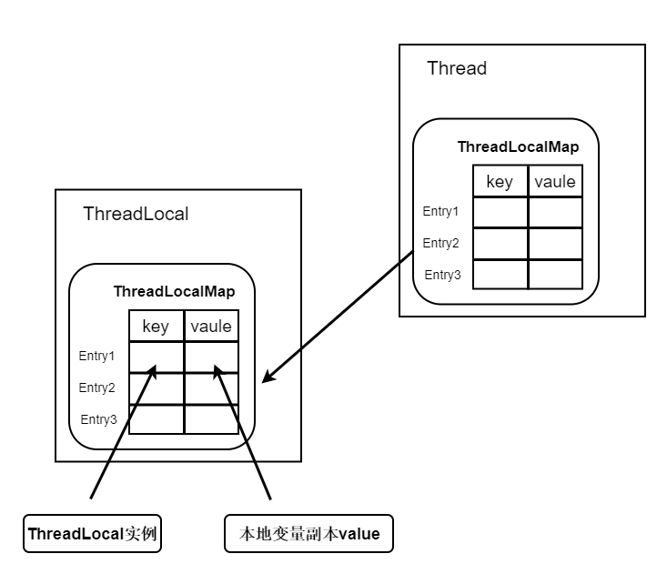

> 本文由 [简悦 SimpRead](http://ksria.com/simpread/) 转码， 原文地址 [segmentfault.com](https://segmentfault.com/a/1190000021529207)

-----------------------

[toc]

# 1.ThreadLocal 简介

ThreadLocal 是线程本地变量，可以为多线程的并发问题提供一种解决方式，当使用 ThreadLocal 维护变量时，ThreadLocal 为每个使用该变量的线程提供独立的变量副本，所以每一个线程都可以独立地改变自己的副本，而不会影响其它线程所对应的副本。

## 1.1 ThreadLocal 使用场景

多个线程去获取一个共享变量时，要求获取的是这个变量的初始值的副本。每个线程存储这个变量的副本，对这个变量副本的改变不去影响变量本身。适用于多个线程依赖不同变量值完成操作的场景。比如：

*   多数据源的切换
*   spring 声明式事务

# 2.ThreadLocal 的使用案例

ThreadLocal 类接口：

*   `void set(T value)`：设置当前线程的线程局部变量的值
*   `T get()`：获取当前线程所对应的线程局部变量
*   `void remove()`：删除当前线程局部变量的值，目的是为了减少内存的占用
*   `T initialValue()`：该线程局部变量的初始值 (默认值为 null)，该方法是一个 protected 的懒加载方法，线程第 1 次调用 `get()` 或 `set(T value)` 时才执行在，而且也是为了让子类覆盖而设计的。

```java
public class ThreadLocalDemo {
    private static ThreadLocal<Index> index = new ThreadLocal(){
        @Override
        protected Object initialValue() {
            return new Index();
        }
    };

    private static class Index{
        private int num;

        public void incr(){
            num++;
        }
    }

    public static void main(String[] args) {
        for(int i = 0; i < 5; i++){
            new Thread(() -> {
                Index local = index.get();
                local.incr();
                System.out.println(Thread.currentThread().getName() + " " + index.get().num);
            }, "thread_" + i).start();
        }
    }
}
```

输出结果：

> thread_1 1  
> thread_0 1  
> thread_3 1  
> thread_4 1  
> thread_2 1

可以看到每个线程的获取的初始值都是 0，并且对 num++ 的操作也互不影响

3.ThreadLocal 如何实现的
===================

## 3.1 ThreadLocal 的数据结构

ThreadLocal 内部维护的是一个类似 Map (并不是 java 提供的 Map 集合) 的 ThreadLocalMap 数据结构，而每个 Thread 类，都有一个 ThreadLocalMap 成员变量。ThreadLocalMap 将线程本地变量（ThreadLocal）作为 key，线程变量的副本作为 value，如图所示：  


> 需要注意的是 ThreadLocal 中的 Entry 的 key 和 value 的关系有系统进行维护，若维护不当则可能导致多线程状态下的不安全（一般不会，至少需要注意）。

## 3.2 get() 源码分析

```java
public T get() {
	// 获取当前线程
	Thread t = Thread.currentThread();
	// 获取当前线程的ThreadLocalMap
	ThreadLocalMap map = getMap(t);
	if (map != null) {
		// 如果 ThreadLocalMap 已经被创建了，那么通过当前的threadLocal对象作为key，获取 value
		ThreadLocalMap.Entry e = map.getEntry(this);
		if (e != null) {
			@SuppressWarnings("unchecked")
			T result = (T)e.value;
				return result;
            }
        }
    //如果ThreadLocalMap还没有被创建或者在ThreadLocalMap中查找不到此元素
    return setInitialValue();
}
```

### 3.2.1 ThreadLocalMap 没初始化

ThreadLocalMap 没初始化，ThreadLocalMap 为 null 时，会调用 setInitialValue() 方法:

```java
    private T setInitialValue() {
        // initialValue方法一般会被重写，不重写的话，直接返回null
        T value = initialValue();
        Thread t = Thread.currentThread();
        // 获取当前线程的ThreadLocalMap
        ThreadLocalMap map = getMap(t);
        if (map != null)
            //ThreadLocalMap已经被创建，那么直接设置初始值（即保存变量副本）
            //初始值来自initialValue方法
            map.set(this, value);
        else
            // 创建ThreadLocalMap
            createMap(t, value);
        return value;
    }
```

> 其中，initialValue() 方法是由我们重写的，需要注意的是，返回值必须为 new 一个对象，而不是直接返回一个对象引用。因为如果多个线程都保存同一个引用的副本的话，那他们通过这个引用修改共享变量的值，是相互影响的。我们本来的目的便是为了获取共享变量的初始值副本，各个线程对副本的修改不影响变量本身。

再来看看 createMap 是如何创建 threadLocalMap 的

```java
	void createMap(Thread t, T firstValue) {
          t.threadLocals = new ThreadLocalMap(this, firstValue);
      }
```

```java
	ThreadLocalMap(ThreadLocal<?> firstKey, Object firstValue) {
             //创建一个初始容量为16的Entry数组
              table = new Entry[INITIAL_CAPACITY];
              //通过threadLocal的threadLocalHashCode来定位在数组中的位置
              int i = firstKey.threadLocalHashCode & (INITIAL_CAPACITY - 1);
              //保存在数组中
              table[i] = new Entry(firstKey, firstValue);
              //记录下已用的大小
              size = 1;
              //设置阈值为容量的2/3
              setThreshold(INITIAL_CAPACITY);
          }
```

### 3.2.2 初始化 threadLocalMap

初始化 threadLocalMap 之后，此线程再次调用 get() 方法，又做了哪些操作呢

```java
	public T get() {
          //获取当前线程
          Thread t = Thread.currentThread();
          //获取当前线程的ThreadLocalMap
          ThreadLocalMap map = getMap(t);
          if (map != null) {
              //如果ThreadLocalMap已经被创建了，那么通过当前的threadLocal对象作为key，获取value
              ThreadLocalMap.Entry e = map.getEntry(this);
              if (e != null) {
                  @SuppressWarnings("unchecked")
                  T result = (T)e.value;
                  return result;
              }
          }
          //如果ThreadLocalMap还没有被创建或者在ThreadLocalMap中查找不到此元素
          return setInitialValue();
      }
```

可以看到是通过 map.getEntry(this) 去查找元素的

```java
	private Entry getEntry(ThreadLocal<?> key) {
              int i = key.threadLocalHashCode & (table.length - 1);
              Entry e = table[i];
              if (e != null && e.get() == key)
                  return e;
              else
                  //如果定位的元素的key与传入的key不相等，那么一直往后找
                  return getEntryAfterMiss(key, i, e);
    }
```

```java
	private Entry getEntryAfterMiss(ThreadLocal<?> key, int i, Entry e) {
              Entry[] tab = table;
              int len = tab.length;
  
              while (e != null) {
                  ThreadLocal<?> k = e.get();
                  if (k == key)
                      return e;
                  if (k == null)
                      //将过期的key清除掉，并把后面的元素（移动过位置的）往前移
                      expungeStaleEntry(i);
                  else
                      //往后移一位
                      i = nextIndex(i, len);
                  e = tab[i];
              }
              return null;
          }
```

```java
	private static int nextIndex(int i, int len) {
              return ((i + 1 < len) ? i + 1 : 0);
          }
```

```java
private int expungeStaleEntry(int staleSlot) {
      Entry[] tab = table;
      int len = tab.length;
  
      // 清除当前元素
      tab[staleSlot].value = null;
      tab[staleSlot] = null;
      size--;
  
      //将此元素后面的，因为hash冲突移动过位置的元素往前移
      Entry e;
      int i;
      for (i = nextIndex(staleSlot, len);
           (e = tab[i]) != null;
           i = nextIndex(i, len)) {
          ThreadLocal<?> k = e.get();
          if (k == null) {
              e.value = null;
              tab[i] = null;
              size--;
          } else {
              int h = k.threadLocalHashCode & (len - 1);
              //h != i说明有过hash冲突
              if (h != i) {
                  tab[i] = null;
  
                  // Unlike Knuth 6.4 Algorithm R, we must scan until
                  // null because multiple entries could have been stale.
                  while (tab[h] != null)
                      h = nextIndex(h, len);
                  tab[h] = e;
              }
          }
      }
      return i;
  }
```

如果 map.getEntry(this) 也找不到元素怎么办？

```java
	public T get() {
          //获取当前线程
          Thread t = Thread.currentThread();
          //获取当前线程的ThreadLocalMap
          ThreadLocalMap map = getMap(t);
          if (map != null) {
              //如果ThreadLocalMap已经被创建了，那么通过当前的threadLocal对象作为key，获取value
              ThreadLocalMap.Entry e = map.getEntry(this);
              if (e != null) {
                  @SuppressWarnings("unchecked")
                  T result = (T)e.value;
                  return result;
              }
          }
          //如果ThreadLocalMap还没有被创建或者在ThreadLocalMap中查找不到此元素
          return setInitialValue();
      }
```

那么继续调用 setInitialValue() 方法

```java
	private T setInitialValue() {
          //initialValue方法一般会被重写，不重写的话，直接返回null
          T value = initialValue();
          Thread t = Thread.currentThread();
          //获取当前线程的ThreadLocalMap
          ThreadLocalMap map = getMap(t);
          if (map != null)
              //ThreadLocalMap已经被创建，那么直接设置初始值（即保存变量副本），初始值来自initialValue方法
              map.set(this, value);
          else
              //创建ThreadLocalMap
              createMap(t, value);
          return value;
      }
```

可以看到将会调用它里面的 map.set(this, value) 方法

```java
	private void set(ThreadLocal<?> key, Object value) {
              Entry[] tab = table;
              int len = tab.length;
              int i = key.threadLocalHashCode & (len-1);
  
              for (Entry e = tab[i];
                   e != null;
                   e = tab[i = nextIndex(i, len)]) {
                  ThreadLocal<?> k = e.get();
  
                  if (k == key) {
                      e.value = value;
                      return;
                  }
  
                  if (k == null) {
                      //替代过期的元素，并清除后面的一些过期元素
                      replaceStaleEntry(key, value, i);
                      return;
                  }
              }
              
              //如果在table中确实找不到，那么新建一个
              tab[i] = new Entry(key, value);
              int sz = ++size;
              if (!cleanSomeSlots(i, sz) && sz >= threshold)
                  //如果没有元素被清除，且超过阈值，那么扩容并重新hash定位
                  rehash();
          }
```

## 3.3 set() 源码分析

在看看 set() 方式处理与 setInitialValue 类似，少了获取初始化值，其他都相同，可参考 get() 方式中 _ThreadLocalMap 没初始化方式_:

```java
	public void set(T value) {
    //获取当前线程
    Thread t = Thread.currentThread();
    //获取当前线程的ThreadLocalMap
    ThreadLocalMap map = getMap(t);
    if (map != null)
        map.set(this, value);
    else
        createMap(t, value);
}
```

# 总结

*   首先判断当前线程的 threadLocalMap 是否存在，若不存在则创建一个。将 ThreadLocal 作为 key，共享变量初始值的副本作为 value，保存在 threadLocalMap 中
*   若 threadLocalMap 存在，那么将 ThreadLocal 作为 key，通过 hash 散列定位在数组中的位置，查找 value
*   如果在 threadLocalMap 中找不到（原因：被删除了，或者此 ThreaLocal 没有加入到 threadLocalMap，毕竟 threadLocalMap 可以存放多个 threadLocal），那么将 ThreadLocal 作为 key，共享变量初始值的副本作为 value，保存在 threadLocalMap 中
*   在 set 的过程中，如果当前位置有其他元素（即 hash 冲突），那么往后找，直到不存在其他元素。并且在 set 的过程中会清除一些过期（key 为 null）的元素。最后将根据 size 大小，决定是否扩容，重新 hash 定位

