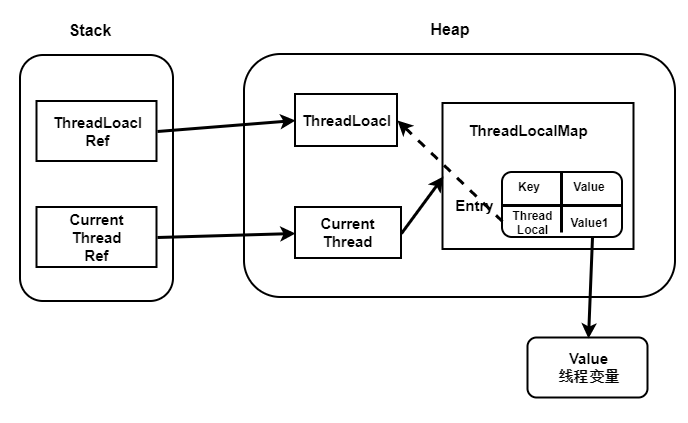

> 本文由 [简悦 SimpRead](http://ksria.com/simpread/) 转码， 原文地址 [segmentfault.com](https://segmentfault.com/a/1190000021562385)

[toc]

# 前言

在分析 ThreadLocal 导致的内存泄露前，需要普及了解一下内存泄露、强引用与弱引用以及 GC 回收机制，这样才能更好的分析为什么 ThreadLocal 会导致内存泄露呢？更重要的是知道该如何避免这样情况发生，增强系统的健壮性。

# 内存泄露

内存泄露为程序在申请内存后，无法释放已申请的内存空间，一次内存泄露危害可以忽略，但内存泄露堆积后果很严重，无论多少内存, 迟早会被占光，

广义并通俗的说，就是：不再会被使用的对象或者变量占用的内存不能被回收，就是内存泄露。

# 强引用与弱引用

**强引用**，使用最普遍的引用，一个对象具有强引用，不会被垃圾回收器回收。当内存空间不足，Java 虚拟机宁愿抛出 OutOfMemoryError 错误，使程序异常终止，也不回收这种对象。

**如果想取消强引用和某个对象之间的关联，可以显式地将引用赋值为 null，这样可以使 JVM 在合适的时间就会回收该对象。**

**弱引用**，JVM 进行垃圾回收时，无论内存是否充足，都会回收被弱引用关联的对象。在 java 中，用 java.lang.ref.WeakReference 类来表示。可以在缓存中使用弱引用。

# GC 回收机制 - 如何找到需要回收的对象

JVM 如何找到需要回收的对象，方式有两种：

*   引用计数法：每个对象有一个引用计数属性，新增一个引用时计数加 1，引用释放时计数减 1，计数为 0 时可以回收，
*   可达性分析法：从 GC Roots 开始向下搜索，搜索所走过的路径称为引用链。当一个对象到 GC Roots 没有任何引用链相连时，则证明此对象是不可用的，那么虚拟机就判断是可回收对象。

> 引用计数法，可能会出现 A 引用了 B，B 又引用了 A，这时候就算他们都不再使用了，但因为相互引用 计数器 = 1 永远无法被回收。

# ThreadLocal 的内存泄露分析

先从前言的了解了一些概念（已懂忽略），接下来我们开始正式的来理解 ThreadLocal 导致的内存泄露的解析。

## 实现原理

```java
static class ThreadLocalMap {

    static class Entry extends WeakReference<ThreadLocal<?>> {
        /** The value associated with this ThreadLocal. */
        Object value;

        Entry(ThreadLocal<?> k, Object v) {
            super(k);
            value = v;
        }
    }
    ...
   }
```

ThreadLocal 的实现原理，每一个 Thread 维护一个 ThreadLocalMap，key 为使用**弱引用**的 ThreadLocal 实例，value 为线程变量的副本。这些对象之间的引用关系如下,



> 实心箭头表示强引用，空心箭头表示弱引用

## ThreadLocal 内存泄漏的原因

从上图中可以看出，hreadLocalMap 使用 ThreadLocal 的弱引用作为 key，如果一个 ThreadLocal 不存在外部**强引用**时，Key(ThreadLocal) 势必会被 GC 回收，这样就会导致 ThreadLocalMap 中 key 为 null， 而 value 还存在着强引用，只有 thead 线程退出以后, value 的强引用链条才会断掉。

但如果当前线程再迟迟不结束的话，这些 key 为 null 的 Entry 的 value 就会一直存在一条强引用链：

> Thread Ref -> Thread -> ThreaLocalMap -> Entry -> value

永远无法回收，造成内存泄漏。

## 那为什么使用弱引用而不是强引用？？

我们看看 Key 使用的

### key 使用强引用

当 hreadLocalMap 的 key 为强引用回收 ThreadLocal 时，因为 ThreadLocalMap 还持有 ThreadLocal 的强引用，如果没有手动删除，ThreadLocal 不会被回收，导致 Entry 内存泄漏。

### key 使用弱引用

当 ThreadLocalMap 的 key 为弱引用回收 ThreadLocal 时，由于 ThreadLocalMap 持有 ThreadLocal 的弱引用，即使没有手动删除，ThreadLocal 也会被回收。当 key 为 null，在下一次 ThreadLocalMap 调用 set(),get()，remove() 方法的时候会被清除 value 值。

## ThreadLocalMap 的 remove() 分析

在这里只分析 remove() 方式，其他的方法可以查看源码进行分析：

```java
private void remove(ThreadLocal<?> key) {
    //使用hash方式，计算当前ThreadLocal变量所在table数组位置
    Entry[] tab = table;
    int len = tab.length;
    int i = key.threadLocalHashCode & (len-1);
    //再次循环判断是否在为ThreadLocal变量所在table数组位置
    for (Entry e = tab[i];
         e != null;
         e = tab[i = nextIndex(i, len)]) {
        if (e.get() == key) {
            //调用WeakReference的clear方法清除对ThreadLocal的弱引用
            e.clear();
            //清理key为null的元素
            expungeStaleEntry(i);
            return;
        }
    }
}
```

再看看清理 key 为 null 的元素 expungeStaleEntry(i):

```java
private int expungeStaleEntry(int staleSlot) {
    Entry[] tab = table;
    int len = tab.length;

    // 根据强引用的取消强引用关联规则，将value显式地设置成null，去除引用
    tab[staleSlot].value = null;
    tab[staleSlot] = null;
    size--;

    // 重新hash，并对table中key为null进行处理
    Entry e;
    int i;
    for (i = nextIndex(staleSlot, len);
         (e = tab[i]) != null;
         i = nextIndex(i, len)) {
        ThreadLocal<?> k = e.get();
        //对table中key为null进行处理,将value设置为null，清除value的引用
        if (k == null) {
            e.value = null;
            tab[i] = null;
            size--;
        } else {
            int h = k.threadLocalHashCode & (len - 1);
            if (h != i) {
                tab[i] = null;
                while (tab[h] != null)
                    h = nextIndex(h, len);
                tab[h] = e;
            }
        }
    }
    return i;
}
```

# 总结

由于 Thread 中包含变量 ThreadLocalMap，因此 ThreadLocalMap 与 Thread 的生命周期是一样长，如果都没有手动删除对应 key，都会导致内存泄漏。

但是使用**弱引用**可以多一层保障：弱引用 ThreadLocal 不会内存泄漏，对应的 value 在下一次 ThreadLocalMap 调用 set(),get(),remove() 的时候会被清除。

因此，ThreadLocal 内存泄漏的根源是：由于 ThreadLocalMap 的生命周期跟 Thread 一样长，如果没有手动删除对应 key 就会导致内存泄漏，而不是因为弱引用。

# ThreadLocal 正确的使用方法

*   每次使用完 ThreadLocal 都调用它的 remove() 方法清除数据
*   将 ThreadLocal 变量定义成 private static，这样就一直存在 ThreadLocal 的强引用，也就能保证任何时候都能通过 ThreadLocal 的弱引用访问到 Entry 的 value 值，进而清除掉 。

