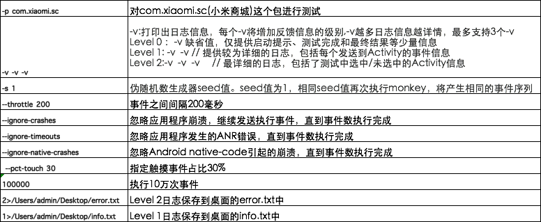

```shell
adb shell monkey -p com.xxx.xxx -v -v -v --throttle 200 -s 1 --ignore-crashes --ignore-timeouts --ignore-native-crashes --pct-touch 30 100000 2>./error.txt 1>./info.log

```



```shell
adb shell monkey -p com.xiaomi.sc -s 2333 --pct-touch 70 --pct-motion 30 --ignore-crashes --ignore-timeouts --monitor-native-crashes --throttle 200 -v -v 500000 >./monkey0903.txt

```


在执行向下滑动的命令时，打开了通知栏，然后又开始了瞎点的操作。这时可在执行monkey命令之前，先执行禁用通知栏的命令

```shell
adb shell settings put global policy_control immersive.full=*
# 解禁命令：
adb shell settings put global policy_control null
```

