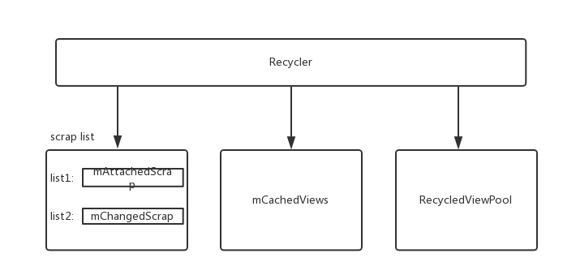
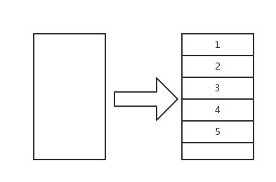
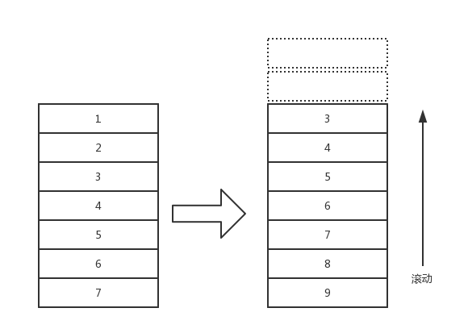

>上一篇文章分析[RecyclerView刷新机制](RecyclerView刷新机制.md)知道LayoutManager在布局子View时会向Recycler索要一个ViewHolder。但从Recycler中获取一个ViewHolder的前提是Recycler中要有ViewHolder。那Recycler中是如何有ViewHolder的呢？
>本文会分析两个问题:

1. RecyclerView的View是在什么时候放入到Recycler中的。以及在Recycler中是如何保存的。
2. LayoutManager在向Recycler获取ViewHolder时，Recycler寻找ViewHolder的逻辑是什么。

即何时存、怎么存和何时取、怎么取的问题。何时取已经很明显了:LayoutManager在布局子View时会从Recycler中获取子View。 所以本文要理清的是其他3个问题。在文章继续之前要知道Recycler管理的基本单元是ViewHolder，LayoutManager操作的基本单元是View，即ViewHolder的itemview。本文不会分析RecyclerView动画时view的复用逻辑。

为了接下来的内容更容易理解，先回顾一下Recycler的组成结构:



- mChangedScrap : 用来保存RecyclerView做动画时，被detach的ViewHolder。
- mAttachedScrap : 用来保存RecyclerView做数据刷新(notify)，被detach的ViewHolder
- mCacheViews : Recycler的一级ViewHolder缓存。
- RecyclerViewPool : mCacheViews集合中装满时，会放到这里。

先看一下如何从Recycler中取一个ViewHolder来复用。

# 从Recycler中获取一个ViewHolder的逻辑

LayoutManager会调用Recycler.getViewForPosition(pos)来获取一个指定位置(这个位置是子View布局所在的位置)的view。getViewForPosition()会调用tryGetViewHolderForPositionByDeadline(position...), 这个方法是从Recycler中获取一个View的核心方法。它就是如何从Recycler中获取一个ViewHolder的逻辑，即怎么取, 方法太长, 我做了很多裁剪:
```java
ViewHolder tryGetViewHolderForPositionByDeadline(int position, boolean dryRun, long deadlineNs) {
    ...
    if (mState.isPreLayout()) {     //动画相关
        holder = getChangedScrapViewForPosition(position);  //从缓存中拿吗？不应该不是缓存？
        fromScrapOrHiddenOrCache = holder != null;
    }
    // 1) Find by position from scrap/hidden list/cache
    if (holder == null) {
        holder = getScrapOrHiddenOrCachedHolderForPosition(position, dryRun); //从 attach 和 mCacheViews 中获取
        if (holder != null) {
            ... //校验这个holder是否可用
        }
    }
    if (holder == null) {
        ...
        final int type = mAdapter.getItemViewType(offsetPosition); //获取这个位置的数据的类型。  子Adapter复写的方法
        // 2) Find from scrap/cache via stable ids, if exists
        if (mAdapter.hasStableIds()) {    //stable id 就是标识一个viewholder的唯一性， 即使它做动画改变了位置
            holder = getScrapOrCachedViewForId(mAdapter.getItemId(offsetPosition),  //根据 stable id 从 scrap 和 mCacheViews中获取
                    type, dryRun);
            ....
        }
        if (holder == null && mViewCacheExtension != null) { // 从用户自定义的缓存集合中获取
            final View view = mViewCacheExtension
                    .getViewForPositionAndType(this, position, type);  //你返回的View要是RecyclerView.LayoutParams属性的
            if (view != null) {
                holder = getChildViewHolder(view);  //把它包装成一个ViewHolder
                ...
            }
        }
        if (holder == null) { // 从 RecyclerViewPool中获取
            holder = getRecycledViewPool().getRecycledView(type);
            ...
        }
        if (holder == null) { 
            ...
            //实在没有就会创建
            holder = mAdapter.createViewHolder(RecyclerView.this, type);
            ...
        }
    }
    ...
    boolean bound = false;
    if (mState.isPreLayout() && holder.isBound()) { //动画时不会想去调用 onBindData
        ...
    } else if (!holder.isBound() || holder.needsUpdate() || holder.isInvalid()) {
        ...
        final int offsetPosition = mAdapterHelper.findPositionOffset(position);
        bound = tryBindViewHolderByDeadline(holder, offsetPosition, position, deadlineNs);  //调用 bindData 方法
    }

    final ViewGroup.LayoutParams lp = holder.itemView.getLayoutParams();
    final LayoutParams rvLayoutParams;
    ...调整LayoutParams
    return holder;
}

```

即大致步骤是:

1. 如果执行了RecyclerView动画的话，尝试根据position从mChangedScrap集合中寻找一个ViewHolder
2. 尝试根据position从scrap集合、hide的view集合、mCacheViews(一级缓存)中寻找一个ViewHolder 
3. 根据LayoutManager的position更新到对应的Adapter的position。 (这两个position在大部分情况下都是相等的，不过在子view删除或移动时可能产生不对应的情况)
4. 根据Adapter position,调用Adapter.getItemViewType()来获取ViewType
5. 根据stable id(用来表示ViewHolder的唯一，即使位置变化了)从scrap集合和mCacheViews(一级缓存)中寻找一个ViewHolder
6. 根据position和viewType尝试从用户自定义的mViewCacheExtension中获取一个ViewHolder
7. 根据ViewType尝试从RecyclerViewPool中获取一个ViewHolder
8. 调用mAdapter.createViewHolder()来创建一个ViewHolder
9. 如果需要的话调用mAdapter.bindViewHolder来设置ViewHolder。
10. 调整ViewHolder.itemview的布局参数为Recycler.LayoutPrams，并返回Holder

虽然步骤很多，逻辑还是很简单的,即从几个缓存集合中获取ViewHolder，如果实在没有就创建。但比较疑惑的可能就是上述ViewHolder缓存集合中什么时候会保存ViewHolder。接下来分几个RecyclerView的具体情形，来一点一点弄明白这些ViewHolder缓存集合的问题。

## 情形一 : 由无到有

即一开始RecyclerView中没有任何数据，添加数据源后adapter.notifyXXX。状态变化如下图:



很明显在这种情形下Recycler中是不会存在任何可复用的ViewHolder。所以所有的ViewHolder都是新创建的。即会调用Adapter.createViewHolder()和Adapter.bindViewHolder()。那这些创建的ViewHolder会缓存起来吗？

这时候新创建的这些ViewHolder是不会被缓存起来的。 即在这种情形下:==Recycler只会通过Adapter创建ViewHolder,并且不会缓存这些新创建的ViewHolder==

## 情形二 : 在原有数据的情况下进行整体刷新

就是下面这种状态:


其实就是相当于用户在feed中做了下拉刷新。实现中的伪代码如下:
```java
dataSource.clear()
dataSource.addAll(newList)
adapter.notifyDatasetChanged()
```

在这种情形下猜想Recycler肯定复用了老的卡片(卡片的类型不变)，那么问题是 : 在用户刷新时旧ViewHolder保存在哪里？ 如何调用旧ViewHolder的Adapter.bindViewHolder()来重新设置数据的？

其实在上一篇文章Recycler刷新机制中，LinearLayoutManager在确定好布局锚点View之后就会把当前attach在RecyclerView上的子View全部设置为scrap状态:

```java
void onLayoutChildren(RecyclerView.Recycler recycler, RecyclerView.State state) {
    ...
    // RecyclerView指定锚点，要准备正式布局了
    onAnchorReady(recycler, state, mAnchorInfo, firstLayoutDirection);
    // 在开始布局时，把所有的View都设置为 scrap 状态
    detachAndScrapAttachedViews(recycler);   
    ...
}
```

什么是scrap状态呢？ 在前面的文章其实已经解释过: ViewHolder被标记为`FLAG_TMP_DETACHED`状态，并且其itemview的parent被设置为null。

 detachAndScrapAttachedViews就是把所有的view保存到Recycler的mAttachedScrap集合中:

```java
public void detachAndScrapAttachedViews(@NonNull Recycler recycler) {
    for (int i = getChildCount() - 1; i >= 0; i--) {
        final View v = getChildAt(i);
        scrapOrRecycleView(recycler, i, v);
    }
}
private void scrapOrRecycleView(Recycler recycler, int index, View view) {
    final ViewHolder viewHolder = getChildViewHolderInt(view);
    ...删去了一些判断逻辑
    detachViewAt(index);  //设置RecyclerView这个位置的view的parent为null， 并标记ViewHolder为FLAG_TMP_DETACHED
    recycler.scrapView(view); //添加到mAttachedScrap集合中  
    ...
}
```

==所以在这种情形下LinearLayoutManager在真正摆放子View之前，会把所有旧的子View按顺序保存到Recycler的mAttachedScrap集合中==

接下来继续看,LinearLayoutManager在布局时如何复用mAttachedScrap集合中的ViewHolder。 

前面已经说了LinearLayoutManager会当前布局子View的位置向Recycler要一个子View，即调用到tryGetViewHolderForPositionByDeadline(position..)。我们上面已经列出了这个方法的逻辑，其实在前面的第二步:

==尝试根据position从scrap集合、hide的view集合、mCacheViews(一级缓存)中寻找一个ViewHolder==

即从mAttachedScrap中就可以获得一个ViewHolder: 

```java
ViewHolder getScrapOrHiddenOrCachedHolderForPosition(int position, boolean dryRun) {
    final int scrapCount = mAttachedScrap.size();
    for (int i = 0; i < scrapCount; i++) {
        final ViewHolder holder = mAttachedScrap.get(i);
        if (!holder.wasReturnedFromScrap() && holder.getLayoutPosition() == position
                && !holder.isInvalid() && (mState.mInPreLayout || !holder.isRemoved())) {
            holder.addFlags(ViewHolder.FLAG_RETURNED_FROM_SCRAP);
            return holder;
        }
    }
    ...
}
```

即如果mAttachedScrap中holder的位置和入参position相等，并且holder是有效的话这个holder就是可以复用的。所以综上所述，在情形二下所有的ViewHolder几乎都是复用Recycler中mAttachedScrap集合中的。
并且重新布局完毕后Recycler中是不存在可复用的ViewHolder的。


## 情形三 : 滚动复用

这个情形分析是在情形二的基础上向下滑动时ViewHolder的复用情况以及Recycler中ViewHolder的保存情况, 如下图:



==在这种情况下滚出屏幕的View会优先保存到mCacheViews, 如果mCacheViews中保存满了，就会保存到RecyclerViewPool中==。

在前一篇文章RecyclerView刷新机制中分析过，RecyclerView在滑动时会调用LinearLayoutManager.fill()方法来根据滚动的距离来向RecyclerView填充子View，其实在个方法在填充完子View之后就会把滚动出屏幕的View做回收:

```java
int fill(RecyclerView.Recycler recycler, LayoutState layoutState,RecyclerView.State state, boolean stopOnFocusable) {
    ...
    int remainingSpace = layoutState.mAvailable + layoutState.mExtra;
    ...
    while ((layoutState.mInfinite || remainingSpace > 0) && layoutState.hasMore(state)) {
        ...
        layoutChunk(recycler, state, layoutState, layoutChunkResult); //填充一个子View

        if (layoutState.mScrollingOffset != LayoutState.SCROLLING_OFFSET_NaN) {
            layoutState.mScrollingOffset += layoutChunkResult.mConsumed;
            if (layoutState.mAvailable < 0) {
                layoutState.mScrollingOffset += layoutState.mAvailable;
            }
            recycleByLayoutState(recycler, layoutState); //根据滚动的距离来回收View
        }
    }
}
```

即fill每填充一个子View都会调用recycleByLayoutState()来回收一个旧的子View,这个方法在层层调用之后会调用到Recycler.recycleViewHolderInternal()。这个方法是ViewHolder回收的核心方法，不过逻辑很简单:

1. 检查mCacheViews集合中是否还有空位，如果有空位，则直接放到mCacheViews集合
2. 如果没有的话就把mCacheViews集合中最前面的ViewHolder拿出来放到RecyclerViewPool中，然后再把最新的这个ViewHolder放到mCacheViews集合
3. 如果没有成功缓存到mCacheViews集合中，就直接放到RecyclerViewPool

mCacheViews集合为什么要这样缓存? 看一下下面这张图 :


我是这样认为的，如上图，往上滑动一段距离，被滑动出去的ViewHolder会被缓存在mCacheViews集合,并且位置是被记录的。如果用户此时再下滑的话，可以参考文章开头的从Recycler中获取ViewHolder的逻辑:

1. 先按照位置从mCacheViews集合中获取
2. 按照viewType从mCacheViews集合中获取

上面对于mCacheViews集合两步操作，其实第一步就已经命中了缓存的ViewHolder。并且这时候都不需要调用Adapter.bindViewHolder()方法的。即是十分高效的。

**所以在普通的滚动复用的情况下，ViewHolder的复用主要来自于mCacheViews集合, 旧的ViewHolder会被放到mCacheViews集合, mCacheViews集合挤出来的更老的ViewHolder放到了RecyclerViewPool中**


