> 本文由 [简悦 SimpRead](http://ksria.com/simpread/) 转码， 原文地址 [wemp.app](https://wemp.app/posts/29445848-5781-4a28-8f0d-3eccb72d0c71)

/   前言   /

以后会尽量写非源码的东西，因为过一段时间之后，发现自己看自己的文章都费劲，而且，源码大部分是在分析方法的调用链，意义不大，需要多写写自己的体悟才行。如果有时候必须要写，也要简化调用链的分析，提供类图，写重点和结论。

本文的思路与结论是基于参考文档的 Anatomy of RecyclerView: a Search for a ViewHolder

> https://android.jlelse.eu/anatomy-of-recyclerview-part-1-a-search-for-a-viewholder-404ba3453714

与 Anatomy of RecyclerView: a Search for a ViewHolder (continued) 

> https://android.jlelse.eu/anatomy-of-recyclerview-part-1-a-search-for-a-viewholder-continued-d81c631a2b91

这两篇文章而来。

由于这两篇文章的某些观点与其他文章的的不一致，我经过自己的理解与推断调试后，是支持这两篇文章的观点的，所以当你阅读参考文档时，需要自己考量。  

# 了解一下 RecyclerView

RecyclerView 有五虎上将：

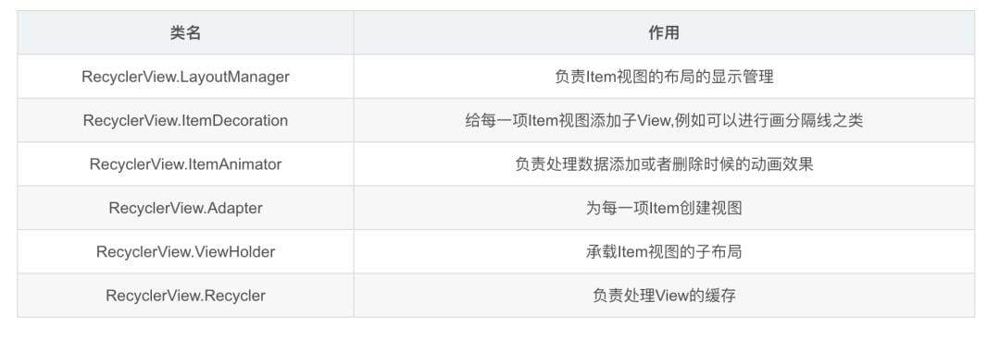

RecyclerView 的职责就是将 Datas 中的数据以一定的规则展示在它的上面，但说破天 RecyclerView 只是一个 ViewGroup，它只认识 View，不清楚 Data 数据的具体结构，所以两个陌生人之间想构建通话，我们很容易想到适配器模式，因此，RecyclerView 需要一个 Adapter 来与 Datas 进行交流：

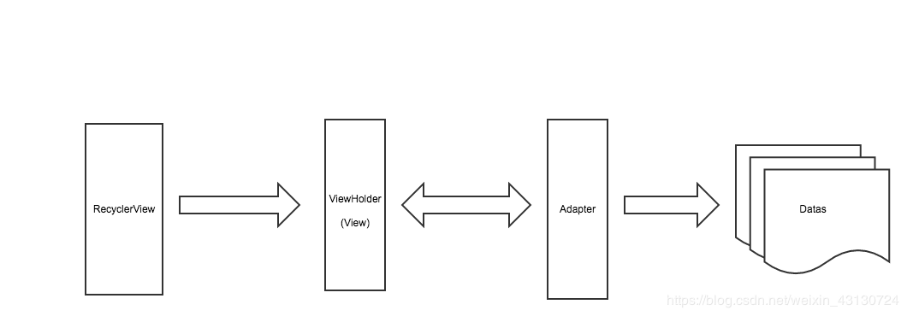

如上如所示，RecyclerView 表示只会和 ViewHolder 进行接触，而 Adapter 的工作就是将 Data 转换为 RecyclerView 认识的 ViewHolder，因此 RecyclerView 就间接地认识了 Datas。

事情虽然进展愉快，但 RecyclerView 是个很懒惰的人，尽管 Adapter 已经将 Datas 转换为 RecyclerView 所熟知的 View，但 RecyclerView 并不想自己管理些子 View，因此，它雇佣了一个叫做 LayoutManager 的大祭司来帮其完成布局，现在，图示变成下面这样：

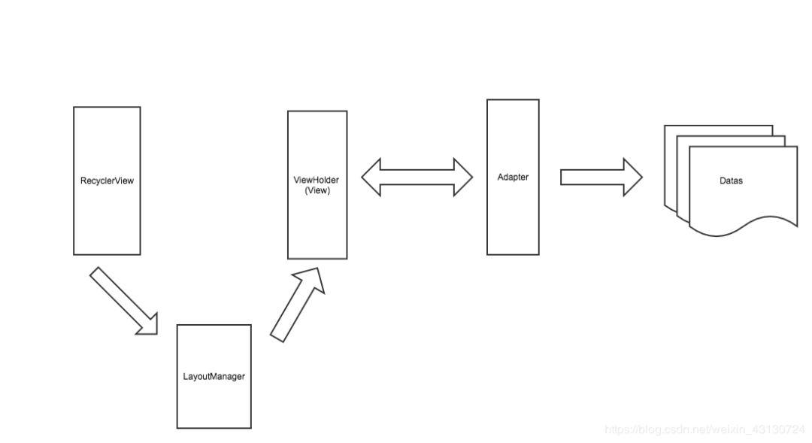

如上图所示，LayoutManager 协助 RecyclerView 来完成布局。但 LayoutManager 这个大祭司也有弱点，就是它只知道如何将一个一个的 View 布局在 RecyclerView 上，但它并不懂得如何管理这些 View，如果大祭司肆无忌惮的玩弄 View 的话肯定会出事情。

所以，必须有个管理 View 的护法，它就是 Recycler，LayoutManager 在需要 View 的时候回向护法进行索取，当 LayoutManager 不需要 View(试图滑出) 的时候，就直接将废弃的 View 丢给 Recycler，图示如下：

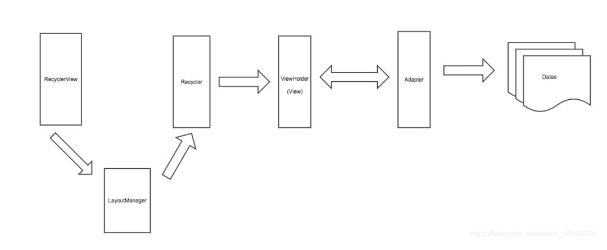

到了这里，有负责翻译数据的 Adapter，有负责布局的 LayoutManager，有负责管理 View 的 Recycler，一切都很完美，但 RecyclerView 乃何等神也，它下令说当子 View 变动的时候姿态要优雅 (动画)，所以用雇佣了一个舞者 ItemAnimator，因此，舞者也进入了这个图示:

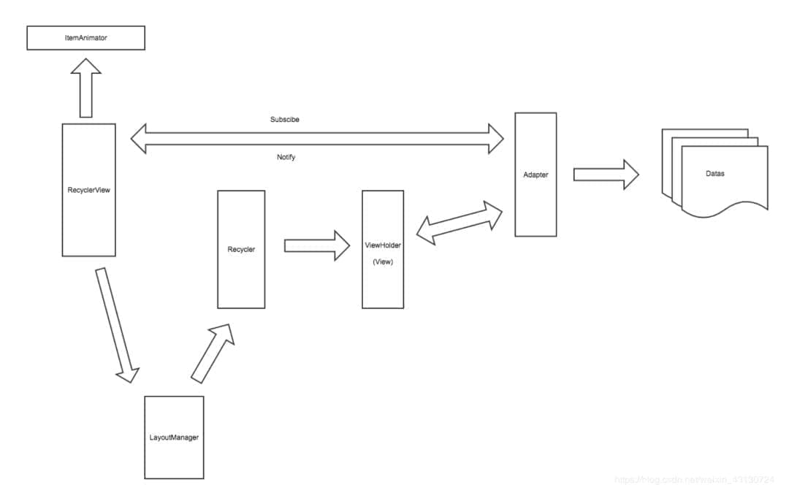

如上，我们就是从宏观层面来对 RecylerView 有个大致的了解，可以看到，RecyclerView 作为一个 View，它只负责接受用户的各种讯息，然后将信息各司其职的分发出去。

还有最后一个 ，ItemDecoration 是为了显示每个 item 之间分隔样式的。它的本质实际上就是一个 Drawable。当 RecyclerView 执行到 onDraw() 方法的时候，就会调用到他的 onDraw()，这时，如果你重写了这个方法，就相当于是直接在 RecyclerView 上画了一个 Drawable 表现的东西。

而最后，在他的内部还有一个叫 getItemOffsets() 的方法，从字面就可以理解，他是用来偏移每个 item 视图的。当我们在每个 item 视图之间强行插入绘画了一段 Drawable，那么如果再照着原本的逻辑去绘 item 视图，就会覆盖掉 Decoration 了，所以需要 getItemOffsets() 这个方法，让每个 item 往后面偏移一点，不要覆盖到之前画上的分隔样式了。

PS:

其实 ItemDecoration 的宽高是计算在 itemview 中的，只不过 itemview 本身绘制区域没有那么大，留出来的地方正好的透明的，于是就透过 itemview 显示出了 ItemDecoration。那么就很有意思了，如果我故意在 ItemDecoration 的偏移量中写成 0，那么 itemview 就会挡住 ItemDecoration，而在 itemview 的增加或删除的时候，会短暂的消失 (透明)，这时候就又可以透过 itemview 看到 ItemDecoration 的样子。使用这种组合还可以做出意想不到的动画效果。

虽然，Google 尽力的解耦了，但是在源码中有的地方还是会有逻辑混杂在一起的地方，比如：动画的处理。

为了能够更好的理解下面的内容，这里先介绍一下 pre-layout 与 post-layout 是什么。

有这样的一个场景：我们有 3 个 item【a, b, c】，其中 a 与 b 显示在屏幕上，当我们删除 b 的时候，c 会显示出来。

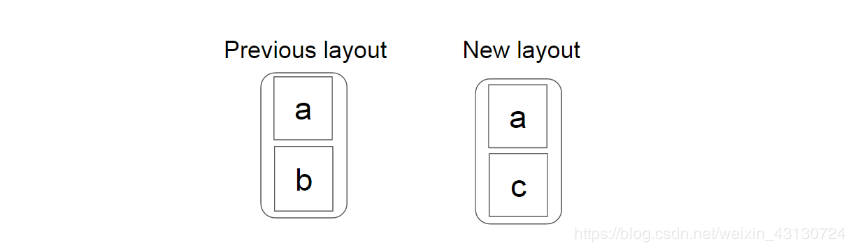

我们希望看到的是 c 从底部顺利滑动到它的新位置。

但这是如何发生呢？

我们知道新布局中 c 的最终位置，但我们如何知道它应该从何处开始滑动？

谷歌的解决方案提供如下：

在 adapter 发生更改后，RecyclerView 会从 LayoutManager 请求两个布局。

第一个 —— pre-layout，因为我们可以收到适配器的变化，所以这里我们可以做一些特殊的处理。在我们的例子中，因为我们现在知道 b 被删除了，所以我们会额外的显示出 c，尽管它已经超出界限。

第二个 —— post-layout，一个正常的布局，对应于更改后的适配器状态。

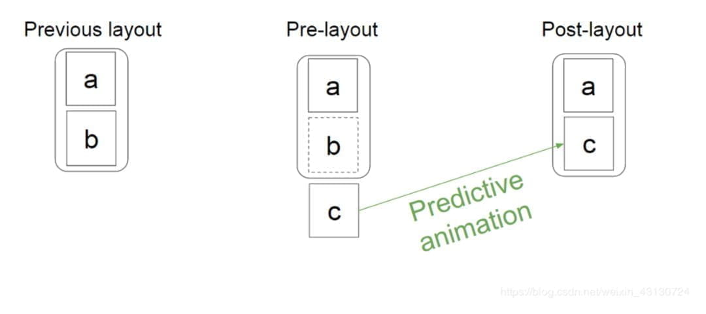

现在，通过比较 pre-layout 和 post-layout 中 c 的位置，我们可以正确地为其设置动画。

仔细思考一下这个动画，This kind of animation — when the animated view is not present either in previous layout or in the new one — is called predictive animation。

再思考一个场景：如果 b 只是发生了变化，而不是被删除了，那么会怎么样呢？

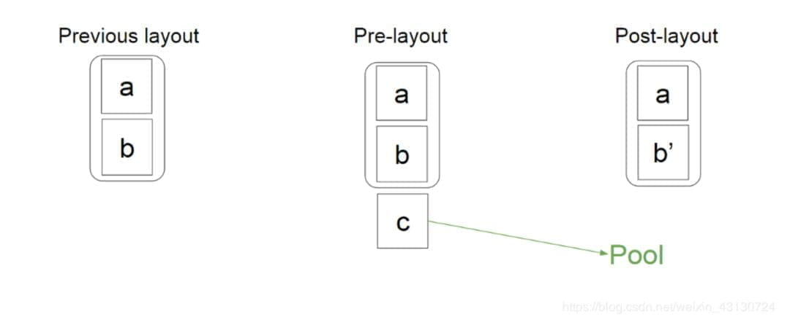

答案是，仍然会在 pre-layout 阶段将 C 放置到后面！为什么呢？因为无法预测 C 的动画是什么动画，也许动画使 b 的高度变小了呢，那么 c 就需要显示出来，如果没有，那么 C 就会被放到缓存里去。

# 缓存介绍

先简单看下代码：

```java
public final class Recycler {
    final ArrayList<ViewHolder> mAttachedScrap = new ArrayList<>();
    ArrayList<ViewHolder> mChangedScrap = null;

    final ArrayList<ViewHolder> mCachedViews = new ArrayList<ViewHolder>();

    private final List<ViewHolder>
            mUnmodifiableAttachedScrap = Collections.unmodifiableList(mAttachedScrap);

    private int mRequestedCacheMax = DEFAULT_CACHE_SIZE;
    int mViewCacheMax = DEFAULT_CACHE_SIZE;

    RecycledViewPool mRecyclerPool;

    private ViewCacheExtension mViewCacheExtension;

    static final int DEFAULT_CACHE_SIZE = 2;
```

## scrap

scrap 缓存是 recyclerView 最先搜索的缓存，网上有很多缓存调用图，第一个缓存调用就是 scrap。scrap 分为两个集合。

scrap 仅仅在 layout 期间不为空。当 LayoutManager 开始 layout 的时候（pre-layout 或 post-layout），会将所有的 viewHolder 都放到 scrap 中。然后一个个再取回来，除非有些 view 发生了变化。

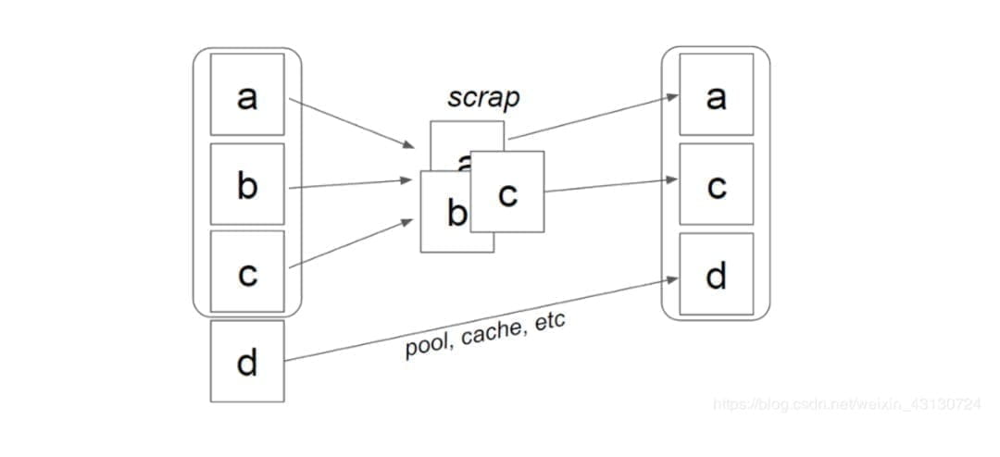

这里说一个题外话，就是有人可能会问，为啥要先放到 scrap 了之后，再取出来啊，这不是没事找事么？

我的观点是：layout 的事归 LayoutManager 管，缓存的事归 Recycler 管。LayoutManager 不应该知道哪个 viewHolder 是否有效，这是一种职责分离设计。

mAttachedScrap 和 mChangedScrap：这两个比较特殊，我跟踪了一下 mAttachScrap 添加的时机，在 LinearLayoutManager 的 onLayoutChildren 方法里面：

```java
public void onLayoutChildren(RecyclerView.Recycler recycler, RecyclerView.State state) {
    ...
        onAnchorReady(recycler, state, mAnchorInfo, firstLayoutDirection);
        
        
        detachAndScrapAttachedViews(recycler);
    ...
}
```

这里的调用时机很值得思考，它在布局的时候就放到缓存里面了，这里说明这个缓存针对的是屏幕上显示的 View.

那么问题就来了，屏幕上显示的为什么要缓存起来呢？我的想法倾向于是减少 layout 方法调用带来的影响。

比如说，当我们调用 `notifyItemRangeChanged` 方法的时候，会触发 `requestLayout` 方法，就会重新布局，重新布局的话，就会先将 `viewHolder` 放到 `scrap` 中（屏幕上变化的放入 `mChangedScrap` 中，其余的放入 `mAttachedScrap` 中），然后 `fill` 布局的时候，再从 `mAttachedScrap` 里面取出来直接使用。

`mChangedScrap` 中的 `viewHolder` 会被移动到 `RecycledViewPool` 中，所以 `mChangedScrap` 对应的 `item` 需要从 `pool` 中取对应的 `viewHolder`，然后重新绑定。

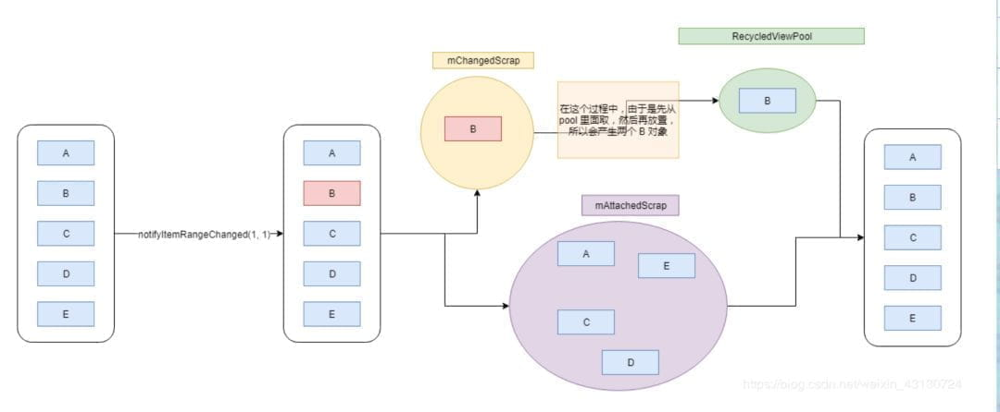

现在再来思考一下，为什么需要 `mChangedScrap` 与 `mAttachedScrap` 这两个缓存？

==因为 `mChangedScrap` 表示 item 变化了，有可能是数据变化，有可能是类型变化，所以它的 viewHolder 无法重用，只能去 RecycledViewPool 中重新取对应的，然后再重新绑定==。

mChangedScrap 与 mAttachedScrap，作用差不多。

mChangedScrap 更多的用于 pre-layout 的动画处理。

然后一点需要注意：mChangedScrap 只能在 pre-layout 中使用，mAttachedScrap 可以在 pre-layout 与 post-layout 中使用。

在继续讨论之前，需要先说明几个方法之间的区别：

**View 中的 detach 和 remove**

detach 在 ViewGroup 中的实现很简单，只是将当前 View 从 ParentView 的 ChildView 数组中移除，将当前 View 的 mParent 设置为 null, 可以理解为轻量级的临时 remove。

remove 代表真正的移除，不光从 ChildView 数组中移除，其他和 View 树各项联系也会被彻底斩断。

**Recycled View 中的 Scrap View**

Scrap View 指的是在 RecyclerView 中，经历了 detach 操作的缓存。RecyclerView 源码中部分代码注释的 detach 其实指代的是 remove，此类缓存是通过 position 匹配的，不需要重新 bindView。

Recycled View 指代的就是真正的移除操作 remove 后的缓存，取出时需重新 bindView 使用。

**cache 与 pool**

cache 与 pool 中储存的均属于 Recycled View ，需要重新 add 到列表中。

## Cache

mCachedViews，这个比较简单。

它是一个 ArrayList 类型，不区分 viewHolder 的类型，大小限制为 2，但是你可以使用 setItemViewCacheSize() 这个方法调整它的大小。

由于它不区分 viewHolder 的类型，所以只能根据 position 来获取 viewHolder 。

## RecycledViewPool

RecycledViewPool，它储存了各个类型的 viewHolder

最大数量为 5，可以通过 setMaxRecycledViews() 方法来设置每个类型储存的容量。还有一个重要的点就是，可以多个列表公用一个 RecycledViewPool，使用 setRecycledViewPool() 方法。

这里顺便说一下，各个缓存的使用上的区别，也好对各个缓存池有一个大概的了解：

*   如果在所有缓存中都没有找到 viewHolder，那就会调用 create 和 bind 方法。
  
*   如果在 pool （RecycledViewPool ） 中找到了，那么会调用 bind 方法。
  
*   如果在 cache （mCachedViews）中找到了，啥都不用做，直接显示就好了。
  

所以，需要注意他们的区别，一个 viewHolder 进入到 cache 与进入到 pool 中是不一样的。  

现在，我们来思考下一个问题：mCachedViews 的大小是有限制的，如果存不下了，怎么办？

实际上，mCachedViews 虽然是一个 ArrayList，但是它的工作方式却和链表有点类似。当 mCachedViews 满了之后，它会将最先存入的元素移除，放入到 pool 中，如下图：

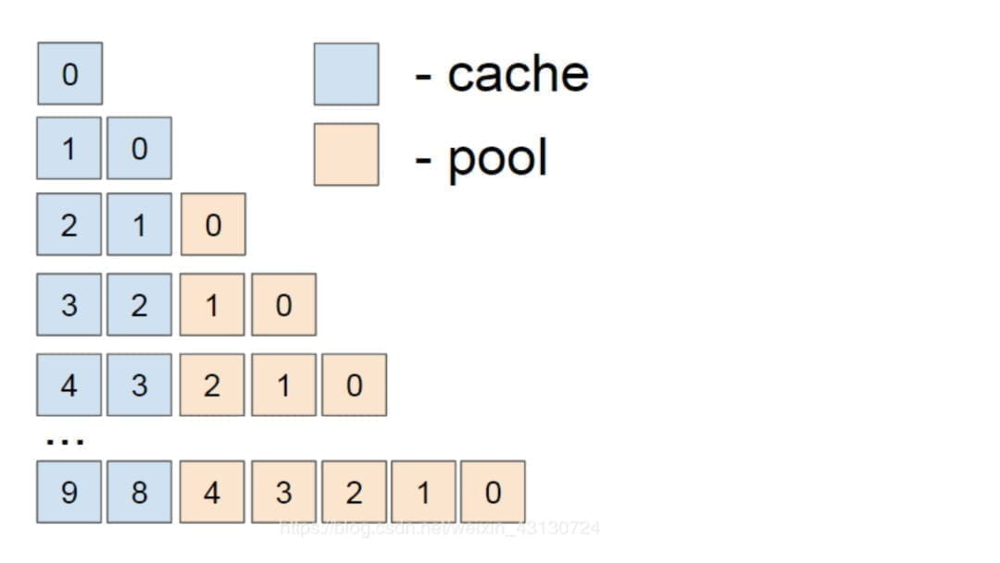

当我们滑动列表的时候，一旦 item 超出了屏幕，那么就会被放入到 mCachedViews 中，如果满了，就会将 “尾部” 的元素移动到 pool 中，如果 pool 也满了，那么就会被丢弃，等待 GC。

下面，用几个场景来巩固一下我们学到的知识：

**场景一：**

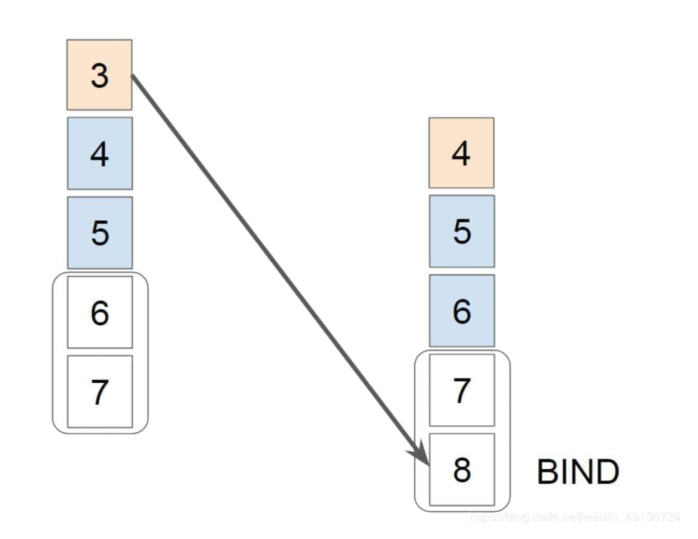

先看图的左边（此时假设 cache 与 pool 中没有东西），当向下滑动时，3 最先进入 mCachedViews，随后是 4 与 5，5 会将 3 挤出来，3 就会跑到 pool 中去了。

再看图的右边，继续向下滑动时，4 被 6 挤出来，放到了 pool 中，同时，8 需要显示，那么就会先从 pool 中取，发现正好有一个 3，那么就会取出来，将 3 重新显示到屏幕上。

**场景二：**


如果，向下滑倒 7 显示出来之后，不再继续向下，而是往上滑动，那么又会怎么样呢？

看图的右边，很明显，5 从 cache 中被取出来直接复用，不用重新绑定，7 被放入了 cache 中。

思考一下，对于这种情况，我们应该如何加以利用呢？

==比如，我们有一个壁纸库的列表，用户经常会上下（左右）滑动，那么我们增加 cache 的容量，就会获得更好得性能。然而对于 feed 流之类得列表，用户很少返回，所以增加 cache 容量意义不大。==

再深入一下，我们继续向上滑动，那么，4 与 7 会放入到 cache 中，3 会从 pool 中取出来，但是，这里需要注意，因为 3 是从 pool 中取出来的，所以它需要重新绑定，但是从逻辑上来说，如果 3 位置的数据没有发生变化，它不需要重新绑定，也是有效的。所以，你也可以把这里当作一个优化点，在 onBindViewHolder() 方法中，检查一下。

再再深入一下，在我们滑动的过程中，一个类型的 viewHolder 在 pool 中应该一直只会存在一个（除非你使用了 GridLayoutManager），所以，如果你的 pool 中存在多个 viewHolder 的话，他们在滚动过程中基本上是无用的。

**场景三：**

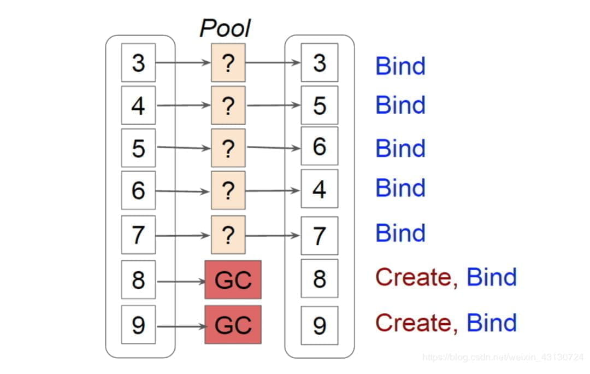

当我们调用 notifyDataSetChanged() 或者 notifyItemRangeChanged(i, c) （c 这个范围非常大的时候），那么很多 viewHolder 都会最终被放入到 pool 中，因为 pool 只能放置 5 个，那么多余的就会被丢弃，等待回收。最重要的是会重新 create 与 bind 对性能影响比较大。如果你的列表能够容纳很多行，而且使用 notifyDataSetChanged 方法比较频繁，那么你应该考虑设置一下容量大小。

```java
recyclerView.getRecycledViewPool().setMaxRecycledViews(0, 20);
```

# ViewCacheExtension

这个是需要自定义的，而且使用有很大的限制，所以不深入介绍了。

因为它需要你自己创建 viewHolder，并将它缓存起来，那么问题就来了。当我们删除或添加一个 item 的时候，AdapterHelper 回调 RecyclerView 通知它需要处理变化。RecyclerView 会遍历当前显示的 viewHolder 然后移动它们的位置。但是这里有个 bug，RecyclerView 根本不知道你创建的 viewHolder，所以它不会管你自己缓存的 viewHolder。

所以，如果你想使用的话，需要满足一些条件：

*   位置固定，比如，广告位。
  
*   不会改变
  
*   数量合理，保存在内存中没啥关系。
  

## setHasStableIds

之前我们说过，当调用 notifyDataSetChanged 的时候，recyclerView 不知道到底发生了什么，所以它只能认为所有的东西都发生了变化，即将所有的 viewHolder 都放入到 pool 中。

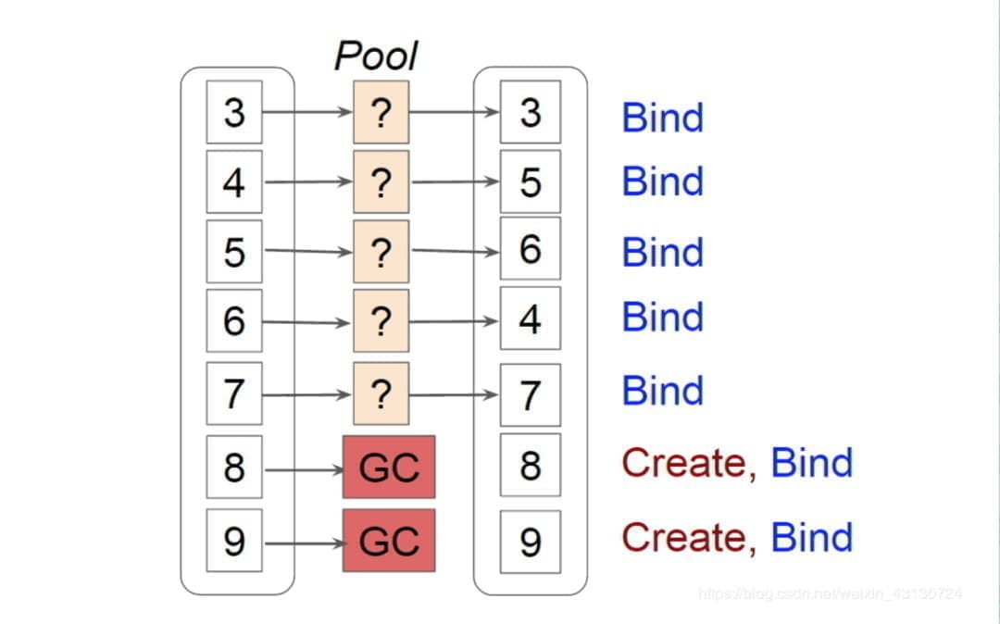

但是，如果我们设置了 stable ids，那么就会不一样了：

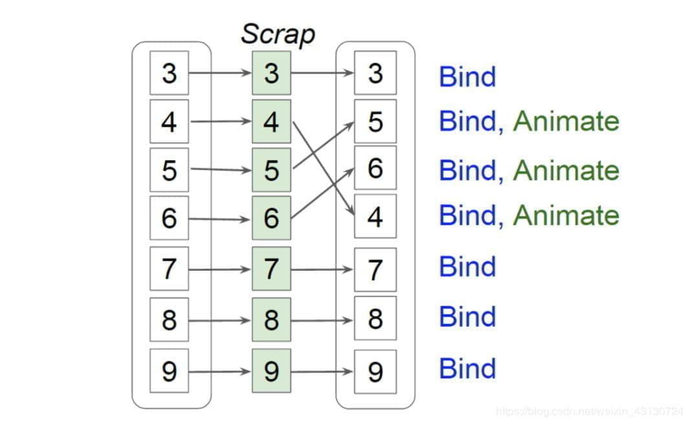

viewHolder 被放入了 scrap 中，而不是 pool 中。注意，这里，它的性能提升了很多！

1.  不用重新绑定，重新创建新的 viewHolder，不用重新 addView。addView 会导致重新测量…
  
2.  原来我们需要调用 notifyItemMoved(4, 6)，但是现在直接调用 notifyDataSetChanged() 就好了，但是我测试的是没有动画效果的。
  

# 总结

到了这里，你应该可以回答下面的问题了：

1.  notifyDataSetChanged 与 notifyItemRangeChanged 的区别？
  
2.  RecyclerView 与 ListView 缓存的区别？这个问题，即使你不知道 ListView 的缓存机制，也应该能说些什么。
  
3.  如何对一个列表进行性能优化？调用 notifyDataSetChanged 时闪烁的原因？
  
