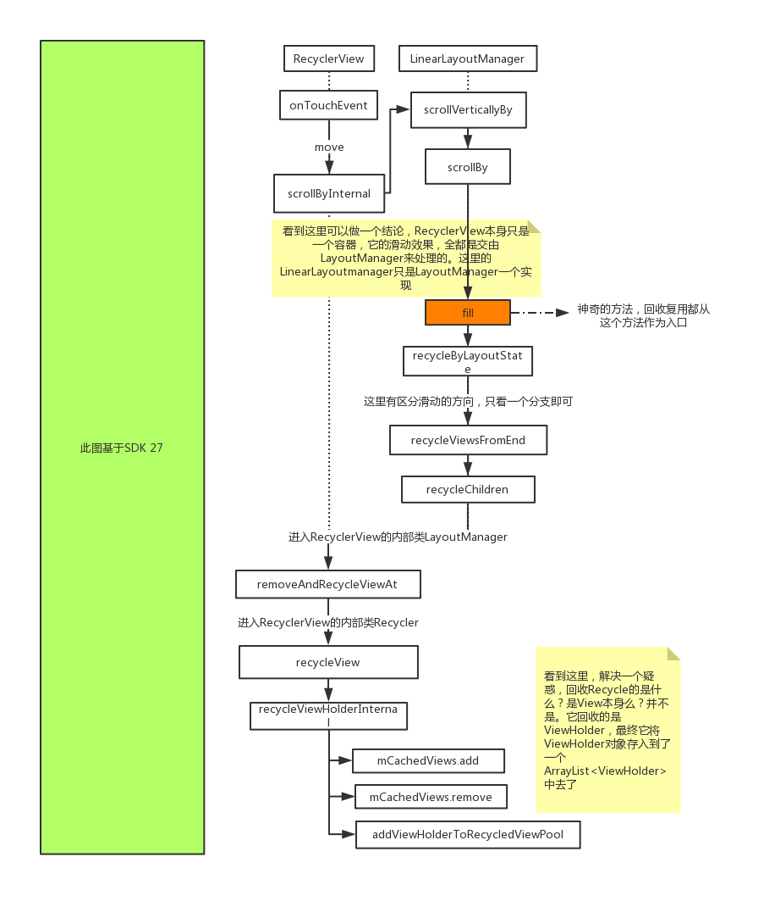

> 本文由 [简悦 SimpRead](http://ksria.com/simpread/) 转码， 原文地址 [www.jianshu.com](https://www.jianshu.com/p/40820ea48457)

[toc]

前言
==

 **学习源码，研究源码编程思想，是程序开发者进阶的必经之路。然而，进了源码世界，就像是进了迷失森林，没有地图，迟早要死在里面。有个地图会好很多。**  
 此类文集，专门用图解编程的方式，来讲解一个知识点，从一个点切入，理解切入点之后，再进行知识发散。  
 路漫漫，进阶之路不好走。与众君共勉之。

正文
==

大家都知道**`RecyclerView`**有回收复用机制，那么回收复用机制是如何作用的？  
回收复用，细分下来，是两个概念: **回收** 和 **复用** 有如下几个问题。

 **回收的是什么？复用的又是什么？**

 **回收到哪里去了？复用又是从哪里拿？**

 **什么时候回收？什么时候复用？**

图解编程
====

看图之前，先明确一个概念，`RecyclerView`是支持滑动，那么一定可以确定一点 ------ 回收和复用一定是基于滑动事件的，不然一个静止的`view`，谈不上回收复用. 既然如此，那么我们探索的起点，应该是 **`RecyclerView`的`onTouchEvent`的`move`事件**

## 回收

_当一个`itemView`从可见到不可见时，`RecyclerView`利用回收机制，将它存放到了内存中，以便其他`item`出现时，不用每次都去`new`一个新的`itemView`, 而是只去 `onBindViewHolder`绑定数据就行了. **大概流程如下:**

  

## 复用

滑动过程中出现了新的 itemView，不用每次都去 new，而是优先从缓存中去拿，缓存不能满足需求，再去 执行 onCreateViewHolder 创建新的 itemView 并封装到 viewHolder 中**大概流程如下:**

  

如果追踪一遍上面的源码，那么就可以回答之前的问题
========================

 **回收的是什么？复用的又是什么？**  
 **回收到哪里去了？复用又是从哪里拿？**

 **_答：回收和复用的都是`ViewHolder`对象，在`RecyclerView`的内部类`Recycler`中，可以看到四重缓存中的关键数据结构都和`ArrayList<ViewHolder`有关,`ViewHolder`是`itemView`的封装。  
 说明无论回收还是复用，都是以`ViewHolder`为单位去存取。_**

 _什么时候回收？什么时候复用？_

 **_答：我们追踪程序，是以 `RecyclerView`的 `onTouchEvnet` `move`事件为起点。结合追踪到的源码，可以发现，回收发生在 `itemView`消失的时候，复用则发生在 `itemView`由不可见到可见的时候_**

其他重要结论
======

 **`RecyclerView`本身只是一个容器 (`RecyclerView extends ViewGroup`), 它的`onLayout`方法重写，决定了`itemView`的排布方式，追踪进去，`onLayout` ==`dispatchLayout()`== `dispatchLayoutStep1()` `dispatchLayoutStep2()` `dispatchLayoutStep3();` 看来`layout`过程分为三步，而进入这 3 个方法，都能找到 `mLayout.XXX`方法，这是因为 `RecyclerView`本身只是一个`ViewGroup`，它的布局方式，全权委托给了`LayoutManager`这个内部类的实现，而这个实现的`关键方法`则是：`onLayoutChildren`, 重写这个方法将会决定`RecyclerView`的`itemView`如何布局**

 **看过了源码，在去理解之前写的一些`RecyclerView`的`Adapter`, 认识深刻了很多，为什么它有这么几个方法 `onCreateViewHolder`,`onBindViewHolder`, 为什么`Adapter`的类定义时要这样 `Adapter<VH extends ViewHolder`. 因为`Adapter`是`RecyclerView`的数据和`itemView`的连接层，`itemView`都是要封装到`ViewHolder`中的，绑定数据就要和`ViewHolder`发生关系**

 **`RecyclerView`这个东西，如果看成是一个知识体系，那么它有这么几个关键因素：**  
 **1. 容器 ，`RecyclerView`本身**  
 **2. 布局管理器，`RecyclerView.LayoutManager`**  
 **3. 回收复用机制, `RecyclerView.Recycler`**  
 **4. 适配器,`RecyclerView.Adapter`**  
 _当然，它的内部类当然不止这么几个，各有各的作用，今天探索复用机制，就涉及到了这么几个。_