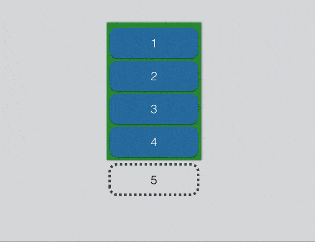

[toc]


# RecyclerView使用常见的问题和需求

## RecycleView设置了数据不显示

这个往往是因为你没有设置`LayoutManger`。 没有`LayoutManger`的话`RecycleView`是无法布局的，即是无法展示数据,下面是`RecycleView`布局的源码:

```java
void dispatchLayout() {  //没有设置 Adapter 和 LayoutManager， 都不可能有内容
    if (mAdapter == null) {
            Log.e(TAG, "No adapter attached; skipping layout");
            // leave the state in START
            return;
    }
    if (mLayout == null) {
            Log.e(TAG, "No layout manager attached; skipping layout");
            // leave the state in START
            return;
    }
}
```

即`Adapter`或`Layout`任意一个为null,就不会执行布局操作。

## RecyclerView数据多次滚动后出现混乱

`RecycleView`在滚动过程中`ViewHolder`是会不断复用的，因此就会带着上一次展示的UI信息(也包含滚动状态), 所以在设置一个`ViewHolder`的UI时，尽量要做`resetUi()`操作:

```java
override fun onBindViewHolder(holder: RecyclerView.ViewHolder, position: Int) {
        holder.itemView.resetUi()
        ...设置信息UI 
}
```

`resetUi()`这个方法就是用来把Ui还原为最初的操作。当然如果你的每一次`bindData`操作会对每一个UI对象重新赋值的话就不需要有这个操作。就不会出现`itemView`的UI混乱问题。 


## 如何获取当前 ItemView展示的位置

我们可能会有这样的需求: 当`RecycleView`中的特定`Item`滚动到某个位置时做一些操作。比如某个`Item`滚动到顶部时，展示搜索框。那怎么实现呢？

首先要获取的Item肯定处于数据源的某个位置并且肯定要展示在屏幕。因此我们可以直接获取这个`Item`的`ViewHolder`:

```java
    val holder = recyclerView.findViewHolderForAdapterPosition(speicalItemPos) ?: return

    val offsetWithScreenTop = holder.itemview.top

    if(offsetWithScreenTop <= 0){  //这个ItemView已经滚动到屏幕顶部
        //do something
    }
```

## 如何在固定时间内滚动一款距离

`smoothScrollToPosition()`大家应该都用过，如果滚动2、3个Item。那么整体的用户体验还是非常棒的。

但是，如果你滚动20个Item，那这个体验可能就会就很差了，因为用户看到的可能是下面这样子:


恩，滚动的时间有点长。因此对于这种case其实我推荐直接使用`scrollToPosition(20)`，效果要比这个好。 可是如果你就是想在`200ms`内从`Item 1 `滚到`Item 20`怎么办呢？

可以参考[StackOverflow上的一个答案](https://stackoverflow.com/questions/28803319/android-control-smooth-scroll-over-recycler-view/28853254)。大致写法是这样的:

```java
//自定义 LayoutManager， Hook smoothScrollToPosition 方法
recyclerView.layoutManager = object : LinearLayoutManager(this, LinearLayoutManager.VERTICAL, false) {
    override fun smoothScrollToPosition(recyclerView: RecyclerView?, state: RecyclerView.State?, position: Int) {
        if (recyclerView == null) return
        val scroller = get200MsScroller(recyclerView.context, position * 500)
        scroller.targetPosition = position
        startSmoothScroll(scroller)
    }
}

private fun get200MsScroller(context: Context, distance: Int): RecyclerView.SmoothScroller = object : LinearSmoothScroller(context) {
    override fun calculateSpeedPerPixel(displayMetrics: DisplayMetrics): Float {
        return (200.0f / distance) //表示滚动 distance 花费200ms
    }
}
```

比如上面我把时间改为`10000`,那么就是用10s的时间完成这个滚动操作。


## 如何测量当前RecyclerView的高度

先描述一下这个需求: `RecyclerView`中的每个`ItemView`的高度都是不固定的。我数据源中有20条数据，在没有渲染的情况下我想知道这个20条数据被`RecycleView`渲染后的总共高度, 比如下面这个图片:


怎么做呢？我的思路是利用`LayoutManager`来测量，因为`RecycleView`在对`子View`进行布局时就是用`LayoutManager`来测量`子View`来计算还有多少剩余空间可用，源码如下:

```java
   void layoutChunk(RecyclerView.Recycler recycler, RecyclerView.State state,LayoutState layoutState, LayoutChunkResult result) {
        View view = layoutState.next(recycler);   //这个方法会向 recycler要一个View
        ...
        measureChildWithMargins(view, 0, 0);  //测量这个View的尺寸，方便布局, 这个方法是public
        ...
    }
```

所以我们也可以利用`layoutManager.measureChildWithMargins`方法来测量，代码如下:

```java
    private fun measureAllItemHeight():Int {
        val measureTemplateView = SimpleStringView(this)
        var totalItemHeight =
        dataSource.forEach {  //dataSource当前中的所有数据
            measureTemplateView.bindData(it, 0) //设置好UI数据
            recyclerView.layoutManager.measureChild(measureTemplateView, 0, 0) //调用源码中的子View的测量方法
            currentHeight += measureTemplateView.measuredHeight
        }
        return totalItemHeight
    }
```

**但要注意的是，这个方法要等布局稳定的时候才可以用，如果你在`Activity.onCreate`中调用，那么应该`post`一下**， 即:

```java
recyclerView.post{
    val totalHeight = measureAllItemHeight()
}
```

## 异常:IndexOutOfBoundsException: Inconsistency detected. Invalid item position 5(offset:5).state:9 

这个异常通常是由于`Adapter的数据源大小`改变没有及时通知`RecycleView`做UI刷新导致的，或者通知的方式有问题。 比如如果数据源变化了(比如数量变少了),而没有调用`notifyXXX`, 那么此时滚动`RecycleView`就会产生这个异常。

解决办法很简单 : **`Adapter的数据源`改变时应立即调用`adapter.notifyXXX`来刷新`RecycleView`** 。

分析一下这个异常为什么会产生:

在`RecycleView刷新机制`一文介绍过，`RecycleView`的滚动操作是不会走`RecycleView`的正常布局过程的，它直接根据滚动的距离来摆放`新的子View`。 想象一下这种场景，原来数据源集合中
有8个Item，然后删除了4个后没有调用`adapter.notifyXXX()`，这时直接滚动`RecycleView`，比如滚动将要出现的是第6个Item，`LinearLayoutManager`就会向`Recycler`要第6个Item的View:

>`Recycler.tryGetViewHolderForPositionByDeadline()`:

```java
final int offsetPosition = mAdapterHelper.findPositionOffset(position);  //position是6 
if (offsetPosition < 0 || offsetPosition >= mAdapter.getItemCount()) {    //但此时  mAdapter.getItemCount() = 5
        throw new IndexOutOfBoundsException("Inconsistency detected. Invalid item "
                + "position " + position + "(offset:" + offsetPosition + ")."
                + "state:" + mState.getItemCount() + exceptionLabel());
}
```

即这时就会抛出异常。如果调用了`adapter.notifyXXX`的话，`RecycleView`就会进行一次完全的布局操作，就不会有这个异常的产生。

其实还有很多异常和这个原因差不多，比如:`IllegalArgumentException: Scrapped or attached views may not be recycled. isScrap:false`(很多情况也是由于没有及时同步UI和数据)

所以在使用`RecycleView`时一定要注意保证**数据和UI的同步，数据变化，及时刷新RecyclerView**, 这样就能避免很多crash。

# 如何对RecyclerView进行封装

现在很多app都会使用`RecyclerView`来构建一个页面，这个页面中有各种卡片类型。为了支持快速开发我们通常会对`RecycleView`的`Adapter`做一层封装来方便我们写各种类型的卡片,下面这种封装是我认为一种比较好的封装:

```java
/**
 * 对 RecyclerView.Adapter 的封装。方便业务书写。 业务只需要处理 (UI Bean) -> (UI View) 的映射逻辑即可
 */
abstract class CommonRvAdapter<T>(private val dataSource: List<T>) : RecyclerView.Adapter<RecyclerView.ViewHolder>() {

    override fun onCreateViewHolder(parent: ViewGroup, viewType: Int): RecyclerView.ViewHolder {
        val item = createItem(viewType)
        return CommonViewHolder(parent.context, parent, item)
    }

    override fun onBindViewHolder(holder: RecyclerView.ViewHolder, position: Int) {
        val commonViewHolder = holder as CommonViewHolder<T>
        commonViewHolder.adapterItemView.bindData(dataSource[position], position)
    }

    override fun getItemCount() = dataSource.size

    override fun getItemViewType(position: Int): Int {
        return getItemType(dataSource[position])
    }

    /**
     * @param viewType 需要创建的ItemView的viewType, 由 {@link getItemType(item: T)} 根据数据产生
     * @return 返回这个 viewType 对应的 AdapterItemView
     * */
    abstract fun createItem(viewType: Int): AdapterItemView<T>

    /**
     * @param T 代表dataSource中的一个data
     *
     * @return 返回 显示 T 类型的data的 ItemView的 类型
     * */
    abstract fun getItemType(item: T): Int

    /**
     * Wrapper 的ViewHolder。 业务不必理会RecyclerView的ViewHolder
     * */
    private class CommonViewHolder<T>(context: Context?, parent: ViewGroup, val adapterItemView: AdapterItemView<T>)
    //这一点做了特殊处理，如果业务的AdapterItemView本身就是一个View，那么直接当做ViewHolder的itemView。 否则inflate出一个view来当做ViewHolder的itemView
        : RecyclerView.ViewHolder(if (adapterItemView is View) adapterItemView else LayoutInflater.from(context).inflate(adapterItemView.getLayoutResId(), parent, false)) {
        init {
            adapterItemView.initViews(itemView)
        }
    }
}

/**
 * 能被 CommonRvAdapter 识别的一个 ItemView 。 业务写一个RecyclerView中的ItemView，只需要实现这个接口即可。
 * */
interface AdapterItemView<T> {

    fun getLayoutResId(): Int

    fun initViews(var1: View)

    fun bindData(data: T, post: Int)
}
```

为什么我认为这是一个不错的封装?

## 业务如果写一个新的Adapter的话只需要实现两个方法:

```java
abstract fun createItem(viewType: Int): AdapterItemView<T>

abstract fun getItemType(item: T): Int
```

即业务写一个`Adapter`只需要对 **UI 数据** -> **UI View** 做映射即可, 不需要关心`RecycleView.ViewHolder`的逻辑。

## 因为抽象了`AdapterItemView`, ItemView足够灵活

由于封装了`RecycleView.ViewHolder`的逻辑，因此对于`UI item view`业务方只需要返回一个实现了`AdapterItemView`的对象即可。可以是一个`View`,也可以不是一个`View`, 这是因为`CommonViewHolder`在构造的时候对它做了兼容:

```java
val view : View = if (adapterItemView is View) adapterItemView else LayoutInflater.from(context).inflate(adapterItemView.getLayoutResId(), parent, false)
```

即如果实现了`AdapterItemView`的对象本身就是一个`View`,那么直接把它当做`ViewHolder`的`itemview`,否则就`inflate`出一个`View`作为`ViewHolder`的`itemview`。

其实这里我比较推荐实现`AdapterItemView`的同时直接实现一个`View`,即不要把`inflate`的工作交给底层框架。比如这样:

```java
private class SimpleStringView(context: Context) : FrameLayout(context), AdapterItemView<String> {

    init {
        LayoutInflater.from(context).inflate(getLayoutResId, this)  //自己去负责inflate工作
    }

    override fun getLayoutResId() = R.layout.view_test

    override fun initViews(var1: View) {}

    override fun bindData(data: String, post: Int) { simpleTextView.text = data }
}
```

为什么呢？原因有两点 :

1. 继承自一个View可复用性很高，封装性很高。即这个`SimpleStringView`不仅可以在`RecycleView`中当一个`itemView`,也可以在任何地方使用。
2. 方便单元测试，直接new这个View就好了。

但其实直接继承自一个`View`是有坑的，即上面那行inflate代码`LayoutInflater.from(context).inflate(getLayoutResId, this)`

它其实是把`xml`文件inflate成一个`View`。然后add到你`ViewGroup`中。因为`SimpleStringView`就是一个`FrameLayout`，所有相当于add到这个`FrameLayout`中。这其实就有问题了。比如你的布局文件是下面这种:

```
<FrameLayout>
.....
</FrameLayout>
```

**这就相当于你可能多加了一层无用的父View**

所有如果是直接继承自一个View的话，我推荐这样写:

1. 布局文件中尽可能使用`<merge>`标签来消除这层无用的父View, 即上面的`<FrameLayout>`改为`<merge>`
2. 很简单的布局的可以直接在代码中写，不要inflate。这样其实也可以减少inflate的耗时，稍微提高了一点性能吧。

当然，如果你不需要对这个View做复用的话你可以不用直接继承自`View`,只实现`AdapterItemView`接口, inflate的工作交给底层框架即可。这样是不会产生上面这个问题的。


----


阿里面试总共 4 轮，其中有 3 轮面试都问到了 RecyclerView 的问题。面试的点各不相同，有原理、嵌套问题、有缓存实现，但是最终都是殊途同归，所有的问题都汇集在, 如何对 RecyclerView 做性能优化？

一、RecyclerView 第一次 layout 时，会发生预布局 pre-layout 吗？
================================================

第一次布局时，并不会触发 pre-layout。pre-layout 只会在每次 notify change 时才会被触发，目的是通过 saveOldPosition 方法将屏幕中各位置上的 ViewHolder 的坐标记录下来，并在重新布局之后，**通过对比实现 Item 的动画效果**。比如以下效果：


二、 如果自定义 LayoutManager 需要注意什么？
==============================

在 RecyclerView 的 dispatchLayoutStep1 阶段，会调用自定义 LayoutManager 的 supportsPredictiveItemAnimations 方法判断在某些状态下是否展示 predictive animation。以下 LinearLayoutManager 的实现：

```java
@Override
public boolean supportsPredictiveItemAnimations() {
	return mPendingSavedState == null && mLastStackFromEnd == mStackFromEnd;
}
```

如果 supportsPredictiveItemAnimations 返回 true，则 LayoutManager 中复写 onLayoutChildren 方法会被调用 2 次：一次是在 pre-layout，另一次是 real-layout。

因为会有 pre-layout 和 real-layout，所有在自定义 LayoutManager 中，需要根据 RecyclerView.State 中的 isPreLayout 方法的返回值，在这两次布局中做区分。比如 LinearLayoutManager 中的 onLayoutChildren 中有如下判断：


上面代码中有一段注释：

> if the child is visible and we are going to move it around, we should layout **extra****items** in the opposite direction to make sure new items animate nicely instead of just fading in

代表的意思就是如果当前正在 update 的 item 是可见状态，则需要在 pre-layout 阶段**额外填充**一个 item，目的是为了保证处于不可见状态的 item 可以平滑的滑动到屏幕内。

三、举例说明
======

 比如下图中点击 item2 将其删除，调用 notifyItemRemoved 后，在 pre-layout 之前 item5 并没有被添加到 RecyclerView 中，而经过 pre-layout 之后，item5 经过布局会被填充到 RecyclerView 中


当 item 移出屏幕之后，item5 会随同 item3 和 item4 一起向上移动，如下图所示：


 如果自定义 LayoutManager 并没有实现 pre-layout，或者实现不合理，则当 item2 移出屏幕时，只会将 item3 和 item4 进行平滑移动，而 item5 只是单纯的 appear 到屏幕中，如下所示：



可以看出 item5 并没有同 item3 和 item4 一起平滑滚动到屏幕内，这样界面上显示会给用户卡顿的感觉。

四、 ViewHolder 何时被缓存到 RecycledViewPool 中？
========================================

主要有以下 2 种情况：

1.  当 ItemView 被滑动出屏幕时，并且 CachedView 已满，则 ViewHolder 会被缓存到 RecycledViewPool 中
2.  当数据发生变动时，执行完 disappearrance 的 ViewHolder 会被缓存到 RecycledViewPool 中

五、CachedView 和 RecycledViewPool 的关系
===================================

 当一个 ItemView 被滑动滚出屏幕之后，默认会先被保存在 CachedView 中。CachedView 的默认大小为 2，可以通过 setItemViewCacheSize 方法修改它的值。当 CachedView 已满后，后续有新的 ItemView 从屏幕内滑出时，会迫使 CachedView 根据 FIFO 规则，将之前的缓存的 ViewHolder 转移到 RecycledViewPool 中，效果可以参考下图：


RecycledViewPool 默认大小为 5，可以通过以下方式修改 RecycledViewPool 的缓存大小：

```
RecyclerView.getRecycledViewPool().setMaxRecycledViews(int viewType, int max);
```

六、 CachedView 和 RecycledViewPool 两者区别
=====================================

缓存到 CachedView 中的 ViewHolder 并不会清理相关信息 (比如 position、state 等)，因此刚移出屏幕的 ViewHolder，再次被移回屏幕时，只要从 CachedView 中查找并显示即可，不需要重新绑定 (bindViewHolder)。

而缓存到 RecycledViewPool 中的 ViewHolder 会被清理状态和位置信息，因此从 RecycledViewPool 查找到 ViewHolder，需要重新调用 bindViewHolder 绑定数据。

七、 你是从哪些方面优化 RecyclerView 的？
============================

我总结了几点，主要可以从以下几个方面对 RecyclerView 进行优化：

> 尽量将复杂的数据处理操作放到异步中完成。RecyclerView 需要展示的数据经常是从远端服务器上请求获取，但是在网络请求拿到数据之后，需要将数据做扁平化操作，尽量将最优质的数据格式返回给 UI 线程。
>
> 优化 RecyclerView 的布局，避免将其与 ConstraintLayout 使用
>
> 针对快速滑动事件，可以使用 addOnScrollListener 添加对快速滑动的监听，当用户快速滑动时，停止加载数据操作。
>
> 如果 ItemView 的高度固定，可以使用 setHasFixSize(true)。这样 RecyclerView 在 onMeasure 阶段可以直接计算出高度，不需要多次计算子 ItemView 的高度，这种情况对于垂直 RecyclerView 中嵌套横向 RecyclerView 效果非常显著。
>
> 当 UI 是 Tab feed 流时，可以考虑使用 RecycledViewPool 来实现多个 RecyclerView 的缓存共享。

