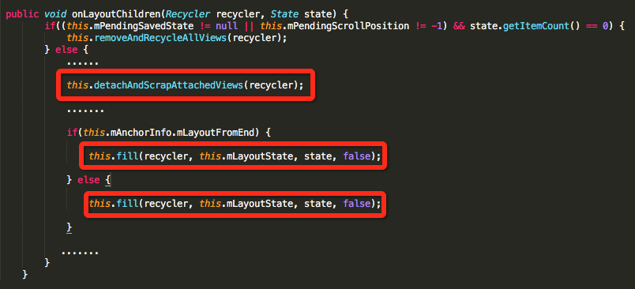
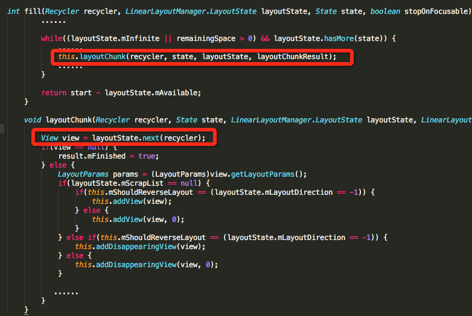

> 本文由 [简悦 SimpRead](http://ksria.com/simpread/) 转码， 原文地址 [www.jianshu.com](https://www.jianshu.com/p/29352def27e6)

目前，在项目中一些主要页面（_如图 1 首页，**采用 ViewPager+TabLayout ，已实现数据懒加载**_）都会缓存第一页数据（网络）存 DB，下次进来时会先请求 DB 数据，然后再请求网络数据，这样用户体验比较好。之前我们主要页面都是使用_RadioPullToRefreshListView(_封装的 PullToRefreshListView，后面简称 ListView_)_方式实现（刷新方式使用的是 notifyDataSetChanged），这样不管 DB 中的数据和网路请求数据是否一样，都会刷新两次，体验上没有什么问题，自从 4.0 版本陆续改用 RecyclerView 方式实现，发现有图片加载的地方会闪烁一下（录屏效果不怎么好，这里就不放图了，脑补一下）。

仅仅只是用 RecyclerView 替换 ListView 逻辑主体并未修改，因此目光很快锁定在 RecyclerView 上面，网上一搜索，类似问题有很多，**大多说是没有设置 setStableIds(true) 和复写 getItemId() 导致的**。

照葫芦画瓢，我给对应的 Adapter 设置了 **setStableIds(true) 和复写 getItemId()，**发现闪络问题依然存在，至于为什么当时没解决（**其实可以解决，后面给原因**），就放弃尝试这种方式。

我们都知道 RecylerView  在 ListView 的基础上新增了 很多种刷新方式，既然 notifyDataSetChanged() 不行 ，于是乎改用了_notifyItemRangeChanged(int positionStart, int itemCount)，_发现改方法竟然解决了上述闪烁问题。

#### **一 、对比两种刷新方式异同点**

**（1）notifyDataSetChanged() 最后作用于 onChanged**

唯独可疑的是：_RecyclerView.this.setDataSetChangedAfterLayout()，_将 ViewHolder 标记为更新或无用，暂时记录一下，后续会讲。

**（2）RecyclerView 中刷新（如_notifyItemRangeChanged（）_**）

notifyItemRangeChanged 等方法最后，都会调用_triggerUpdateProcessor() ，_由于主页面基本都是多 ViewType 情况，一般不会设置 HasFixedSize 为 true，因而最终只会调用 else 分支去。

 图 4  triggerUpdateProcessor()

从（1）和（2）中，两种刷新差别，仅仅在于方法（1）会更改 ViewHolder 的标志，共同点都会调用 requestLayout()，导致 RecyclerView 重新测量和布局，到此还是看不出闪烁问题的原因所在。另外还有一个重要实验未说：如果单纯的只进行网络刷新的话，图像闪烁情况基本没有（页面跳转导致闪烁不明显）。种种迹象表明，可能是数据刷新过程中 View 未复用，从新 inflate 耗时亦或是其他原因，导致闪烁。
    
接下来，我们只能从 RecyclerView 的测量和布局来分析，找出蛛丝马迹。

#### 二、简要分析 RecyclerView 的测量、布局及缓存策略

**(1) RecyclerView::onMeasure()**

RecyclerView 的 onMeasure 相对比较简单 ，具体如下：目前官方提供的 LayoutManager 的 mAutoMeasure 为 true ，项目中 RecyclerView 的宽高是精确的，因而 skipMeasure 为 true ，直接 return 了。从 RecyclerView::onMeasure() 看不出两种刷新的不同点，接下来看看 onLayout 。

**（2）RecyclerView::onLayout ()**

这里不打算细讲，跳过 1000 字 ，RecyclerView 之所以能够灵活布局，是因为它将 onLayout() 委托给了 LayoutManager ，这里以 LinearLayoutManager 为例说明：

**LinearLayoutManager::onLayoutChildren()**(调用链  RecyclerView::dispatchLayout()->dispatchLayoutStep2() ->**onLayoutChildren()**) ，在 onLayoutChildren() 讲解两个比较重要的函数：detachAndScrapAttachedViews(recycler) 用于处理 ViewHolder 复用（View 复用），fill（）执行布局。

 **1）detachAndScrapAttachedViews（）**

 detachAndScrapAttachedViews() 会循环遍历所有的 View ，根据 ViewHolder 的状态 及 Adapter.hasStableIds() 来进行不同操作。

**分支 1：**

ViewHolder 无用 && 没有 Remove&&hasStableIds 为 false ，会删除对应 View, 同时根据条件选择 保存在 mCachedViews 和 addViewHolderToRecycledViewPool ；

**分支 2：**

先 detachView ，同时根据条件保存在 mChangedScrap 和 mAttachedScrap 中；

看到上面的条件，是不是很熟，在 notifyDataSetChanged 时，会先将 ViewHolder 设置成无效。在此打断点，发现 单独 notifyDataSetChanged() 情况，确实会走进 if 分支（_**notifyItemRangeChanged(）会进入 else 分支**_），那设置 hasStableIds（true）应该不会吧，发现竟然还是走进去了 ，纳尼？？？？
    
仔细一看，对应的 Adapter 不对，竟然是封装的 RecyclerView 组件，内部的 WrapAdapter （方便实现加载更多等操作），对应修改组件内的 WrapAdapter ，设置 hasStableIds（true） 和 复写 getItemId（），仍然使用 notifyDataSetChanged ，闪烁问题果然没有了 。
    
根据 **_detachAndScrapAttachedViews()_** 发现，两种刷新方式不同在于对 ViewHoler 的缓存方式不一样，那先看看布局时是如何复用的，fill() 函数是真正进行布局的：

从上可以看到 View 是通过 next() 方式获取 ：

next()->recycler.getViewForPosition()->tryGetViewHolderForPositionByDeadline()

从上可以看到 ViewHolder 创建或复用的过程，为了弄懂里面的流程，我们接着简要介绍一下 RecyclerView 的四级缓存是如何实现的。

**（3）RecyclerView 的四级缓存**

1）屏幕内缓存

 mChangedScrap： 表示数据已经改变的 ViewHolder

 **mAttachedScrap ： 表示未与 RecyclerView 分离的 ViewHolder**

2）屏幕外缓存

mCachedViews：屏幕划出屏幕时，ViewHolder 会被缓存在 mCachedViews  （默认 2）

3）自己实现 ViewCacheExtension 类实现自定义缓存

4）缓存池

tryGetViewHolderForPositionByDeadLine() 中操作，可细化为如下流程图（网络盗图）：

结合 tryGetViewHolderForPositionByDeadLine() 调用流程 和 RecyclerView 四级缓存策略，我们很容易分析出两种刷新方式，导致的现象不一样。

#### 三、RecyclerView notifyDataSetChanged 导致图片闪烁的真凶

结合上文所讲内容，可以很容易分析出 notifyDataSetChanged 导致图片闪烁的真凶 ：

（1）仅使用 notifyDataSetChanged ，在重新布局时，会先 remove View ，然后根据相关场景，缓存到 mCachedViews 、ViewCacheExtension（项目未实现）、缓存池 pool 中；在 tryGetViewHolderForPositionByDeadLine() 时，会从上述缓存中复用，根据图 10，如果在 pool 中取不到的话，会直接 CreateViewHolder，重新 inflate，导致闪烁。

（2）使用 notifyDataSetChanged() + hasStableIds() true + 复写 getItemId()  或者_notifyItemRangeChanged(），会缓存在_ _mAttachedScrap，_因此不会重新 createViewHolder。

原因真的如（1）所说是重新创建 CreateViewHolder，导致闪烁的吗，简单实验如下：图中 Customxxxx 是 itemView 的顶级 View。

1）notifyDataSetChanged() 刷新

发现请求网络数据后，基本上没有发现 CreateViewHolder （有时候会有，日志中没有打印，这里主要展示 ItemView 的测量和布局），却发现了 itemView 重新测量 和布局了。

2）notifyDataSetChanged() + hasStableIds() true + 复写 getItemId()

发现请求网络数据后，并未发现 itemView 重新测量和布局

上述实验说明，图片闪烁的原因不在于此，不是因为 createViewHolder 造成的 ，因为第二次网络请求回来时，pool 中是有缓存的。
    
那么闪烁的真正原因是什么？目前还有一个疑点  ，之前 我们只是分析了 ViewHolder 的复用，但是拿到 ViewHolder（或 View）后，addView 操作两种方式是不是也存在差别   。
    
在 layoutChunk() 中，拿到 view 后，最终会调用 addViewInt() 方法，如下图所示：

1) 如果 holder 来自 scrap，则最终调用 RecyclerView.this.attachViewToParent(child, index, layoutParams) ，用来显示 View ，与之前 detachView 相对应；

2）child.getParent 是当前 RecyclerView ，则 仅仅移动 View；

3）1）和 2）都不是，则直接 RecyclerView.this.addView(child, index)，导致 itemView 重新测量和布局 

 **至此，notifyDataSetChanged 导致图片闪烁的真凶 是 itemView 重新测量布局导致的，并非 createViewHolder 。**

#### 四、解决图片闪烁的几种方式 

几种解决的办法：

1）notifyDataSetChanged()+SetHasStableIds(true)  + getItemId 复写

2）使用 notifyItemRangeChanged() 

notifyItemRangeChanged() 一般使用在加载更多场景，如果直接使用 notifyItemRangeChanged() 代替 notifyDataSetChanged 会给人一种错觉，为什么不能使用 notifyDataSetChanged()，不是很好理解。

3）使用 diffUtil 工具类实现刷新

具体可参看我的另一篇文章 ：[RecyclerView + DiffUtil 使用预研](https://link.jianshu.com?t=http%3A%2F%2Fkm.oa.com%2Farticles%2Fshow%2F352880%3Fts%3D1516246147)

#### 五 、关于 getItemId() 的疑问

为什么这里单独介绍 notifyDataSetChanged + setHasStableIds(true) + 复写 getItemId() 方法，这种方式解决闪烁是没有问题的，但是存在一个大大的坑。
    
那就是设置 setHasStableIds(true) 时，一定要保证 有一个 unique  identifiters （如下图所示） ，同网上通常做法是直接复用 Adapter 中的 getItemId() 方法，直接返回 position （但是数据集的 position 可能会变的，并不唯一 ，大大的疑问？） 。但是，反复测试确实没有发现问题，可能是因为使用场景不同导致不易察觉。

带着疑问，Google 前人杰作及官方示例代码（太简单未涉及），发现了一篇文章 Android [RecyclerView 使用 ItemTouchHelper 时异常](https://link.jianshu.com?t=http%3A%2F%2Fblog.csdn.net%2Fsunsteam%2Farticle%2Fdetails%2F78115151) （感谢一下），文章提及在使用 ItemTouchHelper 时发生闪烁数据异常，同时指出原因 是 使用 setHasStableIds(true) + 复写 getItemId() 返回 position 导致的，具体原因，并未讲明。
    
刚好项目中 UGC 录音，音效歌曲选择那里使用到 ItemTouchHelper，简单实验一下，发现果然如文章所示发生了异常，操作过程如下：滑动过程闪现闪烁，滑动停止后，发现数据异常（两个位置的数据时一样的）。

出现上述现象的原因 ：

（1）在移动过程中，会调用 _notifyItemMoved(fromPosition, toPosition)，_导致 RecyclerView 重新布局  

（2）在图 9 tryGetViewHolderForPositionByDeadLine() 方法中，当 hasStableIds 为 true 时，会通过 getScrapOrCachedViewForId （如下图）获取复用 viewHolder 的 id  。滑动前：getItemId 为_fromPosition，_因此 holder.getItemId() 等于_fromPosition，_由于滑动 RecyclerView.this.mAdapter.getItemId(offsetPosition) 中的 offsetPosition 发生了改变，导致 id 不等于 fromPosition，最终导致 getScrapOrCachedViewForId() 为 null_。_

这一步获取失败后，就会从缓存池 pool 中获取，会重新 addView ，导致 测量和布局，因此上述拖动过程会发生闪烁。
    
既然是因为 getItemId() 返回 position 导致的，那就返回一个唯一值不就可以了 ，返回 第 postion 位置 data 的 hashCode 不就可以吗  （在 DB + 网络情况，data 内容相同，但是它的 hashCode 是不同的），如果这里有更好的表示返回值方式请告诉我 ！

**由此得出结论** ：notifyDataSetChanged + setHasStableIds(true) + 复写 getItemId() 方法 并非是万能的，其解决还是要区分场景。