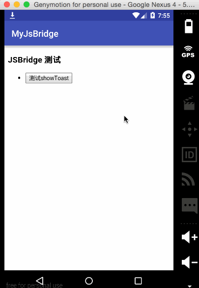
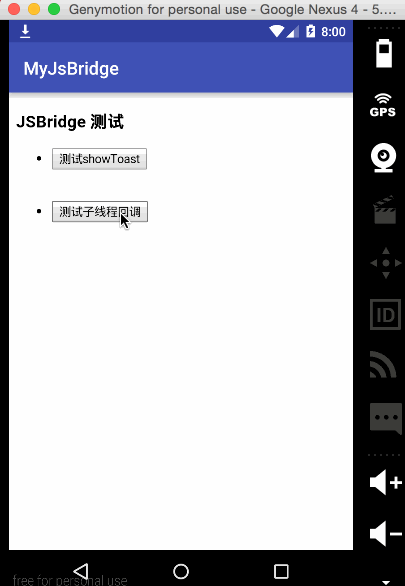

# Android JSBridge 的原理与实现

> 本文由 [简悦 SimpRead](http://ksria.com/simpread/) 转码， 原文地址 [blog.csdn.net](https://blog.csdn.net/sbsujjbcy/article/details/50752595)

在 Android 中，JSBridge 已经不是什么新鲜的事物了，各家的实现方式也略有差异。大多数人都知道 WebView 存在一个漏洞，见 [WebView 中接口隐患与手机挂马利用](https://www.shuzhiduo.com/A/D8544mYp5E/)，虽然该漏洞已经在 Android 4.2 上修复了，即使用 ``@JavascriptInterface`` 代替 ``addJavascriptInterface``，但是由于兼容性和安全性问题，基本上我们不会再利用 Android 系统为我们提供的 ``addJavascriptInterface`` 方法或者 ``@JavascriptInterface`` 注解来实现，所以我们只能另辟蹊径，去寻找既安全，又能实现兼容 Android 各个版本的方案。

首先我们来了解一下为什么要使用 JSBridge，**在开发中，为了追求开发的效率以及移植的便利性，一些展示性强的页面我们会偏向于使用 h5 来完成，功能性强的页面我们会偏向于使用 native 来完成，**而一旦使用了 h5，为了在 h5 中尽可能的得到 native 的体验，我们 native 层需要暴露一些方法给 js 调用，比如，弹 Toast 提醒，弹 Dialog，分享等等，有时候甚至把 h5 的网络请求放着 native 去完成，而 JSBridge 做得好的一个典型就是微信，微信给开发者提供了 JSSDK，该 SDK 中暴露了很多微信 native 层的方法，比如支付，定位等。

那么，怎么去实现一个兼容 Android 各版本又具有一定安全性的 JSBridge 呢？我们知道，在 WebView 中，如果 java 要调用 js 的方法，是非常容易做到的，使用 ``WebView.loadUrl(“javascript:function()”)`` 即可，这样，就做到了 JSBridge 的 native 层调用 h5 层的单向通信，但是 h5 层如何调 native 层呢，我们需要寻找这么一个通道。仔细回忆一下，WebView 有一个方法，叫 ``setWebChromeClient``，可以设置 ``WebChromeClient`` 对象，而这个对象中有三个方法，分别是 ``onJsAlert``,``onJsConfirm``,``onJsPrompt``，当 js 调用 ``window`` 对象的对应的方法，即 ``window.alert``，``window.confirm``，``window.prompt``，WebChromeClient 对象中的三个方法对应的就会被触发，我们是不是可以利用这个机制，自己做一些处理呢？答案是肯定的。

至于 js 这三个方法的区别，可以详见 w3c [JavaScript 消息框](http://www.w3school.com.cn/js/js_popup.asp) 。一般来说，我们是不会使用 ``onJsAlert`` 的，为什么呢？因为 js 中 alert 使用的频率还是非常高的，一旦我们占用了这个通道，alert 的正常使用就会受到影响，而 confirm 和 prompt 的使用频率相对 alert 来说，则更低一点。那么到底是选择 `confirm` 还是 `prompt` 呢，其实 `confirm` 的使用频率也是不低的，比如你点一个链接下载一个文件，这时候如果需要弹出一个提示进行确认，点击确认就会下载，点取消便不会下载，类似这种场景还是很多的，因此不能占用 `confirm`。而 `prompt` 则不一样，在 Android 中，几乎不会使用到这个方法，就是用，也会进行自定义，所以我们完全可以使用这个方法。**该方法就是弹出一个输入框，然后让你输入，输入完成后返回输入框中的内容。因此，占用 `prompt` 是再完美不过了。**


到这一步，我们已经找到了 JSBridge 双向通信的一个通道了，接下来就是如何实现的问题了。本文中实现的只是一个简单的 demo，如果要在生产环境下使用，还需要自己做一层封装。

要进行正常的通信，通信协议的制定是必不可少的。我们回想一下熟悉的 http 请求 url 的组成部分。形如 [http://host:port/path?param=value](http://host:port/path?param=value)，我们参考 http，制定 JSBridge 的组成部分，我们的 JSBridge 需要传递给 native 什么信息，native 层才能完成对应的功能，然后将结果返回呢？显而易见我们 native 层要完成某个功能就需要调用某个类的某个方法，我们需要将这个类名和方法名传递过去，此外，还需要方法调用所需的参数，为了通信方便，native 方法所需的参数我们规定为 json 对象，我们在 js 中传递这个 json 对象过去，native 层拿到这个对象再进行解析即可。为了区别于 http 协议，我们的 jsbridge 使用 jsbridge 协议，为了简单起见，问号后面不适用键值对，我们直接跟上我们的 json 字符串，于是就有了形如下面的这个 uri

```json
jsbridge://className:port/methodName?jsonObj
```

有人会问，这个 port 用来干嘛，其实 js 层调用 native 层方法后，native 需要将执行结果返回给 js 层，不过你会觉得通过 WebChromeClient 对象的 onJsPrompt 方法将返回值返回给 js 不就好了吗，其实不然，如果这么做，那么这个过程就是同步的，如果 native 执行异步操作的话，返回值怎么返回呢？这时候 port 就发挥了它应有的作用，我们在 js 中调用 native 方法的时候，在 js 中注册一个 callback，然后将该 callback 在指定的位置上缓存起来，然后 native 层执行完毕对应方法后通过 WebView.loadUrl 调用 js 中的方法，回调对应的 callback。那么 js 怎么知道调用哪个 callback 呢？于是我们需要将 callback 的一个存储位置传递过去，那么就需要 native 层调用 js 中的方法的时候将存储位置回传给 js，js 再调用对应存储位置上的 callback，进行回调。于是，完整的协议定义如下：

```json
jsbridge://className:callbackAddress/methodName?jsonObj
```

假设我们需要调用 native 层的 Logger 类的 log 方法，当然这个类以及方法肯定是遵循某种规范的，不是所有的 java 类都可以调用，不然就跟文章开头的 WebView 漏洞一样了，参数是 msg，执行完成后 js 层要有一个回调，那么地址就如下

```json
jsbridge://Logger:callbackAddress/log?{"msg":"native log"}
```

至于这个 callback 对象的地址，可以存储到 js 中的 window 对象中去。至于怎么存储，后文会慢慢倒来。

上面是 js 向 native 的通信协议，那么另一方面，native 向 js 的通信协议也需要制定，一个必不可少的元素就是返回值，这个返回值和 js 的参数做法一样，通过 json 对象进行传递，该 json 对象中有``状态码 code``，``提示信息 msg``，以及``返回结果 result``，如果 code 为非 0，则执行过程中发生了错误，错误信息在 msg 中，返回结果 result 为 null，如果执行成功，返回的 json 对象在 result 中。下面是两个例子，一个成功调用，一个调用失败。

```json
{
    "code":500,
    "msg":"method is not exist",
    "result":null
}
```

```json
{
    "code":0,
    "msg":"ok",
    "result":{
        "key1":"returnValue1",
        "key2":"returnValue2",
        "key3":{
            "nestedKey":"nestedValue"
            "nestedArray":["value1","value2"]
        }
    }
}
```

那么这个结果如何返回呢，native 调用 js 暴露的方法即可，然后将 js 层传给 native 层的 port 一并带上，进行调用即可，调用的方式就是通过 WebView.loadUrl 方式来完成，如下。

```java
mWebView.loadUrl("javascript:JSBridge.onFinish(port,jsonObj);");
```

关于 JsBridge.onFinish 方法的实现，后面再叙述。前面我们提到了 native 层的方法必须遵循某种规范，不然就非常不安全了。**在 native 中，我们需要一个 JSBridge 统一管理这些暴露给 js 的类和方法，并且能实时添加，这时候就需要这么一个方法**

```java
JSBridge.register("jsName",javaClass.class)
```

这个 javaClass 就是满足某种规范的类，该类中有满足规范的方法，我们规定这个类需要实现一个空接口，为什么呢? 主要作用就混淆的时候不会发生错误，还有一个作用就是约束 JSBridge.register 方法第二个参数必须是该接口的实现类。那么我们定义这个接口

```java
public interface IBridge{
}
```

类规定好了，类中的方法我们还需要规定，为了调用方便，我们规定类中的方法必须是 static 的，这样直接根据类而不必新建对象进行调用了（还要是 public 的），然后该方法不具有返回值，因为返回值我们在回调中返回，既然有回调，参数列表就肯定有一个 callback，除了 callback，当然还有前文提到的 js 传来的方法调用所需的参数，是一个 json 对象，在 java 层中我们定义成 JSONObject 对象；方法的执行结果需要通过 callback 传递回去，而 java 执行 js 方法需要一个 WebView 对象，于是，满足某种规范的方法原型就出来了。

```java
public static void methodName(WebView web view,JSONObject jsonObj,Callback callback){

}
```

js 层除了上文说到的 JSBridge.onFinish(port,jsonObj); 方法用于回调，应该还有一个方法提供调用 native 方法的功能，该函数的原型如下

```java
JSBridge.call(className,methodName,params,callback)
```

在 call 方法中再将参数组合成形如下面这个格式的 uri

```java
jsbridge://className:callbackAddress/methodName?jsonObj
```

然后调用 window.prompt 方法将 uri 传递过去，这时候 java 层就会收到这个 uri，再进一步解析即可。

万事具备了，只欠如何编码了，别急，下面我们一步一步的来实现，先完成 js 的两个方法。新建一个文件，命名为 JSBridge.js

```js
(function (win) {
    var hasOwnProperty = Object.prototype.hasOwnProperty;
    var JSBridge = win.JSBridge || (win.JSBridge = {});
    var JSBRIDGE_PROTOCOL = 'JSBridge';
    var Inner = {
        callbacks: {},
        call: function (obj, method, params, callback) {
            console.log(obj+" "+method+" "+params+" "+callback);
            var port = Util.getPort();
            console.log(port);
            this.callbacks[port] = callback;
            var uri=Util.getUri(obj,method,params,port);
            console.log(uri);
            window.prompt(uri, "");
        },
        onFinish: function (port, jsonObj){
            var callback = this.callbacks[port];
            callback && callback(jsonObj);
            delete this.callbacks[port];
        },
    };
    var Util = {
        getPort: function () {
            return Math.floor(Math.random() * (1 << 30));
        },
        getUri:function(obj, method, params, port){
            params = this.getParam(params);
            var uri = JSBRIDGE_PROTOCOL + '://' + obj + ':' + port + '/' + method + '?' + params;
            return uri;
        },
        getParam:function(obj){
            if (obj && typeof obj === 'object') { return JSON.stringify(obj); } else { return obj || ''; }
        }
    };
    for (var key in Inner) {
        if (!hasOwnProperty.call(JSBridge, key)) {
            JSBridge[key] = Inner[key];
        }
    }
})(window);
```

可以看到，我们里面有一个 Util 类，里面有三个方法，getPort() 用于随机生成 port，getParam() 用于生成 json 字符串，getUri() 用于生成 native 需要的协议 uri，里面主要做字符串拼接的工作，然后有一个 Inner 类，里面有我们的 call 和 onFinish 方法，在 call 方法中，我们调用 Util.getPort() 获得了 port 值，然后将 callback 对象存储在了 callbacks 中的 port 位置，接着调用 Util.getUri() 将参数传递过去，将返回结果赋值给 uri，调用 window.prompt(uri, “”) 将 uri 传递到 native 层。而 onFinish() 方法接受 native 回传的 port 值和执行结果，根据 port 值从 callbacks 中得到原始的 callback 函数，执行 callback 函数，之后从 callbacks 中删除。最后将 Inner 类中的函数暴露给外部的 JSBrige 对象，通过一个 for 循环一一赋值即可。


当然这个实现是最最简单的实现了，实际情况要考虑的因素太多，由于本人不是很精通 js，所以只能以 java 的思想去写 js，没有考虑到的因素姑且忽略吧，比如内存的回收等等机制。


这样，js 层的编码就完成了，接下来实现 java 层的编码。

上文说到 java 层有一个空接口来进行约束暴露给 js 的类和方法，同时也便于混淆

```
public interface IBridge {
}
```

首先我们要将 js 传来的 uri 获取到，编写一个 WebChromeClient 子类。

```java
public class JSBridgeWebChromeClient extends WebChromeClient {
    @Override
    public boolean onJsPrompt(WebView view, String url, String message, String defaultValue, JsPromptResult result) {
        result.confirm(JSBridge.callJava(view, message));
        return true;
    }
}

```

之后不要忘记了将该对象设置给 WebView

```java
WebView mWebView = (WebView) findViewById(R.id.webview);
WebSettings settings = mWebView.getSettings();
settings.setJavaScriptEnabled(true);
mWebView.setWebChromeClient(new JSBridgeWebChromeClient());
mWebView.loadUrl("file:///android_asset/index.html");
```

核心的内容来了，就是 JSBridgeWebChromeClient 中调用的 JSBridge 类的实现。前文提到该类中有这么一个方法提供注册暴露给 js 的类和方法

```java
JSBridge.register("jsName",javaClass.class)
```

该方法的实现其实很简单，从一个 Map 中查找 key 是不是存在，不存在则反射拿到对应的 Class 中的所有方法，将方法是 public static void 类型的，并且参数是三个参数，分别是 Webview，JSONObject，Callback 类型的，如果满足条件，则将所有满足条件的方法 put 进去，整个实现如下

```java
public class JSBridge {
    private static Map<String, HashMap<String, Method>> exposedMethods = new HashMap<>();

    public static void register(String exposedName, Class<? extends IBridge> clazz) {
        if (!exposedMethods.containsKey(exposedName)) {
            try {
                exposedMethods.put(exposedName, getAllMethod(clazz));
            } catch (Exception e) {
                e.printStackTrace();
            }
        }
    }

    private static HashMap<String, Method> getAllMethod(Class injectedCls) throws Exception {
        HashMap<String, Method> mMethodsMap = new HashMap<>();
        Method[] methods = injectedCls.getDeclaredMethods();
        for (Method method : methods) {
            String name;
            if (method.getModifiers() != (Modifier.PUBLIC | Modifier.STATIC) || (name = method.getName()) == null) {
                continue;
            }
            Class[] parameters = method.getParameterTypes();
            if (null != parameters && parameters.length == 3) {
                if (parameters[0] == WebView.class && parameters[1] == JSONObject.class && parameters[2] == Callback.class) {
                    mMethodsMap.put(name, method);
                }
            }
        }
        return mMethodsMap;
    }
}
```

而至于 JSBridge 类中的 callJava 方法，就是将 js 传来的 uri 进行解析，然后根据调用的类名别名从刚刚的 map 中查找是不是存在，存在的话拿到该类所有方法的 methodMap，然后根据方法名从 methodMap 拿到方法，反射调用，并将参数传进去，参数就是前文说的满足条件的三个参数，即 WebView，JSONObject，Callback。

```java
public static String callJava(WebView webView, String uriString) {
        String methodName = "";
        String className = "";
        String param = "{}";
        String port = "";
        if (!TextUtils.isEmpty(uriString) && uriString.startsWith("JSBridge")) {
            Uri uri = Uri.parse(uriString);
            className = uri.getHost();
            param = uri.getQuery();
            port = uri.getPort() + "";
            String path = uri.getPath();
            if (!TextUtils.isEmpty(path)) {
                methodName = path.replace("/", "");
            }
        }


        if (exposedMethods.containsKey(className)) {
            HashMap<String, Method> methodHashMap = exposedMethods.get(className);

            if (methodHashMap != null && methodHashMap.size() != 0 && methodHashMap.containsKey(methodName)) {
                Method method = methodHashMap.get(methodName);
                if (method != null) {
                    try {
                        method.invoke(null, webView, new JSONObject(param), new Callback(webView, port));
                    } catch (Exception e) {
                        e.printStackTrace();
                    }
                }
            }
        }
        return null;
    }
```


看到该方法中使用了 new Callback(webView, port) 进行新建对象，该对象就是用来回调 js 中回调方法的 java 对应的类。这个类你需要将 js 传来的 port 传进来之外，还需要将 WebView 的引用传进来，因为要使用到 WebView 的 loadUrl 方法，为了防止内存泄露，这里使用弱引用。如果你需要回调 js 的 callback，在对应的方法里调用一下 callback.apply() 方法将返回数据传入即可，

```java
 mWebViewRef;

    public Callback(WebView view, String port) {
        mWebViewRef = new WeakReference<>(view);
        mPort = port;
    }


    public void apply(JSONObject jsonObject) {
        final String execJs = String.format(CALLBACK_JS_FORMAT, mPort, String.valueOf(jsonObject));
        if (mWebViewRef != null && mWebViewRef.get() != null) {
            mHandler.post(new Runnable() {
                @Override
                public void run() {
                    mWebViewRef.get().loadUrl(execJs);
                }
            });

        }

    }
}
" data-snippet-id="ext.5fc9ec3243b9e8d49c59bbae9af4abb3" data-snippet-saved="false" data-codota-status="done">
public class Callback {
    private static Handler mHandler = new Handler(Looper.getMainLooper());
    private static final String CALLBACK_JS_FORMAT = "javascript:JSBridge.onFinish('%s', %s);";
    private String mPort;
    private WeakReference<WebView> mWebViewRef;

    public Callback(WebView view, String port) {
        mWebViewRef = new WeakReference<>(view);
        mPort = port;
    }


    public void apply(JSONObject jsonObject) {
        final String execJs = String.format(CALLBACK_JS_FORMAT, mPort, String.valueOf(jsonObject));
        if (mWebViewRef != null && mWebViewRef.get() != null) {
            mHandler.post(new Runnable() {
                @Override
                public void run() {
                    mWebViewRef.get().loadUrl(execJs);
                }
            });

        }

    }
}
```

唯一需要注意的是 apply 方法我把它扔在主线程执行了，为什么呢，因为暴露给 js 的方法可能会在子线程中调用这个 callback，这样的话就会报错，所以我在方法内部将其切回主线程。

编码完成的差不多了，那么就剩实现 IBridge 即可了，我们来个简单的，就来显示 Toast 为例好了，显示完给 js 回调，虽然这个回调没有什么意义。

```java
public class BridgeImpl implements IBridge {
    public static void showToast(WebView webView, JSONObject param, final Callback callback) {
        String message = param.optString("msg");
        Toast.makeText(webView.getContext(), message, Toast.LENGTH_SHORT).show();
        if (null != callback) {
            try {
                JSONObject object = new JSONObject();
                object.put("key", "value");
                object.put("key1", "value1");
                callback.apply(getJSONObject(0, "ok", object));
            } catch (Exception e) {
                e.printStackTrace();
            }
        }
    }

    private static JSONObject getJSONObject(int code, String msg, JSONObject result) {
        JSONObject object = new JSONObject();
        try {
            object.put("code", code);
            object.put("msg", msg);
            object.putOpt("result", result);
            return object;
        } catch (JSONException e) {
            e.printStackTrace();
        }
        return null;
    }
}
```

你可以往该类中扔你需要的方法，但是必须是 public static void 且参数列表满足条件，这样才能找到该方法。

不要忘记将该类注册进去

```java
JSBridge.register("bridge", BridgeImpl.class);
```

进行一下简单的测试，将之前实现好的 JSBridge.js 文件扔到 assets 目录下，然后新建 index.html，输入

```html
<!DOCTYPE HTML>
<html>
<head>
    <meta charset="utf-8">
    <title>JSBridge</title>
    <meta name="viewport"
          content="width=device-width, initial-scale=1.0, maximum-scale=1.0, minimum-scale=1, user-scalable=no"/>
    <script src="file:///android_asset/JSBridge.js" type="text/javascript"></script>
    <script type="text/javascript">

    </script>
    <style>

    </style>
</head>

<body>
<div>
    <h3>JSBridge 测试</h3>
</div>
<ul class="list">
    <li>
        <div>
            <button onclick="JSBridge.call('bridge','showToast',{'msg':'Hello JSBridge'},function(res){alert(JSON.stringify(res))})">
                测试showToast
            </button>
        </div>
    </li>
    <br/>
</ul>
</body>
</html>

```

很简单，就是按钮点击时调用 JSBridge.call() 方法，回调函数是 alert 出返回的结果。

接着就是使用 WebView 将该 index.html 文件 load 进来测试了

```java
mWebView.loadUrl("file:///android_asset/index.html");
```


效果如下图所示




可以看到整个过程都走通了，然后我们测试下子线程回调，在 BridgeImpl 中加入测试方法

```java
public static void testThread(WebView webView, JSONObject param, final Callback callback) {
        new Thread(new Runnable() {
            @Override
            public void run() {
                try {
                    Thread.sleep(3000);
                    JSONObject object = new JSONObject();
                    object.put("key", "value");
                    callback.apply(getJSONObject(0, "ok", object));
                } catch (InterruptedException e) {
                    e.printStackTrace();
                } catch (JSONException e) {
                    e.printStackTrace();
                }
            }
        }).start();
    }
```

在 index.html 中加入

```html
<ul class="list">
    <li>
        <div>
            <button onclick="JSBridge.call('bridge','testThread',{},function(res){alert(JSON.stringify(res))})">
                测试子线程回调
            </button>
        </div>
    </li>
    <br/>
</ul>
```

理想的效果应该是 3 秒钟之后回调弹出 alert 显示




很完美，代码也不多，就实现了功能。如果你需要使用到生成环境中去，上面的代码你一定要再自己封装一下，因为我只是简单的实现了功能，其他因素并没有考虑太多。


当然你也可以参考一个开源的实现
[Safe Java-JS WebView Bridge](https://github.com/pedant/safe-java-js-webview-bridge)

最后还是惯例，贴上代码

http://download.csdn.net/detail/sbsujjbcy/9446915