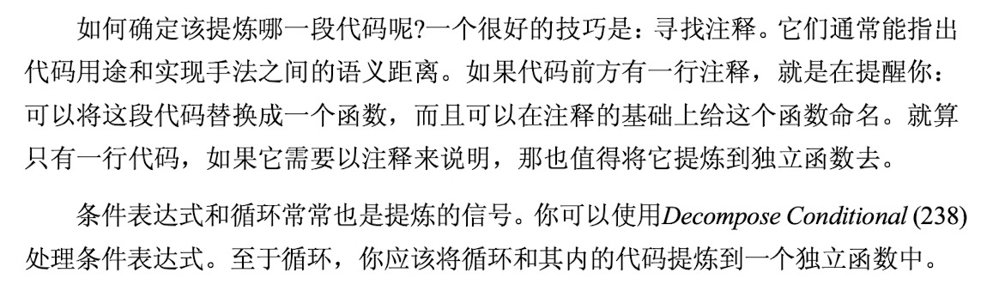

[toc]


# 3 - 坏代码的味道

## 3.1 Duplicated Code 重复的代码

重复代码会导致代码杂乱无章、而且和老鼠洞一样很难做到统一控制。

1. **在同一个类中有重复的代码:** 

   直接使用 *Extract Method* 方法提取重复的方法。

2. **两个互为兄弟关系的子类中包含相同表达式。**

   提取相同的代码后使用 *Pull Up Method* 将它推入超类。如果代码不同但是作用是相同可以选择最好的实现方式，在 *Pull Up Method*

3. **几个毫无关系的类中有重复代码。**

   这个问题的关键是要判断把 *Extract Method* 后的代码放到什么地方，如果这个方法和一种一个类联系很大就应该放到其中，都没有关系的情况下，要创建第三方类。

   ## 3.2 Long Method 过长函数

   函数过长很难进行测试、理解、以后的拓展。让小函数更好容易理解的真正关键是一个好名字，函数的长度并不一定是关键，而是函数的名字是否能到位的描述函数在做什么。

   

## 3.3 Large Class 过大的类

过大的类一般都不满足单一原则，其中往往就会出现太多实例变量。遇到过大的类就要考虑 *Extract Class* 和 *Extract Subclass*方法了。

这里有个技巧：先确定客户端如何使用他们，然后运用 *Extract Interface* 为每一种使用方法提炼一个接口，这或许可以帮助我们看清楚如何分解这个类。fa

## 3.4 Log parameter List 过长参数列表

不要有太长的参数列表，如果太长就把参数封装成类，但是有些场景并不希望造成”被调用对象“与”较大对象“间的某种依赖关系。这时候将数据从对象中拆解出来单独作为参数，也合情合理。但是注意其所引发的代价。

面对上面的问题也可以封装一个类，单独传递参数。


## 3.5 Divergent Change 发散式变化

描述：一个类被锚定了多个变化，当这些变化中的任意一个发生时，就必须对类进行修改。
解释：一个类最好只因一种变化而被修改
操作：你应该找出某特定原因而造成的所有变化，然后运用Extract Class将它们提炼到另一个类中。

## 3.6 Shotgun Surgery 散弹式修改

描述：一种变化引发程序多处的修改。
解释: 一种变化在程序中有多个锚点，并且分散在程序各处。(就像散弹一样)
需要修改的代码散布四处，你不但很难找到它们，也很容易忘记某个重要的修改。

操作：找出某个变化在程序中的所有锚点，并尝试使用Move Method和Move Field将它们集中到一个类中。如果没有合适的类安置这些代码，就创造一个


# 8- 重新组织数据

## 8.13 Replace Type Code with Class: 以类代替类型

这个重构的手段主要讲的是使用类代替类型，从而为缩小了类型的范围，以供编译器可以检测。（什么是类型呢？我认为可以用作 switch case 的都算是类型）

```java
   /**
     * 版本 1
     */
    private static class Person {
        public static String BLOOD_O = "O";
        public static String BLOOD_A = "A";
        public static String BLOOD_B = "B";
        public static String BLOOD_AB = "AB";

        private final String mBloodGroup;

        public Person1(String bloodGroup) {
            mBloodGroup = bloodGroup;
        }

        public String getBloodGroup() {
            return mBloodGroup;
        }
    }
```

例如书中的例子：使用静态常量表示血型，此时类型的范围是所有的 String 类型这个范围太大了，很容易被不了解业务的的同学使用错误

```java
    public static void main(String[] args) {
        new Person1(Person1.BLOOD_O);
        new Person1(Person1.BLOOD_A);
        // 编译器无法检测错误的类型
        new Person1("ERROR");
    }
```


此时我们可以使用封装类的方式缩小范围，避免误用：

```java
    private static class Person {
        private final BloodGroup mBloodGroup;

        public Person3(BloodGroup bloodGroup) {
            mBloodGroup = bloodGroup;
        }

        public String getBloodGroup() {
            if (mBloodGroup != null) {
                return mBloodGroup.getCode();
            }
            return "";
        }
    }

    private static final class BloodGroup {
        public static BloodGroup BLOOD_O = new BloodGroup("O");
        public static BloodGroup BLOOD_A = new BloodGroup("A");
        public static BloodGroup BLOOD_B = new BloodGroup("B");
        public static BloodGroup BLOOD_AB = new BloodGroup("AB");

        private final String mBloodGroupCode;

        public BloodGroup(String bloodGroupCode) {
            mBloodGroupCode = bloodGroupCode;
        }

        private String getCode() {
            return mBloodGroupCode;
        }
    }
```

如果使用错误，着编译器可以立即提示，并不能完成编译。

```java
class ReplaceTypeCodeWithClazz {

    public static void main(String[] args) {
        new Person3(BloodGroup.BLOOD_A);
        // 编译直接检测出错误
        new Person3("xxx");
    }
```


==这种方式仅适用于类型不影响类的行为（例如 Person 类），简单的说就是 Person 中没有使用类型码进行 switch 、 if-else 等条件判断。如果有则应该使用 「Replace Type Code with Subclass」以多态封装类型替换类型下的具体逻辑。==


个人感觉此方式还是挺有意义的，在类型较多、又要提供给外部人员访问的时候可以提高拓展性，而且减少了犯错的机会。


## 8.14 Replace Type Code with Subclass

这一条重构的规则是上一条的延续，如果类型控制着行为，那么就要使用多态的形式将类型和对应的逻辑封装到子类中，然后提供工厂方式根据类型创建类。

==使用这种方式的需要保证 case 不多，而且不会动态拓展新的类型。==


# 9- 简化条件表达式

## 9.6 以多态取代条件表达式 —— switch

1. 分析相关代码，分析适合抽象为 Interface 还是可以代码复用的抽象类（一开始生命为普通方法、普通类方便一步步替换实现）

2. 分析被提取类是否可以使用依赖注入的方式完成完成多态，不能就使用map完成策略模式

3. 提取需要替代的 swtich 代码块和相关代码：
   1. 如果是抽象为 Interface 就创建默认实现类并将代码提取进去，
   2. 如果是抽象为抽象类直接提取进去（但是此时类还是普通类、普通方法）

4. 开始替换：实现子类完成一个 case 中对应的代码，并在 case 中添加 Exception

5. 测试 + 步骤 4

6. 后续工作：
   1. 如果是 Interface：删除默认实现类中的 swtich 代码块，作为空实现。
   2. 如果是抽象类：在删除 swtich 代码块后，将方法和类都改为 abstract
7. 完成工作。安全又可靠的完成。


# 10 - 简化函数调用

指导思想：

1. 尽可能的缩短参数列表。

## 10.5 令函数携带参数（抽取重复代码为函数）

如果几个函数中做着类似的工作(功能、语义重复)，但是他们因少数几个值略有不同，那么我们就可以从中提炼一个公共参数，将导致差异的值作为参数传递给它。

<font color = red>这条重构手法主要体现的思想还是**减少重复的代码**</font>

1. 识别几个函数中重复的代码部分，这个重复可能是功能重复、语义重复、或者就是代码重复。
2. 提炼重复的代码到一个新的函数，将导致差异的值作为参数传递进来。
3. 观察传递进来的参数，是否会导致逻辑判断。如果会就利用 10.6 再次重构。

## 10.6 以明确的函数取代参数（不用多种可能的参数控制代码行为）

如果某个参数有多种可能，而函数内又以条件表达式(if\switch)检查这些参数，并根据不同参数做出不同的行为。

<font color = red>不要用有多种可能的参数控制函数的行为，例如不要使用类型为 Boolean 参数控制函数，此时应该拆分两个函数，当然如果函数内特简单也是可以容忍的</font>


## 10.7 保存对象完整性（将传递对象数据转为传递对象）

有时候，你会将来自同一对象的若干数据作为参数，传递给某个函数，可以直接将对象传递给函数。但是这样会带来代码耦合，导致强依赖关系，如果这会导致依赖结构恶化，就不应该使用这条重构技巧。

对于被调用函数只需对象一个数值的情况，这项重构也很试用，因为传递一个数值和传递一个对象，至少代码清晰度上是等价的。所以使用此手段时，不要过多考虑参数的数量，而是着重考量对象之间的依赖关系。

==在写函数的时候尽可能的传递对象，但前提是考量二者之间的依赖关系，如果传递对象会导致依赖结构的恶化，就不能使用它==

<font color = red>额外要注意的是，如果一个函数使用了另外一个对象的很多数据，那么就意味着函数应该被定义在那些数据所属的对象中。所以在考虑使用此条重构手段的同时也要考虑 *Move Method*。</font>

在运用本项重构之前，可能还没有一个完整的对象，那么就使用 *引入参数对象* 构建一个对象出来。

## 10.8 以函数取代参数 （函数自己能调用到的函数自己调）

对象调用某个函数，并将所得结果作为参数，传递给另一个函数。而接受该参数的函数本身也能够调用前一个函数。让参数接受者去除该项参数，并直接调用前一个函数。

如果函数可以通过其他途径获得参数，那么就不应该通过参数取得该值。这里要注意，全局变量可以作为获得参数的手段，但是变量带来的状态不可控，很容易出问题，所以宁可传参数也要小心使用全局变量。

**这个重构手法强调的是一个对象内部的函数对函数的调用关系，自己能够调用的函数自己调用，不要将其作为参数依赖。**


## 10.9 引入参数对象 （用对象取代成对出现的参数）

某些参数总是很自然的同时出现，以一个对象取代这些参数。