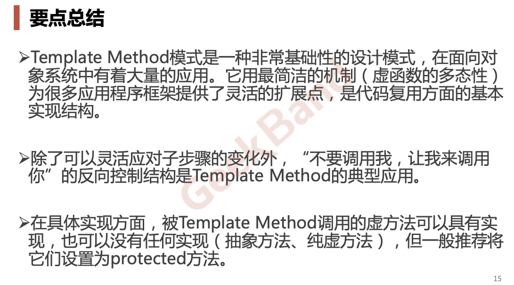

# 摘要

* <font color = red>面向对象设计模式是 ”好的面向对象设计“，所谓 ”好的面向对象设计“ 指的是那些可以满足 ”应对变化，提高复用“的设计</font>
* <font color = red>现代软件设计的特征是 ”需求的频繁变化“。设计模式的要点就是**「寻求变化，然后在变化点运用设计模式，从而来更好的应对需求的变化」**。什么时候、地点应用设计模式比理解设计模式结构本身更为重要</font>
* <font color = red>设计模式的应用不益先入为主，一上来就是用设计模式是对设计模式的误解。没有一部到位的设计模式。敏捷开发提倡 ”Refactoring to Patterns“ 重构获得模式，是目前普遍公认的最好的使用设计模式的方法。</font>


我的理解：

> 设计模式是写代码的招式，这些招式透露的核心思想都是：抵御变化，提高复用性。他要解决的是稳定中有变化的问题，然后提供方案将二者分离最终把变化替换为稳定。设计模式提供了解决方案，但问题的出现却千变万化，所以发现问题的过程尤为重要。
>
> 一般来说发现问题的过程都是结合经验和场景人为判断地，既是人为的，那么判断错误就是难免的。跌倒了不要紧，但不能在同一个地方再次跌倒!，所以一开始不要过度设计，变化第一次出现的时候再运用设计模式去化解它才是最好的时机。一开始要做的是仔细分析：什么是变化什么是稳定，然后根据具体场景、资源限制(项目进度、人力与时间成本)等因素评估变化发生的可能性，最终决定要不要去动他（单元测试是探究变化的优秀手段）。
>
> 可见理解什么时候、什么地点使用合适的模式，比理解它们本身更为重要。要知道最好的设计模式就是没有模式、最好的代码就是没有代码。在没有变化、未来有不明朗、没有真实需求的情况下我们为什么还要背负风险引入复杂？这所谓厚积薄发、无招胜有招。
>
> 而重构是这一过程的重要手段，它相当于一块磨刀石，让代码不断趋近稳定和拓展性。
>
> 林林总总，设计需要的是一个人的判断力与决策力、需要的是解决问题的方案，不是炫技。
>
> 

# 模式的划分

**从目的来看**：

* 创建型(Creational)模式:

  将对象的部分创建工作延迟到子类或者其他对象，从而应对需求变化为对象创建时具体类型实现引起的冲击。

* 结构型(Structural)模式:

  通过类继承或者对象组合获得更灵活的结构，从而对应需求变化为对象的结构带来的冲击。

* 行为型(Behavioral)模式:

  通过类继承或者对象组合来划分类与对象间的职责，从而应对需求变化为多个交互的对象带来的冲击。

  

**从范围来看**：

* 类模式处理类与子类的静态关系。

* 对象模式处理对象间的动态关系。

  
  

**从封装变化角度来看**

  

# 创建型（4种）

通过 *创建模式* 绕开「new」来避免对象创建(new)过程中的紧耦合（依赖具体工具），从而支持对象创建的稳定性。他是借口抽象后的第一步工作。

## 1. 单例模式

### 为什么使用单利

**处理资源的访问冲突**

这个部分主要涉及到并发锁的内容，具体内容参考[单例模式（上）](https://time.geekbang.org/column/article/194035)

**表示全局唯一类**

从业务的概念上，如果有些数据在系统中只应保存一份，那就比较适合设计为单利类。


单利的各种写法参考  [单例模式（上）](https://time.geekbang.org/column/article/194035)

### 懒加载的双重校验不一定比饿汉式更优

```java

public class IdGenerator { 
  private AtomicLong id = new AtomicLong(0);
  // 初始化的时候就创建好了对象，不存在线程不安全的问题
  private static final IdGenerator instance = new IdGenerator();
  private IdGenerator() {}
  public static IdGenerator getInstance() {
    return instance;
  }
  public long getId() { 
    return id.incrementAndGet();
  }
}
```

有的人觉得这种方式不好，因为不支持延迟加载。如果实例占用资源多(比如内存占用多)或者初始化耗时(需要记载各种配置文件)，提前初始化实例是一种浪费资源的行为。最好的办法应该在用的时候再去初始化，不过我个人并不这样认同。


1. 如果初始化耗时，就不应该等到他需要时候的时候再去加载。这会影响到系统的性能。比如：在响应客户端接口请求的时候，做这个初始化操作，会导致此请求的响应时间变长，甚至超时。

   采用饿汉式实现方式，将操作的初始化操作，提前到程序启动的时候完成，这样就能避免初始化带来的性能问题

2. 如果实例占用资源过多，按照 fail-fast 的设计原则（有问题及早暴露) ，那我们也希望程序启动时候就将这个实例初始化好，如果资源不够，就应该在程序启动的时候触发报错，然后立即被修复。这样也能避免在程序运行一段时间后，发现因初始化实例占用资源过多而系统崩溃、影响可用性。

3. 对于 Android 这种并发度不要的场景，也没有必要采用懒汉式的写法增加代码的复杂度。Android 使用的单利一般都是简单的，很少存在初始化耗时、占用资源过多的问题。所以直接使用饿汉式初始化代码更容易阅读

4. 上面的总结还是属于建议，要根据具体问题场景具体分析，不要过度设计。


### 单利存在问题

#### 1. 对于 OOP 特性支持不友好

==单利这种设计模式对于抽象、继承、多态都支持的不太好。==

```java

public class Order {
  public void create(...) {
    //...
    long id = IdGenerator.getInstance().getId();
    //...
  }
}

public class User {
  public void create(...) {
    // ...
    long id = IdGenerator.getInstance().getId();
    //...
  }
}
```

IdGenerator 的使用方式违背了基于接口而非实现的设计原则，也就违背了广义上理解的 OOP 的抽象特性。如果未来某一天，我们希望针对不同的业务采用不同的 ID 生成算法。比如，订单 ID 和用户 ID 采用不同的 ID 生成器来生成。为了应对这个需求变化，我们需要修改所有用到 IdGenerator 类的地方，这样代码的改动就会比较大。

```java

public class Order {
  public void create(...) {
    //...
    long id = IdGenerator.getInstance().getId();
    // 需要将上面一行代码，替换为下面一行代码
    long id = OrderIdGenerator.getIntance().getId();
    //...
  }
}

public class User {
  public void create(...) {
    // ...
    long id = IdGenerator.getInstance().getId();
    // 需要将上面一行代码，替换为下面一行代码
    long id = UserIdGenerator.getIntance().getId();
  }
}
```


除此之外，单利对于继承、多态支持的也不友好。注意是不友好，也不是完全不支持，从理论上讲单利也可以被继承，也可以实现多态，但实现起来会很奇怪，代码的可读性会很差，让人开起来莫名其妙，不懂设计者的用途。==所以，一旦选择单利，也就意味着放弃了继承和多态这两个强有力的特性，也就损失了可以应对未来变换的拓展性==

####  2. 单利会隐藏类之间的依赖关系

某个类要是依赖了单利，不仔细阅读代码是不容易发现的，降低了代码的可读性，不能一眼就看出这个类对其他对象依赖关系。

我们知道，代码的可读性非常重要。在阅读代码的时候，我们希望一眼就能看出类与类之间的依赖关系，搞清楚这个类依赖了哪些外部类。通过构造函数、参数传递等方式声明的类之间的依赖关系，我们通过查看函数的定义，就能很容易识别出来。但是，单例类不需要显示创建、不需要依赖参数传递，在函数中直接调用就可以了。如果调用者的代码比较复杂，这种调用关系就会非常隐蔽。在阅读代码的时候，我们就需要仔细查看每个函数的代码实现，才能知道这个类到底依赖了哪些单例类。

#### 3. 单利代码的拓展性不友好


#### 4. 单利对代码的可测试性不友好


#### 5. 单利不支持有参数的构造函数

单例不支持有参数的构造函数，比如我们创建一个连接池的单例对象，我们没法通过参数来指定连接池的大小


最好的解决方案将参数放到另外一个全局变量中。具体的代码实现如下。Config 是一个存储了 paramA 和 paramB 值的全局变量。里面的值==既可以像下面的代码那样通过静态常量来定义，也可以从配置文件中加载得到==。

```java

public class Config {
  public static final int PARAM_A = 123;
  public static final int PARAM_B = 245;
}

public class Singleton {
  private static Singleton instance = null;
  private final int paramA;
  private final int paramB;

  private Singleton() {
    this.paramA = Config.PARAM_A;
    this.paramB = Config.PARAM_B;
  }

  public synchronized static Singleton getInstance() {
    if (instance == null) {
      instance = new Singleton();
    }
    return instance;
  }
}
```

### 单利的替代方案

1. 静态方法

   ```java
   // 静态方法实现方式
   public class IdGenerator {
     private static AtomicLong id = new AtomicLong(0);
     
     public static long getId() { 
       return id.incrementAndGet();
     }
   }
   // 使用举例
   long id = IdGenerator.getId();
   ```

   

2. 将单利依赖注入

   ```java
   // 1. 老的使用方式
   public demofunction() {
     //...
     long id = IdGenerator.getInstance().getId();
     //...
   }
   
   // 2. 新的使用方式：依赖注入
   public demofunction(IdGenerator idGenerator) {
     long id = idGenerator.getId();
   }
   // 外部调用demofunction()的时候，传入idGenerator
   IdGenerator idGenerator = IdGenerator.getInsance();
   demofunction(idGenerator);
   ```

   

3. 使用带有缓存的工厂方法，比如简单工厂方法


## 2. 工厂模式

==工厂模式是用来创建具体实现不同但是相关类型的对象实例的==具体的表现形式有以下三种：


* 简单工厂方法：

  > 专门定义一个类来集中创建有着同一类型的其他对象的实例。

* 工厂模式

  > 定义了一个创建对象的接口，但由子类决定要实例化的类是哪一个。工厂方法把类的实例化推迟到子类。

* 抽象工厂模式

  > 提供一个接口，用于创建相关和依赖对象的家族，而不需要明确指定具体类。
  
  三种形式都透出着一下的动机：

### 动机

* 在软件系统中，经常面临着创建对象的工作；由于需求的变化，需要创建的对象实例也经常变化。

* 如何应对这种变化？如何绕开常规的对象创建方法(new), 提供一种“封装机制”来避免客户程序和这种“具体对象创建工作”的紧耦合。

  


### 简单工厂模式


简单工厂某事是一种工厂模式的一种变型，它将所有创建实例、选择实例的过程都封装到一个类中。

代码示例：

```java
public class MouseFactory {
  // 使用一个静态的 Map 承载对象
  private static final Map<String, RuleConfigParser> CACHED_MAP = new HashMap<>();

  static {
    // 在初始化的时候就已经将对象缓存在 Map 中了
    CACHED_MAP.put("dell", new DellMouse());
    CACHED_MAP.put("ph", new HpMouse());
    CACHED_MAP.put("apple", new AppleMouse());
    CACHED_MAP.put("lenovo", new LenovoMouse());
  }

  // 对外暴露静态方法
  public static Mouse createOf(String type) {
    if (type == null || type.isEmpty()) {
      return null; //返回null还是IllegalArgumentException全凭你自己说了算
    }
    return CACHED_MAP.get(type.toLowerCase());
  }
}

/**
 * 对于实现类的统一抽象
 */
public interface Mouse {
    void sayHi();
}
```


#### 特点

1. 对实现类提取有统一抽象
2. 使用策略模式（map）完成多态。
3. 对外暴露静态方法，例如 createOf、createFrom，完成构造逻辑。

#### 优点：

1. ==封装了对象的构造过程，避免客户程序与“具体对象创建工作”的紧耦合，绕开了 new 对象的动作==
2. 封装了因使用多态导致的对象选择逻辑（替换 if else 、 switch 为策略模式）。
3. 统一了对象实例化位置，方便拓展、移除。

#### 缺点：

1. 提前创建好了对象：
   1. 相当于缓存了，不能每次都创建新的对象实例、也无法懒加载。
   2. 客户端与对象实例构建类紧耦合，无法将创建过程向下传递，完成依赖倒置 。
   3. 如果对象创建需要客户端信息，此方案行不通。
2. 如果创建过程很复杂，例如需要各种初始化动作。则对象实例构建类（MouseFactory）将会变得很复杂。
3. 有人说，每次添加新实现类的时候都要修对象实例构建类（MouseFactory）改违反开闭原则，我不敢苟同：
   1. 修改在细粒度上看是改了老代码，但在粗粒度上看其实是拓展。开闭原则讲究的少改稳定的老代码防止引入问题，而不是不改。
   2. 完全可以暴露注册和解除注册的方法，拓展的时候只需注册即可。

### 工厂模式


#### 定义解读

> 定义一个创建对象的接口（MouseFactory），让子类 (HpMouseFactory、DellMouseFactory) 决定实例化哪一个类（HPMouse、DellMouse）使一个类（HPMouse、DellMouse）的实例化延迟到其子类 (HpMouseFactory、DellMouseFactory)。

#### 代码示例：


```java

public class MouseFactory {
  // 使用一个静态的 Map 承载对象
  private static final Map<String, RuleConfigParser> CACHED_MAP = new HashMap<>();

  static {
    // 在初始化的时候就已经将对象缓存在 Map 中了
    CACHED_MAP.put("dell", new DellMouse());
    CACHED_MAP.put("ph", new HpMouse());
    CACHED_MAP.put("apple", new AppleMouse());
    CACHED_MAP.put("lenovo", new LenovoMouse());
  }

  // 对外暴露静态方法
  public static Mouse createOf(String type) {
    if (type == null || type.isEmpty()) {
      return null; //返回null还是IllegalArgumentException全凭你自己说了算
    }
    return CACHED_MAP.get(type.toLowerCase());
  }
}

/**
 * 对于实现类的统一抽象
 */
public interface Mouse {
    void sayHi();
}
```

#### 优点：

1. 拥有具体的对象创建类（DellMouseFactory、HpMouseFactory）让客户端可以自行选择实例化的时机，为实现依赖倒置、延迟加载成为了可能。
2. 将对象实例化逻辑封装在了不同子类中，即使对象实例化很复杂也没有关系，也能保持整体的清晰性。

#### 缺点：

1. 没有封装对象示例选择逻辑，会让客户端代码复杂。


为了解决缺点 1 可以对 MouseFactory的实例(DellMouseFactory、HpMousdFactory)再做一层封装，具体过程类似简单工厂模式：提供一个集中创建对象实例的类。

为此在命名上我做了一个小改动：将上图中的 MouseFactory 接口重命名为 MouseCreator，而 MouseFactory 将作为基础创建对象实例的类，这样做的目的在于区分类型，明确 Factory 的含义。对外而言，客户端不用关心 Facotry 的具体实现方式，对内清晰了概念，让逻辑看起来简单一些。


#### 改进版代码示例

```java
public class MouseFactory {
  /**
   * 注册的是 Creator！！！
   */
  private static final Map<String, MouseCreator> CACHED_MAP = new HashMap<>();
  /**
   * 默认的构造器
   */
  private static MouseCreator DETAULT_CREATOR = () -> {}

  static {
    // 每次获取的都是 Creator，只有使用的时候才会真正创建实例，达到了懒加载。
    CACHED_MAP.put("dell", () -> new DellMouse());
    CACHED_MAP.put("ph", () -> new HpMouse());
    CACHED_MAP.put("apple", () -> new AppleMouse());
    CACHED_MAP.put("lenovo", () ->new LenovoMouse());
  }

  // 对外暴露静态方法, 此时返回的是 MouseCreator，当然也也可以构造好后返回 Mouse。
  public static MouseCreator get(String type) {
    if (type == null || type.isEmpty()) {
      return null; //返回null还是IllegalArgumentException全凭你自己说了算
    }
    final MouseCreator result = CACHED_MAP.get(type.toLowerCase());
    return result == null ? DETAULT_CREATOR : result;
  }
  
  /**
   * 暴露注册、解注册方法
   */
  public static rigesterCreator(String type, MouseCreator creator) {
      if(TextUtils.isEmpty(type) || creator == null) {
        return;
      }
      CACHED_MAP.put(type, creator);
  }
  
  public static unrigesterCreator(String type) {
      if (CACHED_MAP.containsKey(type)) {
       CACHED_MAP.remove(type);      
      }
  }
  
  
  /**
   * 对于构造器的抽象 
   */
  public static MouseCreator {
      Mouse createOf();
  }
}

 /**
  * 对于实现类的统一抽象
  */
public interface Mouse {
    void sayHi();
}
```


### 抽象工厂


### 使用场景

表现层：

==当创建逻辑比较复杂，是一个“大工程”的时候，我们就考虑使用工厂模式，封装对象的创建过程，将对象的创建和使用相分离。==

第一种情况：类似规则配置解析的例子，代码中存在 if-else 分支判断，动态地根据不同的类型创建不同的对象。针对这种情况，我们就考虑使用工厂模式，将这一大坨 if-else 创建对象的代码抽离出来，放到工厂类中。

还有一种情况，尽管我们不需要根据不同的类型创建不同的对象，但是，单个对象本身的创建过程比较复杂，比如前面提到的要组合其他类对象，做各种初始化操作。在这种情况下，我们也可以考虑使用工厂模式，将对象的创建过程封装到工厂类中。

终极目标:

抵御变化：抵御因需求的变化导致创建的对象实例也经常变化的问题，。


==如果创建对象的逻辑并不复杂，那我们就直接通过 new 来创建对象就可以了，不需要使用工厂模式。==


### 那什么时候该用工厂方法模式，而非简单工厂模式呢？

当对象的创建逻辑比较复杂，不只是简单的 new 一下就可以的，而是要组合其他类对象，做各种初始化操作的时候，我们推荐使用工厂方法模式，将复杂的创建逻辑拆分到多个工厂类中，让每个工厂类都不至于过于复杂。

而使用简单工厂模式，将所有的**创建逻辑**都放到一个工厂类中，会导致这个工厂类变得很复杂。

> 由此可见，工厂方法和简单工厂方法的差异在于将创建的过程放在什么地方，简单工厂把创建过程使用都放在了一个类中，而工厂方法是将他们分散在了各个接口的实现类中。


==工厂方法是为了创建对象而生的==，他无法消除创建对象的复杂度，只能将其转移:

* 不是工厂方法，if-else 逻辑、创建逻辑和业务耦合在一起
* 简单方法是将不同的创建逻辑放在一个工厂类中， if-else 逻辑在这个工厂类中
* 工厂方法模式是根据定义的接口将不同创建逻辑放到不同工厂类中，先用一个工厂类得到创建某个对象的工厂类从而创建对象，if-else 逻辑在工厂类的工厂中。
* 抽象工厂就是同时负责多种不同类型对象的创建。


==工厂类中创建对象的方法一般都是 create 开头==


## 3. 建造者模式

参考

> [详解构造函数、set方法、建造者模式三种对象创建方式](https://time.geekbang.org/column/article/199674)

### 使用场景

1. 构造函数需要的必要参数很多
2. 一些属性的设置存在关联关系，使用 set 方法可能会遗漏
3. 创建之后对象不该再改变。

### VS 工厂模式

工厂模式是用来创建不同但是相关类型的对象（继承同一父类或者接口的一组子类），由给定的参数来决定创建哪种类型的对象。建造者模式是用来创建一种类型的复杂对象，通过设置不同的可选参数，“定制化”地创建不同的对象。

==当配置项是必填的，需要把它放到构造函数中设置，强制创建类对象的时候就要填写==


## 4、原型模式

## # 总结

单例模式用来创建全局唯一的对象。

工厂模式用来创建不同但是相关类型的对象（继承同一父类或者接口的一组子类），由给定的参数来决定创建哪种类型的对象。

建造者模式是用来创建复杂对象，可以通过设置不同的可选参数，“定制化”地创建不同的对象。

原型模式针对创建成本比较大的对象，利用对已有对象进行复制的方式进行创建，以达到节省创建时间的目的。

# 结构型（7种）

结构型模式主要总结了一些==类或对象组合在一起的经典结构==，这些经典的结构可以解决特定应用场景的问题。结构型模式包括：代理模式、桥接模式、装饰器模式、适配器模式、门面模式、组合模式、享元模式。

## 1、代理模式

***定义***：它在不改变原始类（或叫被代理类）代码的情况下，通过引入代理类来给原始类附加功能。

### 静态代理

1. ==存在接口==的时候，使用依赖注入的方式，将原始类注入到代理类中。为了让代码改动尽量小，代理类和原始类需要实现相同的接口。

   ```java
   
   public interface IUserController {
     UserVo login(String telephone, String password);
     UserVo register(String telephone, String password);
   }
   
   public class UserController implements IUserController {
     //...省略其他属性和方法...
   
     @Override
     public UserVo login(String telephone, String password) {
       //...省略login逻辑...
       //...返回UserVo数据...
     }
   
     @Override
     public UserVo register(String telephone, String password) {
       //...省略register逻辑...
       //...返回UserVo数据...
     }
   }
   
   public class UserControllerProxy implements IUserController {
     private MetricsCollector metricsCollector;
     private UserController userController;
   
     /**
     * 将 UserController 注入到代理类中
     */
     public UserControllerProxy(UserController userController) {
       this.userController = userController;
       this.metricsCollector = new MetricsCollector();
     }
   
     @Override
     public UserVo login(String telephone, String password) {
       long startTimestamp = System.currentTimeMillis();
   
       // 委托
       UserVo userVo = userController.login(telephone, password);
   
       long endTimeStamp = System.currentTimeMillis();
       long responseTime = endTimeStamp - startTimestamp;
       RequestInfo requestInfo = new RequestInfo("login", responseTime, startTimestamp);
       metricsCollector.recordRequest(requestInfo);
   
       return userVo;
     }
   
     @Override
     public UserVo register(String telephone, String password) {
       long startTimestamp = System.currentTimeMillis();
   
       UserVo userVo = userController.register(telephone, password);
   
       long endTimeStamp = System.currentTimeMillis();
       long responseTime = endTimeStamp - startTimestamp;
       RequestInfo requestInfo = new RequestInfo("register", responseTime, startTimestamp);
       metricsCollector.recordRequest(requestInfo);
   
       return userVo;
     }
   }
   
   //UserControllerProxy使用举例
   //因为原始类和代理类实现相同的接口，是基于接口而非实现编程
   //将UserController类对象替换为UserControllerProxy类对象，不需要改动太多代码
   IUserController userController = new UserControllerProxy(new UserController());
   ```

   ==当原始类不是我们开发维护的时候并不存在接口==，对于这种外部类的拓展，我们一般采用继承的方式。我们让代理类继承原始类，然后拓展功能。

   ```java
   
   /**
   * 直接继承原始类
   */
   public class UserControllerProxy extends UserController {
     private MetricsCollector metricsCollector;
   
     public UserControllerProxy() {
       this.metricsCollector = new MetricsCollector();
     }
   
     public UserVo login(String telephone, String password) {
       // …… 同上的代理逻辑
     }
   
     public UserVo register(String telephone, String password) {
       // …… 同上的代理逻辑
     }
   }
   //UserControllerProxy使用举例
   UserController userController = new UserControllerProxy();
   ```

   ### 动态代理

   ```java
   
   public class MetricsCollectorProxy {
     private MetricsCollector metricsCollector;
   
     public MetricsCollectorProxy() {
       this.metricsCollector = new MetricsCollector();
     }
   
     public Object createProxy(Object proxiedObject) {
       Class<?>[] interfaces = proxiedObject.getClass().getInterfaces();
       DynamicProxyHandler handler = new DynamicProxyHandler(proxiedObject);
       return Proxy.newProxyInstance(proxiedObject.getClass().getClassLoader(), interfaces, handler);
     }
   
     private class DynamicProxyHandler implements InvocationHandler {
       private Object proxiedObject;
   
       public DynamicProxyHandler(Object proxiedObject) {
         this.proxiedObject = proxiedObject;
       }
   
       @Override
       public Object invoke(Object proxy, Method method, Object[] args) throws Throwable {
         long startTimestamp = System.currentTimeMillis();
         Object result = method.invoke(proxiedObject, args);
         long endTimeStamp = System.currentTimeMillis();
         long responseTime = endTimeStamp - startTimestamp;
         String apiName = proxiedObject.getClass().getName() + ":" + method.getName();
         RequestInfo requestInfo = new RequestInfo(apiName, responseTime, startTimestamp);
         metricsCollector.recordRequest(requestInfo);
         return result;
       }
     }
   }
   
   //MetricsCollectorProxy使用举例
   MetricsCollectorProxy proxy = new MetricsCollectorProxy();
   IUserController userController = (IUserController) proxy.createProxy(new UserController());
   ```

### 使用场景

代理模式的应用场景代理模式常用在业务系统中开发一些非功能性需求，比如：监控、统计、鉴权、限流、事务、幂等、日志。我们将这些附加功能与业务功能解耦，放到代理类统一处理，让程序员只需要关注业务方面的开发。除此之外，代理模式还可以用在 RPC、缓存等应用场景中。

## 2、桥接模式


## 3、装饰器模式

目的就是使用组合而非继承的手段增强原始类，避免了类型爆炸。


```java
public abstract class InputStream {
  //...
  public int read(byte b[]) throws IOException {
    return read(b, 0, b.length);
  }

  public int read(byte b[], int off, int len) throws IOException {
    //...
  }

  public long skip(long n) throws IOException {
    //...
  }

  public int available() throws IOException {
    return 0;
  }

  public void close() throws IOException {}

  public synchronized void mark(int readlimit) {}
    
  public synchronized void reset() throws IOException {
    throw new IOException("mark/reset not supported");
  }

  public boolean markSupported() {
    return false;
  }
}

// 继承了原始类、接口
public class BufferedInputStream extends InputStream {
  protected volatile InputStream in;

  // 又将原始类注入进来，对原有功能进行拓展
  protected BufferedInputStream(InputStream in) {
    this.in = in;
  }

  //...实现基于缓存的读数据接口...  
}

public class DataInputStream extends InputStream {
  protected volatile InputStream in;

  protected DataInputStream(InputStream in) {
    this.in = in;
  }

  //...实现读取基本类型数据的接口
}
```

==装饰器类和原始类继承同样的父类，这样我们可以对原始类“嵌套”多个装饰器类。==比如，下面这样一段代码，我们对 FileInputStream 嵌套了两个装饰器类：BufferedInputStream 和 DataInputStream，让它既支持缓存读取，又支持按照基本数据类型来读取数据。

```java
InputStream in = new FileInputStream("/user/wangzheng/test.txt");
InputStream bin = new BufferedInputStream(in);
DataInputStream din = new DataInputStream(bin);
int data = din.readInt();
```


==装饰器类是对原始功能的增强, 而代理添加的内容与原始逻辑无关==


```java

// 代理模式的代码结构(下面的接口也可以替换成抽象类)
public interface IA {
  void f();
}
public class A impelements IA {
  public void f() { //... }
}
public class AProxy impements IA {
  private IA a;
  public AProxy(IA a) {
    this.a = a;
  }
  
  public void f() {
    // 新添加的代理逻辑，与原始逻辑无关
    a.f();
    // 新添加的代理逻辑，与原始逻辑无关
  }
}

// 装饰器模式的代码结构(下面的接口也可以替换成抽象类)
public interface IA {
  void f();
}
public class A impelements IA {
  public void f() { //... }
}
public class ADecorator impements IA {
  private IA a;
  public ADecorator(IA a) {
    this.a = a;
  }
  
  public void f() {
    // 功能增强代码
    a.f();
    // 功能增强代码
  }
}
```


## 4、适配器模式

适配器模式降不兼容的接口转换为可兼容的接口，让原本由于接口不能兼容而不能工作的类可以一起工作。

适配器模式有两种实现方式：类适配器和对象适配器。其中类适配器使用继承来实现，对象适配器使用组合关系来实现。

```java

// 类适配器: 基于继承
public interface ITarget {
  void f1();
  void f2();
  void fc();
}

public class Adaptee {
  public void fa() { //... }
  public void fb() { //... }
  public void fc() { //... }
}

public class Adaptor extends Adaptee implements ITarget {
  public void f1() {
    super.fa();
  }
  
  public void f2() {
    //...重新实现f2()...
  }
  
  // 这里fc()不需要实现，直接继承自Adaptee，这是跟对象适配器最大的不同点
}

// 对象适配器：基于组合
public interface ITarget {
  void f1();
  void f2();
  void fc();
}

public class Adaptee {
  public void fa() { //... }
  public void fb() { //... }
  public void fc() { //... }
}

public class Adaptor implements ITarget {
  private Adaptee adaptee;
  
  public Adaptor(Adaptee adaptee) {
    this.adaptee = adaptee;
  }
  
  public void f1() {
    adaptee.fa(); //委托给Adaptee
  }
  
  public void f2() {
    //...重新实现f2()...
  }
  
  public void fc() {
    adaptee.fc();
  }
}
```

### 如何选择使用哪种适配器

在实际开发中使用哪一个方式，判断的标准主要有两个，一个是 Adaptee 接口的数量，另外一个是 Adaptee 和 ITarget 的契合程度。

* 如果 Adaptee 的接口不多，用哪个都可以， 但是第二个更优一些：组合优于继承。
* 如果 Adaptee 接口数量很多，而且 Adaptee 和 ITarget 接口定义大部分相同。那我们推荐使用类适配器，因为 Adaptor 复用父类 Adaptee 的接口，比起对象适配器的实现方式，Adaptor 的代码量少一些。
* 如果 Adaptee 接口数量很多，而且和 ITarget 接口定义大部分不相同，那我们推荐使用对象适配器，因为组合结构相对继承更加灵活。


### 应用场景

适配器可以作为一种“补偿模式”，用来弥补设计上的缺陷。应用这些模式就是无奈之举。如果在设计的初期，我们就能协调规避接口不兼容的问题，那这种模式就没有应用的机会了。

#### 封装有设计缺陷的接口

```java

public class CD { //这个类来自外部sdk，我们无权修改它的代码
  //...
  public static void staticFunction1() { //... }
  
  public void uglyNamingFunction2() { //... }

  public void tooManyParamsFunction3(int paramA, int paramB, ...) { //... }
  
   public void lowPerformanceFunction4() { //... }
}

// 使用适配器模式进行重构
public class ITarget {
  void function1();
  void function2();
  void fucntion3(ParamsWrapperDefinition paramsWrapper);
  void function4();
  //...
}
// 注意：适配器类的命名不一定非得末尾带Adaptor
public class CDAdaptor extends CD implements ITarget {
  //...
  public void function1() {
    // 借助接口将SDK种的方法在封装一遍，满足我们业务的需要。
     super.staticFunction1();
  }
  
  public void function2() {
    super.uglyNamingFucntion2();
  }
  
  public void function3(ParamsWrapperDefinition paramsWrapper) {
     super.tooManyParamsFunction3(paramsWrapper.getParamA(), ...);
  }
  
  public void function4() {
    //...reimplement it...
  }
}
```


#### 统一多个类的接口设计

```java
public class ASensitiveWordsFilter { // A敏感词过滤系统提供的接口
  //text是原始文本，函数输出用***替换敏感词之后的文本
  public String filterSexyWords(String text) {
    // ...
  }
  
  public String filterPoliticalWords(String text) {
    // ...
  } 
}

public class BSensitiveWordsFilter  { // B敏感词过滤系统提供的接口
  public String filter(String text) {
    //...
  }
}

public class CSensitiveWordsFilter { // C敏感词过滤系统提供的接口
  public String filter(String text, String mask) {
    //...
  }
}

// 未使用适配器模式之前的代码：代码的可测试性、扩展性不好
public class RiskManagement {
  private ASensitiveWordsFilter aFilter = new ASensitiveWordsFilter();
  private BSensitiveWordsFilter bFilter = new BSensitiveWordsFilter();
  private CSensitiveWordsFilter cFilter = new CSensitiveWordsFilter();
  
  public String filterSensitiveWords(String text) {
    String maskedText = aFilter.filterSexyWords(text);
    maskedText = aFilter.filterPoliticalWords(maskedText);
    maskedText = bFilter.filter(maskedText);
    maskedText = cFilter.filter(maskedText, "***");
    return maskedText;
  }
}

// 使用适配器模式进行改造
public interface ISensitiveWordsFilter { // 统一接口定义
  String filter(String text);
}

public class ASensitiveWordsFilterAdaptor implements ISensitiveWordsFilter {
  private ASensitiveWordsFilter aFilter;
  public String filter(String text) {
    String maskedText = aFilter.filterSexyWords(text);
    maskedText = aFilter.filterPoliticalWords(maskedText);
    return maskedText;
  }
}
//...省略BSensitiveWordsFilterAdaptor、CSensitiveWordsFilterAdaptor...

// 扩展性更好，更加符合开闭原则，如果添加一个新的敏感词过滤系统，
// 这个类完全不需要改动；而且基于接口而非实现编程，代码的可测试性更好。
public class RiskManagement { 
  private List<ISensitiveWordsFilter> filters = new ArrayList<>();
 
  public void addSensitiveWordsFilter(ISensitiveWordsFilter filter) {
    filters.add(filter);
  }
  
  public String filterSensitiveWords(String text) {
    String maskedText = text;
    for (ISensitiveWordsFilter filter : filters) {
      maskedText = filter.filter(maskedText);
    }
    return maskedText;
  }
}
```


#### 替换依赖的外部系统

```java
// 外部系统A
public interface IA {
  //...
  void fa();
}
public class A implements IA {
  //...
  public void fa() { //... }
}
// 在我们的项目中，外部系统A的使用示例
public class Demo {
  private IA a;
  public Demo(IA a) {
    this.a = a;
  }
  //...
}
Demo d = new Demo(new A());

// 将外部系统A替换成外部系统B
public class BAdaptor implemnts IA {
  private B b;
  public BAdaptor(B b) {
    this.b= b;
  }
  public void fa() {
    //...
    b.fb();
  }
}
// 借助BAdaptor，Demo的代码中，调用IA接口的地方都无需改动，
// 只需要将BAdaptor如下注入到Demo即可。
Demo d = new Demo(new BAdaptor(new B()));
```


#### 兼容老版本

#### 适配不同的数据格式


## # 总结：代理、桥接、装饰器、适配器之间的区别

***代理模式*：** 不改变原始类接口的条件下，为原始类定义一个代理类，添加的逻辑与原始逻辑无关，主要目的是为了控制访问，而非加强功能，这是他跟装饰模式最大的不同。

***桥接模式***：桥接模式的目的是将接口部分和实现部分分离，从而让它们可以较为容易、也相对独立地加以改变。

**装饰器模式**：不改变原始类接口的条件下，对原始***类***功能进行增强，并且支持多个装饰器的嵌套使用。

***适配器模式***：一种事后补救的策略。适配器提供跟原始不同的接口，而代理、装饰提供的都是和原始类相同的接口。

**装饰器类是对原始功能的增强, 而代理添加的内容与原始逻辑无关**


**==问==**：*适配器有两种实现方式：类适配器、对象适配器。那我们之前讲到的代理模式、装饰器模式，是否也同样可以有两种实现方式*

**==答==**：代理模式支持，基于接口组合代理就是对象代理，基于继承代理就是类匹配。

​		装饰者不支持两种，这个模式本身就是为了避免继承导致的类型爆炸的问题。


# 行为型

## 模板模式

### 动机

* 在构建过程中，对于某一项任务，他常常有稳定的整体操作结构，但各个子步骤却有很多改变的需求，或者由于固有的实现（如框架与应用之间的关系）而无法和任务的整体结构同时实现。

* 如何在确定稳定操作结构的前提下，来灵活应对各个子步骤的变化或者晚期实现需求？

  ### 模式定义

  定义一个操作中的算法骨架(稳定)，而将一些步骤（变化）延迟到子类中。Template Method 使得子类可以不改变（复用）一个算法的结构寄可重定义（overwride重写）该算法的某些特定步骤。—— 《设计模式》GoF




## 策略模式


## 观察者模式

定义对象间的一种一对多（变化）的依赖关系，以便当一个对象（Subject）的状态发生变化时，所有依赖于他的对象都得到通知并自动更新 —— 《设计模式》 GoF

## 动机

* 在软件构建过程中，我么你需要在某些对象建立一种 “通知依赖关系” —— 一个对象（目标对象）的状态发生变化，所有的依赖对象（观察对象）都将得到通知，如果这样的依赖关系过于紧密，将使软件不能很好的抵御变化。
* 使用面向对象技术，将这些依赖关系弱化，并形成一种稳定的依赖关系。从而实现软件体系结构的松耦合。


# 参考资料

* 极客时间《设计模式之美》
* [B站：23个设计模式](https://www.bilibili.com/video/BV1kW411P7KS)