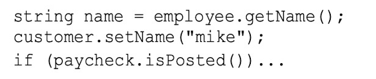

[toc]

# 摘要

> Any fool can write code that a computer can understand. Good programmers write code that humans can understand. 
>
> 普通的工程师堆砌代码，优秀的工程师优雅代码，卓越的工程师简化代码。


# 命名

## 类的名字要使用**名词**或者**动词短语**。

## 方法名应该是**动词**或者**动词短语**

* 属性方位器、修改器，和断言应该根据其值命名，并加上 get、set、is 前缀。



* 重载构造器的时候，使用描述了参数的静态工程方法名。例如:

  ```java
  Complex instance = Complex.FromRealNumber(23.0);
  ```

  通常好于

  ```java
  Complex instance = new Complex(23.0);
  ```

  


## 尽可能使用标准命名方法比如设计模式，通用学术名词等

## 命名要找更有表现力的词

* 使用更专业的词，比如不用 get 而使用 fetch 或者 download
* 避免空泛的名字，像 tmp
* 使用具体的名字来细致的描述事物
* 给变量名带上重要的细节，比如加上单位 ms 等
* 为作用域大的名字采用更长的名字，作用域小的使用短名字
* 变量类型为布尔值表达加上is，has，can，should这样的词会更明确

## 变量名称长短应该与其作用域对应

- 别害怕长名称，长而具有描述性的名称比短而令人费解的名称好
- 函数名称应该说明副作用，名称应该表达函数，变量或类的一切信息，请不要掩盖副作用，比如CreateAndReturnXXX

# 注释

## 不给不好的名字加注释，好的名字比注释更重要

## 不要“拐杖注释”，好代码 > 坏代码 + 好注释

## 在文件/类级别使用全局注释来解释所有部分如何工作

## 一定要给常量加注释

## 团队统一定义标记

```
TODO  待处理的问题
FIXME  已知有问题的代码
HACK 不得不采用的粗糙的解决方案
```

## 在注释中用精心挑选的输入输出例子进行说明

## 注释应该声明代码的高层次意图，而非明显的细节

## 不要在代码中加入代码的著作信息，git可以干的事情不要交给代码

## 源代码中的html注释是一种厌物, 增加阅读难度

## 注释一定要描述离它最近的代码

## 注释一定要与代码对应

## 公共api需要添加注释，其它代码谨慎使用注释

## 典型的烂注释

```
不恰当的信息
废弃的注释
冗余注释
糟糕的注释
注释掉的代码
```

## 唯一真正好的注释是你想办法不去写的注释

```
不要有循规式注释，比如setter/getter注释
不要添加日志式注释，比如修改时间等信息（git可以做的事情）
注释一定是表达代码之外的东西，代码可以包含的内容，注释中一定不要出现
如果有必要注释，请注释意图（why），而不要去注释实现（how)，大家都会看代码
适当添加警示注释 
```

# 方法

## 函数不应该有100行那么长，20行封顶最好

## <font color = red>if else while等控制语句其中代码块应该只有一行，也就是一个函数调用语句</font>

## 函数的缩进层次不应该多于两层

## 一个函数只做一件事，一个函数不应该能抽象出另外一个函数

## 某个公共函数调用的私有函数紧随其后

## 最理想的参数是零参数，最长不要超过三个入参，尽量不要输出参数

如果函数传入三个及以上参数最好将其抽象为类

## 标识参数十分丑陋，向函数传入布尔值用于区分不同业务的做法很丑陋，应该拆分为多个函数

## 别返回null值，抛出异常或者返回特殊对象，尽量避免NPE

## 别传入null值

# 异常与错误

## <font color = red>将 try catch 包含的代码块抽象为一个函数</font>

## 抛出的每个异常，都应当提供足够的环境说明，已便判断错误的来源与处所

## 不要将系统错误归咎于偶然事件

# 代码结构

## 类的组织

* 遵循 Java 的约定，类应该从一组变量列表开始 公共静态常量 -》 私有静态常量 -》私有静态变量 -》私有变量 -》protected变量 -》 公共变量 
* <font color = red>封装对于 protectd 变量的定义最好的方式就是测试用例。</font>

* 类应该短小:代码行长度控制在100-120个字符、可能用大多数为200行，最长500行的单个文件

## 关系密切的代码应该相互靠近

变量声明应该靠近其使用位置
若某个函数调用了另外一个，应该把他们放在一起，而且调用者应该放在被调用者上面
自上向下展示函数调用依赖顺序

## 应该把解释条件意图的函数抽离出来，尽可能将条件表达为肯定形式

## 不要继承常量，比如接口中定义常量，不要使用继承欺骗编程语言的作用范围规则

## 模块不应了解它所操作对象的内部情况

- DTO（Data Transfer Objects）是一个只有公共变量没有函数的类

- 对象暴露行为，隐藏数据

  ## 不要使用“尤达表示法” 如 if(null == obj)，现代编译器对if(obj = null)这样的代码会给出警告

  ## 一般情况使用if else，简单语句使用三目运算符

  ## 通常来讲提早返回可以减少嵌套并让代码整洁

# 设计

# 类应该足够短小

* 类应该满足单一权责原则（SRP），类和模块只有一个修改理由
* 类应该只有少量的实体变量
* 类应该遵循依赖倒置原则 DIP（Dependency Inversion Principle），类应该依赖于抽象而不是依赖于具体细节
* 类中的方法越少越好，函数知道的变量越少越好，类拥有的实体变量越少越好

## 通过减少变量的数量和让他们尽量“轻量级”来让代码更有可读性

* 减少变量
* 缩小变量的作用域
* <font color = red>**只写一次的变量更好，如常量**</font>

## 最好读的代码就是没有代码

从项目中消除不必要的功能，不要过度设计
从新考虑需求，解决版本最简单的问题，只要能完成工作就行
经常性地通读标准库的整个API，保持对他们的熟悉程度

## 简单设计

运行所有测试
<font color = red>不可重复</font>
表达了程序员的意图
尽可能减少类和方法的数量
以上规则按重要程度排列

## <font color = red>无论是设计系统或者单独模块，别忘了使用大概可工作的最简单方案</font>

## 整洁的代码只提供一种而非多种做一件事的途径，他只有尽量少的依赖。明确定义并提供尽量少的API

## 减少重复代码，提高表达力，提早构建，简单抽象


# 并发

- 分离并发相关代码与其它代码
- 严格限制对可能被共享的数据的访问
- 避免使用一个共享对象的多个同步方法
- 保持同步区域微小，尽可能少设计临界区

# 单元测试

- 不要怕单元测试的方法名字太长或者繁琐，测试函数的名称就像注释

- 不要追求太高的测试覆盖率，测试代码前面90%通常比后面10%花的时间少

- 使用最简单的并且能够完整运用代码的测试输入

- 给测试函数取一个完整性的描述性名字，比如 Test _

- 测试代码与生产代码一样重要

- 如果测试代码不能保证整洁，你就会很快失去他们

- 每个测试一个断言，单个测试中断言数量应该最小化也就是一个断言

- FIRST原则

  快速 Fast
  独立 Independent 测试应该相互独立
  可重复 Repeatable 测试应当在任何环境中重复通过
  自足验证 Self-Validating 测试应该有布尔值输出
  及时 Timely 最好的方式是TDD


