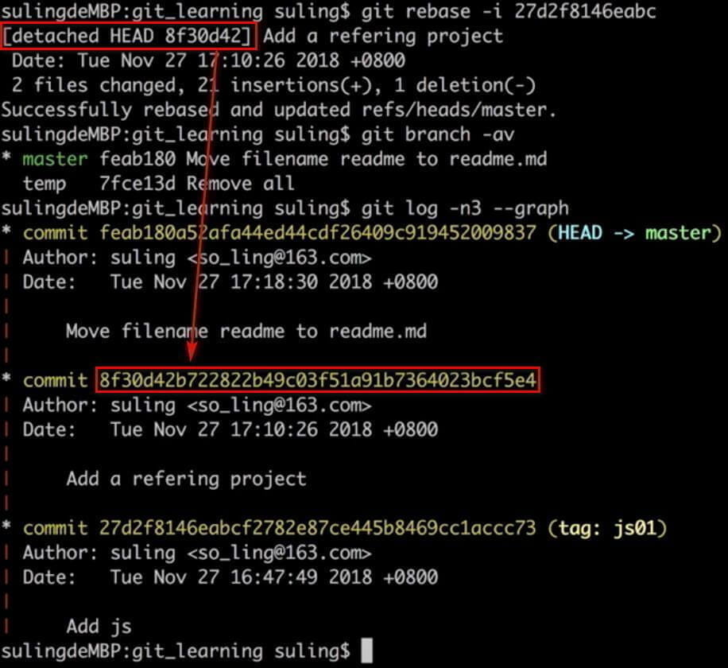
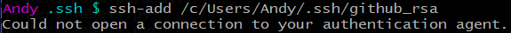

# i Play Git
*这是极客时间苏玲老师的《玩转Git三剑客》笔记*       

---
[toc]


# 配置git环境

## 添加配置
```bash
git config [--local | --global | --system] user.name 'Your name'
git config [--local | --global | --system] user.email 'Your email'
```

## 查看配置
```bash
git config --list [--local | --global | --system]
```
## 区别
```bash
local：区域为本仓库
global: 当前用户的所有仓库
system: 本系统的所有用户
```
## `git add .` 和 `git add -u`区别

```bash
git add . ：将工作空间新增和被修改的文件添加的暂存区
git add -u :将工作空间被修改和被删除的文件添加到暂存区(不包含没有纳入Git管理的新增文件)
```

# 创建仓库
```bash
git init [project folder name]  初始化 git 仓库
git add [fileName]  把文件从工作目录添加到暂存区
git commit -m'some information'  用于提交暂存区的文件
git commit -am'Some information' 用于提交跟踪过的文件
git log  查看历史
git status  查看状态
```

**额外**    
git add -u 可以添加所有已经被 git 控制的文件到暂存区
以前删除文件夹只会用 「-rf」，今天学到了 「-r」，并得知它们两个区别：「-r」 有时候会提示是否确认删除。    


## clone时指定文件夹名字
```git
git clone https://github.com/repository_NAME PATH/new_folder
```

## 给文件重命名的简便方法
```bash
git  mv  [old file name]  [new file name]
git commit -m 'some information'
```
# Tag标签
**显示已有标签**   
```shell
git tag
```
**新建标签**   
*创建一个含附注类型的标签非常简单，用 -a （译注：取 annotated 的首字母）指定标签名字即可*
```shell
git tag -a tag_name -m 'Some Messages'
```
**删除标签**   
删除本地标签:    
```shell
git tag -d tag_name
```
删除`remote`标签    :
```shell
git push --delete origin tag_name
```
**推送标签到github**
将本地**所有**标签推送到`remote`:    
```shell
git push origin --tags
```

# 在Github上面创建Release
1. 在当前`repository`下点击 **release** 标签:
        

2. 点击 **Draft a new release** 按钮:
        

3. 在跳转后的界面下填写 `Tag version` 、 `Release title` 和 `描述`
        
    如下图:   
        
4. 点击 `Update release`按钮提交即可，提交后效果:
        

# 通过git log查看版本演变历史
```bash
git log --all 查看所有分支的历史
git log --all --graph 查看图形化的 log 地址
git log --oneline 查看单行的简洁历史。
git log --oneline -n4 查看最近的4条简洁历史。
git log --oneline --all -n4 --graph 查看所有分支最近4条单行的图形化历史。
git help --web log 跳转到git log 的帮助文档网页
```

```bash
git branch -v 查看本地有多少分支
```

## 通过图形界面工具来查看版本历史
```bash
gitk
```

# 探密`.git`目录
查看`.git`文件夹下的内容：    
```bash
ls .git/ -al
```
如下:   
```shell
drwxr-xr-x 1 Andy 197609   0 12月 17 22:38 ./
drwxr-xr-x 1 Andy 197609   0 12月 17 21:50 ../
-rw-r--r-- 1 Andy 197609   7 12月 17 22:38 COMMIT_EDITMSG
-rw-r--r-- 1 Andy 197609 301 12月 12 22:55 config
-rw-r--r-- 1 Andy 197609  73 12月 12 22:55 description
-rw-r--r-- 1 Andy 197609  96 12月 19 00:00 FETCH_HEAD
-rw-r--r-- 1 Andy 197609  23 12月 12 22:55 HEAD
drwxr-xr-x 1 Andy 197609   0 12月 12 22:55 hooks/
-rw-r--r-- 1 Andy 197609 249 12月 17 22:38 index
drwxr-xr-x 1 Andy 197609   0 12月 12 22:55 info/
drwxr-xr-x 1 Andy 197609   0 12月 12 22:55 logs/
drwxr-xr-x 1 Andy 197609   0 12月 17 22:38 objects/
-rw-r--r-- 1 Andy 197609 114 12月 12 22:55 packed-refs
drwxr-xr-x 1 Andy 197609   0 12月 12 22:55 refs/
```

```bash
cat命令主要用来查看文件内容，创建文件，文件合并，追加文件内容等功能。
cat HEAD 查看HEAD文件的内容
git cat-file 命令 显示版本库对象的内容、类型及大小信息。
git cat-file -t b44dd71d62a5a8ed3 显示版本库对象的类型
git cat-file -s b44dd71d62a5a8ed3 显示版本库对象的大小
git cat-file -p b44dd71d62a5a8ed3 显示版本库对象的内容
```

`.git`里几个常用的如下：    
```bash
HEAD：指向当前的工作路径
config：存放本地仓库（local）相关的配置信息。
refs/heads: 存放分支
refs/heads/master/: 指向master分支最后一次commit
refs/tags: 存放tag，又叫里程牌 （当这次commit是具有里程碑意义的 比如项目1.0的时候 就可以打tag）
objects：核心文件，存储文件
```
.git/objects/ 存放所有的 git 对象，对象哈希值前 2 位作为文件夹名称，后 38 位作为对象文件名, 可通过 git cat-file -p 命令，拼接文件夹名称+文件名查看。    

## `commit`、`tree`和`blob`三个对象之间的关系
     

```bash
commit: 提交时的镜像
tree: 文件夹
blob: 文件
```

**【同学问题】** 每次commit，git 都会将当前项目的所有文件夹及文件快照保存到objects目录，如果项目文件比较大，不断迭代，commit无数次后，objects目录中文件大小是不是会变得无限大？    
**【老师解答】** Git对于内容相同的文件只会存一个blob，不同的commit的区别是commit、tree和有差异的blob，多数未变更的文件对应的blob都是相同的，这么设计对于版本管理系统来说可以省很多存储空间。其次，Git还有增量存储的机制，我估计是对于差异很小的blob设计的吧。    


# 分离头指针情况下的注意事项

detached HEAD   

## 进一步理解`HEAD`和`branch`
```bash
git checkout -b new_branch [具体分支 或 commit] 创建新分支并切换到新分支
git diff HEAD HEAD~1 比较最近两次提交
git diff HEAD HEAD~2 比较最近和倒数第三次提交
git diff HEAD HEAD^  比较最近两次提交
git diff HEAD HEAD^^ 比较最近和倒数第三次提交
```

# 怎么删除不需要的分支？
查看分支：   
```bash
git branch -av
```
删除分支命令：    
```bash
git branch -d [branch name]  #删除
git branch -D [branch name]  #强制删除
```

# 怎么修改最新commit的message
```bash
git commit --amend  对最近一次的commit信息进行修改
```


reabase

## 怎么修改老旧commit的message

```bash
git rebase -i [要更改的commit的上一级commit]
```
接下来就是一个交互过程...    
这期间会产生一个detached HEAD，然后将改好的commit指向该detached HEAD，如下图所示：    
    

**git rebase工作的过程中，就是用了分离头指针。rebase意味着基于新base的commit来变更部分commits。它处理的时候，把HEAD指向base的commit，此时如果该commit没有对应branch，就处于分离头指针的状态，然后重新一个一个生成新的commit，当rebase创建完最后一个commit后，结束分离头状态，Git让变完基的分支名指向HEAD。**    

## 怎样把连续的多个commit整理成1个
```bash
git rebase -i [要更改的commit的上一级commit]
```
```bash
$ git log --graph
* commit 7d3386842a2168ae630b65f687364243139c893c (HEAD -> master, origin/master, origin/HEAD)
| Author: aimuch <liuvay@gmail.com>
| Date:   Thu Dec 20 23:34:18 2018 +0800
|
|     update
|
* commit 9eb3188bbc63cae1bfed5f9dfc1593019e360a6a
| Author: aimuch <liuvay@gmail.com>
| Date:   Wed Dec 19 20:30:14 2018 +0800
|
|     update
|
* commit bbe6d53e2b477f2d2aa402af7f315ecdfc63459e
| Author: aimuch <liuvay@gmail.com>
| Date:   Wed Dec 19 20:12:29 2018 +0800
|
|     update
|
* commit 7735d66ded7f98adeca93d96fb7be12ffb67c76a
| Author: aimuch <liuvay@gmail.com>
| Date:   Wed Dec 19 00:27:00 2018 +0800
|
|     update
|
* commit d9f9d115fab425b5654f8ccfec6a996aef35b76b
| Author: aimuch <liuvay@gmail.com>
| Date:   Wed Dec 19 00:23:36 2018 +0800
|
|     update

```
```bash
pick   7735d66 update #合并到该commit上
squash bbe6d53 update
squash 9eb3188 update
squash 7d33868 update
# Rebase d9f9d11..7d33868 onto d9f9d11 (4 commands)
#
# Commands:
# p, pick <commit> = use commit
# r, reword <commit> = use commit, but edit the commit message
# e, edit <commit> = use commit, but stop for amending
# s, squash <commit> = use commit, but meld into previous commit
# f, fixup <commit> = like "squash", but discard this commit's log message
# x, exec <command> = run command (the rest of the line) using shell
# b, break = stop here (continue rebase later with 'git rebase --continue')
# d, drop <commit> = remove commit
# l, label <label> = label current HEAD with a name
# t, reset <label> = reset HEAD to a label
# m, merge [-C <commit> | -c <commit>] <label> [# <oneline>]
# .       create a merge commit using the original merge commit's
# .       message (or the oneline, if no original merge commit was
# .       specified). Use -c <commit> to reword the commit message.
```

```bash
# This is a combination of 4 commits.
# This is the 1st commit message:

update

# This is the commit message #2:

update

# This is the commit message #3:

update

# This is the commit message #4:

update

```

# 添加忽略配置文件gitignore
在git中如果想忽略掉某个文件， 不让这个文件提交到版本库中，可以使用修改 .gitignore 文件的方法。    
这个文件每一行保存了一个匹配的规则, 可以用正则表达式来描述, 例如:    
```bash
# 此为注释 – 将被 Git 忽略
*.a       # 忽略所有 .a 结尾的文件
!lib.a    # 但 lib.a 除外
/TODO     # 仅仅忽略项目根目录下的 TODO 文件，不包括 subdir/TODO
build/    # 忽略 build/ 目录下的所有文件
doc/*.txt # 会忽略 doc/notes.txt 但不包括 doc/server/arch.txt
*ignore/  # 忽略名称中末尾为ignore的文件夹
*ignore*/ # 忽略名称中间包含ignore的文件夹
```
通用的模板:   
```bash
# Compiled source #
###################
*.com
*.class
*.dll
*.exe
*.o
*.so

# Packages #
############
# it's better to unpack these files and commit the raw source
# git has its own built in compression methods
*.7z
*.dmg
*.gz
*.iso
*.jar
*.rar
*.tar
*.zip

# Logs and databases #
######################
*.log
*.sql
*.sqlite

# OS generated files #
######################
.DS_Store
.DS_Store?
._*
.Spotlight-V100
.Trashes
Icon?
ehthumbs.db
Thumbs.db
```

更详细的介绍请看 **GitHub** 官网给出的例子: `https://github.com/github/gitignore`
## Git修改gitignore后生效
```bash
git rm -r --cached .    #清除缓存
git add .               #重新trace file
git commit -m "update .gitignore" #提交和注释
git push origin master  #可选，如果需要同步到remote上的话
```

# git submodule 子模块的管理和使用
## 使用前提
经常碰到这种情况：当你在一个Git 项目上工作时，你需要在其中使用另外一个Git 项目。也许它是一个第三方开发的Git 库或者是你独立开发和并在多个父项目中使用的。这个情况下一个常见的问题产生了：你想将两个项目单独处理但是又需要在其中一个中使用另外一个。    

在Git 中你可以用子模块**submodule**来管理这些项目，**submodule**允许你将一个Git 仓库当作另外一个Git 仓库的子目录。这允许你克隆另外一个仓库到你的项目中并且保持你的提交相对独立。    

## 添加子模块
此文中统一将远程项目 `https://github.com/maonx/vimwiki-assets.git` 克隆到本地 `assets` 文件夹。   
```shell
$ git submodule add https://github.com/maonx/vimwiki-assets.git assets
```
添加子模块后运行 `git status`, 可以看到目录有增加1个文件`.gitmodules`, 这个文件用来保存子模块的信息。    
```shell
$ git status
On branch master

Initial commit

Changes to be committed:
  (use "git rm --cached <file>..." to unstage)

    new file:   .gitmodules
    new file:   assets
```

## 查看子模块
```shell
$ git submodule
 e33f854d3f51f5ebd771a68da05ad0371a3c0570 assets (heads/master)
```
## 更新子模块
- 更新项目内子模块到最新版本
    ```shell
    $ git submodule update
    ```
- 更新子模块为远程项目的最新版本
    ```shell
    $ git submodule update --remote
    ```

## 克隆包含子模块的项目

克隆包含子模块的项目有二种方法：
- 一种是先克隆父项目，再更新子模块；
- 另一种是直接递归克隆整个项目。

## 克隆父项目，再更新子模块
- 克隆父项目
    ```shell
    $ git clone https://github.com/maonx/vimwiki-assets.git assets
    ```
- 查看子模块
    ```shell
    $ git submodule
    -e33f854d3f51f5ebd771a68da05ad0371a3c0570 assets
    ```

    子模块前面有一个` -`，说明子模块文件还未检入（空文件夹）。

- 初始化子模块
    ```shell
    $ git submodule init
    Submodule 'assets' (https://github.com/maonx/vimwiki-assets.git) registered for path 'assets'
    ```
    初始化模块只需在克隆父项目后运行一次。

- 更新子模块    
    ```shell
    $ git submodule update
    Cloning into 'assets'...
    remote: Counting objects: 151, done.
    remote: Compressing objects: 100% (80/80), done.
    remote: Total 151 (delta 18), reused 0 (delta 0), pack-reused 70
    Receiving objects: 100% (151/151), 1.34 MiB | 569.00 KiB/s, done.
    Resolving deltas: 100% (36/36), done.
    Checking connectivity... done.
    Submodule path 'assets': checked out 'e33f854d3f51f5ebd771a68da05ad0371a3c0570'
    ```

## 递归克隆整个项目
```shell
git clone https://github.com/maonx/vimwiki-assets.git assets --recursive
```
递归克隆整个项目，子模块已经同时更新了，一步到位。

## 修改子模块
在子模块中修改文件后，直接提交到远程项目分支。
```shell
$ git add .
$ git ci -m "commit"
$ git push origin HEAD:master
```

## 删除子模块

**删除子模块比较麻烦，需要手动删除相关的文件，否则在添加子模块时有可能出现错误**    

同样以删除assets文件夹为例:   

- 删除子模块文件夹
    ```shell
    $ git rm --cached assets
    $ rm -rf assets
    ```

- 删除.gitmodules文件中相关子模块信息
    ```shell
    [submodule "assets"]
    path = assets
    url = https://github.com/maonx/vimwiki-assets.git
    ```
- 删除.git/config中的相关子模块信息
    ```shell
    [submodule "assets"]
    url = https://github.com/maonx/vimwiki-assets.git
    ```

- 删除.git文件夹中的相关子模块文件
    ```shell
    $ rm -rf .git/modules/assets
    ```


# 寻找并删除Git记录中的大文件
本文来介绍查找和重写Git记录的命令：`git rev-list` , `git filter-branch` 。生产环境请考虑使用 [bfg](https://github.com/rtyley/bfg-repo-cleaner) 等效率工具。    

首先通过rev-list来找到仓库记录中的大文件：    
```shell
git rev-list --objects --all | grep "$(git verify-pack -v .git/objects/pack/*.idx | sort -k 3 -n | tail -5 | awk '{print$1}')"
```
然后通过 `filter-branch` 来重写这些大文件涉及到的所有提交（重写历史记录）：    
```shell
git filter-branch -f --prune-empty --index-filter 'git rm -rf --cached --ignore-unmatch your-file-name' --tag-name-filter cat -- --all
```
# Git仓库的存储方式
*如果你熟知Git的存储方式，跳过此节。*

Git仓库位于项目根目录的 `.git` 文件夹，其中保存了从仓库建立（`git init`）以来所有的代码增删。 每一个提交（`Commit`）相当于一个Patch应用在之前的项目上，借此一个项目可以回到任何一次提交时的文件状态。    

于是在Git中删除一个文件时，Git只是记录了该删除操作，该记录作为一个Patch存储在 `.git` 中。 删除前的文件仍然在Git仓库中保存着。直接删除文件并提交起不到给Git仓库瘦身的效果。   

在Git仓库彻底删除一个文件只有一种办法：重写（`Rewrite`）涉及该文件的所有提交。 幸运的是借助 `git filter-branch` 便可以重写历史提交，当然这也是Git中最危险的操作。 可以说比 `rm -rf *` 危险一万倍。    

# 从所有提交中删除一个文件
如果清楚地记得曾提交过名为 `recent-badge.psd` 的文件。这是一个很大的PhotoShop文件，要把它删掉。 `filter-branch` 命令可以用来重写Git仓库中的提交， 利用`filter-branch` 的 `--index-filter`参数便能把它从所有Git提交中删除。
```shell
$ git filter-branch -f --prune-empty --index-filter 'git rm -rf --cached --ignore-unmatch assets/img/recent-badge.psd' --tag-name-filter cat -- --all
Rewrite 2771f50d45a0293668a30af77983d87886441640 (264/982)rm 'assets/img/recent-badge.psd'
Rewrite 1a98ecb3f39e1f200e31754714eec18bc92848ce (265/982)rm 'assets/img/recent-badge.psd'
Rewrite d4e61cfb1d88187b0561d283e663b81b738df2c7 (270/982)rm 'assets/img/recent-badge.psd'
Rewrite 4ba0df06b26cf86fd39c2cda6b012c521cbc4dc1 (271/982)rm 'assets/img/recent-badge.psd'
Rewrite 242ae98060c77863f5e826ba7e1ec47
```
- `filter-branch` 是让git重写每一个分支;
- `--prune-empty` 选项告诉git，如果因为重写导致某些commit变成了空（比如修改的文件全部被删除），那么忽略掉这个commit;
- `--index-filter`参数用来指定一条Bash命令，然后Git会检出（`checkout`）所有的提交， 执行该命令，然后重新提交。我们在提交前移除了`recent-badge.psd`文件， 这个文件便从Git的所有记录中完全消失了;
- `--tag-name-filter` 表示对每一个tag如何重命名，重命名的命令紧跟在后面，当前的tag名会从标注输入送给后面的命令，用cat就表示保持tag名不变;
- 紧跟着的 `--` 表示分割符;
- `--all`参数告诉Git我们需要重写所有分支（或引用）。

# 寻找大文件的ID
删掉了`recent-badge.psd`后我仍不满足，我要找到所有的大文件，并把它删掉。 `verify-pack`命令用来验证Git打包的归档文件，我们用它来找到那些大文件。 例如：
```shell
$ git verify-pack -v .git/objects/pack/*.idx
8fa15d279de33ce28a3289fd33951374084231e4 tree   135 137 144088922
a44a50b2ffb1f8283c8e64aafb8e7628249d7453 tree   33 43 144089059
b57d99f38fe22491e4a2d30c2b081ecb7bbb329c tree   99 97 144089102
2d4ffaffc11758d561ea1a6d57dd8ee17ee1d836 blob   644952 644959 144089199
8cf81ebfeec409f19e7a47a76517317f3bfa268d blob   695898 695871 144734158
...
```
- `-v`（verbose）参数是打印详细信息。

输出的第一列是文件ID，第二列表示文件（blob）或目录（tree），第三列是文件大小。 现在得到了所有的文件ID及其大小，需要写一点Bash了！   

先按照第三列排序，并取最大的5条，然后打印出每项的第一列（这一列是文件ID）：
```shell
$ git verify-pack -v .git/objects/pack/*.idx | sort -k 3 -n | tail -10 | awk '{print$1}')"
f846f156d16f74243b67e3dabec58a3128744352 
4a1546e732b2e2a352b7bf220c1a22ad859abf89 
f72d04efe6d0b41b067f9fbbc62455f28d3670d2 
49bdf300ddf57d1946bc9c6570d94a38ac9d6a50 
9c073d4177af5d2e43ada41f92efb18d9462a536
```
现在变得到了最大的5个文件的ID，而我需要文件名才能用`filter-branch`移除它。 我现在需要文件ID和文件名的映射关系。

# 文件名与ID映射
`rev-list`命令用来列出Git仓库中的提交，我们用它来列出所有提交中涉及的文件名及其ID。 该命令可以指定只显示某个引用（或分支）的上下游的提交。例如：
```shell
git rev-list foo bar ^baz
```
将会列出所有从`foo`和`bar`可到达，但从baz不可到达的提交。我们将会用到`rev-list`的两个参数：    
- `--objects`：列出该提交涉及的所有文件ID。
- `--all`：所有分支的提交，相当于指定了位于/refs下的所有引用。   

我们看看这条命令的输出：
```shell
$ git rev-list --objects --all
c252878ac09a3979a80520b82a71dc2dae4529f9
7bc7d05c6097063f531580ba4c32921464a6c456 _drafts
dcce26ed53fbb869dc7d5b71742d2f9e523bfe42 _layouts
414186c794a0d58695abb75c548bdbfec1de2763 _layouts/default.html
1934eeffe3d242375510dff28cffa6de6b3de367 _layouts/post.html
5f14647875f2177a6d37b8bfbcdb4629af595b64 _posts
6cdbb293d453ced07e6a07e0aa6e580e6a5538f4 _posts/2013-10-12-2.md
...
```
现在就得到了**文件名**（如`_posts/2013-10-12-2.md`）和**ID**（如`6cdbb293d453ced07e6a07e0aa6e580e6a5538f4` ）的映射关系。

# 得到文件名列表
前面我们通过`rev-list`得到了**文件名-ID**的对应关系，通过`verify-pack`得到了最大的5个文件ID。 用后者筛选前者便能得到最大的5个文件的文件名：
```shell
$ git rev-list --objects --all | grep "$(git verify-pack -v .git/objects/pack/*.idx | sort -k 3 -n | tail -5 | awk '{print$1}')"
#$ git rev-list --objects --all | grep "$(git verify-pack -v .git/objects/pack/*.idx | sort -k 3 -n | tail -5 | awk '{print$1}')" > large-files.txt
f846f156d16f74243b67e3dabec58a3128744352 assets/img/recent-badge.psd
4a1546e732b2e2a352b7bf220c1a22ad859abf89 assets/img/album/me/IMG_0276.JPG
f72d04efe6d0b41b067f9fbbc62455f28d3670d2 assets/img/album/me/IMG_0389.JPG
49bdf300ddf57d1946bc9c6570d94a38ac9d6a50 assets/img/album/me/IMG_0813.JPG
9c073d4177af5d2e43ada41f92efb18d9462a536 assets/img/album/me/IMG_0891.JPG
```
先把上面输出存到`large-files.txt`中。还记得吗？`--tree-filter`参数中我们需要给出一行的文件名列表。上述列表我们需要处理一下：
```shell
$ cat large-files.txt| awk '{print $2}' | tr '\n' ' '
assets/img/recent-badge.psd assets/img/album/me/IMG_0276.JPG assets/img/album/me/IMG_0389.JPG assets/img/album/me/IMG_0813.JPG assets/img/album/me/IMG_0891.JPG
```

现在便得到了一行的文件列表。把它存到`large-files-inline.txt`中。

# 删除所有大文件
现在得到了要删除的大文件列表`large-files-inline.txt`，把它传入到`--tree-filter`中即可：
```shell
git filter-branch -f --prune-empty --index-filter "git rm -rf --cached --ignore-unmatch `cat large-files-inline.txt`" --tag-name-filter cat -- --all
```
注意这里`--index-filter`的参数要用双引号，因为`cat large-files-inline.txt`还需要Bash的解析。    

至此已经干掉了那些大文件，来看看瘦身了多少吧！ 注意filter-branch之后.git目录下会有大量的备份。     

当然到此为止我们更改的都是本地仓库，现在把这些改变Push到远程仓库中去！
```shell
git push origin --force --all
```
因为不是fast forward，所以需要指定`--force`参数。

这里的`--all`会将所有分支都推送到`origin`上。当然你也可以只推送`master`分支：` git push origin master --force`。但是！如果其它远程分支有那些大文件提交的话，仍然没有瘦身！


# diff

```shell
git log --name-status #每次修改的文件列表, 显示状态
git log --name-only #每次修改的文件列表
git log --stat #每次修改的文件列表, 及文件修改的统计
git show --stat [commit id] #指定 commit 修改列表及统计
git whatchanged #每次修改的文件列表
git whatchanged --stat #每次修改的文件列表, 及文件修改的统计
git show #显示最后一次的文件改变的具体内容
```


## 怎么比较暂存区和HEAD所含文件的差异？

```bash
git diff --cached
```
或者
```bash
git diff --staged
```

## 怎么比较工作区和暂存区所含文件的差异？
```bash
git diff
```
```bash
git diff -- [filename/pathname] #比较具体的文件或者路径
```

## 如何让暂存区恢复成和HEAD的一样？
```bash
git reset HEAD
```
```bash
git reset 有三个参数
--soft 这个只是把 HEAD 指向的 commit 恢复到你指定的 commit，暂存区 工作区不变
--hard 这个是 把 HEAD， 暂存区， 工作区 都修改为 你指定的 commit 的时候的文件状态
--mixed 这个是不加时候的默认参数，把 HEAD，暂存区 修改为 你指定的 commit 的时候的文件状态，工作区保持不变
```

##  如何让工作区的文件恢复为和暂存区一样？
```bash
git checkout -- <file>...
```
**恢复工作区用checkout，恢复暂存区用reset。**   

## 怎样取消暂存区部分文件的更改？
```bash
git reset HEAD -- <file>...
```

## 看看不同提交的指定文件的差异
```bash
git diff commit-id1 commit-id2 -- <file>...
```

## 正确删除文件的方法
```bash
git rm <file>
```

## 开发中临时加塞了紧急任务怎么处理？
```bash
git stash list #查看stash中存放的信息
git stash #将当前工作区内容存放到"堆栈"中
```
```bash
git stash apply #把"堆栈"里面的内容弹出到工作区中，同时"堆栈"中信息还在
```
```bash
git stash pop #把"堆栈"里面的内容弹出到工作区中，同时丢弃"堆栈"中最新的信息
```

## 如何指定不需要Git管理的文件？
```bash
.gitignore
```
**【同学提问】** 如果提交commit后，想再忽略一些已经提交的文件，怎么处理。    
**【老师回答】** The problem is that .gitignore ignores just files that weren't tracked before (by git add). Run git reset name_of_file to unstage the file and keep it. In case you want to also remove given file from the repository (after pushing), use git rm --cached name_of_file.    
把想忽略的文件添加到 .gitignore ；然后通过 git rm -- cached name_of_file 的方式删除掉git仓库里面无需跟踪的文件。    

##  添加远程仓库
```bash
git remote add [shortname] [url]
```

## 配置公私钥
### 1、 检查是否已存在相应的`ssh key`:    
打开终端, 输入:   
```shell
ls -al ~/.ssh
```
核对列出来的ssh key是否有已存在的，假如你没有看到列出的公私钥对，或是不想再用之前的公私钥对，你可以选择下面的步骤生成新的公私钥对.    

### 2、 生成新的`ssh key`,并添加至`ssh-agent`:    
#### 2.1 打开终端, 使用`ssh key`生成命令：
```shell
ssh-keygen -t rsa -b 4096 -C "your_email@example.com"
```
**注意** ：后面的邮箱对应相应账号的邮箱，假如是github的账号，且注册账号的邮箱为`xxx@gmail.com`，则命令行为：    
```shell
ssh-keygen -t rsa -b 4096 -C "xxx@gmail.com"`。    
```

#### 2.2 接下来会提示你保存的`ssh key`的名称以及路径。    
默认路径是`/home/you/.ssh/id_rsa`(`you`为用户个人目录)即`~/.ssh/id_rsa`。这一步很重要，如果你使用默认的，且下一个账号也是使用默认的路径和文件名，那么之前的`ssh key`就会被后来生成的`ssh key`重写，从而导致之前的账号不可用。因此，正确的做法是给它命名，最后以应用名进行命名，因为更容易区分。以下是我个人配的：    
```shell
/home/andy/.ssh/github_rsa 
```

#### 2.3 接下来会提示设置ssh安全密码。    
这一步可以使用默认的（即不设置密码），直接按回车即可。    
这里会生成`xxx_rsa`和`xxx_rsa.pub`两个文件,`xxx_rsa`是生成的`ssh key`的私钥名，`xxx_rsa.pub`是生成的`ssh key`的公钥名，私钥要放在本地，公钥要放在服务器或github的Settings->SSHand GPG keys->New SSH key上。    
     

#### 2.4 `ssh key`生成后，接下来需要为`ssh key`添加代理。   
这是为了让请求自动对应相应的账号。网上很多文章写到需要另外配置`config`文件，经本人亲测，其实是不需要的，在生成了`ssh key`后，通过为生成的`ssh key`添加代理即可，为`ssh key`添加代理命令:**`ssh-add ~/.ssh/xxx_rsa`**， `xxx_rsa`是你生成的`ssh key`的私钥名，我的设置为:    
```shell
ssh-add ~/.ssh/github_rsa
```
这里有可能会提示以下错误:    
     
解决方法:    
*需要ssh-agent启动bash，或者说把bash挂到ssh-agent下面*    
```shell
#ssh-agent bash --login -i
eval `ssh-agent -s`
```

### 3、 将生成的`xxx_rsa.pub`公钥内容添加到GitHub的SSH keys页面上。    
    
### 4、 连接测试    
接下来我们测试是否配置成功，打开终端，输入:    
```bash
ssh -T git@github.com
```
    

## 怎么快速淘到感兴趣的开源项目

**UI界面高级搜索**： https://github.com/search/advanced     

**命令高级搜索**：   
```bash
git 最好 学习 资料 in:readme stars:>1000 language:c
```
上述命令的意思是搜索reademe中包含`git、最好、学习、资料`”且`star大于1000`的，用`C语言编写`的仓库。    

---
## 参考资料
> 1. [git-cheat-sheet](https://github.com/arslanbilal/git-cheat-sheet)
> 2. [寻找并删除Git记录中的大文件](https://harttle.land/2016/03/22/purge-large-files-in-gitrepo.html) 
> 3. [GitHub官网给出的例子](https://github.com/github/gitignore) 
> 4. [Git submodule 子模块的管理和使用](https://www.jianshu.com/p/9000cd49822c)
