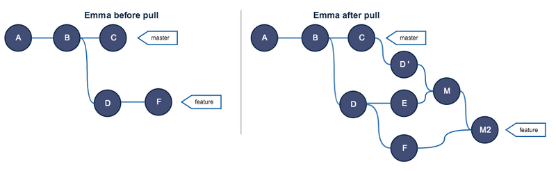

https://juejin.cn/post/6844903890295455751#heading-6

#不要再公共分支使用 rebase 

不要再公共分支使用 rebase 否者不会让流程线简单，而会变得更加复杂。这也解释为啥我需要 push -f 才能提交新的代码。

https://segmentfault.com/a/1190000005937408



# rebase 后生成重复提交记录的问题

https://coldfunction.com/geyite/p/9u

rebase后生成了一系列的重复提交记录。这种情况往往是因为rebase的分支记录已经被上传到remote。所以==rebase后git需要生成一系列重复的，存在于本地的记录，并且提交时间都是一样的==，这点很坑。所以尽量避免这样的rebase。

这种情况最好用merge. 如果非要用rabase的话，rebase后可以考虑强行push到远端覆盖远端的提交记录，但是注意提交时间也会永久丢失了。

```bash
git rebase origin/master
git push origin myBranch --force
```

# Github 不要使用 Rebase and Merge 合并 PR

https://docs.github.com/cn/github/collaborating-with-issues-and-pull-requests/about-pull-request-merges#rebase-and-merge-your-pull-request-commits

Github 不要使用 Rebase and Merge 合并 PR，来自主题分支（或头部分支）的所有提交都会单独添加到基础分支，也会产生重复记录的问题


https://judes.me/tech/2015/11/08/about-git-rebase.html