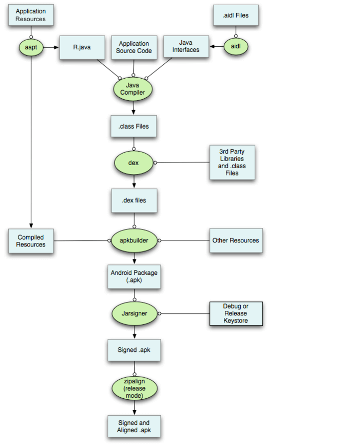
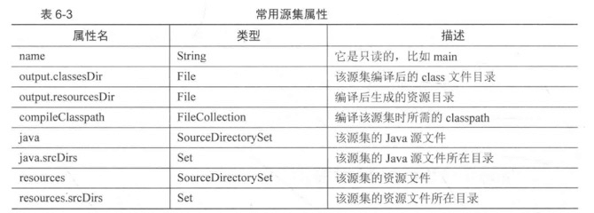
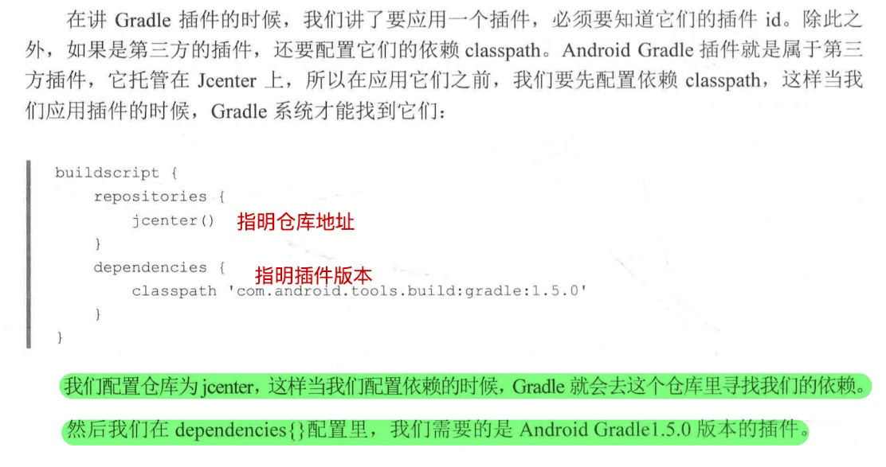
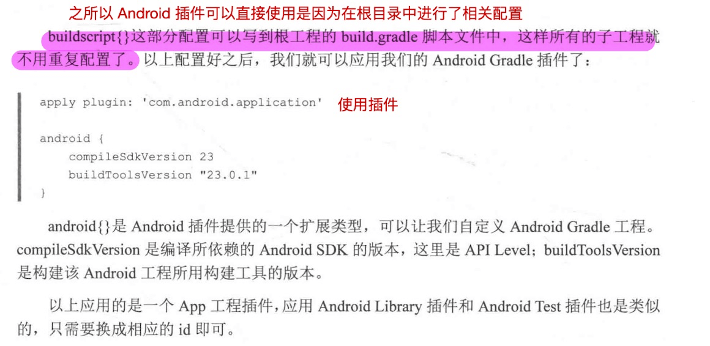

[toc]


# 定义

DSL ：Demo Special Language -》 领域特定语言，指的是专注某一领域的语言，它的特点是专，而不是全，所以才叫领域特定，而不是像 java 这种通用全面的语言。

Gradle 就是一门 DSL ，它基于 Groovy，专门解决自动化构建的 DSL。自动化构建太复杂太专业了，我们很难理解，所以专家为了帮助人们，就开发了 DSL —— Gradle 。我们作为开发者只要按照流程自定义我们的构建脚本就可以了。

## APK 的构建过程

Apk 的构建过程：



这个APK构建的过程主要分为以下几步：

1. 通过AAPT(Android Asset Packaging Tool)打包res资源文件，比如AndroidManifest.xml、xml布局文件等，并将这些xml文件编译为二进制，其中assets和raw文件夹的文件不会被编译为二进制，最终会生成R.java和resources.arsc文件。
2. AIDL工具会将所有的aidl接口转化为对应的Java接口。
3. 所有的Java代码，包括R.java和Java接口都会被Java编译器编译成.class文件。
4. Dex工具会将上一步生成的.class文件、第三库和其他.class文件编译成.dex文件。
5. 上一步编译生成的.dex文件、编译过的资源、无需编译的资源（如图片等）会被ApkBuilder工具打包成APK文件。
6. 使用Debug Keystore或者Release Keystore对上一步生成的APK文件进行签名。
7. 如果是对APK正式签名，还需要使用zipalign工具对APK进行对齐操作，这样应用运行时会减少内存的开销。

从以上步骤可以看出，APK的构建过程是比较繁琐的，而且这个构建过程又是时常重复的，如果没有构建工具，手动去完成构建工作，无疑对于开发人员是个折磨，也会产生诸多的问题，导致项目开发周期变长。

# Gradle 基础

## 安装

brew install gradle

## Gradle Wrapper

Gradle Wrapper 是一种对于 Gradle 的封装，**便于团队开发过程中统一 Gradle 构建版本 **，避免 Gradle 版本不统一造成的不必要问题。

**参考：**

《Android Gradle 权威指南》—— 1.3 节


# Gradle 脚本

## 任务依赖

```groovy
// dependsOn 表示任务以来，在执行 extHello 之前要执行 extMain
task extHello(dependsOn: extMain) {
    println 'hello'
}

task extMain {
    println 'main'
}
```


## 自定义属性

相比于局部变量，自定义属性更加强大，他可以跨 Project 和 task 之间进行访问。利用这个特点我们可以在根 build.gradle 中定义一个指明 targetSdk 版本的自定义属性，使用它约束所有 child project。

```groovy
// 自定义一个 Project 属性
ext.age = 18

ext {
    phone = '123232323'
    address = 'Beijing'
}

task ex37CustomProperty {
    println "年龄是：${age}"
    println "电话是：${phone}"
    println "电话是：${address}"
}
```


## 任务分组和描述

```groovy
// 任务分组和描述
def Task myTask = task ex43GroupTask
myTask.group = BasePlugin.BUILD_GROUP
myTask.description = '这是一个构建引导任务'

myTask.doLast {
    println "group:${group}, description:${description}"
}
```

执行 `./gradlew tasks`


# Gradle 插件

## 如何配置第三方依赖

```groovy
	//仓库地址    
	repositories {
      // 自定义依赖库
        maven {
          	// 仓库的地址
            url XXXXX
          	// 认证方式
            credentials {
                username XXXX
                password XXXXX
            }
        // 第三方仓库
        google()
        jcenter()
    }
```

## 源码集合

```groovy
    sourceSets {
        main {
             manifest.srcFile 'src/main/debug/AndroidManifest.xml'
             res.srcDirs += 'src/main/debug/res/'
             java.srcDirs += "src/main/debug/java/"
        }
    }
```



## subprojects

对于所有的子项目应用如下配置

```groovy
subprojects {
    // 1。插件类：让所有子项目都应有这个插件
    apple plugin: 'java'
  	// 2。仓库类：让所有子项目都使用这个仓库
    repositories {
        google()
    }
  	// 3. 依赖类
    dependencies {
        testCompiles 'junit:junit:4.14'
    }
}
```

# 发布构件

由 Gradle 构建的产物，我们称之为构件，它可以是一个 Jar、zip、war、arr 等等

[参见用例](./CODE/publish_to_maven.gradle)


# 应用 Android Gradle 插件

注意这里讲的插件都是应有于 Gradle 的，并不是工程项目的远程依赖






# Android Gradle 高级自定义

## 65535 在 5.0 之前版本的实现原理

详情参考：《Android Gradle 权威指南》 9.11节

## 自动清理未使用资源

详情参考：《Android Gradle 权威指南》9.12节

## 创建 product flavors 分组

[详情可以参见](https://developer.android.com/studio/build/build-variants?utm_source=android-studio#product-flavors)

```groovy
		// 必须指定 否者会报错，相当于是分组，可以写多个用，分开
    flavorDimensions "test","app"
    productFlavors {
        dev {
            // 必须指定
            dimension "test"
        }
    }
```


# Android Gradle 多渠道构建

> 详情参见《Android Gradle 权威指南》11章

Gradle 里面有一个概念叫做 Build Variant，直译过来就是构建变体， 我们喜欢叫他构件——构建的产物(apk).

Build Variant = Build Type + Product Flavor,。

Build Type 就是我们构建的类型，比如 realse 和 debug；而 Product Flavor 就是我们构建的渠道，比如 Baidu，Google 等，他们加起来就是 baiduRelease、baiduDebug、GoogleRelease、GoogleDebug。


## 提高多渠道构建的效率

具体步骤参见：[新一代开源Android渠道包生成工具Walle](https://tech.meituan.com/2017/01/13/android-apk-v2-signature-scheme.html)

首先多渠道包的目的就是为了区分不同渠道统计的数据，所以每一个渠道包基本上没啥区别。但是使用 Gradle 打多渠道包速度很慢，因为 Gradle 会对每个渠道包进行单独构建。

美团团队针对这个问题提出了一个很好的解决方案，他们根据 apk 的 META-INFO 目录下添加空文件不用重新签名的原理，非常高效的解决多渠道构建问题。

具体步骤：

1. 使用 Android Gradle 构建一个 apk
2. 复制出一个新的 apk ，重命名为可以识别出产品，打包时间、版本、渠道等
3. 在复制出来的 apk META-IINFO 目录下创建空文件，但是空文件的名字要有意义，必须能区分渠道，比如：mtchaneel_goole
4. 重复2，3生成所有需要的多渠道包，这个可以使用 python 脚本来做
5. 在 apk 启动 （Application onCreate）的时候，读取 apk META-IINFO 目录前缀为 mtchannel_ 文件，如果找得到的话，拿出来得到渠道名


# 参考 

* [google 官方文档](https://developer.android.com/studio/build)

* 《Android Gradle 权威指南》第9章开始很多使用的方法里面都有
* 