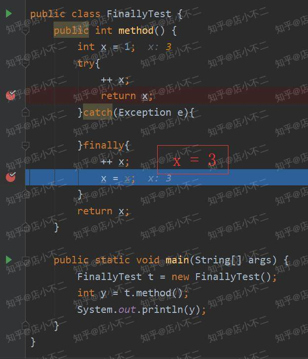

[toc]


# 请描述 new 一个对象的流程。


# Java 对象会不会分配到栈中？

答：有可能，这个叫逃逸分析。


（15）String， Stringbuffer， StringBuilder 的区别是什么？（东方头条）a.String StringBuffer StringBuilder 在进行字符串操作时的效率；这里主要考察 String 在内存中是如何创建的。（字节跳动）
（16）String 为什么是不可变的？（字节跳动）a.String为什么设计成final的？
（17）final 、finally、finalize 区别。
（18）抽象类和接口的区别。
（19）重载和重写的区别 （京东）
（20）什么是值传递和引用传递，Java 是值传递还是引用传递？

# String s = new String(“”);创建了几个对象?

答：两个。

1. 在堆上创建一个 String 对象，并指向 s。

2. 看看常量池里面找 “” 存不存在，如果不存在就创建一个常量对象指向堆。


# java 里 equals和== 区别。

# try-catch-finally，try 里有 return，finally 还执行么？

这个肯定是会执行的，但是要是 catch 里面有 return 就不会执行了。

对于该问题，答案是肯定的。[Java官方文档](https://docs.oracle.com/javase/tutorial/essential/exceptions/finally.html)上是这么描述的:

> The `finally` block *always* executes when the `try` block exits.`

我们看到描述词用的是always，即在**try执行完成之后，finally是一定会执行的**。这种特性可以让程序员避免在`try`语句中使用了`return`, `continue`或者 `break`关键字而忽略了关闭相关资源的操作。把清理相关资源放到`finally`语句块中一直是最佳实践。

# try { return } finally{}?

我们知道了finally语句会执行，当我们在IDE上运行该程序的时候，会发现运行结果是2。那么为什么不是3呢？

我们来debug一下：

我们在下图可以看到，try中x值是2，且执行了try语句块中的`return x`语句。


之后执行了finally语句，x重新赋值为3。



try中返回了x=2, finally语句又重新设置了x=3，为什么返回给主程序的结果是2呢？

原来[JVM规范](http://docs.oracle.com/javase/specs/jvms/se7/html/jvms-4.html#jvms-4.10.2.5)里面明确说明了这种情况：

```
If the try clause executes a return, the compiled code does the following:

1. Saves the return value (if any) in a local variable.
2. Executes a jsr to the code for the finally clause.
3. Upon return from the finally clause, returns the value saved in the local variable.
复制代码
```

大意就是如果在try中return的情况下，先把try中将要return的值先存到一个本地变量中，即本例中的x=2将会被保存下来。接下来去执行finally语句，最后返回的是存在本地变量中的值，即返回x=2.

==还有一点要注意的，如果你在finally里也用了return语句，比如return ++x。那么程序返回值会是3。因为规范规定了，当try和finally里都有return时，会忽略try的return，而使用finally的return。==

# Excption 与 Error 区别

Excption 和 Error 都是 Throwable 的子类，在 Java 中只有是 Throwable 的子类才能抛出（throw） 和捕获异常（catch）。

Exception 和 Error 体现了 Java 平台设计者对不同异常情况的分类。<font color = red>Exception 是程序正常运行中，可以预料的意外情况，可能并且应该被捕获，进行相应处理。Error 是指在正常情况下，不大可能出现的情况，绝大部分的 Error 都会导致程序（比如 JVM 自身）处于非正常的、不可恢复状态</font>。既然是非正常情况，所以不便于也不需要捕获，常见的比如 OutOfMemoryError 之类，都是 Error 的子类。

Exception 又分为可检查（checked）异常和不检查（unchecked）异常，可检查异常在源代码里必须显式地进行捕获处理，这是编译期检查的一部分。前面我介绍的不可查的 Error，是 Throwable 不是 Exception。不检查异常就是所谓的运行时异常，类似 NullPointerException、ArrayIndexOutOfBoundsException 之类，通常是可以编码避免的逻辑错误，具体根据需要来判断是否需要捕获，并不会在编译期强制要求。


## 拓展： NoClassDefFoundError 和 ClassNOtFoundException

NoClassDefFoundError是一个错误(Error)，而ClassNOtFoundException是一个异常，在Java中对于错误和异常的处理是不同的，我们可以从异常中恢复程序但却不应该尝试从错误中恢复程序。

**ClassNotFoundException的产生原因**：
Java支持使用反射方式在运行时动态加载类，例如使用Class.forName方法来动态地加载类时，可以将类名作为参数传递给上述方法从而将指定类加载到JVM内存中，如果这个类在类路径中没有被找到，那么此时就会在运行时抛出ClassNotFoundException异常。
解决该问题需要确保所需的类连同它依赖的包存在于类路径中，常见问题在于类名书写错误。
另外还有一个导致ClassNotFoundException的原因就是：当一个类已经某个类加载器加载到内存中了，此时另一个类加载器又尝试着动态地从同一个包中加载这个类。通过控制动态类加载过程，可以避免上述情况发生。

**NoClassDefFoundError产生的原因在于**：
如果JVM或者ClassLoader实例尝试加载（可以通过正常的方法调用，也可能是使用new来创建新的对象）类的时候却找不到类的定义。要查找的类在编译的时候是存在的，运行的时候却找不到了。这个时候就会导致NoClassDefFoundError.
造成该问题的原因可能是打包过程漏掉了部分类，或者jar包出现损坏或者篡改。解决这个问题的办法是查找那些在开发期间存在于类路径下但在运行期间却不在类路径下的类。


（25）Static class 与 non static class 的区别。
（26）PathClassLoader 与 DexClassLoader 的区别是什么？
（27）什么是双亲委托机制，为什么需要双亲委托机制？
（28）描述 JVM 类加载过程。
（29）动态代理是什么？如何实现？
（30）动态代理的方法怎么初始化的？（字节跳动）
（31）CGLIB 动态代理（字节跳动）
（32）说说反射的应用场景，哪些框架，原理是什么？
（33）Java 泛型的特点与优缺点，泛型擦除是怎么回事？
（34）List 能否转为 List。
（35）泛型 super 和 extends 的区别。a.说法 2：Java 的泛型，<? super T> 和 <? extends T> 的区别。
（36）为什么 IO 是耗时操作？