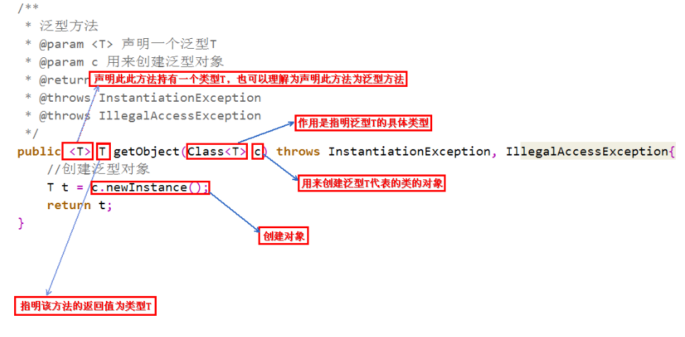
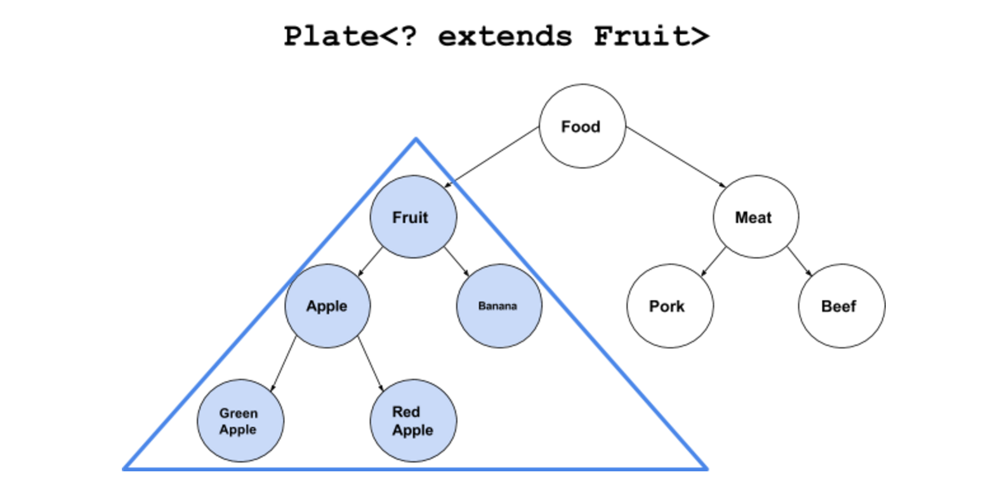
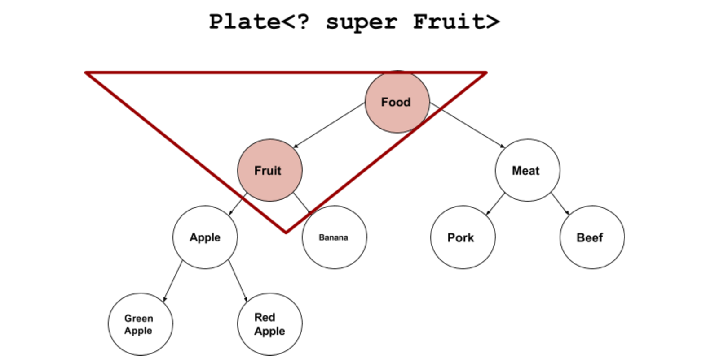

> 本文由 [简悦 SimpRead](http://ksria.com/simpread/) 转码， 原文地址 [itimetraveler.github.io](https://itimetraveler.github.io/2016/12/27/%E3%80%90Java%E3%80%91%E6%B3%9B%E5%9E%8B%E4%B8%AD%20extends%20%E5%92%8C%20super%20%E7%9A%84%E5%8C%BA%E5%88%AB%EF%BC%9F/)

[toc]

[](https://itimetraveler.github.io/gallery/java-genericity/example.png)

`<? extends T>`和`<? super T>`是 Java 泛型中的 **“通配符（Wildcards）”** 和 **“边界（Bounds）”** 的概念。

*   `<? extends T>`：是指 **“上界通配符（Upper Bounds Wildcards）”**
*   `<? super T>`：是指 **“下界通配符（Lower Bounds Wildcards）”**

为什么要用通配符和边界
------------------------------------------------

使用泛型的过程中，经常出现一种很别扭的情况。比如按照题主的例子，我们有 Fruit 类，和它的派生类 Apple 类。

```
class Fruit {}
class Apple extends Fruit {}
```

然后有一个最简单的容器：Plate 类。盘子里可以放一个泛型的 “东西”。我们可以对这个东西做最简单的“放” 和“取”的动作：`set( )`和`get( )`方法。

```java
class Plate<T>{
    private T item;
    public Plate(T t){item=t;}
    public void set(T t){item=t;}
    public T get(){return item;}
}
```

现在我定义一个 “水果盘子”，逻辑上水果盘子当然可以装苹果。

```java
Plate<Fruit> p = new Plate<Apple>(new Apple());
```

但实际上 Java 编译器不允许这个操作。会报错，“装苹果的盘子” 无法转换成 “装水果的盘子”。

```sh
error: incompatible types: Plate<Apple> cannot be converted to Plate<Fruit>
```

所以我的尴尬症就犯了。实际上，编译器脑袋里认定的逻辑是这样的：

*   苹果 IS-A 水果
*   装苹果的盘子 NOT-IS-A 装水果的盘子

所以，就算容器里装的东西之间有继承关系，但容器之间是没有继承关系的。所以我们不可以把 Plate 的引用传递给 Plate。

为了让泛型用起来更舒服，Sun 的大脑袋们就想出了`<? extends T>`和`<? super T>`的办法，来让 “水果盘子” 和“苹果盘子”之间发生关系。

什么是上界？
------------------------------

下面代码就是 “上界通配符（Upper Bounds Wildcards）”：

```java
Plate<？ extends Fruit>
```

翻译成人话就是：一个能放水果以及一切是水果派生类的盘子。再直白点就是：啥水果都能放的盘子。这和我们人类的逻辑就比较接近了。`Plate<？ extends Fruit>`和`Plate<Apple>`最大的区别就是：`Plate<？ extends Fruit>`是`Plate<Fruit>`以及`Plate<Apple>`的基类。直接的好处就是，我们可以用 “苹果盘子” 给“水果盘子”赋值了。

```java
Plate<? extends Fruit> p=new Plate<Apple>(new Apple());
```

如果把 Fruit 和 Apple 的例子再扩展一下，食物分成水果和肉类，水果有苹果和香蕉，肉类有猪肉和牛肉，苹果还有两种青苹果和红苹果。

```java
class Food{}

class Fruit extends Food{}
class Meat extends Food{}

class Apple extends Fruit{}
class Banana extends Fruit{}
class Pork extends Meat{}
class Beef extends Meat{}

class RedApple extends Apple{}
class GreenApple extends Apple{}
```

在这个体系中，下界通配符 `Plate<？ extends Fruit>` 覆盖下图中蓝色的区域。

[](https://itimetraveler.github.io/gallery/java-genericity/lowerBounds.png)

什么是下界？
------------------------------

相对应的，“下界通配符（Lower Bounds Wildcards）”：

```java
Plate<？ super Fruit>
```

表达的就是相反的概念：一个能放水果以及一切是水果基类的盘子。`Plate<？ super Fruit>`是`Plate<Fruit>`的基类，但不是`Plate<Apple>`的基类。对应刚才那个例子，`Plate<？ super Fruit>`覆盖下图中红色的区域。

[](https://itimetraveler.github.io/gallery/java-genericity/upperBounds.png)

上下界通配符的副作用
------------------------------------------

边界让 Java 不同泛型之间的转换更容易了。但不要忘记，这样的转换也有一定的副作用。那就是容器的部分功能可能失效。

还是以刚才的 Plate 为例。我们可以对盘子做两件事，往盘子里 set() 新东西，以及从盘子里 get() 东西。

```java
class Plate<T>{
    private T item;
    public Plate(T t){item=t;}
    public void set(T t){item=t;}
    public T get(){return item;}
}
```

### 上界`<? extends T>`不能往里存，只能往外取

==`<? extends Fruit>`会使往盘子里放东西的`set( )`方法失效。但取东西`get( )`方法还有效==。比如下面例子里两个 set() 方法，插入 Apple 和 Fruit 都报错。

```java
Plate<? extends Fruit> p=new Plate<Apple>(new Apple());
	

p.set(new Fruit());    
p.set(new Apple());    


Fruit newFruit1=p.get();
Object newFruit2=p.get();
Apple newFruit3=p.get();
```

原因是编译器只知道容器内是 Fruit 或者它的派生类，但具体是什么类型不知道。可能是 Fruit？可能是 Apple？也可能是 Banana，RedApple，GreenApple？编译器在看到后面用 Plate 赋值以后，盘子里没有被标上有 “苹果”。而是标上一个占位符：CAP#1，来表示捕获一个 Fruit 或 Fruit 的子类，具体是什么类不知道，代号 CAP#1。然后无论是想往里插入 Apple 或者 Meat 或者 Fruit 编译器都不知道能不能和这个 CAP#1 匹配，所以就都不允许。

所以通配符`<?>`和类型参数的区别就在于，==对编译器来说所有的 T 都代表同一种类型。比如下面这个泛型方法里，三个 T 都指代同一个类型，要么都是 String，要么都是 Integer。==

```java
public <T> List<T> fill(T... t);
```

==但通配符`<?>`没有这种约束，`Plate<?>`单纯的就表示：盘子里放了一个东西，是什么我不知道==。

<font color = red>所以题主问题里的错误就在这里，`Plate<？ extends Fruit>`里什么都放不进去。</font>

### 下界`<? super T>`不影响往里存，但往外取只能放在 Object 对象里

使用下界`<? super Fruit>`会使从盘子里取东西的 get() 方法部分失效，只能存放到 Object 对象里。set() 方法正常。

```java
Plate<? super Fruit> p=new Plate<Fruit>(new Fruit());


p.set(new Fruit());
p.set(new Apple());


Apple newFruit3=p.get();    
Fruit newFruit1=p.get();    
Object newFruit2=p.get();
```

因为下界规定了元素的最小粒度的下限，实际上是放松了容器元素的类型控制。既然元素是 Fruit 的基类，那往里存粒度比 Fruit 小的都可以。但往外读取元素就费劲了，只有所有类的基类 Object 对象才能装下。但这样的话，元素的类型信息就全部丢失。

PECS 原则
-------------------------------

最后看一下什么是 PECS（Producer Extends Consumer Super）原则，已经很好理解了：

*   **频繁往外读取内容的，适合用上界 Extends。**
*   **经常往里插入的，适合用下界 Super。**

参考资料
--------------------

*   [Java 泛型中 extends 和 super 的区别？](http://www.ciaoshen.com/2016/08/21/superExtends/)