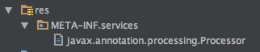
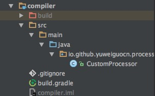

> 本文由 [简悦 SimpRead](http://ksria.com/simpread/) 转码， 原文地址 [yuweiguocn.github.io](https://yuweiguocn.github.io/java-annotation-processor/)

[toc]

本文介绍了如何自定义 Java 注解处理器及涉及到的相关知识，看完本文可以很轻松看懂并理解各大开源框架的注解处理器的应用。

> 《游园不值》  
> 应怜屐齿印苍苔 ，小扣柴扉久不开 。  
> 春色满园关不住 ，一枝红杏出墙来 。  
>
> - 宋，叶绍翁

关于自定义 Java 注解请查看[自定义注解](https://yuweiguocn.github.io/java-annotation/)。

> 本文已授权微信公众号：鸿洋（hongyangAndroid）原创首发。

基本实现
--------------------

实现一个自定义注解处理器需要有两个步骤，第一是实现 Processor 接口处理注解，第二是注册注解处理器。

### 实现 Processor 接口

通过实现 Processor 接口可以自定义注解处理器，这里我们采用更简单的方法通过继承 AbstractProcessor 类实现自定义注解处理器。实现抽象方法 process 处理我们想要的功能。

```java
public class CustomProcessor extends AbstractProcessor {
    @Override
    public boolean process(Set<? extends TypeElement> annotations,
                                                 RoundEnvironment roundEnvironment){
        return false;
    }
}
```

除此之外，我们还需要指定支持的注解类型以及支持的 Java 版本通过重写 getSupportedAnnotationTypes 方法和 getSupportedSourceVersion 方法：

```java
public class CustomProcessor extends AbstractProcessor {
    @Override
    public boolean process(Set<? extends TypeElement> annotations, 
                           					RoundEnvironment roundEnvironment) {
        return false;
    }
    @Override
    public Set<String> getSupportedAnnotationTypes() {
        Set<String> annotataions = new LinkedHashSet<String>();
        annotataions.add(CustomAnnotation.class.getCanonicalName());
        return annotataions;
    }

    @Override
    public SourceVersion getSupportedSourceVersion() {
        return SourceVersion.latestSupported();
    }
}
```

对于指定支持的注解类型，我们还可以通过注解的方式进行指定：

```java
@SupportedAnnotationTypes({"io.github.yuweiguocn.annotation.CustomAnnotation"})
public class CustomProcessor extends AbstractProcessor {
    @Override
    public boolean process(Set<? extends TypeElement> annotations,
                                         RoundEnvironment roundEnvironment) {
        return false;
    }
    @Override
    public SourceVersion getSupportedSourceVersion() {
        return SourceVersion.latestSupported();
    }
}
```

> ==因为 Android 平台可能会有兼容问题，建议使用重写 getSupportedAnnotationTypes 方法指定支持的注解类型。==

### 注册注解处理器

最后我们还需要将我们自定义的注解处理器进行注册。新建 res 文件夹，目录下新建 META-INF 文件夹，目录下新建 services 文 件夹，目录下新建 javax.annotation.processing.Processor 文件，然后将我们自定义注解处理器的全类名写到此文件：  


```groovy
io.github.yuweiguocn.processor.CustomProcessor
```

上面这种注册的方式太麻烦了，谷歌帮我们写了一个注解处理器来生成这个文件。  
github 地址：[https://github.com/google/auto](https://github.com/google/auto)  
添加依赖：

```groovy
compile 'com.google.auto.service:auto-service:1.0-rc2'
```

添加注解：

```java
@AutoService(Processor.class)
public class CustomProcessor extends AbstractProcessor {
    ...
}
```

搞定，体会到注解处理器的强大木有。后面我们只需关注注解处理器中的处理逻辑即可。

我们来看一下最终的项目结构：



基本概念
--------------------

抽象类中还有一个 init 方法，这是 Processor 接口中提供的一个方法，当我们编译程序时注解处理器工具会调用此方法并且提供实现 ProcessingEnvironment 接口的对象作为参数。

```java
@Override
public synchronized void init(ProcessingEnvironment processingEnvironment) {
    super.init(processingEnvironment);
}
```

我们可以使用 ProcessingEnvironment 获取一些实用类以及获取选项参数等：

<table><thead><tr><th>方法</th><th>说明</th></tr></thead><tbody><tr><td>Elements getElementUtils()</td><td>返回实现 Elements 接口的对象，用于操作元素的工具类。</td></tr><tr><td>Filer getFiler()</td><td>返回实现 Filer 接口的对象，用于创建文件、类和辅助文件。</td></tr><tr><td>Messager getMessager()</td><td>返回实现 Messager 接口的对象，用于报告错误信息、警告提醒。</td></tr><tr><td>Map&lt;String,String&gt; getOptions()</td><td>返回指定的参数选项。</td></tr><tr><td>Types getTypeUtils()</td><td>返回实现 Types 接口的对象，用于操作类型的工具类。</td></tr></tbody></table>

### 元素

Element 元素是一个接口，表示一个程序元素，比如包、类或者方法。以下元素类型接口全部继承自 Element 接口：

<table><thead><tr><th>类型</th><th>说明</th></tr></thead><tbody><tr><td>ExecutableElement</td><td>表示某个类或接口的方法、构造方法或初始化程序（静态或实例），包括注解类型元素。</td></tr><tr><td>PackageElement</td><td>表示一个包程序元素。提供对有关包及其成员的信息的访问。</td></tr><tr><td>TypeElement</td><td>表示一个类或接口程序元素。提供对有关类型及其成员的信息的访问。注意，枚举类型是一种类，而注解类型是一种接口。</td></tr><tr><td>TypeParameterElement</td><td>表示一般类、接口、方法或构造方法元素的形式类型参数。</td></tr><tr><td>VariableElement</td><td>表示一个字段、enum 常量、方法或构造方法参数、局部变量或异常参数。</td></tr></tbody></table>

如果我们要判断一个元素的类型，应该使用 Element.getKind() 方法配合 ElementKind 枚举类进行判断。尽量**避免使用 instanceof 进行判断**，因为比如 TypeElement 既表示类又表示一个接口，这样判断的结果可能不是你想要的。例如我们判断一个元素是不是一个类：

```java
if (element instanceof TypeElement) { //错误，也有可能是一个接口
}

if (element.getKind() == ElementKind.CLASS) { //正确
    //doSomething
}
```

下表为 ElementKind 枚举类中的部分常量，详细信息请查看官方文档。

<table><thead><tr><th>类型</th><th>说明</th></tr></thead><tbody><tr><td>PACKAGE</td><td>一个包。</td></tr><tr><td>ENUM</td><td>一个枚举类型。</td></tr><tr><td>CLASS</td><td>没有用更特殊的种类（如 ENUM）描述的类。</td></tr><tr><td>ANNOTATION_TYPE</td><td>一个注解类型。</td></tr><tr><td>INTERFACE</td><td>没有用更特殊的种类（如 ANNOTATION_TYPE）描述的接口。</td></tr><tr><td>ENUM_CONSTANT</td><td>一个枚举常量。</td></tr><tr><td>FIELD</td><td>没有用更特殊的种类（如 ENUM_CONSTANT）描述的字段。</td></tr><tr><td>PARAMETER</td><td>方法或构造方法的参数。</td></tr><tr><td>LOCAL_VARIABLE</td><td>局部变量。</td></tr><tr><td>METHOD</td><td>一个方法。</td></tr><tr><td>CONSTRUCTOR</td><td>一个构造方法。</td></tr><tr><td>TYPE_PARAMETER</td><td>一个类型参数。</td></tr></tbody></table>

### 类型

TypeMirror 是一个接口，表示 Java 编程语言中的类型。这些类型包括基本类型、声明类型（类和接口类型）、数组类型、类型变量和 null 类型。还可以表示通配符类型参数、executable 的签名和返回类型，以及对应于包和关键字 void 的伪类型。以下类型接口全部继承自 TypeMirror 接口：

<table><thead><tr><th>类型</th><th>说明</th></tr></thead><tbody><tr><td>ArrayType</td><td>表示一个数组类型。多维数组类型被表示为组件类型也是数组类型的数组类型。</td></tr><tr><td>DeclaredType</td><td>表示某一声明类型，是一个类 (class) 类型或接口 (interface) 类型。这包括参数化的类型（比如 java.util.Set<string>）和原始类型。TypeElement 表示一个类或接口元素，而 DeclaredType 表示一个类或接口类型，后者将成为前者的一种使用（或调用）。</string></td></tr><tr><td>ErrorType</td><td>表示无法正常建模的类或接口类型。</td></tr><tr><td>ExecutableType</td><td>表示 executable 的类型。executable 是一个方法、构造方法或初始化程序。</td></tr><tr><td>NoType</td><td>在实际类型不适合的地方使用的伪类型。</td></tr><tr><td>NullType</td><td>表示 null 类型。</td></tr><tr><td>PrimitiveType</td><td>表示一个基本类型。这些类型包括 boolean、byte、short、int、long、char、float 和 double。</td></tr><tr><td>ReferenceType</td><td>表示一个引用类型。这些类型包括类和接口类型、数组类型、类型变量和 null 类型。</td></tr><tr><td>TypeVariable</td><td>表示一个类型变量。</td></tr><tr><td>WildcardType</td><td>表示通配符类型参数。</td></tr></tbody></table>

同样，如果我们想判断一个 TypeMirror 的类型，应该使用 TypeMirror.getKind() 方法配合 TypeKind 枚举类进行判断。尽量**避免使用 instanceof 进行判断**，因为比如 DeclaredType 既表示类 (class) 类型又表示接口 (interface) 类型，这样判断的结果可能不是你想要的。

TypeKind 枚举类中的部分常量，详细信息请查看官方文档。

<table><thead><tr><th>类型</th><th>说明</th></tr></thead><tbody><tr><td>BOOLEAN</td><td>基本类型 boolean。</td></tr><tr><td>INT</td><td>基本类型 int。</td></tr><tr><td>LONG</td><td>基本类型 long。</td></tr><tr><td>FLOAT</td><td>基本类型 float。</td></tr><tr><td>DOUBLE</td><td>基本类型 double。</td></tr><tr><td>VOID</td><td>对应于关键字 void 的伪类型。</td></tr><tr><td>NULL</td><td>null 类型。</td></tr><tr><td>ARRAY</td><td>数组类型。</td></tr><tr><td>PACKAGE</td><td>对应于包元素的伪类型。</td></tr><tr><td>EXECUTABLE</td><td>方法、构造方法或初始化程序。</td></tr></tbody></table>

### 创建文件

Filer 接口支持通过注解处理器创建新文件。可以创建三种文件类型：源文件、类文件和辅助资源文件。

1. 创建源文件

```java
JavaFileObject createSourceFile(CharSequence name,
                                Element... originatingElements)
                                throws IOException
```

创建一个新的源文件，并返回一个对象以允许写入它。文件的名称和路径（相对于源文件的根目录输出位置）基于该文件中声明的类型。如果声明的类型不止一个，则应该使用主要顶层类型的名称（例如，声明为 public 的那个）。还可以创建源文件来保存有关某个包的信息，包括包注解。要为指定包创建源文件，可以用 name 作为包名称，后跟 “.package-info”；要为未指定的包创建源文件，可以使用 “package-info”。

2. 创建类文件

```java
JavaFileObject createClassFile(CharSequence name,
                               Element... originatingElements)
                               throws IOException
```

创建一个新的类文件，并返回一个对象以允许写入它。文件的名称和路径（相对于类文件的根目录输出位置）基于将写入的类型名称。还可以创建类文件来保存有关某个包的信息，包括包注解。要为指定包创建类文件，可以用 name 作为包名称，后跟 “.package-info”；为未指定的包创建类文件不受支持。

3. 创建辅助资源文件  

```java
FileObject createResource(JavaFileManager.Location location,
                          CharSequence pkg,
                          CharSequence relativeName,
                          Element... originatingElements)
                          throws IOException
```

创建一个用于写入操作的新辅助资源文件，并为它返回一个文件对象。该文件可以与新创建的源文件、新创建的二进制文件或者其他受支持的位置一起被查找。位置 CLASS_OUTPUT 和 SOURCE_OUTPUT 必须受支持。资源可以是相对于某个包（该包是源文件和类文件）指定的，并通过相对路径名从中取出。从不太严格的角度说，新文件的完全路径名将是 location、 pkg 和 relativeName 的串联。

对于生成 Java 文件，还可以使用 Square 公司的开源类库 [JavaPoet](https://github.com/square/javapoet)，感兴趣的同学可以了解下。

### 打印错误信息

Messager 接口提供注解处理器用来报告错误消息、警告和其他通知的方式。

> 注意：我们应该**对在处理过程中可能发生的异常进行捕获**，通过 Messager 接口提供的方法通知用户。此外，使用带有 Element 参数的方法连接到出错的元素，用户可以直接点击错误信息跳到出错源文件的相应行。如果你在 process() 中抛出一个异常，那么运行注解处理器的 JVM 将会崩溃（就像其他 Java 应用一样），这样用户会从 javac 中得到一个非常难懂出错信息。

<table><thead><tr><th>方法</th><th>说明</th></tr></thead><tbody><tr><td>void printMessage(Diagnostic.Kind kind, CharSequence msg)</td><td>打印指定种类的消息。</td></tr><tr><td>void printMessage(Diagnostic.Kind kind, CharSequence msg, Element e)</td><td>在元素的位置上打印指定种类的消息。</td></tr><tr><td>void printMessage(Diagnostic.Kind kind, CharSequence msg, Element e, AnnotationMirror a)</td><td>在已注解元素的注解镜像位置上打印指定种类的消息。</td></tr><tr><td>void printMessage(Diagnostic.Kind kind, CharSequence msg, Element e, AnnotationMirror a, AnnotationValue v)</td><td>在已注解元素的注解镜像内部注解值的位置上打印指定种类的消息。</td></tr></tbody></table>

### 配置选项参数

我们可以通过 getOptions() 方法获取选项参数，在 gradle 文件中配置选项参数值。例如我们配置了一个名为 yuweiguoCustomAnnotation 的参数值。

```java
android {
    defaultConfig {
        javaCompileOptions {
            annotationProcessorOptions {
                arguments = [ yuweiguoCustomAnnotation : 'io.github.yuweiguocn.customannotation.MyCustomAnnotation' ]
            }
        }
    }
}
```

在注解处理器中重写 getSupportedOptions 方法指定支持的选项参数名称。通过 getOptions 方法获取选项参数值。

```java
public static final String CUSTOM_ANNOTATION = "yuweiguoCustomAnnotation";

@Override
public boolean process(Set<? extends TypeElement> annotations, RoundEnvironment roundEnv) {
   try {
       String resultPath = processingEnv.getOptions().get(CUSTOM_ANNOTATION);
       if (resultPath == null) {
           ...
           return false;
       }
       ...
   } catch (Exception e) {
       e.printStackTrace();
       ...
   }
   return true;
}


@Override
public Set<String> getSupportedOptions() {
   Set<String> options = new LinkedHashSet<String>();
   options.add(CUSTOM_ANNOTATION);
   return options;
}
```

### 处理过程

Java 官方文档给出的注解处理过程的定义：注解处理过程是一个有序的循环过程。在每次循环中，一个处理器可能被要求去处理那些在上一次循环中产生的源文件和类文件中的注解。第一次循环的输入是运行此工具的初始输入。这些初始输入，可以看成是虚拟的第 0 次的循环的输出。这也就是说我们实现的 process 方法有可能会被调用多次，因为我们生成的文件也有可能会包含相应的注解。例如，我们的源文件为 SourceActivity.class，生成的文件为 Generated.class，这样就会有三次循环，第一次输入为 SourceActivity.class，输出为 Generated.class；第二次输入为 Generated.class，输出并没有产生新文件；第三次输入为空，输出为空。

每次循环都会调用 process 方法，process 方法提供了两个参数，第一个是我们请求处理注解类型的集合（也就是我们通过重写 getSupportedAnnotationTypes 方法所指定的注解类型），第二个是有关当前和上一次 循环的信息的环境。返回值表示这些注解是否由此 Processor 声明，==如果返回 true，则这些注解已声明并且不要求后续 Processor 处理它们；如果返回 false，则这些注解未声明并且可能要求后续 Processor 处理它们。==

```java
public abstract boolean process(Set<? extends TypeElement> annotations,
                                RoundEnvironment roundEnv)
```

### 获取注解元素

我们可以通过 RoundEnvironment 接口获取注解元素。process 方法会提供一个实现 RoundEnvironment 接口的对象。

<table><thead><tr><th>方法</th><th>说明</th></tr></thead><tbody><tr><td>Set&lt;? extends Element&gt; getElementsAnnotatedWith(Class&lt;? extends Annotation&gt; a)</td><td>返回被指定注解类型注解的元素集合。</td></tr><tr><td>Set&lt;? extends Element&gt; getElementsAnnotatedWith(TypeElement a)</td><td>返回被指定注解类型注解的元素集合。</td></tr><tr><td>processingOver()</td><td>如果循环处理完成返回 true，否则返回 false。</td></tr></tbody></table>

示例
--------------

了解完了相关的基本概念，接下来我们来看一个示例，**本示例只为演示无实际意义**。主要功能为自定义一个注解，此注解只能用在 public 的方法上，我们通过注解处理器拿到类名和方法名存储到 List 集合中，然后生成通过参数选项指定的文件，通过此文件可以获取 List 集合。

自定义注解：  

```java
@Documented
@Target({ElementType.METHOD})
@Retention(RetentionPolicy.RUNTIME)
public @interface CustomAnnotation {
}
```

注解处理器中关键代码：  

```java
@Override
public boolean process(Set<? extends TypeElement> annotations, RoundEnvironment roundEnv) {
   try {
       String resultPath = processingEnv.getOptions().get(CUSTOM_ANNOTATION);
       if (resultPath == null) {
           messager.printMessage(Diagnostic.Kind.ERROR, "No option " + CUSTOM_ANNOTATION +
                   " passed to annotation processor");
           return false;
       }

       round++;
       messager.printMessage(Diagnostic.Kind.NOTE, "round " + round + " process over " + roundEnv.processingOver());
       Iterator<? extends TypeElement> iterator = annotations.iterator();
       while (iterator.hasNext()) {
           messager.printMessage(Diagnostic.Kind.NOTE, "name is " + iterator.next().getSimpleName().toString());
       }

       if (roundEnv.processingOver()) {
           if (!annotations.isEmpty()) {
               messager.printMessage(Diagnostic.Kind.ERROR,
                       "Unexpected processing state: annotations still available after processing over");
               return false;
           }
       }

       if (annotations.isEmpty()) {
           return false;
       }

       for (Element element : roundEnv.getElementsAnnotatedWith(CustomAnnotation.class)) {
           if (element.getKind() != ElementKind.METHOD) {
               messager.printMessage(
                       Diagnostic.Kind.ERROR,
                       String.format("Only methods can be annotated with @%s", CustomAnnotation.class.getSimpleName()),
                       element);
               return true; // 退出处理
           }

           if (!element.getModifiers().contains(Modifier.PUBLIC)) {
               messager.printMessage(Diagnostic.Kind.ERROR, "Subscriber method must be public", element);
               return true;
           }

           ExecutableElement execElement = (ExecutableElement) element;
           TypeElement classElement = (TypeElement) execElement.getEnclosingElement();
           result.add(classElement.getSimpleName().toString() + "#" + execElement.getSimpleName().toString());
       }
       if (!result.isEmpty()) {
           generateFile(resultPath);
       } else {
           messager.printMessage(Diagnostic.Kind.WARNING, "No @CustomAnnotation annotations found");
       }
       result.clear();
   } catch (Exception e) {
       e.printStackTrace();
       messager.printMessage(Diagnostic.Kind.ERROR, "Unexpected error in CustomProcessor: " + e);
   }
   return true;
}

private void generateFile(String path) {
   BufferedWriter writer = null;
   try {
       JavaFileObject sourceFile = filer.createSourceFile(path);
       int period = path.lastIndexOf('.');
       String myPackage = period > 0 ? path.substring(0, period) : null;
       String clazz = path.substring(period + 1);
       writer = new BufferedWriter(sourceFile.openWriter());
       if (myPackage != null) {
           writer.write("package " + myPackage + ";\n\n");
       }
       writer.write("import java.util.ArrayList;\n");
       writer.write("import java.util.List;\n\n");
       writer.write("/** This class is generated by CustomProcessor, do not edit. */\n");
       writer.write("public class " + clazz + " {\n");
       writer.write("    private static final List<String> ANNOTATIONS;\n\n");
       writer.write("    static {\n");
       writer.write("        ANNOTATIONS = new ArrayList<>();\n\n");
       writeMethodLines(writer);
       writer.write("    }\n\n");
       writer.write("    public static List<String> getAnnotations() {\n");
       writer.write("        return ANNOTATIONS;\n");
       writer.write("    }\n\n");
       writer.write("}\n");
   } catch (IOException e) {
       throw new RuntimeException("Could not write source for " + path, e);
   } finally {
       if (writer != null) {
           try {
               writer.close();
           } catch (IOException e) {
               //Silent
           }
       }
   }
}

private void writeMethodLines(BufferedWriter writer) throws IOException {
   for (int i = 0; i < result.size(); i++) {
       writer.write("        ANNOTATIONS.add(\"" + result.get(i) + "\");\n");
   }
}
```

编译输出：  

```
Note: round 1 process over false
Note: name is CustomAnnotation
Note: round 2 process over false
Note: round 3 process over true
```

获取完整代码：[https://github.com/yuweiguocn/CustomAnnotation](https://github.com/yuweiguocn/CustomAnnotation)

关于上传自定义注解处理器到 jcenter 中，请查看[上传类库到 jcenter](https://yuweiguocn.github.io/publishing-lib-to-jcenter/)。

很高兴你能阅读到这里，此时再去看 EventBus 3.0 中的注解处理器的源码，相信你可以很轻松地理解它的原理。

> 注意：如果你 clone 了工程代码，你可能会发现**注解和注解处理器是单独的 module**。有一点可以肯定的是我们的注解处理器只需要在编译的时候使用，并不需要打包到 APK 中。因此为了用户考虑，我们需要将注解处理器分离为单独的 module。

应用案例
--------------------

*   [https://github.com/greenrobot/EventBus](https://github.com/greenrobot/EventBus) Android optimized event bus that simplifies communication between Activities, Fragments, Threads, Services, etc. Less code, better quality.
*   [https://github.com/frankiesardo/icepick](https://github.com/frankiesardo/icepick) Android Instance State made easy
*   [https://github.com/sockeqwe/fragmentargs](https://github.com/sockeqwe/fragmentargs) Annotation Processor for setting arguments in android fragments
*   [http://parceler.org/](http://parceler.org/) Android Parcelable code generator for Google Android
*   [https://github.com/JakeWharton/butterknife](https://github.com/JakeWharton/butterknife) Bind Android views and callbacks to fields and methods.
*   [https://github.com/bluelinelabs/LoganSquare](https://github.com/bluelinelabs/LoganSquare) Screaming fast JSON parsing and serialization library for Android.
*   [https://github.com/google/auto](https://github.com/google/auto) A collection of source code generators for Java.

参考
--------------

*   [https://www.race604.com/annotation-processing/](https://www.race604.com/annotation-processing/)
*   [http://docs.oracle.com/javase/7/docs/api/javax/annotation/processing/package-summary.html](http://docs.oracle.com/javase/7/docs/api/javax/annotation/processing/package-summary.html)
*   [http://tool.oschina.net/uploads/apidocs/jdk-zh/](http://tool.oschina.net/uploads/apidocs/jdk-zh/)
*   [https://github.com/greenrobot/EventBus](https://github.com/greenrobot/EventBus)
*   [http://hannesdorfmann.com/annotation-processing/annotationprocessing101](http://hannesdorfmann.com/annotation-processing/annotationprocessing101)
*   [https://github.com/sockeqwe/annotationprocessing101](https://github.com/sockeqwe/annotationprocessing101)

