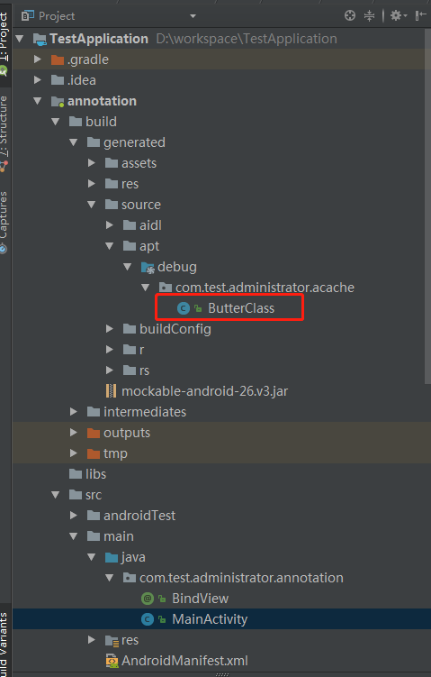
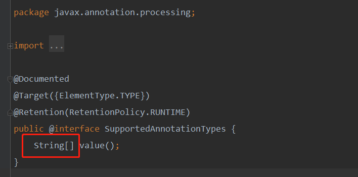

> 本文由 [简悦 SimpRead](http://ksria.com/simpread/) 转码， 原文地址 [www.jianshu.com](https://www.jianshu.com/p/c995ffe75ec2) 

前言
==

>     继前一节内容，我们知道动态代理其实质就是依靠反射来实现的，这节讲述的是反射的另一个分支 **注解** 。

反射与注解的关系
========

  关于反射与注解的关系，总结起来一句话就是：**Annotation 是被动的元数据，永远不会有主动行为，所以我们需要通过使用反射，才能让我们的注解产生意义。**

注解的分类
=====

 

*   **是否包含成员变量**  
    **1. 标记注解：** 没有成员变量的 Annotation 被称为标记。这种 Annotation 仅用自身是否存在，来为我们提供信息。例如 @Override 等。  
    **2. 元数据注解：** 包含成员变量的 Annotation。因为它们可以接受更多的元数据，因此被称为元数据 Annotation。成员以无参数的方法的形式被声明，其方法名和返回值定义了该成员变量的名字和类型。
    
*   **来源**  
    **1. 内建注解（java.lang 包下）：** 是 JDK 自带的注解，其大致分为 5 种（后 2 种可忽略）  
      **@Override：** 重写，标识覆盖它的父类的方法  
      **@Deprecated：** 已过期，表示方法是不被建议使用的  
      **@SuppressWarnings：** 压制警告，抑制警告  
    **2. 元注解（java.lang.annotation 包下）：** 元注解就是修饰注解的注解。  
      **@Target：** 表示该注解用于什么地方，可取的值包括：  
        **ElemenetType.CONSTRUCTOR：** 构造器声明  
        **ElemenetType.FIELD：** 域声明（包括 enum 实例）  
        **ElemenetType.LOCAL_VARIABLE：** 局部变量声明  
        **ElemenetType.METHOD：** 方法声明  
        **ElemenetType.PACKAGE：** 包声明  
        **ElemenetType.PARAMETER：** 参数声明  
        **ElemenetType.TYPE：** 类，接口（包括注解类型）或 enum 声明  
        **ElemenetType.ANNOTATION_TYPE：** 注解  
      **@Retention：** 表示在什么级别保存该注解信息。可选的 RetentionPolicy 参数包括：  
        **RetentionPolicy.SOURCE：** 注解将被编译器丢弃  
        **RetentionPolicy.CLASS：** 注解在 class 文件中可用，但会被 VM 丢弃  
        **RetentionPolicy.RUNTIME：** JVM 将在运行期也保留注释，因此可以通过反射机制读取注解的信息  
      **@Documented：** 将此注解包含在 javadoc 中  
      **@Inherited：** 允许子类继承父类中的注解  
    **3. 自定义注解**
    
*   **运行机制**  
    <font color = green>**1. 源码注解（RetentionPolicy.SOURCE）：** 注解只保留在源文件，当 Java 文件编译成 class 文件的时候，注解被遗弃。</font>
    <font color = green>**2. 编译时注解（RetentionPolicy.CLASS）：** 注解被保留到 class 文件，但 jvm 加载 class 文件时候被遗弃，这是默认的生命周期。  </font>
    <font color = green>**3. 运行时注解（RetentionPolicy.RUNTIME）：** 注解不仅被保存到 class 文件中，jvm 加载 class 文件之后，仍然存在。</font>

自定义注解
=====


注解的使用，如下图：

 

>   上图中，自定义注解已被创建使用，那么这个自定义注解有什么作用呢？

自定义注解的作用往往体现在两个方面：  
**1. 判断注解自身是否存在，来提供信息**  
**2. 获取注解中的元数据**

如果想实现注解的这两方面作用，就必须要先获取注解对象。

>    那么，如何获取注解对象呢？

  对于大多数开发者来说，提及如何获取注解对象，第一个想到的就是通过 **反射** 。  
  正如之前所说的，Annotation 是被动的元数据，永远不会有主动行为，所以我们需要通过使用反射，才能让我们的注解产生意义。  
  但是往往使用反射，会对性能有造成影响。因此，我们也可以采取另外一种方法 **编译时注解** 。

获取注解对象
======

> 上面说过，获取注解对象大致可以分为两种方式，即
>
> *   ==**运行时注解：** 通过 **反射** 机制获取注解对象==
> *   ==**编译时注解：** 通过 **APT** 方式获取注解对象==

<font color = red>**误区：** 关于注解这里，容易出现一个误区。一谈到注解，往往会说不要使用或尽量少些使用注解，因为注解会损耗手机性能。其实，这里提及的注解，往往就属于通过反射获取的运行时注解。</font>

*   同上面描述，使用注解方式有两种，通过反射来获取注解信息会对性能造成影响，而编译时注解就不一样了。编译时注解，是在 java 编译生成 .class 文件这一步进行的操作，性能问题也就无从说起了。因此，关于注解影响性能，并不能一概而论。
*   即使是运行时注解，完全依赖于反射。虽然通过反射的方式会对性能造成影响，但是其实影响的因素往往也可以忽略不计的。

**1. 运行时注解**

```java
public class MainActivity extends Activity {
      @ButterView(getResourceId = R.id.btn1)
      private Button btn1;

      @Override
      protected void onCreate(Bundle savedInstanceState) {
          super.onCreate(savedInstanceState);
          setContentView(R.layout.activity_main);
          setView();
      }

      private void setView() {
          try {
              Class c = this.getClass();
              for (Field f : c.getDeclaredFields()) {
                  BindView bindView = f.getAnnotation(BindView.class);
                  if (bindView != null) {
                      f.setAccessible(true);
                      f.set(this, this.findViewById(bindView.getResourceId()));
                  }
              }
          } catch (IllegalAccessException e) {
            e.printStackTrace();
          }
      }
  }
```

  上面的例子，有点类似于 ButterKnife。ButterKnife 框架中提供了很多的注解，上述代码仿照的是其中注解之一的，**@BindView** （控件 id 注解）。这里仅仅是反射知识，不做详解，可以去前几章回顾下。像采用运行时注解的开源框架有 **Retrofit** ，它的底层采用动态代理获取接口函数，然后获取对应的注解来实现。  
  不过，真正的 ButterKnife 框架采取的不是这种运行时注解，它底层是采用编译时注解来完成。  
类似采用编译时注解，我们熟知的开源框架还有 **MVVM** ， **EventBus** 等。

**2. 编译时注解**  
  在进入到编译时注解前，回顾下 MVVM 框架在 android 应用中是如何实现的呢  

 

 

使用过 MVVM 框架的同学应该了解，在 android 开发中，MVVM 框架是采取 Databinding 来实现的。在图 2 中，ActivityMainBinding 是根据 activity_main.xml 生成的，其命名规则为：

**xml 文件名称 + Binding，首字母大写。如果中间被 “-” 分隔，那么分隔后的首字母也大写。**

然而 ActivityMainBinding 的生成需要人为手动 rebuild 生成，其底层就采取的是编译时注解方式来实现，生成路径在 build 文件夹下

 build 路径. png

说了这么多，编译时注解具体该如何实现呢，这里需要先了解 APT 的概念。

>     什么是 APT

  APT 是一种处理注解的工具，确切的说它是 javac 的一个工具，它用来在编译时扫描和处理注解，一个注解的注解处理器，以 java 代码（或者编译过的字节码）作为输入，生成 .java 文件作为输出，核心是交给自己定义的处理器去处理。

>     编译期解析过程

  在某些代码元素上添加注解，在编译时编译器会检查 **AbstractProcessor** 的子类，并且调用该类型的 **process** 函数，然后将添加了注解的所有元素都传递到 process 函数中，使得开发人员可以在编译器进行相应的处理。

编译时注解实战
=======

一般来说，搭建一个简单编译期注解，最终目标是 **生成 .java 文件作为输出。**  

 编译时注解. png

然而，中间有几个特别容易陷进去的坑，也是本人一步步踩过来的，今天总结列举出以下几点：

> **1. 注解的生命周期**  
> **2. 创建 Java Library**  
> **3. 定义 @SupportedAnnotationTypes 和 @SupportedSourceVersion(SourceVersion.RELEASE_7)**  
> **4. javaCompileOptions 配置**  
> **5. 生成 .java 文件路径**  
> **6. META-INF 中显示标识**

*   **注解的生命周期**  
      首先要明确生命周期长度 **SOURCE < CLASS < RUNTIME**，虽然采用编译时注解时没问题，但是采用运行时注解（如果采用 RetentionPolicy.SOURCE），获取注解则会为空。  
        
     注解. png
    
*   **创建 Java Library**  
      若使用 AndroidStudio（Eclipse 同学自动忽略），需要注意 Android Library 并不是普通的 JavaSE，所以并没有提供 javax 的一些功能，因此在新建 Module 的时候不能选 Android Library 而应该选 Java Library。因为它只在编译的时候使用到 JavaSE 的功能，所以并不用担心在手机上出现异常。
    
*   **定义 @SupportedAnnotationTypes 和 @SupportedSourceVersion(SourceVersion.RELEASE_7)**  
  
     AbstractProcessor.png  SupportedAnnotationTypes.png   **@SupportedAnnotationTypes：**指定注解处理器是注册给那一个注解的，它是一个字符串的集合，意味着可以支持多个类型的注解，并且字符串是合法全名。  
      **@SupportedSourceVersion：**指定 Java 版本。
    
*   **javaCompileOptions 配置**  
  
     javaCompileOptions .png   在 app Module 的 build-gradle 中加入 javaCompileOptions 配置，否则编译会报错。
    
*   **生成 .java 文件路径**  
      .java 文件的输出路径格式为：**包名. 类名**，一定要和文件内的包名和类名对应上。  
        
     
    
*   **META-INF 中显示标识**  
      完成好了所有代码，踩过了所有的坑，然而点击 rebuild 后发现对应的. java 文件并没有生成。那最后再检查下 META-INF 文件夹下，是否添加了 javax.annotation.processing.Processor 文件。它的作用是为了我们的 AbstractProcessor 内被使用。  
        
     
    
*    
      
*    注意两点：  
        **1. Processor 的存放路径千万别要写错。**  
      **2. 自定义 AbstractProcessor 子类路径不要写错。**  
      这两点有一点不满足，那么. java 文件就不会被生成。

