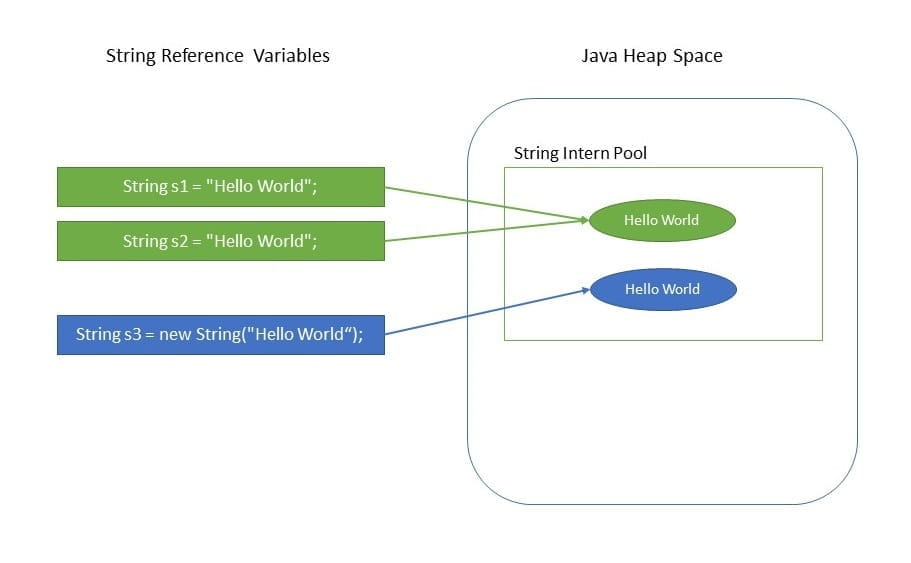

> 本文由 [简悦 SimpRead](http://ksria.com/simpread/) 转码， 原文地址 [www.baeldung.com](https://www.baeldung.com/java-string-immutable#what-is-an-immutable-object)

1.简介
-----------------------------------------------------------------------

在Java中，字符串是不可变的。在访谈中一个非常普遍的明显问题是“为什么在Java中将字符串设计为不可变的？”

Java的创建者James Gosling[在一次采访中曾被问及](https://www.artima.com/intv/gosling313.html) 何时应该使用不可变对象，他回答：

> 我会尽可能使用不可变的。

他进一步支持其论点，指出了不变性提供的功能，例如缓存，安全性，无需复制即可轻松重用等。

在本教程中，我们将进一步探讨Java语言设计人员为何决定保持_String_ 不可变。

2.什么是不可变对象？
-----------------------------------------------------------------------------------------

不变对象是**在完全创建后其内部状态保持不变的对象**。这意味着一旦将对象分配给变量，我们将无法通过任何方式更新引用或更改内部状态。

我们有另一篇文章详细讨论了不可变对象。有关更多信息，请阅读[Java中不可变对象](https://www.baeldung.com/java-immutable-object) 文章。

3.为什么字符串在Java中是不可变的？
------------------------------------------------------------------------------------------------------------

保持此类不变的主要好处是缓存，安全性，同步和性能。

让我们讨论一下这些事情是如何工作的。

### 3.1。介绍字符串池

该字符串是最广泛使用的数据结构。==缓存String并重新使用它们可以节省大量堆空间==，因为不同的String变量引用_String_池中的同一对象。字符串实习生池正是用于此目的。

Java字符串池是  **JVM在其中存储字符串的特殊内存区域** 。由于字符串在Java中是不可变的，因此JVM通过在池中仅存储每个文字字符串的一个副本来优化为其分配的内存量。此过程称为实习（interning）：

```java
String s1 = “ Hello World” ;
String s2 = “ Hello World” ;
         
assertThat（s1 == s2）.isTrue（）;
```

由于前面的示例中存在 *String pool*，因此两个不同的变量指向池中的同一_String_对象，从而节省了关键的内存资源。



我们有专门针对Java_字符串池的文章。有关更多信息，请[转至该文章](https://www.baeldung.com/java-string-pool)。

### 3.2。安全

字符串被广泛使用在Java应用程序中，存储的敏感信息，像用户名，密码，网络连接的 URL 等，它也广泛使用在 JVM 的类加载器中。

因此，一般而言，保护_String_类对于整个应用程序的安全性至关重要。例如，考虑以下简单代码段：

```java
void criticalMethod(String userName) {
    // perform security checks
    if (!isAlphaNumeric(userName)) {
        throw new SecurityException(); 
    }
	
    // do some secondary tasks
    initializeDatabase();
	
    // critical task
    connection.executeUpdate("UPDATE Customers SET Status = 'Active' " +
      " WHERE UserName = '" + userName + "'");
}
```

在上面的代码片段中，假设我们从一个不可信的来源接收到一个_String_对象。我们最初会进行所有必要的安全检查，以检查_String_是否仅是字母数字，然后再进行一些其他操作。

请记住，我们不可靠的源调用方方法仍然引用了此_userName_对象。

**如果字符串是可变的，那么在执行更新时，即使执行安全检查后，我们也无法确定收到的字符串是否安全。**不可信的调用方方法仍然具有引用，并且可以在完整性检查之间更改_String_。因此，在这种情况下，我们的查询易于进行SQL注入。因此，可变的字符串可能会导致安全性随时间下降。

也可能发生字符串 _userName_ 对另一个线程可见的情况，该线程然后可以在完整性检查后更改其值。

通常，在这种情况下，不变性可以帮助我们解决问题，因为在值不变的情况下使用敏感代码更容易操作，因为可能影响结果的操作更少。

### 3.3。同步化

不可变使_String_线程安全，因为从多个线程访问它们时不会更改它们。

因此，**不可变对象通常可以在同时运行的多个线程之间共享。它们也是线程安全的，**因为如果线程更改了值，则将在字符串池中创建一个新的字符串，而不是对其进行修改。因此，字符串对于多线程是安全的。

### 3.4。哈希码缓存

由于_String_对象被大量用作数据结构，因此它们也广泛用于_HashMap_，_HashTable_，_HashSet_等哈希实现中。在对这些哈希实现进行操作时，_hashCode（）方法被频繁调用以进行存储。

不变性保证_Strings_的值不会改变。因此**，在_String_类中重写_hashCode（）方法以方便缓存，从而在第一次_hashCode（）调用期间计算并缓存了哈希，此后返回了相同的值。**

**反过来，这可以改善在对_String_对象进行操作时使用哈希实现的集合的性能。**

在另一方面，可变字符串将产生在插入和取回的两个不同时间散列码如果内容的字符串被操作之后修改，可能会丢失在值对象地图。

### 3.5。性能

正如我们之前看到的，因为字符串是不可变的，所以存在字符串池。反过来，通过使用字符串操作时，它可以节省堆内存并更快地访问哈希实现，从而提高性能。

由于_String_是使用最广泛的数据结构，因此提高_String_的性能通常对提高整个应用程序的性能有相当大的影响。

**4。结论**[](https://www.baeldung.com/java-string-immutable#conclusion)
---------------------------------------------------------------------

通过本文，我们可以得出结论：**字符串精确地是不可变的，因此可以将它们的引用视为普通变量，并且可以在方法之间和线程之间传递它们，而不必担心它指向的实际_String_对象是否会改变。**

我们还了解了促使_Java_语言设计人员将此类变为不可变的其他原因是什么。
