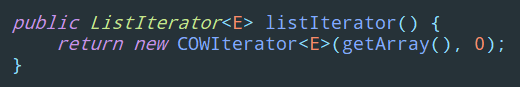

> ArrayList 有什么缺点？

1.  非线程安全
2.  迭代时无法修改

> 你用过线程安全的集合吗？

有，说在哪使用。

没有，不过我了解过。

> 那你说说它们的实现。

**Vector**

Vector 本身比较低效，因为它的实现基本就是将 add、get、set 等各种方法加上 synchronized 锁。这就导致了所有并发操作都要竞争同一把锁，一个线程在进行同步操作时，其他线程只能等待，大大降低了并发操作的效率。

**Collections#SynchronizedList**

同步包装器 SynchronizedList 虽然没使用方法级别的 synchronized 锁，但是使用了同步代码块的形式，本质上还是没有改进。

**CopyOnWriteArrayList**

CopyOnWriteArrayList 是一个写时复制的容器，当我们往一个容器添加元素的时候，不直接往当前容器添加，而是先将当前容器进行 Copy，复制出一个新的容器，然后往新的容器里添加元素，添加完元素之后，再将原容器的引用指向新的容器。这样做的好处是我们可以对 CopyOnWriteArrayList 进行并发的读，而不需要加锁，因为当前容器不会添加任何元素。所以 CopyOnWriteArrayList 是一种读写分离的容器，适用于读多写少的场景，支持高并发读取。

> CopyOnWriteArrayList 是如何保证写时线程安全的？

使用了 ReentrantLock 独占锁，保证同时只有一个线程对集合进行修改操作。

> 如何理解 CopyOnWrite 思想？

写时复制。就是在写的时候，拷贝一份原对象，只操作拷贝的对象，操作完后再覆盖原对象，保证 volatile 语义。

> CopyOnWriteArrayList 的缺点是什么？

1.  占用内存问题。因为 CopyOnWrite 的写时复制机制，所以在进行写操作的时候，内存里会同时驻扎两个对象的内存，旧的对象和新写入的对象，这样如果数据很大可能造成频繁的 GC。
2.  数据一致性问题。因为 CopyOnWrite 容器支持读写分离，所以只能保证数据的最终一致性，不能保证实时一致性。

> CopyOnWriteArrayList 在使用迭代器时是否有什么注意事项？

我们知道，CopyOnWriteArrayList 是底层使用一种安全失败机制。也就是说，可以在迭代时进行增删改操作。

不过，在迭代器使用时有一个注意事项：**迭代器获取的数据取决于迭代器创建的时候，而不是迭代器迭代的时候。**

请看下面示例：

```
public static void main(String[] args) {
    CopyOnWriteArrayList<Integer> list = new CopyOnWriteArrayList<>(new Integer[]{1, 2, 3});

    ListIterator<Integer> iterator1 = list.listIterator();
    list.add(4);
    ListIterator<Integer> iterator2 = list.listIterator();

    iterator1.forEachRemaining(System.out::print);  // 123
    System.out.println();
    iterator2.forEachRemaining(System.out::print);  // 1234
}
```

从上可以看出，iterator1 在添加数据 4 之前就以前创建，那么最终它遍历获取的数据是 123，而 iterator2 在添加完数据 4 之后才创建，那么最终它遍历获取的数据是 1234。

下面我说下原因。




不管是调用 iterator 方法获取迭代器，还是调用 listIterator 方法获取迭代器，内部都会返回一个 COWIterator 对象。


进入 COWIterator 构造方法查看，发现在构造方法中会把 array 数组赋值给 snapshot 变量，如果其他线程没有对 CopyOnWriteArrayList 进行增删改的操作，那么 snapshot 就是本身的 array，但是如果其他线程对 CopyOnWriteArrayList 进行了增删改的操作，那么旧的数组会被新的数组给替换掉，但是 snapshot 还是原来旧的数组的引用。也就是说，当我们使用迭代器遍历获取数据时，不能保证拿到的数据是最新的。
