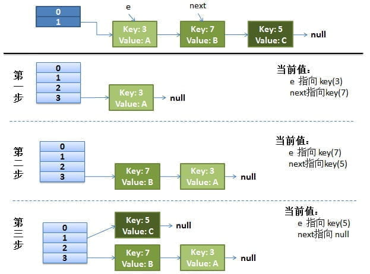
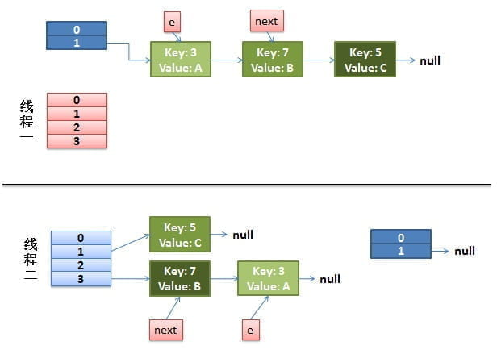
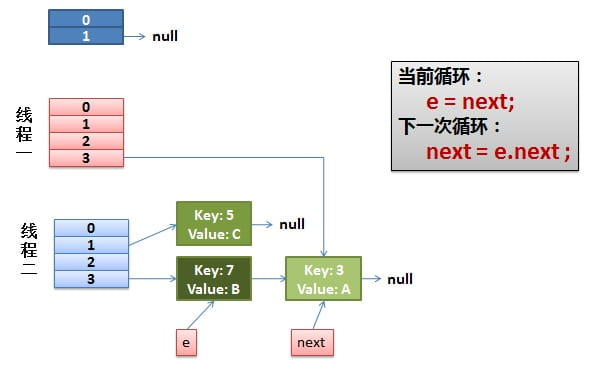
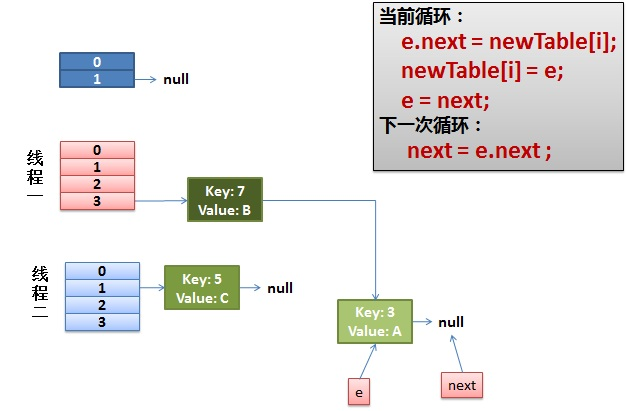
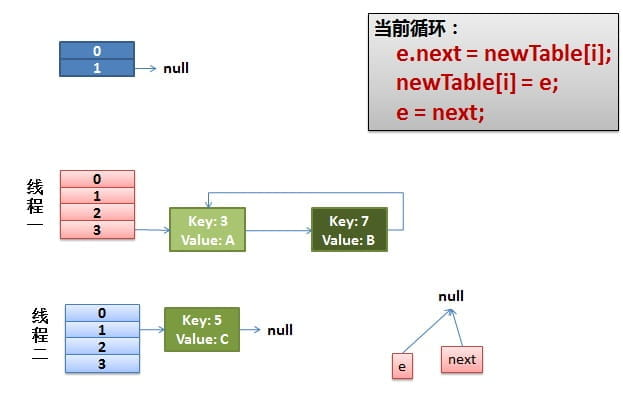

[toc]

HashMap 是线程不安全的是众所周知的事情，但是在并发的场景下 HashMap 将出现什么问题、是什么原因造成的就不是大多数人说的清楚的了。

在 JDK 7 之前呢，HashMap 在并发场景下容易出现两种问题：

1. HashMap 在多线程 put 后可能导致 get 无限循环 。
2. 迭代的时候修改内容，会触发 fast-fail

虽然在 JDK8 中对问题1有了修正，但是 HashMap 还是线程不安全的，在并发场景下还是会出现丢失数据的问题


首先我们看看 JDK 1.7 为啥会有如上问题：

# JDK 1.7 链表有环

put 一个 [kye value] 到 HashMap 中

```java
public V put(K key, V value)
{
    ......
    //算Hash值
    int hash = hash(key.hashCode());
    int i = indexFor(hash, table.length);
    //如果该key已被插入，则替换掉旧的value （链接操作）
    for (Entry<K,V> e = table[i]; e != null; e = e.next) {
        Object k;
        if (e.hash == hash && ((k = e.key) == key || key.equals(k))) {
            V oldValue = e.value;
            e.value = value;
            e.recordAccess(this);
            return oldValue;
        }
    }
    modCount++;
    //该key不存在，需要增加一个结点
    addEntry(hash, key, value, i);
    return null;
}
```

检查容量是否超标

```java
void addEntry(int hash, K key, V value, int bucketIndex)
{
    Entry<K,V> e = table[bucketIndex];
    table[bucketIndex] = new Entry<K,V>(hash, key, value, e);
    //查看当前的size是否超过了我们设定的阈值threshold，如果超过，需要resize
    if (size++ >= threshold)
        resize(2 * table.length);
} 
```

创建一个更大的 hash 表（原来容量的2倍）然后将老数据从老的 hash 表中迁移到新的 hash 表中。

```java
void resize(int newCapacity)
{
    Entry[] oldTable = table;
    int oldCapacity = oldTable.length;
    ......
    //创建一个新的Hash Table
    Entry[] newTable = new Entry[newCapacity];
    //将Old Hash Table上的数据迁移到New Hash Table上
    transfer(newTable);
    table = newTable;
    threshold = (int)(newCapacity * loadFactor);
}
```

迁移的源代码，注意 do while 代码块内：

```java
void transfer(Entry[] newTable)
{
    Entry[] src = table;
    int newCapacity = newTable.length;
    //下面这段代码的意思是：
    //  从OldTable里摘一个元素出来，然后放到NewTable中
    for (int j = 0; j < src.length; j++) {
        Entry<K,V> e = src[j];
        if (e != null) {
            src[j] = null;
            do {
                Entry<K,V> next = e.next;
                int i = indexFor(e.hash, newCapacity);
                e.next = newTable[i];
                newTable[i] = e;
                e = next;
            } while (e != null);
        }
    }
} 
```

## 正常的ReHash的过程

- 我假设了我们的hash算法就是简单的用key mod 一下表的大小（也就是数组的长度）。

- 最上面的是old hash 表，其中的Hash表的size=2, 所以key = 3, 7, 5，在mod 2以后都冲突在table[1]这里了。

- 此时有元素要落入 table[0] 中，则大小超过阈值，接下来的三个步骤是Hash表 resize成4，然后所有的<key,value> 重新rehash的过程



## 并发下的Rehash

1）假设我们有两个线程同时执行 put 。我用红色和浅蓝色标注了一下。

我们再回头看一下我们的 transfer代码中的这个细节：

```java
do {
    Entry<K,V> next = e.next; // <--假设线程一执行到这里就被调度挂起了
    int i = indexFor(e.hash, newCapacity);
    e.next = newTable[i];
    newTable[i] = e;
    e = next;
} while (e != null);
```

而我们的线程二执行完成了。于是我们有下面的这个样子。



在线程一挂起前 e 指向了 key(3) next 指向了 key(7)。而在线程二 refresh 后 ，e 和 next 指向了重组之后的链表，此时可以看到链表的顺序被反转了。

2）线程一被唤醒继续执行未完成的工作。

* **先是执行 newTalbe[i] = e;**
* **然后是e = next，导致了e指向了key(7)，**
* **而下一次循环的next = e.next导致了next指向了key(3)**



**3）一切安好。**

线程一接着工作。**把key(7)摘下来，放到newTable[i]的第一个，然后把e和next往下移**。



**4）环形链接出现。**

**e.next = newTable[i] 导致 key(3).next 指向了 key(7)**

**注意：此时的key(7).next 已经指向了key(3)， 环形链表就这样出现了。**



**于是，当我们的线程一调用到，HashTable.get(11)时，悲剧就出现了——Infinite Loop。**

### 其他

有人把这个问题报给了Sun，不过Sun不认为这个是一个问题。因为HashMap本来就不支持并发。要并发就用ConcurrentHashmap


# JDK8 对链表有环问题的修复

JDK 7 中采用了头插法来转移数据，这样的好处是不用遍历链表，但是改变了链表的顺序。此方法在单线程下并不影响结果和性能。而在并发下会造成链表有环。

 JDK 8 将转移函数改为了双指针尾插法，使用头指针记录链表起始点，利用尾指针作为游标进行插入，在保证了顺序的同时也不用遍历链表。

**JDK 8 的 转移逻辑：**

```java
    Node<K,V> loHead = null, loTail = null;
    Node<K,V> hiHead = null, hiTail = null;
    Node<K,V> next;
    do {
        next = e.next;
        // 位置不用改变的元素
        if ((e.hash & oldCap) == 0) {
            if (loTail == null)
                loHead = e;
            else
                // 作为游标，记录链表尾部，插入的时候不用遍历链表。
                loTail.next = e;
            loTail = e;
        }
        else {
            // 需要转移位置的元素
            if (hiTail == null)
                hiHead = e;
            else
                hiTail.next = e;
            hiTail = e;
        }
    } while ((e = next) != null);
	// 不动的
    if (loTail != null) {
        loTail.next = null;
        newTab[j] = loHead;
    }
	// 需要转移的
    if (hiTail != null) {
        hiTail.next = null;
        // 新位置 = 原始位置 + 老 hash 表容量
        newTab[j + oldCap] = hiHead;
    }
```

扩容后的 hash 表容量将会是原来的两倍，而且 hash 表的容量一定是 $2^n$ ，由此可以推导出如下关系：

1. 元素 e 的 hash code 和 老 hash 表容量做 & 操作结果等于 0 则保留原来位置不动，放置于 loHead （low Head）为首的链表中
2. 如果结果 == 1 则表示要移动到 【原有位置 + 老链表容量】的新位置上，放置于 hiHead (high head) 为首的链表中。


