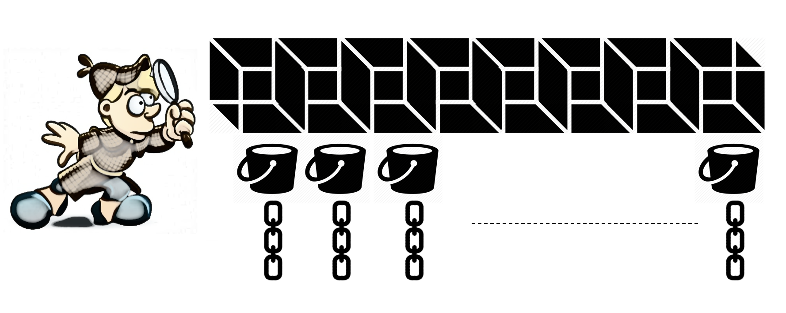
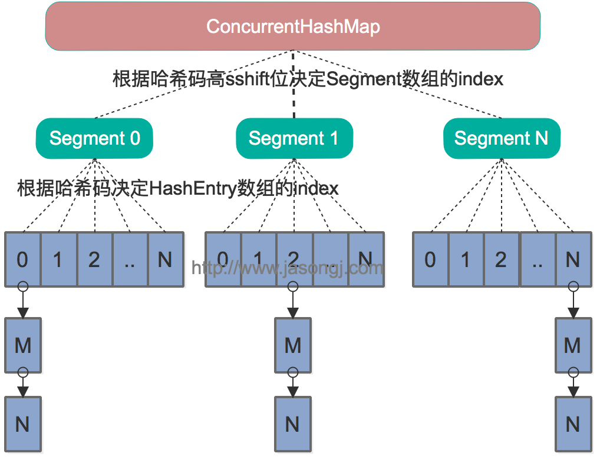
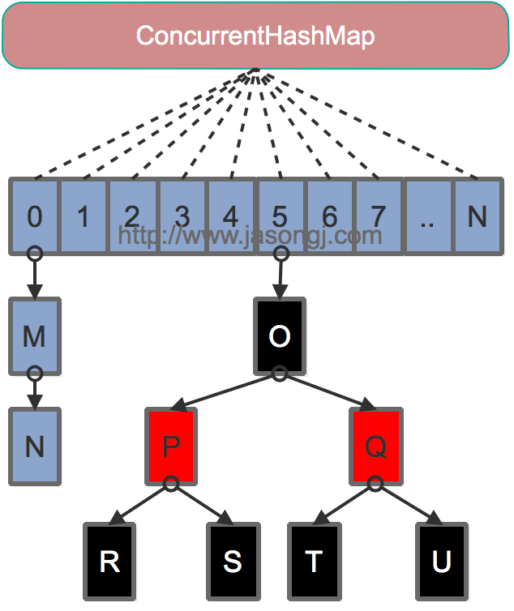

[toc]




中所值周，HashMap 是线程不安全的，而线程不安全主要体现在 resize 造成的死循环（链表有环）和 遍历时的 fast-fail 的问题。

- **JDK1.8：synchronized+CAS+HashEntry+红黑树；**
- **JDK1.7：ReentrantLock+Segment+HashEntry。**

# JDK7 的实现

## 数据结构

JDK7 中的 ConcurrentHashmap 不再和 HashMap 一样，使用一个大数组作为主要容器，而是使用多个称之为 segmetn 的小数组。每个 segment 都有和 HashMap 差不多的结构



## 寻址方式

在读写某个 Key 时，先取该 Key 的哈希值。并将哈希值的高 N 位对 Segment 个数取模从而得到该 Key 应该属于哪个 Segment，接着如同操作 HashMap 一样操作这个 Segment。为了保证不同的值均匀分布到不同的 Segment，需要通过如下方法计算哈希值。

```java
private int hash(Object k) {
  int h = hashSeed;
  if ((0 != h) && (k instanceof String)) {
    return sun.misc.Hashing.stringHash32((String) k);
  }
  h ^= k.hashCode();
  h += (h <<  15) ^ 0xffffcd7d;
  h ^= (h >>> 10);
  h += (h <<   3);
  h ^= (h >>>  6);
  h += (h <<   2) + (h << 14);
  return h ^ (h >>> 16);
}
```

同样为了提高取模运算效率，通过如下计算，ssize即为大于concurrencyLevel的最小的2的N次方，同时segmentMask为2^N-1。这一点跟上文中计算数组长度的方法一致。对于某一个Key的哈希值，只需要向右移segmentShift位以取高sshift位，再与segmentMask取与操作即可得到它在Segment数组上的索引。

```java
int sshift = 0;
int ssize = 1;
while (ssize < concurrencyLevel) {
  ++sshift;
  ssize <<= 1;
}
this.segmentShift = 32 - sshift;
this.segmentMask = ssize - 1;
Segment<K,V>[] ss = (Segment<K,V>[])new Segment[ssize];
```


## 同步方式

Segment继承自ReentrantLock，所以我们可以很方便的对每一个Segment上锁。

对于读操作，获取Key所在的Segment时，需要保证可见性(请参考[如何保证多线程条件下的可见性](http://www.jasongj.com/java/thread_safe/#Java如何保证可见性))。具体实现上可以使用volatile关键字，也可使用锁。但使用锁开销太大，而使用volatile时每次写操作都会让所有CPU内缓存无效，也有一定开销。ConcurrentHashMap使用如下方法保证可见性，取得最新的Segment。

```java
Segment<K,V> s = (Segment<K,V>)UNSAFE.getObjectVolatile(segments, u)
```


获取Segment中的HashEntry时也使用了类似方法

```java
HashEntry<K,V> e = (HashEntry<K,V>) UNSAFE.getObjectVolatile
  (tab, ((long)(((tab.length - 1) & h)) << TSHIFT) + TBASE)
```


对于写操作，并不要求同时获取所有Segment的锁，因为那样相当于锁住了整个Map。它会先获取该Key-Value对所在的Segment的锁，获取成功后就可以像操作一个普通的HashMap一样操作该Segment，并保证该Segment的安全性。
同时由于其它Segment的锁并未被获取，因此理论上可支持concurrencyLevel（等于Segment的个数）个线程安全的并发读写。

获取锁时，并不直接使用lock来获取，因为该方法获取锁失败时会挂起（参考[可重入锁](http://www.jasongj.com/java/multi_thread/#重入锁)）。事实上，它使用了自旋锁，如果tryLock获取锁失败，说明锁被其它线程占用，此时通过循环再次以tryLock的方式申请锁。如果在循环过程中该Key所对应的链表头被修改，则重置retry次数。如果retry次数超过一定值，则使用lock方法申请锁。

这里使用自旋锁是因为自旋锁的效率比较高，但是它消耗CPU资源比较多，因此在自旋次数超过阈值时切换为互斥锁。

## size操作

put、remove 和 ge t操作只需要关心一个 Segment，而 size 操作需要遍历所有的 Segment 才能算出整个 Map 的大小。一个简单的方案是，先锁住所有Sgment，计算完后再解锁。但这样做，在做size操作时，不仅无法对Map进行写操作，同时也无法进行读操作，不利于对Map的并行操作。

为更好支持并发操作，ConcurrentHashMap 会在不上锁的前提逐个 Segment 计算3次size，如果某相邻两次计算获取的所有Segment 的更新次数（每个 Segment 都与 HashMap 一样通过 modCount 跟踪自己的修改次数，Segmen t每修改一次其modCount 加一）相等，说明这两次计算过程中无更新操作，则这两次计算出的总 size 相等，可直接作为最终结果返回。如果这三次计算过程中 Map 有更新，则对所有 Segment 加锁重新计算 Size。该计算方法代码如下

```java
public int size() {
  final Segment<K,V>[] segments = this.segments;
  int size;
  boolean overflow; // true if size overflows 32 bits
  long sum;         // sum of modCounts
  long last = 0L;   // previous sum
  int retries = -1; // first iteration isn't retry
  try {
    for (;;) {
      if (retries++ == RETRIES_BEFORE_LOCK) {
        for (int j = 0; j < segments.length; ++j)
          ensureSegment(j).lock(); // force creation
      }
      sum = 0L;
      size = 0;
      overflow = false;
      for (int j = 0; j < segments.length; ++j) {
        Segment<K,V> seg = segmentAt(segments, j);
        if (seg != null) {
          sum += seg.modCount;
          int c = seg.count;
          if (c < 0 || (size += c) < 0)
            overflow = true;
        }
      }
      if (sum == last)
        break;
      last = sum;
    }
  } finally {
    if (retries > RETRIES_BEFORE_LOCK) {
      for (int j = 0; j < segments.length; ++j)
        segmentAt(segments, j).unlock();
    }
  }
  return overflow ? Integer.MAX_VALUE : size;
}
```


# JDK8 的实现



## 寻址方式

Java 8的ConcurrentHashMap同样是通过Key的哈希值与数组长度取模确定该Key在数组中的索引。同样为了避免不太好的Key的hashCode设计，它通过如下方法计算得到Key的最终哈希值。不同的是，Java 8的ConcurrentHashMap作者认为引入红黑树后，即使哈希冲突比较严重，寻址效率也足够高，所以作者并未在哈希值的计算上做过多设计，只是将Key的hashCode值与其高16位作异或并保证最高位为0（从而保证最终结果为正整数）。

```java
static final int spread(int h) {
  return (h ^ (h >>> 16)) & HASH_BITS;
}
```


## 同步方式

对于put操作，如果Key对应的数组元素为null，则通过[CAS操作](http://www.jasongj.com/java/thread_safe/#CAS（compare-and-swap）)将其设置为当前值。如果Key对应的数组元素（也即链表表头或者树的根元素）不为null，则对该元素使用synchronized关键字申请锁，然后进行操作。如果该put操作使得当前链表长度超过一定阈值，则将该链表转换为树，从而提高寻址效率。

对于读操作，由于数组被volatile关键字修饰，因此不用担心数组的可见性问题。同时每个元素是一个Node实例（Java 7中每个元素是一个HashEntry），它的Key值和hash值都由final修饰，不可变更，无须关心它们被修改后的可见性问题。而其Value及对下一个元素的引用由volatile修饰，可见性也有保障。

```java
static class Node<K,V> implements Map.Entry<K,V> {
  final int hash;
  final K key;
  volatile V val;
  volatile Node<K,V> next;
}
```


对于Key对应的数组元素的可见性，由Unsafe的getObjectVolatile方法保证。

```java
static final <K,V> Node<K,V> tabAt(Node<K,V>[] tab, int i) {
  return (Node<K,V>)U.getObjectVolatile(tab, ((long)i << ASHIFT) + ABASE);
}
```


## size 操作

put方法和remove方法都会通过addCount方法维护Map的size。size方法通过sumCount获取由addCount方法维护的Map的size。

## put 源码

```java
/** Implementation for put and putIfAbsent */
final V putVal(K key, V value, boolean onlyIfAbsent) {
    // 与 HashMap 不同 K V 均不能为 null
    if (key == null || value == null) throw new NullPointerException();
    // 计算 hash code
    int hash = spread(key.hashCode());
    int binCount = 0;
  	// CAS 自旋
    for (Node<K,V>[] tab = table;;) {
      	// f 为链表头或者红黑树父节点
        Node<K,V> f; int n, i, fh;
        // 数组还没有初始化
        if (tab == null || (n = tab.length) == 0)
            tab = initTable();// 内部使用 CAS 
        // 如果索引位置不存在数据则使用 CAS 插入 【重点1】
        else if ((f = tabAt(tab, i = (n - 1) & hash)) == null) {
            if (casTabAt(tab, i, null,new Node<K,V>(hash, key, value, null)))
                // 插入成功则推出循环
                break;                   // no lock when adding to empty bin
        }
        // 如果链表在扩容，则帮助进行
        else if ((fh = f.hash) == MOVED)
            tab = helpTransfer(tab, f);
        else {
            // 走到这里说明 hash 冲突了
            V oldVal = null;
            // 锁住链表的头或者红黑树的头节点，此时已经将锁最小化 【重点2】
            synchronized (f) {
                if (tabAt(tab, i) == f) {
                    // 如果 fh >= 0 说明是链表节点
                    if (fh >= 0) {
                        binCount = 1;
                        // 遍历所有链表节点
                        for (Node<K,V> e = f;; ++binCount) {
                            K ek;
                            if (e.hash == hash && ((ek = e.key) == key
                                                   ||(ek != null && key.equals(ek)))) {
                               // 发现相同的 key 更新 value
                                oldVal = e.val;
                                if (!onlyIfAbsent)
                                    e.val = value;
                                break;
                            }
                          	// 不存在 key 创建新节点插入到链表尾部。
                            Node<K,V> pred = e;
                            if ((e = e.next) == null) {
                                pred.next = new Node<K,V>(hash, key, value, null);
                                break;
                            }
                        }
                    }
                    else if (f instanceof TreeBin) {
                       // 处理红黑树节点
                        Node<K,V> p;
                        binCount = 2;
                        if ((p = ((TreeBin<K,V>)f).putTreeVal(hash, key,
                                                       value)) != null) {
                            oldVal = p.val;
                            if (!onlyIfAbsent)
                                p.val = value;
                        }
                    }
                    else if (f instanceof ReservationNode)
                        throw new IllegalStateException("Recursive update");
                }
            }
            if (binCount != 0) {
                // 如果链表长度 >= TREEIFY_THRESHOLD（阈值为8）则转化为红黑树
                if (binCount >= TREEIFY_THRESHOLD)
                    treeifyBin(tab, i);
                if (oldVal != null)
                    return oldVal;
                break;
            }
        }
    }
    // 当前 ConcurrentHashMap size + 1 （CAS 方式）
    addCount(1L, binCount);
    return null;
}
```

# compareAndSwapXX 参数解读

在上面的列子中使用到了 UNSAFE 的 compareAndSwapXX 方法

```java
/**
 *@param object 需要更改的对象
 *@param offset 对象在内存中偏移量为offset处的值,就是要修改的数据的值在内存中的偏移量，结合object + offect找到要修改的值
 *@param expect 对内存中期望的值，如果此值和 object + offect 指向的值一致则更新 object + offect 为 update 值
 *@param expect 更新的目标值
 */
compareAndSwapInt(Object object, long offset, int expect, int update);
compareAndSwapObject(Object object, long offset, int expect, int update);
```


## initTable

在开始之前我们来看一下 SIZECTL 指的是什么：

```java
  // Unsafe mechanics
    private static final sun.misc.Unsafe U = sun.misc.Unsafe.getUnsafe();
    private static final long SIZECTL;

    static {
        try {
            // 指的是 sizeCtl 字段在 ConcurrentHashMap 中的偏移量，此值将会在 compareAndSwapInt 函数中使用到
            SIZECTL = U.objectFieldOffset
                (ConcurrentHashMap.class.getDeclaredField("sizeCtl"));
         ………………
        } catch (ReflectiveOperationException e) {
            throw new Error(e);
        }
    }
```

```java
    /**
     * Initializes table, using the size recorded in sizeCtl.
     */
    private final Node<K,V>[] initTable() {
        Node<K,V>[] tab; int sc;
        while ((tab = table) == null || tab.length == 0) {
            // 说明已经有线程在创建了
            if ((sc = sizeCtl) < 0)
              	// 自旋等待
                Thread.yield(); // lost initialization race; just spin
            // 使用 CAS 判断 sizeCtl 有没有改变,有改变则 sc = -1 ，开始创建
            else if (U.compareAndSwapInt(this, SIZECTL, sc, -1)) {
                try {
                    if ((tab = table) == null || tab.length == 0) {
                        // 检测用户有没有指定初始化大小，没有则使用默认容量
                        int n = (sc > 0) ? sc : DEFAULT_CAPACITY;
                      	// 初始化数组大小
                        @SuppressWarnings("unchecked")
                        Node<K,V>[] nt = (Node<K,V>[])new Node<?,?>[n];
                        table = tab = nt;
                        // sizeCtl 计算后作为扩容的阀值
                        sc = n - (n >>> 2);
                    }
                } finally {
                    sizeCtl = sc;
                }
                break;
            }
        }
        return tab;
    }
```

## casTabAt

```java
    static final <K,V> boolean casTabAt(Node<K,V>[] tab, int i, Node<K,V> c, Node<K,V> v) {
      // 直接使用 UNSAFE 工具类操作
        return U.compareAndSwapObject(tab, ((long)i << ASHIFT) + ABASE, c, v);
    }

```

compareAndSwapObject 具体实现为 native 。想要了解更多可以看看这个[无锁队列的实现](https://coolshell.cn/articles/8239.html)

```java
  public final native boolean compareAndSwapObject(Object var1, long var2, Object var4, Object var5);
```


### 总结

1. 和 HashMap 不同，ConcurrentHashMap K V 均不能为 null

2. ConcurrentHashMap 内部使用了 CAS + synchronized 方式实现了线程安全的 put 操作，目的就是将锁的范围缩小化：

   1. 当插入位置为 null 的时候则使用 CAS 插入新 node 到头节点。
   2.  Hash 冲突时则，则开始遍历链表或红黑树，此时使用 synchronized 锁住链表或红黑树==头节点==。

   ==这样的好处就是锁的粒度更小了，并发性能更好==

3. 内部使用了循环不断尝试 CAS 


## transfer & helperTransfer

```java
 private final void transfer(Node<K,V>[] tab, Node<K,V>[] nextTab) {
        int n = tab.length, stride;
        // length / 8 再除以 CPU 个数，如果结果 < 16	则取 16;
        // 此操作的目的是为了将任务均匀地分配给每个 cpu （线程）去执行，提高资源利用率
        if ((stride = (NCPU > 1) ? (n >>> 3) / NCPU : n) < MIN_TRANSFER_STRIDE)
            stride = MIN_TRANSFER_STRIDE; // subdivide range
   			// table 尚未初始化
        if (nextTab == null) {            // initiating
            try {
              	// 创建容量为原来 2 倍的数组
                @SuppressWarnings("unchecked")
                Node<K,V>[] nt = (Node<K,V>[])new Node<?,?>[n << 1];
                nextTab = nt;
            } catch (Throwable ex) { // try to cope with OOME ！！竟然也使用了 try catch 来防止 OOM！！！
              	// 扩容失败，设置容量阈值为 int 最大值
                sizeCtl = Integer.MAX_VALUE;
                return;
            }
            nextTable = nextTab;
            transferIndex = n;
        }
        int nextn = nextTab.length;
        ForwardingNode<K,V> fwd = new ForwardingNode<K,V>(nextTab);
        boolean advance = true;
        boolean finishing = false; // to ensure sweep before committing nextTab
        for (int i = 0, bound = 0;;) {
            Node<K,V> f; int fh;
            while (advance) {
                int nextIndex, nextBound;
                if (--i >= bound || finishing)
                    advance = false;
                else if ((nextIndex = transferIndex) <= 0) {
                    i = -1;
                    advance = false;
                }
                else if (U.compareAndSwapInt
                         (this, TRANSFERINDEX, nextIndex,
                          nextBound = (nextIndex > stride ?
                                       nextIndex - stride : 0))) {
                    bound = nextBound;
                    i = nextIndex - 1;
                    advance = false;
                }
            }
            if (i < 0 || i >= n || i + n >= nextn) {
                int sc;
                if (finishing) {
                    nextTable = null;
                    table = nextTab;
                    sizeCtl = (n << 1) - (n >>> 1);
                    return;
                }
                if (U.compareAndSwapInt(this, SIZECTL, sc = sizeCtl, sc - 1)) {
                    if ((sc - 2) != resizeStamp(n) << RESIZE_STAMP_SHIFT)
                        return;
                    finishing = advance = true;
                    i = n; // recheck before commit
                }
            }
            else if ((f = tabAt(tab, i)) == null)
                advance = casTabAt(tab, i, null, fwd);
            else if ((fh = f.hash) == MOVED)
                advance = true; // already processed
            else {
                synchronized (f) {
                    if (tabAt(tab, i) == f) {
                        Node<K,V> ln, hn;
                        if (fh >= 0) {
                            int runBit = fh & n;
                            Node<K,V> lastRun = f;
                            for (Node<K,V> p = f.next; p != null; p = p.next) {
                                int b = p.hash & n;
                                if (b != runBit) {
                                    runBit = b;
                                    lastRun = p;
                                }
                            }
                            if (runBit == 0) {
                                ln = lastRun;
                                hn = null;
                            }
                            else {
                                hn = lastRun;
                                ln = null;
                            }
                            for (Node<K,V> p = f; p != lastRun; p = p.next) {
                                int ph = p.hash; K pk = p.key; V pv = p.val;
                                if ((ph & n) == 0)
                                    ln = new Node<K,V>(ph, pk, pv, ln);
                                else
                                    hn = new Node<K,V>(ph, pk, pv, hn);
                            }
                            setTabAt(nextTab, i, ln);
                            setTabAt(nextTab, i + n, hn);
                            setTabAt(tab, i, fwd);
                            advance = true;
                        }
                        else if (f instanceof TreeBin) {
                            TreeBin<K,V> t = (TreeBin<K,V>)f;
                            TreeNode<K,V> lo = null, loTail = null;
                            TreeNode<K,V> hi = null, hiTail = null;
                            int lc = 0, hc = 0;
                            for (Node<K,V> e = t.first; e != null; e = e.next) {
                                int h = e.hash;
                                TreeNode<K,V> p = new TreeNode<K,V>
                                    (h, e.key, e.val, null, null);
                                if ((h & n) == 0) {
                                    if ((p.prev = loTail) == null)
                                        lo = p;
                                    else
                                        loTail.next = p;
                                    loTail = p;
                                    ++lc;
                                }
                                else {
                                    if ((p.prev = hiTail) == null)
                                        hi = p;
                                    else
                                        hiTail.next = p;
                                    hiTail = p;
                                    ++hc;
                                }
                            }
                            ln = (lc <= UNTREEIFY_THRESHOLD) ? untreeify(lo) :
                                (hc != 0) ? new TreeBin<K,V>(lo) : t;
                            hn = (hc <= UNTREEIFY_THRESHOLD) ? untreeify(hi) :
                                (lc != 0) ? new TreeBin<K,V>(hi) : t;
                            setTabAt(nextTab, i, ln);
                            setTabAt(nextTab, i + n, hn);
                            setTabAt(tab, i, fwd);
                            advance = true;
                        }
                    }
                }
            }
        }
    }
```


# 为什么不是要Lock接口实现类来锁住链表头转而使用sychronized呢？

# 常见问题

- **ConcurrentHashMap的实现原理**
  - **ConcurrentHashMap1.7和1.8的区别？**
  - **ConcurrentHashMap使用什么技术来保证线程安全**
- **ConcurrentHashMap的put()方法**
  - **ConcurrentHashmap 不支持 key 或者 value 为 null 的原因？**
  - **put()方法如何实现线程安全呢？**
- **ConcurrentHashMap扩容机制**
- **ConcurrentHashMap的get方法是否要加锁，为什么？**
- **其他问题**
  - **为什么使用ConcurrentHashMap**
  - **ConcurrentHashMap迭代器是强一致性还是弱一致性？HashMap呢？**
  - **JDK1.7与JDK1.8中ConcurrentHashMap的区别**

# 参考


[从ConcurrentHashMap的演进看Java多线程核心技术](http://www.jasongj.com/java/concurrenthashmap/)

[[面试：为了进阿里，死磕了ConcurrentHashMap源码和面试题(一)](https://segmentfault.com/a/1190000024432650)](https://segmentfault.com/a/1190000024432650)

