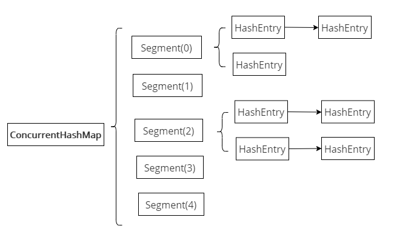
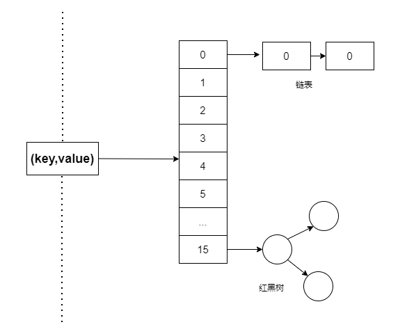

### 前言

在平时中集合使用中，当涉及多线程开发时，如果使用`HashMap`可能会导致死锁问题，使用`HashTable`效率又不高。而`ConcurrentHashMap`在保持同步同时并发效率比较高，`ConcurrentHashmap`是最好的选择，那面试中也会被常常问到，那可能的问题是：

*   **ConcurrentHashMap 的实现原理**
  
    *   **ConcurrentHashMap1.7 和 1.8 的区别？**
    *   **ConcurrentHashMap 使用什么技术来保证线程安全**
*   **ConcurrentHashMap 的 put() 方法**
  
    *   **ConcurrentHashmap 不支持 key 或者 value 为 null 的原因？**
    *   **put() 方法如何实现线程安全呢？**
*   **ConcurrentHashMap 扩容机制**
*   **ConcurrentHashMap 的 get 方法是否要加锁，为什么？**
*   **其他问题**
  
    *   **为什么使用 ConcurrentHashMap**
    *   **ConcurrentHashMap 迭代器是强一致性还是弱一致性？HashMap 呢？**
    *   **JDK1.7 与 JDK1.8 中 ConcurrentHashMap 的区别**

### ConcurrentHashMap 的实现原理

ConcurrentHashMap 的出现主要为了解决 hashmap 在并发环境下不安全，JDK1.8ConcurrentHashMap 的设计与实现非常精巧，大量的利用了 volatile，CAS 等乐观锁技术来减少锁竞争对于性能的影响，**ConcurrentHashMap 保证线程安全的方案是：**

*   **JDK1.8：synchronized+CAS+HashEntry + 红黑树；**
*   **JDK1.7：ReentrantLock+Segment+HashEntry。**

#### JDK7 ConcurrentHashMap

在 JDK1.7 中 ConcurrentHashMap 由 Segment(分段锁) 数组结构和 HashEntry 数组组成，且主要通过 Segment(分段锁) 段技术实现线程安全。

Segment 是一种可重入锁，是一种数组和链表的结构，一个 Segment 中包含一个 HashEntry 数组，每个 HashEntry 又是一个链表结构，因此在 ConcurrentHashMap 查询一个元素的过程需要进行两次 Hash 操作，如下所示：

*   第一次 Hash 定位到 Segment，
*   第二次 Hash 定位到元素所在的链表的头部



正是通过 Segment 分段锁技术，将数据分成一段一段的存储，然后给每一段数据配一把锁，当一个线程占用锁访问其中一个段数据的时候，其他段的数据也能被其他线程访问，能够实现真正的并发访问。

这样结构会使 Hash 的过程要比普通的 HashMap 要长，影响性能，但写操作的时候可以只对元素所在的 Segment 进行加锁即可，不会影响到其他的 Segment，ConcurrentHashMap 提升了并发能力。

#### JDK8 ConcurrentHashMap

在 JDK8ConcurrentHashMap 内部机构：数组 + 链表 + 红黑树，Java 8 在链表长度超过一定阈值 (8) 时将链表（寻址时间复杂度为 O(N)）转换为红黑树（寻址时间复杂度为 O(long(N)))，结构基本上与功能和 JDK8 的 HashMap 一样，只不过 ConcurrentHashMap 保证线程安全性。



但在 JDK1.8 中摒弃了 Segment 分段锁的数据结构，基于 CAS 操作保证数据的获取以及使用 synchronized 关键字对相应数据段加锁来实现线程安全，这进一步提高了并发性。（**CAS 原理详情**[《面试：为了进阿里，又把并发 CAS（Compare and Swap）实现重新精读一遍》)](https://segmentfault.com/a/1190000023839912)  
)）

```
static class Node<K,V> implements Map.Entry<K,V> {
        final int hash;
        final K key;
        volatile V val;  //使用了volatile属性
        volatile Node<K,V> next;  //使用了volatile属性
        ...
    }
```

ConcurrentHashMap 采用 Node 类作为基本的存储单元，每个键值对 (key-value) 都存储在一个 Node 中，使用了 volatile 关键字修饰 value 和 next，保证并发的可见性。其中 Node 子类有：

*   ForwardingNode：扩容节点，只是在扩容阶段使用的节点，主要作为一个标记，在处理并发时起着关键作用，有了 ForwardingNodes，也是 ConcurrentHashMap 有了分段的特性，提高了并发效率
*   TreeBin：TreeNode 的代理节点，用于维护 TreeNodes，ConcurrentHashMap 的红黑树存放的是 TreeBin
*   TreeNode：用于树结构中，红黑树的节点（当链表长度大于 8 时转化为红黑树），此节点不能直接放入桶内，只能是作为红黑树的节点
*   ReservationNode：保留结点

ConcurrentHashMap 中查找元素、替换元素和赋值元素都是基于`sun.misc.Unsafe`中**原子操作**实现**多并发的无锁化**操作。

```
static final <K,V> Node<K,V> tabAt(Node<K,V>[] tab, int i) {
        return (Node<K,V>)U.getObjectAcquire(tab, ((long)i << ASHIFT) + ABASE);
    }

    static final <K,V> boolean casTabAt(Node<K,V>[] tab, int i,
                                        Node<K,V> c, Node<K,V> v) {
        return U.compareAndSetObject(tab, ((long)i << ASHIFT) + ABASE, c, v);
    }

    static final <K,V> void setTabAt(Node<K,V>[] tab, int i, Node<K,V> v) {
        U.putObjectRelease(tab, ((long)i << ASHIFT) + ABASE, v);
    }
```

### ConcurrentHashMap 的 put() 方法

ConcurrentHashMap 的 put 的流程步骤

1.  如果 key 或者 value 为 null，则抛出空指针异常，和 HashMap 不同的是 HashMap 单线程是允许为 Null；
  
    `if (key == null || value == null) throw new NullPointerException();`
    
2.  for 的死循环，为了实现 CAS 的无锁化更新，如果 table 为 null 或者 table 的长度为 0，则初始化 table，调用`initTable()`方法（第一次 put 数据，调用默认参数实现，其中重要的`sizeCtl`参数）。
  
    ```
    //计算索引的第一步，传入键值的hash值
        int hash = spread(key.hashCode());
        int binCount = 0; //保存当前节点的长度
        for (Node<K,V>[] tab = table;;) {
            Node<K,V> f; int n, i, fh; K fk; V fv;
            if (tab == null || (n = tab.length) == 0)
                tab = initTable(); //初始化Hash表
            ...
        }
    ```
    
3.  确定元素在 Hash 表的索引
  
    通过 hash 算法可以将元素分散到哈希桶中。在 ConcurrentHashMap 中通过如下方法确定数组索引：
    
    第一步：
    
    ```
    static final int spread(int h) {
            return (h ^ (h >>> 16)) & HASH_BITS; 
        }
    ```
    
    第二步：`(length-1) & (h ^ (h >>> 16)) & HASH_BITS);`
    
4.  通过`tableAt()`方法找到位置`tab[i]`的`Node`, 当 Node 为 null 时为没有`hash`冲突的话，使用`casTabAt()`方法`CAS`操作将元素插入到`Hash`表中，`ConcurrentHashmap`使用`CAS`无锁化操作，这样在高并发`hash`冲突低的情况下，性能良好。
  
    ```
    else if ((f = tabAt(tab, i = (n - 1) & hash)) == null) {
                    //利用CAS操作将元素插入到Hash表中
                    if (casTabAt(tab, i, null, new Node<K,V>(hash, key, value)))
                        break;  // no lock when adding to empty bin(插入null的节点，无需加锁)
                }
    ```
    
5.  当 f 不为 null 时，说明发生了 hash 冲突，当 f.hash == MOVED==-1 时，说明`ConcurrentHashmap`正在发生`resize`操作, 使用`helpTransfer()`方法帮助正在进行 resize 操作。
  
    ```
    else if ((fh = f.hash) == MOVED) //f.hash == -1 
            //hash为-1 说明是一个forwarding nodes节点，表明正在扩容
            tab = helpTransfer(tab, f);
    ```
    
6.  以上情况都不满足的时，使用`synchronized`同步块上锁当前节点`Node` , 并判断有没有线程对数组进行了修改，如果没有则进行：
  
    *   遍历该链表并统计该链表长度`binCount`，查找是否有和 key 相同的节点，如果有则将查找到节点的 val 值替换为新的 value 值，并返回旧的 value 值，否则根据 key，value，hash 创建新 Node 并将其放在链表的尾部
    *   如果`Node f`是`TreeBin`的类型，则使用红黑树的方式进行插入。然后则退出`synchronized(f)`锁住的代码块
    
    ```
    //当前节点加锁
     synchronized (f) {
     //判断下有没有线程对数组进行了修改
     if (tabAt(tab, i) == f) {
           //如果hash值是大于等于0的说明是链表
            if (fh >= 0) {
                  binCount = 1;
                  for (Node<K,V> e = f;; ++binCount) {
                        K ek;
                       //插入的元素键值的hash值有节点中元素的hash值相同，替换当前元素的值
                          if (e.hash == hash &&
                               ((ek = e.key) == key ||
                                (ek != null && key.equals(ek)))) {
                                oldVal = e.val;
                                if (!onlyIfAbsent)
                                    //替换当前元素的值
                                    e.val = value;
                                break;
                            }
                         Node<K,V> pred = e;
                          //如果循环到链表结尾还没发现，那么进行插入操作
                         if ((e = e.next) == null) {
                                pred.next = new Node<K,V>(hash, key, value);
                                break;
                               }
                    }
              }else if (f instanceof TreeBin) { //节点为树
                            Node<K,V> p;
                            binCount = 2;
                            if ((p = ((TreeBin<K,V>)f).putTreeVal(hash, key,
                                                           value)) != null) {
                                oldVal = p.val;
                                if (!onlyIfAbsent)
                                    //替换旧值
                                    p.val = value;
                            }
                        }
                        else if (f instanceof ReservationNode)
                            throw new IllegalStateException("Recursive update");
                    }
                }
    ```
    
7.  执行完`synchronized(f)`同步代码块之后会先检查`binCount`, 如果大于等于 TREEIFY_THRESHOLD = 8 则进行 treeifyBin 操作尝试将该链表转换为红黑树。
  
    ```
    if (binCount != 0) {
                  //如果节点长度大于8,转化为树
                  if (binCount >= TREEIFY_THRESHOLD)
                       treeifyBin(tab, i);
                  if (oldVal != null)
                       return oldVal; 
                   break;
             }
    ```
    
8.  执行了一个`addCount`方法, 主要用于统计数量以及决定是否需要扩容.
  
    ```
    addCount(1L, binCount);
    ```
    

#### ConcurrentHashmap 不支持 key 或者 value 为 null 的原因？

`ConcurrentHashmap`和`hashMap`不同的是，`concurrentHashMap`的`key`和`value`都不允许为 null，

因为`concurrenthashmap`它们是用于多线程的，并发的 ，如果`map.get(key)`得到了 null，不能判断到底是映射的 value 是 null, 还是因为没有找到对应的 key 而为空，

而用于单线程状态的`hashmap`却可以用`containKey（key）` 去判断到底是否包含了这个 null。

#### put() 方法如何实现线程安全呢？

1.  在第一次 put 数据时，调用`initTable()`方法

```
/**  
 * Hash表的初始化和调整大小的控制标志。为负数，Hash表正在初始化或者扩容;  
 * (-1表示正在初始化,-N表示有N-1个线程在进行扩容)  
 * 否则，当表为null时，保存创建时使用的初始化大小或者默认0;  
 * 初始化以后保存下一个调整大小的尺寸。  
 */  
 private transient volatile int sizeCtl;  
     //第一次put，初始化数组  
     private final Node<K,V>[] initTable() {  
         Node<K,V>[] tab; int sc;  
         while ((tab = table) == null || tab.length == 0) {  
             //如果已经有别的线程在初始化了，这里等待一下  
             if ((sc = sizeCtl) < 0)  
             Thread.yield(); // lost initialization race; just spin  
             //-1 表示正在初始化  
             else if (U.compareAndSwapInt(this, SIZECTL, sc, -1)) {  
             ...  
         } finally {  
            sizeCtl = sc;  
         }  
            break;  
         }  
     }  
     return tab;  
 }
```

使用`sizeCtl`参数作为控制标志的作用，当在从插入元素时，才会初始化 Hash 表。在开始初始化的时候，

*   首先判断`sizeCtl`的值，如果 **sizeCtl < 0**，说明**有线程在初始化**，**当前线程便放弃初始化操作**。否则，将**`SIZECTL`设置为 - 1**，**Hash 表进行初始化**。
*   初始化成功以后，将`sizeCtl`的值设置为当前的容量值

1.  在不存在 hash 冲突的时

```
else if ((f = tabAt(tab, i = (n - 1) & hash)) == null) {  
     //利用CAS操作将元素插入到Hash表中  
     if (casTabAt(tab, i, null, new Node<K,V>(hash, key, value)))  
     break;  // no lock when adding to empty bin(插入null的节点，无需加锁)  
 }
```

`(f = tabAt(tab, i = (n - 1) & hash)) == null`中使用 tabAt 原子操作获取数组，并利用`casTabAt(tab, i, null, new Node<K,V>(hash, key, value))`CAS 操作将元素插入到 Hash 表中

1.  在存在 hash 冲突时，先把当前节点使用关键字`synchronized`加锁，然后再使用`tabAt()`原子操作判断下有没有线程对数组进行了修改，最后再进行其他操作。

**为什么要锁住更新操作的代码块?**

因为发生了哈希冲突，当前线程正在 f 所在的链表上进行更新操作，假如此时另外一个线程也需要到这个链表上进行更新操作，则需要等待当前线程更新完后再执行

```
//当前节点加锁  
synchronized (f) {  
     //这里判断下有没有线程对数组进行了修改  
     if (tabAt(tab, i) == f) {  
     ......//do something  
 }
}
```
