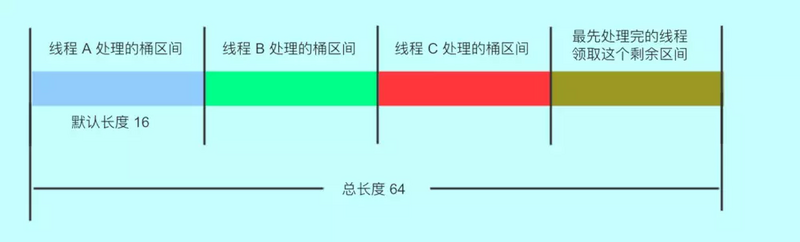

研究了基础原理，以及 ConcurrentHashMap 数据 put 的流程等线程安全的，来回顾一下面试的问题点：

*   **ConcurrentHashMap 的实现原理**
  
    *   **ConcurrentHashMap1.7 和 1.8 的区别？**
    *   **ConcurrentHashMap 使用什么技术来保证线程安全**
*   **ConcurrentHashMap 的 put() 方法**
  
    *   **ConcurrentHashmap 不支持 key 或者 value 为 null 的原因？**
    *   **put() 方法如何实现线程安全呢？**
*   **ConcurrentHashMap 扩容机制**
*   **ConcurrentHashMap 的 get 方法是否要加锁，为什么？**
*   **其他问题**
  
    *   **为什么使用 ConcurrentHashMap**
    *   **ConcurrentHashMap 迭代器是强一致性还是弱一致性？HashMap 呢？**
    *   **JDK1.7 与 JDK1.8 中 ConcurrentHashMap 的区别**

那我们接下继续看看 CurrentHashMap 核心内容，扩容机制。

### ConcurrentHashMap 的扩容机制

1.  扩容变量
  
    ```java
    // 新 tab 的 length  
    int nextn = nextTab.length;  
    // 创建一个 fwd 节点，用于占位。当别的线程发现这个槽位中是 fwd 类型的节点，则跳过这个节点。  
    ForwardingNode<K,V> fwd = new ForwardingNode<K,V>(nextTab);  
    // 首次推进为 true，如果等于 true，说明需要再次推进一个下标（i--）  
    //反之，如果是 false，那么就不能推进下标，需要将当前的下标处理完毕才能继续推进  
    boolean advance = true;  
    // 完成状态，如果是 true，就结束此方法。  
    boolean finishing = false; // to ensure sweep before committing nextTab
    ```
    
2.  因为`ConcurrentHashMap`支持多线程扩容，多个线程处理不同的节点，首先先计算出每个线程（CPU）处理的桶数：将 length / 8 然后除以 CPU 核心数。如果得到的结果小于 16，那么就使用 16。（避免出现转移任务不均匀的现象）
  
    ```java
    int n = tab.length, stride;  
    if ((stride = (NCPU > 1) ? (n >>> 3) / NCPU : n) < MIN_TRANSFER_STRIDE)  
     stride = MIN_TRANSFER_STRIDE;
    ```
    
3.  新的 table 尚未初始化，进行 2 倍扩容
  
    ```java
    if (nextTab == null) {            // initiating  
         try {  
             // 扩容  2 倍  
             Node<K,V>[] nt = (Node<K,V>\[])new Node<?,?>[n << 1];  
             // 更新  
             nextTab = nt;  
         } catch (Throwable ex) {      // try to cope with OOME  
             // 扩容失败， sizeCtl 使用 int 最大值。  
             sizeCtl = Integer.MAX_VALUE;  
             return;// 结束  
         }  
         // 更新成员变量  
         nextTable = nextTab;  
         // 更新转移下标，就是 老的 tab 的 length  
         transferIndex = n;  
     }
    ```
    
4.  在死循环中，每个线程先取得自己需要转移的桶的区间：先获取 CAS 修改 transferIndex，即 length - 区间值，留下剩余的区间值供后面的线程使用 (i 表示下标，bound 表示当前线程可以处理的当前桶区间最小下标)。
  
    *   判断`--i`是否大于等于`bound` ，正常情况下，如果大于 bound 不成立，说明该线程上次领取的任务已经完成了。那么，需要在下面继续领取任务。
    *   `transferIndex` 小于等于 0，说明没有区间了 ，i 改成 -1，推进状态变成 false，不再推进，表示，扩容结束了，当前线程可以退出了
    *   第一次进入循环，走下面的 nextIndex 赋值操作（获取最新的转移下标）。其余情况都是：如果可以推进，将 i 减一，然后修改成不可推进。如果 i 对应的桶处理成功了，改成可以推进。
    
    ```java
    int nextIndex, nextBound;  
     if (--i >= bound || finishing)  
         //是为了防止在没有成功处理一个桶的情况下却进行了推进   
         advance = false;  
         else if ((nextIndex = transferIndex) <= 0) {  
         i = -1;  
         advance = false;  
     } else if ((nextIndex = transferIndex) <= 0) {
             // 如果小于等于0，说明没有区间了 ，i 改成 -1，
             //推进状态变成 false，不再推进，表示，扩容结束了，当前线程可以退出了
             // 这个 -1 会在下面的 if 块里判断，从而进入完成状态判断
             i = -1;
             advance = false;
     } 
     else if (U.compareAndSwapInt  
         (this, TRANSFERINDEX, nextIndex,  
         nextBound = (nextIndex > stride ?  
         nextIndex - stride : 0))) {  
         //当前线程可以处理的最小当前区间最小下标   
         bound = nextBound;  
         //初次对i 赋值，这个就是当前线程可以处理的当前区间的最大下标  
         i = nextIndex - 1;   
         advance = false;  
     }
    ```
    
5.  判断该节点是否需要进行扩容处理
  
    *   是否已完成扩容
      
        *   `finishing`为`true`，完成扩容
        *   如果没完成
          
            *   这个线程结束帮助扩容了`U.compareAndSwapInt(this, SIZECTL, sc = sizeCtl, sc - 1)`为 true
    *   `(f = tabAt(tab, i)) == null`, 获取老 tab i 下标位置的变量，如果是 null，写入 fwd 占位，推进下个下标
    *   `(fh = f.hash) == MOVED`说明别的线程已经处理过了，再次推进一个下标。
    *   以上情况都不符合就说明，这个位置有实际值了，且不是占位符，需要对这个节点`synchronized`上锁，进行数据迁移
      
        ```java
        if (i < 0 || i >= n || i + n >= nextn) {
                    int sc;
                    if (finishing) { // 如果完成了扩容
                        nextTable = null;// 删除成员变量
                        table = nextTab;// 更新 table
                        sizeCtl = (n << 1) - (n >>> 1); // 更新阈值
                        return;// 结束方法。
                    }// 如果没完成
                   // 尝试将 sc -1. 表示这个线程结束帮助扩容了，将 sc 的低 16 位减一。
                    if (U.compareAndSwapInt(this, SIZECTL, sc = sizeCtl, sc - 1)) {
                        // 如果 sc - 2 等于标识符左移 16 位，说明没有线程在帮助他们扩容了
                        if ((sc - 2) != resizeStamp(n) << RESIZE_STAMP_SHIFT)。
                            return;// 不相等，说明没结束，当前线程结束方法。
                        finishing = advance = true;// 如果相等，扩容结束了，更新 finising 变量
                        i = n; // 再次循环检查一下整张表
                    }
                }
                // 获取老 tab i 下标位置的变量，如果是 null就写入fwd占位，再次推进一个下标
                else if ((f = tabAt(tab, i)) == null) 
                    advance = casTabAt(tab, i, null, fwd);
                // 如果不是 null 且 hash 值是 MOVED,说明别的线程已经处理过了，再次推进一个下标。
                else if ((fh = f.hash) == MOVED)
                    advance = true;  
                else {// 到这里，说明这个位置有实际值了，且不是占位符。对这个节点上锁。
                    //为什么上锁，防止 putVal 的时候向链表插入数据
                    synchronized (f) { 
            ....
        }
        ```
        
    
    1.  扩容时，对该节点`synchronized`加锁, 再进行处理, 判断 i 下标处的桶节点是否和 f 相同:
    
    *   如果 f 的 hash 值大于 0 , 是链表结构，根据当前节点和首节点的 `hash &n`值取于结果不同，进行处理：
      
        *   相等为低位节点处理
        *   不相等为高位节点处理
        
        ```java
        if (fh >= 0) {
               //获取当前
               int runBit = fh & n;
              // 尾节点，且和头节点的 hash 值取于不相等
               Node<K,V> lastRun = f; 
               // 遍历这个桶
               for (Node<K,V> p = f.next; p != null; p = p.next) {
                    // 取于桶中每个节点的 hash 值
                    int b = p.hash & n;
                    // 如果节点的 hash 值和首节点的 hash 值取于结果不同
                    if (b != runBit) {
                        // 更新 runBit，用于下面判断 lastRun 该赋值给 ln 还是 hn。
                         runBit = b;
                         lastRun = p; 
                          }
                    }
                // 如果最后更新的 runBit 是 0 ，设置低位节点
                 if (runBit == 0) {
                         ln = lastRun;
                         hn = null;
                      }
                 else {// 如果最后更新的 runBit 是 1， 设置高位节点
                          hn = lastRun; 
                          ln = null;
                     }
                 for (Node<K,V> p = f; p != lastRun; p = p.next) {
                        int ph = p.hash; K pk = p.key; V pv = p.val;
                        // 如果与运算结果是 0，那么就还在低位
                        if ((ph & n) == 0) // 如果是0 ，那么创建低位节点
                               ln = new Node<K,V>(ph, pk, pv, ln);
                        else // 1 则创建高位
                            hn = new Node<K,V>(ph, pk, pv, hn);
                        }
                  // 其实这里类似 hashMap 
                  // 设置低位链表放在新链表的 i
                  setTabAt(nextTab, i, ln);
                  // 设置高位链表，在原有长度上加 n
                  setTabAt(nextTab, i + n, hn);
                  // 将旧的链表设置成占位符
                  setTabAt(tab, i, fwd);
                  // 继续向后推进
                  advance = true;
            }
        ```
        
    *   TreeBin 的 hash 是 -2，是红黑树结构进行处理
    
    ```java
    else if (f instanceof TreeBin) {
         TreeBin<K,V> t = (TreeBin<K,V>)f;
         TreeNode<K,V> lo = null, loTail = null;
         TreeNode<K,V> hi = null, hiTail = null;
         int lc = 0, hc = 0;
         // 遍历
         for (Node<K,V> e = t.first; e != null; e = e.next) {
              int h = e.hash;
              TreeNode<K,V> p = new TreeNode<K,V>
                               (h, e.key, e.val, null, null);
              // 和链表相同的判断，与运算 == 0 的放在低位
              if ((h & n) == 0) {
                       if ((p.prev = loTail) == null)
                             lo = p;
                       else
                             loTail.next = p;
                       loTail = p;
                       ++lc;
                 } // 不是 0 的放在高位
                 else {
                       if ((p.prev = hiTail) == null)
                               hi = p;
                       else
                               hiTail.next = p;
                       hiTail = p;
                       ++hc;
                     }
              }
       // 如果树的节点数小于等于 6，那么转成链表，反之，创建一个新的树
        ln = (lc <= UNTREEIFY_THRESHOLD) ? untreeify(lo) :
                  (hc != 0) ? new TreeBin<K,V>(lo) : t;
        hn = (hc <= UNTREEIFY_THRESHOLD) ? untreeify(hi) :
                     (lc != 0) ? new TreeBin<K,V>(hi) : t;
        // 低位树
        setTabAt(nextTab, i, ln);
        // 高位数
        setTabAt(nextTab, i + n, hn);
        // 旧的设置成占位符
        setTabAt(tab, i, fwd);
        // 继续向后推进
        advance = true;
    }
    ```
    

当`ConcurrentHashMap`中元素的数量达到`cap * loadFactor`时，就需要进行扩容。扩容主要通过`transfer()`方法进行，当有线程进行`put`操作时，如果正在进行扩容，可以通过`helpTransfer()`方法加入扩容。也就是说，ConcurrentHashMap 支持多线程扩容，多个线程处理不同的节点，实现方式是，将 Map 表拆分，让每个线程处理自己的区间。如下图：



### ConcurrentHashMap 的 get 方法是否要加锁，为什么？

```java
public V get(Object key) {
        Node<K,V>[] tab; Node<K,V> e, p; int n, eh; K ek;
        int h = spread(key.hashCode());
        //满足条件直接返回对应的值
        if ((tab = table) != null && (n = tab.length) > 0 &&
            (e = tabAt(tab, (n - 1) & h)) != null) {
            if ((eh = e.hash) == h) {
                if ((ek = e.key) == key || (ek != null && key.equals(ek)))
                    return e.val;
            }
            //e.hash<0，正在扩容
            else if (eh < 0)
                return (p = e.find(h, key)) != null ? p.val : null;
            //遍历当前节点
            while ((e = e.next) != null) {
                if (e.hash == h &&
                    ((ek = e.key) == key || (ek != null && key.equals(ek))))
                    return e.val;
            }
        }
        return null;
    }
```

ConcurrentHashMap 的 get 方法就是从 Hash 表中读取数据，并不会与扩容不冲突，因此该方法也不需要同步锁，这样可提高 ConcurrentHashMap 的并发性能。

------

### 总结

#### 为什么使用 ConcurrentHashMap

*   HashMap 在多线程中进行 put 方法有可能导致程序死循环，因为多线程可能会导致 HashMap 形成环形链表，(即链表的一个节点的 next 节点永不为 null，就会产生死循环), 会导致 CPU 的利用率接近 100%，因此并发情况下不能使用 HashMap。
*   HashTable 通过使用 synchronized 保证线程安全，但在线程竞争激烈的情况下效率低下。因为当一个线程访问 HashTable 的同步方法时，其他线程只能阻塞等待占用线程操作完毕。
*   ConcurrentHashMap 使用分段锁的思想，对于不同的数据段使用不同的锁，可以支持多个线程同时访问不同的数据段，这样线程之间就不存在锁竞争，从而提高了并发效率。

#### ConcurrentHashMap 迭代器是强一致性还是弱一致性？HashMap 呢？

在迭代时，ConcurrentHashMap 使用了不同于传统集合的快速失败迭代器，弱一致迭代器。

在这种迭代方式中，当 iterator 被创建后集合再发生改变就不再是抛出 ConcurrentModificationException，取而代之的是在改变时 new 新的数据从而不影响原有的数据，iterator 完成后再将头指针替换为新的数据，

这样 iterator 线程可以使用原来老的数据，而写线程也可以并发的完成改变，更重要的，这保证了多个线程并发执行的连续性和扩展性，是性能提升的关键。

#### JDK1.7 与 JDK1.8 中 ConcurrentHashMap 的区别

其实可以看出 JDK1.8 版本的 ConcurrentHashMap 的数据结构已经接近 HashMap，

*   相对而言，ConcurrentHashMap 只是增加了同步的操作来控制并发，从 JDK1.7 版本的 ReentrantLock+Segment+HashEntry，到 JDK1.8 版本中 synchronized+CAS+HashEntry + 红黑树。
*   数据结构：取消了 Segment 分段锁的数据结构，取而代之的是数组 + 链表 + 红黑树的结构。
*   保证线程安全机制：JDK1.7 采用 segment 的分段锁机制实现线程安全，其中 segment 继承自 ReentrantLock。JDK1.8 采用 CAS+Synchronized 保证线程安全。
*   锁的粒度：原来是对需要进行数据操作的 Segment 加锁，现调整为对每个数组元素加锁（Node）。
*   链表转化为红黑树: 定位结点的 hash 算法简化会带来弊端, Hash 冲突加剧, 因此在链表节点数量大于 8 时，会将链表转化为红黑树进行存储。
*   查询时间复杂度：从原来的遍历链表 O(n)，变成遍历红黑树 O(logN)。
