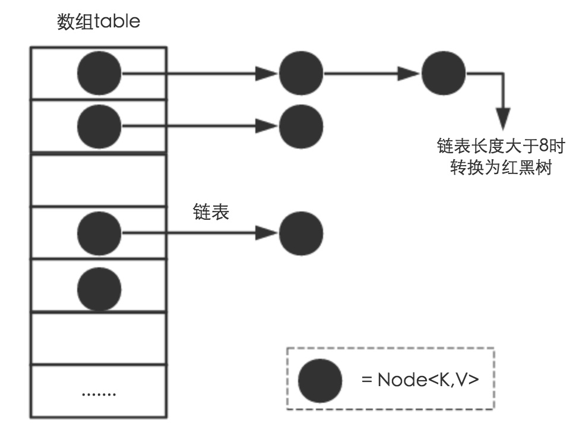

[toc]


# 概述

HashMap 是基于 Map 接口实现的哈希表，它允许拥有为 null 的 key 和 value。相比 HashTable 二者最大的不同在于 HashTable 不接受 null 值（只允许一个 key 为 null, 但 value 可以多个为 null），而且 HashTable 是线程安全的但 HashMap 并不是，其方面二者大致相同。要注意 HashMap 并不能保证映射的顺序性，而且随着事件的推移映射的顺序也可能发生改变（这是因为 hash 算法的随机性且在扩容时重新hash）。但是使用链表实现的 LinkedHashMap 可以保证顺序性。


在正常情况下 HashMap 提供的 get 和 put 方法的时间复杂度恒定为 O(1), 当如果存在大量 hash 碰撞的情况 get 方法会退化为 O(logn) ~ O(n) 之间。在遍历的时候 HashMap 的性能和容量、负载因子相关性非常大：容量越大、负载因子越小 HashMap 的性能就越差。如果迭代的性能很重要，则不要设置过高的容量和过低的负载因子。这一点非常重要。

初始容量（initialCapacity）和负载因子（loadFactor）是影响 HashMap 的重要指标，initialCapacity 指的是 HashMap 底层数组初始化时的容量，而 loadFactor 是指自动扩容的阈值。此阈值 = initialCapacity * loadFactor，当哈希表的使用条目大于了阈值。则将容量扩充为 initialCapacity 的 2 倍。

默认情况下 HashMap 的负载因子为 0.75, 这是一个在空间和时间成本上做了很好这中的经验值。如果负载因子较大表面上是可以较少扩容次数节约空间，但是 get 和 push 的执行时间成本将会增加。如果设置的过低，则会多次触发扩容和重新 hash 时间性能会大幅下降。所以权衡 initialCapacity 和 loadFactor 是很关键的。在设置他们的时候应该结合使用场景考虑映射中的预期条目数及其负载因子，要最大程度上减少重新哈希操作的次数。


HashMap 并不是线程安全的，即多个线程操作同一个 HashMap 的时候结果很可能不一致，而且还有可能造成链表相交的风险。对于此种场景可以使用  Collections 的 synchronizedMap 方法使 HashMap 具有线程安全的能力，或者使用ConcurrentHashMap。

HashTable 是个遗弃类，虽然它是线程安全的但其内部使用的主要操作都是用 synchronized 锁住了整个对象，这意味着每次仅能一个线程工作，其余的线程都将会被阻塞，效率是很低的。采用了分段锁的 ConcurrentHashMap 是最好的选择方案。


# 静态常量

```java
   /**
     * 默认初始化容量（16）- 必须是2的幂次方！
     */
    static final int DEFAULT_INITIAL_CAPACITY = 1 << 4; // aka 16

    /**
     * 最大容量
     */
    static final int MAXIMUM_CAPACITY = 1 << 30;

    /**
     * 扩张因子
     */
    static final float DEFAULT_LOAD_FACTOR = 0.75f;

    /**
		 * 链表转化为红黑树的阈值：当发生 hash 冲突的时候，首先会使用链表解决冲突
		 * 如果节点数量大于 8 则转化为红黑树。
     */
    static final int TREEIFY_THRESHOLD = 8;

    /**
     * 如果红黑树中的节点小于 6 则退化为链表
     */
    static final int UNTREEIFY_THRESHOLD = 6;

    /**
     * hash冲突默认采用单链表存储，当单链表节点个数大于8时，会转化为红黑树存储。
     * 但是有一个前提：要求数组长度大于64，否则不会进行转化
     */
    static final int MIN_TREEIFY_CAPACITY = 64;
```

在默认情况下 HashMap 内部使用数组 + 单链表的形式存储元素。当元素发生 hash 冲突的时候，会存储到该位置的单链表中。但是单链表不会一直增加，当容量达到阈值 TREEIFY_THRESHOLD 的时候会尝试将单链表转化为红黑树从而将查找的时间复杂度从 O(n) 降低到 O(logn)。在转化前会判断数组的容量如果小于 MIN_TREEIFY_CAPACITY = 64 则不会转化而是扩容。

```java
    final void treeifyBin(Node<K,V>[] tab, int hash) {
        int n, index; Node<K,V> e;
        if (tab == null || (n = tab.length) < MIN_TREEIFY_CAPACITY)
           // 数组 size < MIN_TREEIFY_CAPACITY 则扩容，扩容后的链表会重新在桶中分布
            resize();
        else if ((e = tab[index = (n - 1) & hash]) != null) {
                 …………
        }
    }
```


# 存储数据结构

从底层存储数据结构来看 HashMap 使用了数组、单链表、红黑树（JDK 1.8 引入）实现。



HashMap 的主干数据结构是数组。众所周知，数组是拥有连续内存空间的数据结构，因为在查找方面他拥有时间复杂度为 O(1) 的性能。但是一切并不是完美的，当发生 hash 冲突时如何定位存储位置，是需要解决的首要问题。

在解决 hash 冲突上主要有两种解决方案：

1. 开发寻址法：如果发生冲突，在空闲位置上寻找位置并存储
2. 链地址法：使用数组 + 链表的形式将冲突的节点存储到链表中，此时时间复杂度降从 O(1) 退化为 O(n)。

而 HashMap 选择了后者。==从中可见一个好的 hash 算法多么的重要，如何尽可能将元素均匀的分配在数组中，是我们后面讨论的主要问题。==


在 JDK 8 中，使用 Node 作为数组元数据，而每个 Node 都可作为链表中的一个节点

```java
    // HashMap 的数组实现
    transient Node<K,V>[] table;
   
   
    /**
     * Basic hash bin node, used for most entries.  (See below for
     * TreeNode subclass, and in LinkedHashMap for its Entry subclass.)
     */
    static class Node<K,V> implements Map.Entry<K,V> {
        final int hash;
        final K key;
        V value;
        // 下一个节点的引用
        Node<K,V> next;

        Node(int hash, K key, V value, Node<K,V> next) {
            this.hash = hash;
            this.key = key;
            this.value = value;
            this.next = next;
        }
      …………
    }
```


# 数据存储


```java
  final V putVal(int hash, K key, V value, boolean onlyIfAbsent,
                   boolean evict) {
        Node<K,V>[] tab; Node<K,V> p; int n, i;
        if ((tab = table) == null || (n = tab.length) == 0)
            n = (tab = resize()).length;
        if ((p = tab[i = (n - 1) & hash]) == null)
            tab[i] = newNode(hash, key, value, null);
        else {
            Node<K,V> e; K k;
            if (p.hash == hash &&
                ((k = p.key) == key || (key != null && key.equals(k))))
                e = p;
            else if (p instanceof TreeNode)
                e = ((TreeNode<K,V>)p).putTreeVal(this, tab, hash, key, value);
            else {
                for (int binCount = 0; ; ++binCount) {
                    if ((e = p.next) == null) {
                        p.next = newNode(hash, key, value, null);
                        if (binCount >= TREEIFY_THRESHOLD - 1) // -1 for 1st
                            treeifyBin(tab, hash);
                        break;
                    }
                    if (e.hash == hash &&
                        ((k = e.key) == key || (key != null && key.equals(k))))
                        break;
                    p = e;
                }
            }
            if (e != null) { // existing mapping for key
                V oldValue = e.value;
                if (!onlyIfAbsent || oldValue == null)
                    e.value = value;
                afterNodeAccess(e);
                return oldValue;
            }
        }
        ++modCount;
        if (++size > threshold)
            resize();
        afterNodeInsertion(evict);
        return null;
    }
```


# 确定哈希桶数组索引位置


```java
方法一：
static final int hash(Object key) {   //jdk1.8 & jdk1.7
     int h;
     // h = key.hashCode() 为第一步 取hashCode值
     // h ^ (h >>> 16)  为第二步 高位参与运算
     return (key == null) ? 0 : (h = key.hashCode()) ^ (h >>> 16);
}
方法二：
static int indexFor(int h, int length) {  //jdk1.7的源码，jdk1.8没有这个方法，但是实现原理一样的
     return h & (length-1);  //第三步 取模运算
}
```


# 扩容

* 开辟新的数组将老数据 copy 过来。
* 在拷贝过程中 JDK1.7 需要为历史数据重新计算索引，在 JDK1.8 中没有重新计算索引，而是直接将 hashcod 与上老数据容量做与运算，结果为 0 保留位置，不为 0 则新位置 = 原始位置 + 老数据长度。

# 常见问题解答

## 为什么数组容量必须是2次幂

为了让元素平均分配在数组中，常规方案就是取模，但除法和取模运算效率均偏低，在数据规模偏大的场景下很容易成为 HashMap 的性能瓶颈。为此更好的解决方案就是位运算：

用 $ f(x)$表示取模的方式获取索引：$ f(x) = hashCode  \% x $;    x = 数组长度；

用 $ m(x)$ 表示位运算获取索引，经过数学推导可知：对于函数 $ m(x)$ 当且仅当 $ x \in ( 2^n - 1)$ 即 $ m(x) = ( 2^n - 1) \&  hashCode$ 时$  f(x) = m(x)$。

==所以数组 length =  $2^n$ 时 h& (length-1) 运算等价于对 length 取模。在才能保证运算效率的同时又能保证元素的平均分配减少 hash 碰撞。==

### 简单证明

没有验证过程的结论怎么看都有点生拉硬拽的嫌疑。在此简单验证一下为啥容量必须是 $2^n$

当我们执行（$ 2^n - 1$）时得到的是一个二进制表示均为 1 的数字。例如 $16 = 2^4$ 如果从中减去 1 则得到 15，其二进制表示为：1111。现在我们对 1111 进行任意数字 $y$ 的按位与操作，则将获得 $y$ 的最后四位二进式数，我们将其设为 $z$。这等价于 $z =  y \% 16$（除法运算通常为昂贵的操作。因此，按位操作通常优于除法操作)。获得的结果 $z \in \{0, 1, ……15\}$ 就是 HashMap 数组中的索引。

如果我们把容量设为 17 它并不是2次幂的结果，这种中情况下，我们从中减去 1 得到 16，即 10000 的二进制表示，现在执行 $ y \& 16$ 则将丢失 $y$ 的所有其他位数字，除了末尾的第五位。因此无论 $y$ 的取值是什么，数组的索引都为 16 或 0。这意味着会发生很多 hash 冲突这将导致性能变差，换来的 get 操作的空间复杂度将从 O(1) 会退化为  O(n) 或者 O(logn)。

### 拓展：对 ConcurrentHashMap 的性能影响

前面提到 ConcurrentHashMap 内部使用了分段锁的形式在保证线程安全的前提下又提高了吞吐量。如果发生大规模 hash 冲突（例如上述情况下只有两个位置 16 或 0 的位置被使用）那么同一个数据段就会被 n 个线程同时访问，造成（n - 1）个线程阻塞。这会大大降低性能。

### 小结

因此如果容量为 $2^n$，则与其他大小相比，元素将在数组中更均匀的分布，减少 hash 碰撞的可能性，从而有更好的检索性能。


## Hash 计算：为什么将 key 的 hashCode 与高 16 位异或

```java
    static final int hash(Object key) {
        int h;
        return (key == null) ? 0 : (h = key.hashCode()) ^ (h >>> 16);
    }
```

在计算索引之前  `HashMap` 实现还将key的哈希码向右移16位，对原始哈希码进行按位异或，以确保高阶位也被参与运算增加随机性，较少碰撞的发生。


## equals() & hasCode()


## HashMap为何从头插入改为尾插入

在 JDK7 的时候 HashMap 的内部数据结构还是数组 + 单链表的形式，当发生 hash 冲突的时候，会存储到当前 bucket 位置的单链表中。但是当链表的长度很大的时候，get 方法的时间复杂度将退化为 O(n)。JDK8 在 JDK7 数组 + 单链表的结构上增加了红黑树，当 hash 冲突大于 8 且 HashMap bucket array 长度大于 64 的的时候则将链表转化为链表。


# 参考

[java 8 HashMap Api](https://docs.oracle.com/javase/8/docs/api/java/util/HashMap.html)

[Java 8 HashMap Implementation and Performance](https://dzone.com/articles/java8-hashmap-implementation-and-performance)

[HashMap Performance Improvements in Java 8](https://dzone.com/articles/hashmap-performance)

[Java HashMap internal Implementation](https://medium.com/@mr.anmolsehgal/java-hashmap-internal-implementation-21597e1efec3)

[Why Are HashMaps Implemented Using Powers of Two?](https://stackoverflow.com/questions/53526790/why-are-hashmaps-implemented-using-powers-of-two)

[Java 8 系列之重新认识 HashMap](https://zhuanlan.zhihu.com/p/21673805)

