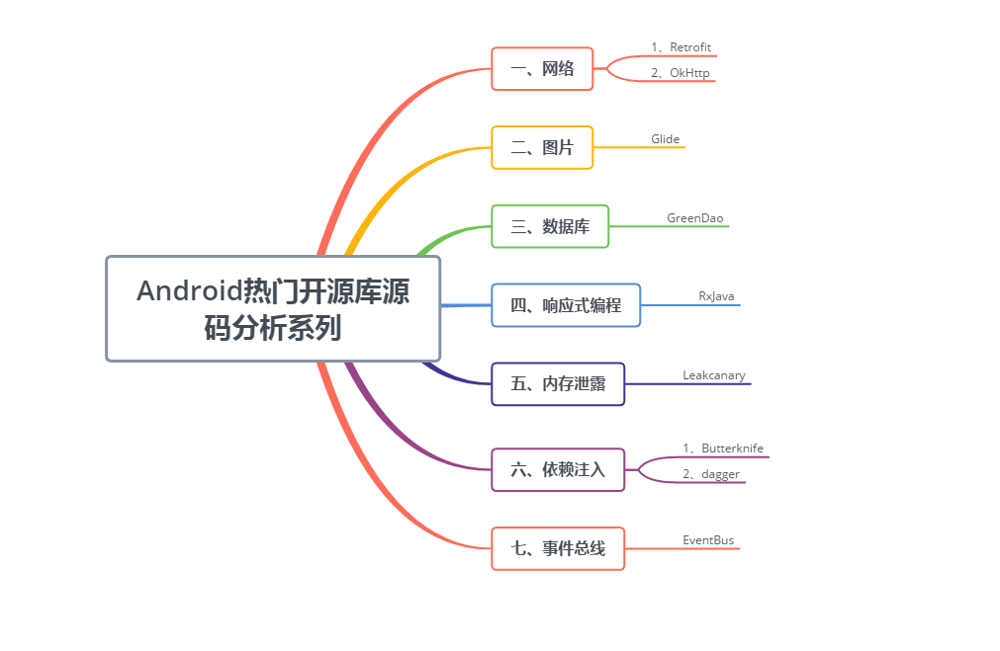

[toc]

[Android知识体系总结(全方面覆盖Android知识结构，面试&进阶)](https://blog.csdn.net/ClAndEllen/article/details/79257663)

[Gityuan的博客](http://gityuan.com/archive/)

[算法面试通关40讲](https://time.geekbang.org/course/intro/130)

[Flutter核心技术与实战](https://time.geekbang.org/column/intro/200)

[一篇文章带你领略Android混淆的魅力](https://juejin.im/post/5d1717996fb9a07eeb13bc95)

[国内优秀Android学习资源](https://github.com/hehonghui/android-tech-frontier/tree/master/the-bad-guys)

[Systrace 基础知识](https://www.androidperformance.com/2019/05/28/Android-Systrace-About/)

[Android Tech And Perf](https://www.androidperformance.com/)

# 优秀学习路线和笔记

[Awesome-Android-Notebook](https://github.com/JsonChao/Awesome-Android-Notebook)

[Android架构师成长之路 ： Awesome-Android-Architecture](https://github.com/JsonChao/Awesome-Android-Architecture)

[性能优化：Awesome-Android-Performance](https://github.com/JsonChao/Awesome-Android-Performance)

[LearningNotes](https://github.com/francistao/LearningNotes)

[Android-ReadTheFuckingSourceCode](https://github.com/jeanboydev/Android-ReadTheFuckingSourceCode)

# 开源库

[第三方开源库源码分析](https://github.com/JsonChao/Awesome-Third-Library-Source-Analysis)

# git

[Pro Git]([https://git-scm.com/book/zh/v2/%E8%B5%B7%E6%AD%A5-%E5%85%B3%E4%BA%8E%E7%89%88%E6%9C%AC%E6%8E%A7%E5%88%B6](https://git-scm.com/book/zh/v2/起步-关于版本控制))

# 书单

1. 编程之美——微软技术面试心得
2. 算法（第4版）
3. 深入理解Android内核设计思想 第2版
4. Android 源码设计模式解析与实战 第2版
5. 深入探索Android热修复技术原理
6. Android插件化开发指南
7. Android应用性能优化最佳实践
8. 移动App性能评测与优化
9. 深入理解Android自动化测试
10. Android自定义控件开发入门与实战
11. Android组件化架构
12. Android开发进阶 从小工到专家
13. 深入理解Java虚拟机
14. 代码整洁之道
15. 数据结构与算法分析
16. 算法图解
17. HTTP权威指南
18. 代码整洁之道
19. 数据结构与算法分析：Java语言描述
20. 趣学算法
21. 图解HTTP
22. 重构 改善既有代码的设计
23. Java并发编程的艺术
24. 代码大全
25. 啊哈！算法
26. Java性能优化权威指南
27. - [x] Android Gradle权威指南
28. 实战Gradle
29. TCP/IP路由技术
30. 深入浅出 HTTPS

# 算法

[leetcode](https://github.com/azl397985856/leetcode)

[leetcode-java](https://github.com/andavid/leetcode-java)

# 面试 

[常见面试题汇总：Awesome-Android-Interview](https://github.com/JsonChao/Awesome-Android-Interview)

[面试反问：reverse-interview-zh](https://github.com/yifeikong/reverse-interview-zh)

