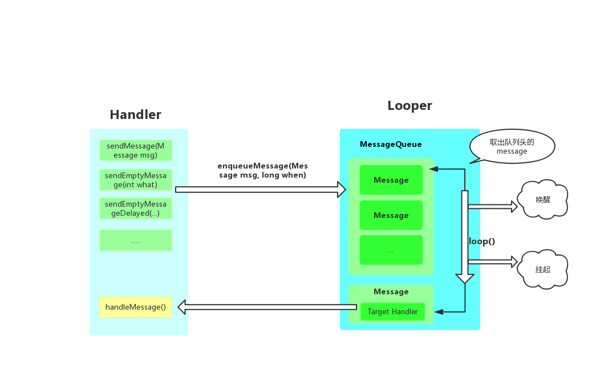
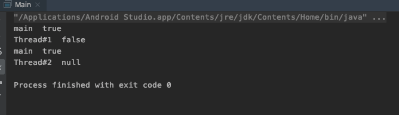
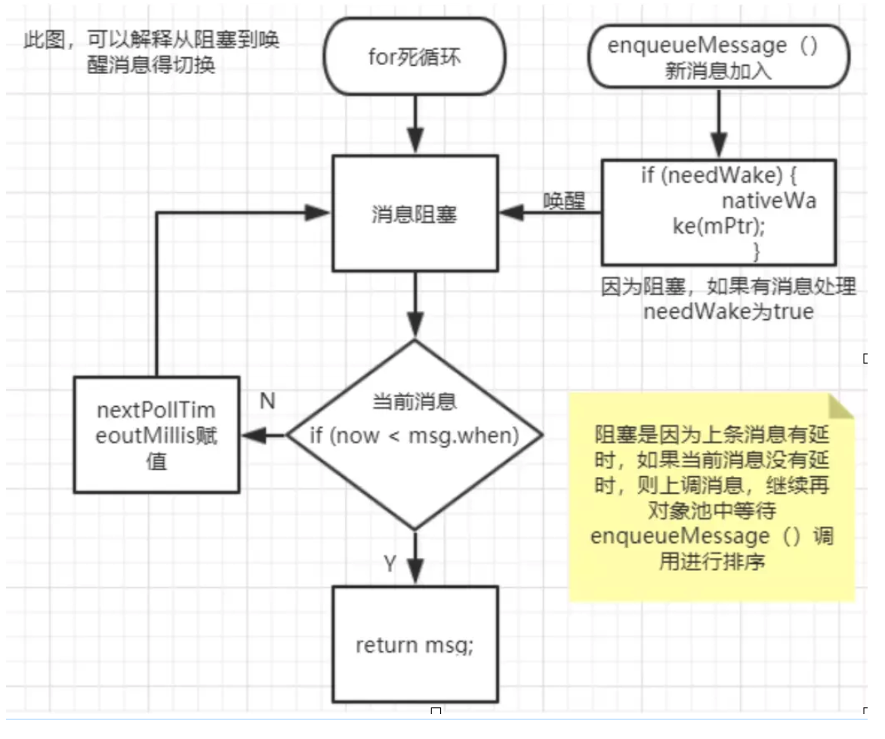
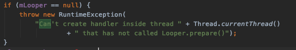
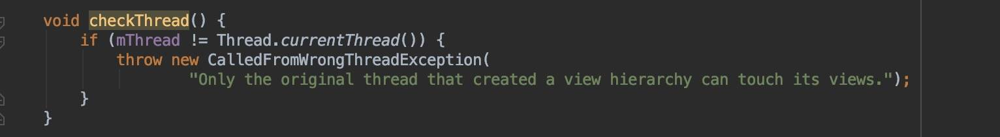

[TOC]


# 内存泄漏

## Handler 造成的内存泄漏 (19.6.25日被骂，超级尴尬)

**问题描述**
Handler中的Message对象会持有Handler的饮用，而Handler如果是一个匿名内部类的方式使用：

```java
mHandler = new Handler(Looper.getMiainLooper()) {
    @Override
    public void handleMessage(Message msg) {
    }
}
```
Handler则会持有Activity的强引用，在Activity需要销毁的时候，Looper还在运行中，则内存泄漏。

**处理方案**

1. 在Activity `onDestory`、View `onDetachedFromWindos`中调用 `removeCallAndMessage(null);`,但是Activity`onDestory`在异常情况下不会被调用，所以需要加上第二种方式。
2. 创建Handler匿名内部类、如果需要依赖外部类，可以传递一个弱引用进去
```java
private static class MyHandler extend Handler {
    private WeakReference mReference;
    MyHandler(Actvity activity) {
        new WeakReference(actvity);
    }
    @Override
    public void handleMessage(Message msg) {
        if (mReference.get() == null ){
            removeCallAndMessage(null);
            return;
        }
        // to do sth.
        mReference.get().todo();
    }
}
```
## 线程造成的内存泄漏

**JVM 不会回收正在运行中的线程**，所有如果 Thread 中运行着一个长任务并且引用了 Activity，那么就会造成内存泄漏，例如 AsyncTask 造成内存泄漏的本质其实也是此原因，所以 AsyncTask 的内存泄漏并不是他自身的特点，而是所有线程的都会造成内存泄漏的风险。

但是，需要运行的任务时间是短暂的例如开发者设定了一个短暂的运行时间，那么其实可以忽略这种，当然可以使用 Activity 弱引用的方式使用线程。


# Activity（19.8.5）

## 监听所有Actvity的生命周期回调

```java
Applicaiton —> registerActivityLifecycleCallbacks();
```

## 设置进入和退出动画

* 【anim】in_from_up.xml

```xml
<?xml version="1.0" encoding="utf-8"?>
<set xmlns:android="http://schemas.android.com/apk/res/android">
    <translate
        android:duration="300"
        android:fromYDelta="100%p"
        android:toYDelta="0%p" />

</set>
```

* 【anim】out_to_down.xml

```xml
<?xml version="1.0" encoding="utf-8"?>
<set xmlns:android="http://schemas.android.com/apk/res/android">
    <translate
        android:duration="300"
        android:fromYDelta="0%p"
        android:toYDelta="100%p" />

</set>
```

* 【style.xml】

```java
 <!--自下而上进入 自上而下退出 -->
    <style name="AppAnimationTheme" parent="继承默认app主题即可">
        <!-- 将Activity的Theme设置成透明 -->
        <item name="android:windowBackground">@null</item>
        <item name="android:windowIsTranslucent">true</item>
        <item name="android:activityOpenEnterAnimation">@anim/in_from_up</item>
        <item name="android:activityOpenExitAnimation">@anim/in_from_up</item>
        <item name="android:activityCloseEnterAnimation">@anim/out_to_down</item>
        <item name="android:activityCloseExitAnimation">@anim/out_to_down</item>
    </style>

```

* 【AndroidManifest.xml】设置主题

```xml
<activity android:theme="@style/AppAnimationTheme" />
```

* 【Activity跳转页面】

```java
Intent intent = new Intent();
startActivity(intent);
// overridePendingTransition 是 Activity 的方法
overridePendingTransition(R.anim.in_from_up, android.R.anim.fade_out);
```
* 【Activity目标页面】重写finish

```java
@Override
    public void finish() {
        super.finish();
        overridePendingTransition(R.anim.out_to_down, R.anim.out_to_down);
    }
```

## 设置透明背景

* 【style.xml】

```xml
  <style name="Transparent" parent="Theme.AppCompat.Light.NoActionBar">
        <item name="android:windowBackground">@android:color/transparent</item>
        <item name="android:windowIsTranslucent">true</item>
    </style>
```

*  【AndroidManifest.xml】设置主题

```xml
<activit
            android:name=".join.RequestJoinListActivity"
            android:screenOrientation="portrait"
            android:theme="@style/Transparent" />
```

## 设置状态栏颜色

```java
StatusBarUtil.setColor(this, Color.TRANSPARENT);
```


# Fragment（19.7.5）

## Fragment与Activity生命周期对照图
[原图地址](https://github.com/xxv/android-lifecycle)


## Fragment常用方法

1. `isResumed`

##  选择正确的 Fragment#commitXXX() 函数
**异常：Can not perform this action after onSaveInstaceState()**
当Actvity在后台被回收的时候会调用`onSaveInstanceState()`方法保存状态和数据，**直到再回到Avtivity之前（`onResume()`）提交FragmentTransaction就会报错**（这种情况一般出现在其他Activity回调让当前页面执行FragmentTransaction的时候）
结局
如何解决

1. `commit()`
  提交不会立即执行，而是排到了主线程等待准备好的时候执行

2. `commitAllowingStateLoss()`
  **允许在Actvity保存状态之后提交，即允许状态丢失。**
  与commit一样但是允许Activity的状态保存之后提交。他的实现是和`commit`几乎一样的，唯一的区别在于`commit`执行之后FragmentManager都会检测是否已经保存了状态（`onSaveInstaceState()`），如果已经保存状态再次使用`commit`会抛出异常：`java.lang.IllegalStateException: Can not perform this action after onSaveInstanceState`
  如果在`onSaveInstanceState()`之后调用`commitAllowingStateLoss()` FragmentManager保存的所有状态可能被丢失，而且重新启动之后在 onSaveInstaceStae() 之后添加和删除的 Fragment 也会丢失。
  **如果说保存状态对于业务需求不重要，则使用`onSaveInstanceState()`**
  使用
3. `commitNow()`
  立即将事务提交

4. `commitNowAllowingStateLoss()`
  立即提交而且允许在保存状态之后提交。

## Fragment的重叠问题
**原因** : 这种情况出现在使用`add\show\hind`时，在异常情况下 Activity会被系统回收，此时Fragmen中的`onSaveInstaceState()`也会被Avtivity的`onSaveInstaceState()`递归调用，在恢复的时候Fragmeng会重新创建。
**解决方案** ：
1. 直接注释掉Activity或者Fragment中的`onSaveInstaceState()` 然后使用`commitAllowingLossSate()`提交事务
2. 在创建的时候的时候添加Tag并存储起来
```java
Fragment fragment = getSupportFragmentManager().findFragmentByTag("FragmentA");
if (fragment == null) {
    mFragmentA = new FragmentA();
    FragmentTransaction fragmentTransaction = getSupportFragmentManager().beginTransaction();
    fragmentTransaction.add(R.id.container, mFragmentA, "FragmentA").commit();
} else {
    mFragmentA = (FragmentA) fragment;
}
```
3. 
  通过savedInstanceState是否null，判断是否已经创建过
```java
if (savedInstanceState == null) {
    mFragmentA = new FragmentA();
    FragmentTransaction fragmentTransaction = getSupportFragmentManager().beginTransaction();
    fragmentTransaction.add(R.id.container, mFragmentA, "FragmentA").commit();
} else {
    mFragmentA = (FragmentA) getSupportFragmentManager().findFragmentByTag("FragmentA");
}
```
## Fragment转场动画
想要给Fragmengt设置进栈和出栈动画，需要使用四个参数的方法`setCustomAnimations(enter exit, popEnter, popExit)` -> `setCustomAnimations(进 exit, popEnter, 出)`，两个参数的方法`setCustomAnimations(enter, exit)`只能设置进场动画.
```java
final FragmentManager fm = getSupportFragmentManager();
final FragmentTransaction ft = fm.beginTransaction();
ft.setCustomAnimations(R.anim.slide_up, R.anim.slide_down, R.anim.slide_up, R.anim.slide_down)
  .add(R.id.fragment_container, new SomeFragment(), FRAGMENT_TAG)
  .addToBackStack(FRAGMENT_TAG)
  .commit();
```

## Fragment的坑
[Fragment全解析系列（一）：那些年踩过的坑](https://www.jianshu.com/p/d9143a92ad94)
[Fragment的那些坑](http://toughcoder.net/blog/2015/04/30/android-fragment-the-bad-parts/)


# Bitmap的处理
## 内存泄漏
## inSampleSize

为了防止内存泄漏，可以通过指定 `inSampleSize` 的值缩小图片的大小。主要的步骤就是通过设置 `options.inJustDecodeBound = true`的方式只将图片加载到内存中，而不输出（也就是说：此时`BitmapFactory.decodeResource(getResources(), resId, options);` 返回的结果为null！！！！） 

在获取 `options.outWidth & options.outHeight` 之后需要将 `inJustDecodeBound ` 设置为 false 


inSampleSize的含义是将原来图片缩小为原来的：1/inSampleSize。Api上写明**inSampleSize 必须是2的整数倍，如果指定的大小不是2的整数倍，则在运行时对指定值处理：取最接近2整数倍的值**

```java
   /**
     * 从资源文件中获取Bitmap
     *
     * @param resId 资源ID
     * @return Bitmap
     */
    private Bitmap getBitmap(@DrawableRes int resId) {
        if (resId == 0) {
            return null;
        }
        BitmapFactory.Options options = new BitmapFactory.Options();
        options.inPreferredConfig = Bitmap.Config.RGB_565;
        options.inJustDecodeBounds = true;
        BitmapFactory.decodeResource(getResources(), resId, options);
        options.inJustDecodeBounds = false;
        options.inSampleSize = BitmapUtils.calculateInSampleSize(options, getWidth(), getHeight());
        Bitmap bitmap = BitmapFactory.decodeResource(getResources(), resId, options);
        Matrix matrix = getMatrix(bitmap);
        return Bitmap.createBitmap(bitmap, 0, 0, bitmap.getWidth(), bitmap.getHeight(), matrix, true);
    }
```


```java
   /**
   	 * 计算采样率代码
     * @param options
     * @param reqWidth 目标宽度
     * @param reqHeight 目标高度
     * @return
     */
    public static int calculateInSampleSize(
        BitmapFactory.Options options, int reqWidth, int reqHeight) {
        // Raw height and width of image
        final int height = options.outHeight;
        final int width = options.outWidth;
        int inSampleSize = 1;

        if (height > reqHeight || width > reqWidth) {

            final int halfHeight = height / 2;
            final int halfWidth = width / 2;

            // Calculate the largest inSampleSize value that is a power of 2 and keeps both
            // height and width larger than the requested height and width.
            while ((halfHeight / inSampleSize) >= reqHeight
                && (halfWidth / inSampleSize) >= reqWidth) {
                inSampleSize *= 2;
            }
        }

        return inSampleSize;
    }
```

# onSaveInstanceState(Bundle)

```java
protected void onSaveInstanceState (Bundle outState)
```


> onSaveInstanceSate()是防止Activity在内存不足等情况下被系统杀死而导致数据丢失。

## 调用时机

一直以来对于 onSaveInstanceState(Bundle) 调用时机的理解存在误区！

并不是说系统在异常杀死Activity前会调用 onSaveInstanceSate(Bundle)，而是在某些系统认为有可能会导致Activity被回收的情况下，预先调用了 onSaveInstanceSate(Bundle) 方法。

例如：

1. 点击Home键回到桌面。
2. 启动另外一个Activity
3. 从最近应用中启动其他App
4. 锁屏的时候
5. 横竖屏切换的时候

这些情况下，onSaveInstanceSate(Bundle) 都会被调用


## 保存方式

Activity作为根部，根据视图树一层一层遍历 Child 的 onSavenInstanceSate(Bundle)方法，恢复的时候一样一层层的调用 onRestorInstanceSate(Bundle)


## 恢复

有两个方法可供恢复 onSaveInstanceState(Bundle) 中存储的数据

1. onCreate(Bundle)
2. onResortInstanceSate(Bundle)

在 onCreate 方法中可以通过判定 Bundle是否为 null 的方式来判定此Activity是否是恢复创建的，如果` Bunlde ！= null` 则表示是恢复的。

如果是恢复启动， onRestorInstaceState(Bundle) 方法的调用是必然的，我们可以

## 生命周期

如上所述 onSaveInstanceState 并不保证每次都会调用，而且他的生命周期反应也不固定，但可以确认的是 onSaveInstanceSate 与 onStop 之间的关系

1. 在Android P（api 28）以后 onSaveInstanceState 将会在 onStop 之后调用
2. 在 api 28 之前会在 onStop之前调用，但是和 onPuase 之前的关系不确定，可能在 onPause 之前，也可能只之后。


用于恢复的方法：onResotrInstanceSate(Bundle)  会在 onStart 与 onPostCreate(Bundle）之间调用


# Android 消息机制 —— Handler



## 概述

Android 的消息机制主要指的是 Handler 的运行机制，从开发者的角度来说 Handler 是 Android 消息机制的上层接口，而底层的逻辑则是由 MessageQueue、 Looper 来完成的。

Handler 的设计目的是为了解决不能在 Android 主线程中做耗时操作而又只有主线程才能访问 UI 的矛盾。通过 Handler 消息机制可以让开发者在子线程中完成耗时操作的同时在主线程中更新UI。


**这里要思考一个问题：为什么 Android 非要规定只有主线程才能更新 UI 呢？**

因为 Android 的所有 View 控件都不是线程安全的，如果在多线程中并发访问很可能造成意想不到的结果。对于加锁这种方案也不可取，首先加锁之后会让 UI 访问逻辑变的很复杂，开发者需要时刻考虑多线程并发将会带来的问题，其次锁机制太重了它会严重影响 UI 访问效率。介于这两个缺点，最简单且高效的方法就是采用单线程的方式访问 UI。Handler 机制应运而生。


那么 Handler 内部是如何完成线程切换的呢？答案就是神奇的 ：ThreadLocal


## ThreadLocal

ThreadLocal 并不是 Thread ，他的特点很有意思: 每一个线程存储的值是相互隔离的

```java
public class TreadLocalDemo {
    // 就算设置为 static 结果也是一样的
    ThreadLocal<Boolean> mThreadLocal = new ThreadLocal<Boolean>();

    public void runDemo() {
        mThreadLocal.set(true);
        System.out.println(Thread.currentThread().getName() + "  " + mThreadLocal.get());
        new Thread("Thread#1") {
            @Override
            public void run() {
                super.run();
                mThreadLocal.set(false);
                System.out.println(Thread.currentThread().getName() + "  " + mThreadLocal.get());
            }
        }.start();

        new Thread("Thread#2") {
            @Override
            public void run() {
                super.run();
                System.out.println(Thread.currentThread().getName() + "  " + mThreadLocal.get());
            }
        }.start();
        System.out.println(Thread.currentThread().getName() + "  " + mThreadLocal.get());
    }
}
```

运行的结果很清晰的展示他的特点，虽然在主线程和线程1中都做了赋值操作，但并不能改变原来线程的赋值情况。




对于 ThreadLocal 的原理简单来说：每一线程都有一个专门用于保存 ThreadLocal 的成员变量 ` localValues`。 尽管在不同线程中访问同一个 ThreadLocal 的 `set` 和 `get` 方法，但所做的操作都仅限制于各自线程的内部。这就是 ThreadLocal 可以在多个线程中互不干扰的存储和读取数据的原因。正是这种特性让 Handler 做到了线程的切换。


***Looper 正是借助 ThreadLocal 的特点在不同的线程创建不同的实例。至此 Handler 与 Looper 、线程达到了一一对应的绑定关系。所以无论此 Handler 的实例在什么线程调用，最终的回调都会分发到创建线程。***


## MessageQueue

MessageQueue 主要有两个操作：插入和读取。读取操作也会伴随着删除，插入和读取的方法分别对应的是：`enquequeMessage` 和 `next`，MessageQueue 并不是像名字一样使用队列作为数据结构，而是使用单链表来维护消息。单链表在插入和删除上比较有优势。

### next()

首先来说说 `next` 方法。

```java
 Message next() {
        // Return here if the message loop has already quit and been disposed.
        // This can happen if the application tries to restart a looper after quit
        // which is not supported.
        final long ptr = mPtr;
        if (ptr == 0) {
            // 可见只有在调用 quit() 方法之后才会返回空
            return null;
        } 
        
   ......
          
        // 一个死循环 ！
        for (;;) {
            if (nextPollTimeoutMillis != 0) {
                Binder.flushPendingCommands();
            }

            // 一个 native 方法，此方法在没有消息或者消息没有到执行时间的时候会让线程进入等待状态。
          	// 有点类似于 Object.wait 但是 nativePollOnce 可以自定等待时间
            nativePollOnce(ptr, nextPollTimeoutMillis);

            synchronized (this) {
   ......
       				 if (!keep) {
                    synchronized (this) {
                      // 获取消息后从列表中移除
                        mIdleHandlers.remove(idler);
                    }
                }
        }
    }
```

最关键的是三点内容

1. 死循环
2. nativePollOnce()
3. 获取到消息之后从列表中移除

`nativePollOnce` 是一个 native 方法，如果单列表中没有消息或者等待的时间没有到，那么当前线程将会被设置为 **wait 等待状态   **，直到可以获取到下一个 `Message`  线程[更详细的内容可以参见 StackOverflow 上关于 nativePollOnce的回答](https://stackoverflow.com/questions/38818642/android-what-is-message-queue-native-poll-once-in-android?answertab=votes#tab-top)而这个死循环的目的就是不让 `next`方法退出，等待 nativePollOnce 的响应。等到获取到消息之后再将这个消息从消息列表中移除。


### enqueueMessage()

enqueueMessage 方法的主要工作就是向单链表中插入数据，当线程处于等待状态则调用 `nativeWake` 唤醒线程，让 next 方法处理消息。

```JAVA
    boolean enqueueMessage(Message msg, long when) {
    ......
            // We can assume mPtr != 0 because mQuitting is false.
            if (needWake) {
                nativeWake(mPtr);
            }
        }
        return true;
    }
```


### 如何处理延时消息

详情请参见[Handler是怎么做到消息延时发送的](https://www.jianshu.com/p/1b475dc531b10) 下面再抄一部分结论：


在 next 方法中如果头部的这个 Message 是有延迟而且延迟时间没到的（`now < msg.when`），会计算一下时间(保存为变量 `nextPollTimeoutMillis`), 然后在循环开始的时候判断如果这个 Message 有延迟，就调用`nativePollOnce (ptr, nextPollTimeoutMillis) `进行阻塞。`nativePollOnce() `的作用类似与 `Object.wait() `, 只不过是使用了 Native 的方法对这个线程精确时间的唤醒。

1. `postDelay() `一个10秒钟的 Runnable A、消息进队，MessageQueue 调用` nativePollOnce() `阻塞，Looper 阻塞；
2. 紧接着 `post()` 一个 Runnable B、消息进队，判断现在A时间还没到、正在阻塞，把B插入消息队列的头部（A的前面），然后调用 `nativeWake() `方法唤醒线程；
3. `MessageQueue.next()` 方法被唤醒后，重新开始读取消息链表，第一个消息B无延时，直接返回给 Looper
4. Looper 处理完这个消息再次调用 `next()` 方法，MessageQueue 继续读取消息链表，第二个消息A还没到时间，计算一下剩余时间（假如还剩 9秒）继续调用 `nativePollOnce() `阻塞；直到阻塞时间到或者下一次有Message 进队；




## Looper

Looper 在 Android 消息机制中扮演着消息循环的角色。具体来说他的任务就是不停的从 MessageQueue 中获取消息，如果有新消息就立即处理，没有消息的时候，与 Looper 绑定的线程就会被 MessageQueue 的 next 的 nativePollOne 方法置于等待状态。

###  Looper 是如何创建的

```java
/** Initialize the current thread as a looper.
  * This gives you a chance to create handlers that then reference
  * this looper, before actually starting the loop. Be sure to call
  * {@link #loop()} after calling this method, and end it by calling
  * {@link #quit()}.
  */
public static void prepare() {
    prepare(true);
}

private static void prepare(boolean quitAllowed) {
    if (sThreadLocal.get() != null) {
        throw new RuntimeException("Only one Looper may be created per thread");
    }
    // 创建 Looper 实例，将实例保存在 sThreadLocal 中与当前线程绑定。
    sThreadLocal.set(new Looper(quitAllowed));
}
```

在构造方法里面他会创建一个 MessageQueque，并保存当前线程。

```java
private Looper(boolean quitAllowed) {
    mQueue = new MessageQueue(quitAllowed);
    mThread = Thread.currentThread();
}
```

getMainLooper 可以在任何地方获取到主线程的 Looper，那么主线程是如何创建 Looper 的呢？


#### 主线程创建 Looper 的过程 —— AndroidThread

我们的目光来到了 AndroidThread 类， 在 AndroidThread 中我们看到了熟悉的方法 ：`main(String[] args`。千万不要被 AndroidThread 的名字所迷惑，AndroidThread 并不是一个线程，它只是一个开启主线程的类。

```java
public static void main(String[] args) {
        ....

        // 创建 Looper 和 MessageQueue 对象，用于处理主线程的消息
        Looper.prepareMainLooper();

        // 创建 ActivityThread 对象
        ActivityThread thread = new ActivityThread(); 

        // 建立 Binder 通道 (创建新线程)
        thread.attach(false);

 			 // 消息循环运行
        Looper.loop(); 
        throw new RuntimeException("Main thread loop unexpectedly exited");
    }
```

注意调用的是 ` prepare(false)` 不允许退出，这是为什么呢？

```java
    public static void prepareMainLooper() {
       // 不允许退出
        prepare(false);
        synchronized (Looper.class) {
            if (sMainLooper != null) {
                throw new IllegalStateException("The main Looper has already been prepared.");
            }
            sMainLooper = myLooper();
        }
    }
```

这是因为主线程的 Looper 伴随着一个 App 的整个生命周期，所有的 UI访问、View 刷新都是在 Looper 里面完成的，如果允许开发者手动退出，那么整个 App 都会变得不可控。

*更多细节可以参见下面的一节「 Looper中的死循环为什么没有卡死线程」*


### Looper 是如何运行的

```java
/**
 * Run the message queue in this thread. Be sure to call
 * {@link #quit()} to end the loop.
 */
public static void loop() {
    final Looper me = myLooper();
  ......
    
    final MessageQueue queue = me.mQueue;
  ......

    // 死循环
    for (;;) {
       // 可能会被阻塞
        Message msg = queue.next();
        if (msg == null) {
            // msg 为 null 会立即退出循环，这也是退出循环的唯一方法。
            return;
        }
   ......
  
        try {
          // 开始分发消息
            msg.target.dispatchMessage(msg);
            dispatchEnd = needEndTime ? SystemClock.uptimeMillis() : 0;
        } finally {
            if (traceTag != 0) {
                Trace.traceEnd(traceTag);
            }
        }
   ......
    }
}
```

loop 方法是一个死循环，他的工作就是不断的检查 MessageQueue 是否有可以处理的消息，如果有这将消息分发给 Handler 处理。既然是死循环那么为什么没有卡死线程呢？*更多细节可以参见下面的一节「 Looper中的死循环为什么没有卡死线程」*


### Looper 如何退出

Looper 内部提供了两种退出的方法，分别是 quit、quitSafely。从本质上来讲 quit 调用后会立即退出 Looper，而 quitSafely 只是设定一个退出标记，等待消息队列中的已有消息处理完毕后，再退出。

Looper 退出后，通过 Handler 发送的消息会失败，这个时候 Handler send 方法会返回 false。在子线程中，如果手动为其创建了 Looper，那么在所有的逻辑完成后理应手动调用 quit 方法终止 Looper 内部的循环，否则这个子线程会一直处于等待状态，而退出 Looper 之后，子线程也就会随之终止，因此在子线程中使用 Looper，**必须在恰当的时机终止它**。

```java
/**
* Quits the looper.
*/
public void quit() {
    mQueue.quit(false);
}

/**
 * Quits the looper safely.
 */
public void quitSafely() {
    mQueue.quit(true);
}
```

如果是主线程开发者就退出不了，要是退出了，就麻烦大了。

```java
public static void prepareMainLooper() {
  // fasle 不允许退出
    prepare(false);
 ....
}
```


#### 退出的本质

在 `Looper.quit` 的源码中可以清晰看到，本质上调用的是 MessageQueue 的 quite 方法。而在调用 `MessageQueue.quite` 之后 再次调用 `MessageQueue.next()`会返回 null 

```java
 Message next() {
        // Return here if the message loop has already quit and been disposed.
        // This can happen if the application tries to restart a looper after quit
        // which is not supported.
        final long ptr = mPtr;
        if (ptr == 0) {
            // 可见只有在调用 quit() 方法之后才会返回空
            return null;
        } 
        
   ......
```

`Looper.loop()`在调用 `queue.next()`得的结果为 null 的时候会立即跳出死循环, 这也是退出死循环的唯一方式。

```java
public static void loop() {
……
	for (;;) {
    Message msg = queue.next(); // might block
    if (msg == null) {
        // No message indicates that the message queue is quitting.
        return;
    }
……
```


### Looper中的死循环为什么没有卡死线程

[参考知乎：Android中为什么主线程不会因为Looper.loop()里的死循环卡死？](https://www.zhihu.com/question/34652589)

我们都知道：一个简单的死循环会消耗掉大量资源导致线程被卡死。但是 Looper.loop()  方法开启就是一个死循环，它为什么没有卡死线程呢？总结一下主要有3个疑惑：

* **Looper 为什么要使用死循环**
* **Android 的主线程为什么没有被 Looper 中的死循环卡死**
* **唤醒 Looper 的消息从何而来**

#### Looper 为什么要使用死循环

首先要说说的是为什么在 Looper 中使用死循环。在 CPU 看来操作系统线程(这里的定义可以参见[《Java基础》多线程和线程同步 —— 进程与线程一节](./java/java基础) ) 只不过是一段可以执行的代码，CPU 会使用 CFS 调度算法，保证每一个 task 都尽可能公平的享用 CPU 时间片。既然操作系统线程是一段可以执行的代码，当可执行的代码结束之后，线程生命周期也就终止，线程将会退出。但是对于 Android 主线程这种场景，我们绝对不希望执行一段时间之后主线程就自己停止掉，那么如何保证线程一直执行下去呢？**简单的做法就是在线程中执行死循环，让线程一直工作下去不会停止退出。**

**总的来说，在线程中使用死循环想要解决的问题就是防止线程自己退出**。所以对于 Looper 而言，他的死循环就是希望不断的从 MessageQueue 中获取消息，而不希望线程线性执行之后就退出。


#### Android 的主线程为什么没有被 Looper 中的死循环卡死

首先 Android 所有的 UI 刷新和生命周期的回调都是由 Handler消息机制完成的，就是说 UI 刷新和生命周期的回调都是依赖 Looper 里面的死循环完成的，这样设计的目的上文已经阐述清楚。[这篇文章里面贴了 AndroidTread 对于 Handler 的实现类 H 的源码(进入文章后搜索：内部类H的部分源码)](https://blog.csdn.net/u012045061/article/details/50631581) 源码太长，我就不贴了。

其次Looper 不是一直拼命干活的傻小子，而是一个有活就干没活睡觉的老司机，所以主线程的死循环并不是一直占据着 CPU 的资源不释放，不会造成过度消耗资源的问题。这里涉及到了Linux pipe/epoll机制，简单说就是在主线程的 MessageQueue 没有消息时，便在 loop 的 queue.next() 中的 nativePollOnce() 方法里让线程进入**休眠状态**，此时主线程会释放CPU资源，直到下个消息到达或者有事务发生才会再次被唤醒。**所以 Looper 里的死循环，没有一直空轮询着瞎忙，也不是进入阻塞状态占据着 CPU 不释放，而是进入了会释放资源的等待状态，等待着被唤醒**


经过上面的讨论可以得知：

1. Looper 中的死循环是 Android 主线程刷新 UI 和生命周期回调的基石。
2. Looper 中的死循环会根据消息分别进入等待和唤醒状态，并不会一直持有资源，所以就不会有卡死的问题。

那么唤醒 Looper 的消息是从哪里来的呢？


#### 唤醒 Looper 的消息从何而来

目光回到 AndroidThread 类中的这几行代码

```java
public static void main(String[] args) {
        ....
          
        // 创建ActivityThread对象
        ActivityThread thread = new ActivityThread(); 
  
        //建立Binder通道 (创建新线程)
        thread.attach(false);

        Looper.loop(); //消息循环运行
    }
```

在创建 ActivityThread 后会通过`thread.attach(false) `方法在 ActivityThread 中创建 Binder 的服务端用于接收系统服务AMS发送来的事件，然后通过 ActivityThread 的内部类 ApplicationThread 中 sendMessage 方法

```java
......

public final void scheduleStopActivity(IBinder token, boolean showWindow,
                int configChanges) {
           sendMessage(
                showWindow ? H.STOP_ACTIVITY_SHOW : H.STOP_ACTIVITY_HIDE,
                token, 0, configChanges);
        }

        public final void scheduleWindowVisibility(IBinder token, boolean showWindow) {
            sendMessage(
                showWindow ? H.SHOW_WINDOW : H.HIDE_WINDOW,
                token);
        }

        public final void scheduleSleeping(IBinder token, boolean sleeping) {
            sendMessage(H.SLEEPING, token, sleeping ? 1 : 0);
        }

        public final void scheduleResumeActivity(IBinder token, int processState,
                boolean isForward, Bundle resumeArgs) {
            updateProcessState(processState, false);
            sendMessage(H.RESUME_ACTIVITY, token, isForward ? 1 : 0);
......

```

将消息发送给 AndroidThread 的 Handler 实现内部类 H。从而完成了ActivityThread 到 UI 线程即主线程的切换，唤醒 Looper 进行 dispatchMessage 的动作。

唤醒的具体操作参见上文「MessageQueue -> enqueueMessage -> nativeWake」


#### 拓展：如何在非主线程中使用 Handler 消息机制

通过 ActivityThread  的源码可以清楚看到

```java
public static void main(String[] args) {
        ....

        //创建Looper和MessageQueue对象，用于处理主线程的消息
        Looper.prepareMainLooper();
        ....

        Looper.loop(); //消息循环运行
        ....
    }
```

Android 在没启动一个 App 的时候都会创建一个 Looper，而开始子线程的时候是没有这个操作的，所以需要开发者自己创建并调用 Looper.loop() 让 Looper 运行起来。

```java
   new Thread("Thread#1") {
      @Override
      public void run() {
         // 手动生成为当前线程生成 Looper
         Looper.prepare();
         Handler handler = new Handler();
         Looper.loop();
      }

    }.start();
```

此处我们做个实验，既然 Looper 是个死循环那么在 loop() 之后的代码是不是永远没有机会执行呢？

```java
/**
 * Android 消息机制 —— Handler
 * <p>
 * Created by im_dsd on 2019-09-07
 */
public class HandlerDemo {

    public static final String TAG = "HandlerDemo";
    private Handler mHandler;
    private Looper mLooper;

    /**
     * 如何在子线程中开启 Handler
     */
    public void startThreadHandler() {
        new Thread("Thread#1") {
            @Override
            public void run() {
                // 手动生成为当前线程生成 Looper
                Looper.prepare();
                mLooper = Looper.myLooper();
                mHandler = new Handler() {
                    @Override
                    public void handleMessage(Message msg) {
                        super.handleMessage(msg);
                        Log.d(TAG,Thread.currentThread().getName() + "  " + msg.what);
                    }
                };
                Log.d(TAG,Thread.currentThread().getName() + "loop 开始 会执行吗？  ");
                // 手动开启循环
                Looper.loop();
                Log.d(TAG,Thread.currentThread().getName() + "loop 结束 会执行吗？  ");
            }

        }.start();

        // 等待线程启动
        try {
            Thread.sleep(100);
        } catch (InterruptedException e) {
            e.printStackTrace();
        }
        Log.d(TAG,"start send message");
        mHandler.sendEmptyMessage(1);
        mHandler.post(() -> Log.d(TAG,Thread.currentThread().getName()));
    }
}
```

自启动到将 App 彻底杀死，输出结果也是如此：loop 后面的代码没有执行！

```shell
2964-3007/com.example.dsd.demo D/HandlerDemo: Thread#1loop 开始 会执行吗？  
2964-2964/com.example.dsd.demo D/HandlerDemo: start send message
2964-3007/com.example.dsd.demo D/HandlerDemo: Thread#1  1
2964-3007/com.example.dsd.demo D/HandlerDemo: Thread#1
```

这意味两个严重的问题：`looper()` 后面的代码一直都不会执行而且线程 Thread#1 将会一直运行下去！在 JVM 规范里面规定处于运行中的线程是会不被 GC 的。在没有消息的时候 Looper 会处于等待状态。等待在 Thread 的生命周期里仍然属于运行状态，它**永远不会被 GC**。

所以很多网上很多文章里都有一个致命的缺陷，根本就没有提及到要在使用完毕后即使退出 Looper。紧接上文的代码

```java
      // 尝试 1秒 后停止
        try {
            Thread.sleep(1000);
            mLooper.quit();
        } catch (InterruptedException e) {
            e.printStackTrace();
        }
```

此时的结果

```shell
2964-3007/com.example.dsd.demo D/HandlerDemo: Thread#1loop 开始 会执行吗？  
2964-2964/com.example.dsd.demo D/HandlerDemo: start send message
2964-3007/com.example.dsd.demo D/HandlerDemo: Thread#1  1
2964-3007/com.example.dsd.demo D/HandlerDemo: Thread#1
2964-3007/com.example.dsd.demo D/HandlerDemo: Thread#1loop 结束 会执行吗？  
```


根据综上所述，**Handler 机制完全可以在 Android 中用作线程间的消息同步**，这里要强调一下，Handler 机制是 Android 独有的，笔者在写上面的 Demo 的时候竟然傻傻的将 Handler 的启动放在了 Java 中，直接抛出了 RuntimException Stub 的错误。


**总结一下在子线程中使用 Handler 机制要注意两点问题：**

1. 必须调用 `   Looper.prepare();`手动生成为当前线程生成 Looper，并调用`Looper.looper()`启动内部的死循环。
2. 必须在使用结束后调用 `Looper.myLooper().quit()`退出当前线程。


## Handler

Handler 的工作主要就是发送和接收消息。消息的发送可以通过 post 的一系列方法和 send 的一系类方法。在创建 Handler 的时候他会默认使用当前线程的 Looper ，如果当前线程没有创建过 Looper 会抛出如下异常。




当然也可以手动指定不同线程的 Looper。

```java
Handler mHandler = new Handler(Looper.getMainLooper());
```


### 消息是如何发送到的呢？

```java
    public final boolean sendMessage(Message msg)
    {
        return sendMessageDelayed(msg, 0);
    }

    public final boolean sendMessageDelayed(Message msg, long delayMillis)
    {
        if (delayMillis < 0) {
            delayMillis = 0;
        }
        return sendMessageAtTime(msg, SystemClock.uptimeMillis() + delayMillis);
    }

    public final boolean sendEmptyMessageAtTime(int what, long uptimeMillis) {
        Message msg = Message.obtain();
        msg.what = what;
        return sendMessageAtTime(msg, uptimeMillis);
    }

    public boolean sendMessageAtTime(Message msg, long uptimeMillis) {
        MessageQueue queue = mQueue;
        if (queue == null) {
            RuntimeException e = new RuntimeException(
                    this + " sendMessageAtTime() called with no mQueue");
            Log.w("Looper", e.getMessage(), e);
            return false;
        }
        return enqueueMessage(queue, msg, uptimeMillis);
    }

```

经过一系列的跟踪，最终的结果是调用了`enqueueMessage(MessageQueue, Message, long)`方法，目的就是为了向 MessageQueue 中插入一条消息。

```java
    private boolean enqueueMessage(MessageQueue queue, Message msg, long uptimeMillis) {
        msg.target = this;
        if (mAsynchronous) {
            msg.setAsynchronous(true);
        }
        return queue.enqueueMessage(msg, uptimeMillis);
    }
```

而后 `nativeWake` 将会唤醒等待的线程，`MessageQueue#next`将会在`Looper.loop() `中将这条消息返回，`Looper.loop()`在收到这条消息之后最终会交由 `Handler#dispatchMessage`处理

```java
/** 
 * Looper 的 loop 方法
 */
public static void loop() {
  ......

    // 死循环
    for (;;) {
   ......
      // 开始分发消息  msg.target 指的就是发送消息的 Handler
       msg.target.dispatchMessage(msg);
   ......
    }
}
```

```java
   /**
     * Handle 的 dispatchMessage 方法
     */
    public void dispatchMessage(Message msg) {
       // 首先检查 msg 的 callback 是否为 null
        if (msg.callback != null) {
          // 不为 null 使用 msg 的 callback 处理消息
            handleCallback(msg);
        } else {
            // mCallback 是否为 null
            if (mCallback != null) {
                if (mCallback.handleMessage(msg)) {
                    return;
                }
            }
          // 都没有指定则交由开发者重写的 handleMessage 处理
            handleMessage(msg);
        }
    }
```

`mCallback`指的是一个接口 , 可以使用 `Handler handler = new Handler(Callback)`的方式指定回调，这种方式可以由外部传递进来会回调方法，更加灵活。

```java
 * Callback interface you can use when instantiating a Handler to avoid
 * having to implement your own subclass of Handler.
 */
public interface Callback {
    /**
     * @param msg A {@link android.os.Message Message} object
     * @return True if no further handling is desired
     */
    public boolean handleMessage(Message msg);
}
```


至此对于 Android 的消息机制已经讲解完毕，你是否已经有了清晰的认识呢？对于开篇的问题：Handler 是如何完成线程切换的，你找到答案了吗？


## 常见问题分析

### 为什么不能在子线程中更新 UI ，根本原因是什么？



mThread 是主线程，这里会检查当前线程是否是主线程，那么为什么没有在 onCreate 里面没有进行这个检查呢？这个问题原因出现在 Activity 的生命周期中 , 在 onCreate 方法中， UI 处于创建过程，对用户来说界面还不可见，直到 onStart 方法后界面可见了，再到 onResume 方法后页面可以交互，从某种程度来讲, 在 onCreate 方法中不能算是更新 UI，只能说是配置 UI，或者是设置 UI 属性。 这个时候不会调用到 ViewRootImpl.checkThread () , 因为 ViewRootImpl 没有创建。 而在 onResume 方法后， ViewRootImpl 才被创建。 这个时候去交户界面才算是更新 UI。

setContentView 知识建立了 View 树，并没有进行渲染工作 (其实真正的渲染工作实在 onResume 之后)。也正是建立了 View 树，因此我们可以通过 findViewById() 来获取到 View 对象，但是由于并没有进行渲染视图的工作，也就是没有执行 ViewRootImpl.performTransversal。同样 View 中也不会执行 onMeasure (), 如果在 onResume() 方法里直接获取 View.getHeight() / View.getWidth () 得到的结果总是 0。

### 为什么 Handler 构造方法里面的 Looper 不是直接 new ?

如果在 Handler 构造方法里面直接 new Looper(), 可能是无法保证 Looper 唯一，只有用 Looper.prepare() 才能保证唯一性，具体可以看 prepare 方法。

### MessageQueue 为什么要放在 Looper 私有构造方法初始化？

因为一个线程只绑定一个 Looper ,所以在 Looper 构造方法里面初始化就可以保证 mQueue 也是唯一的 Thread 对应一个 Looper 对应一个 mQueue。


## 总结

1. Android 的消息机制指的就是 Handler 消息机制，Handler 是面向开发者的上层接口，而底层的实现是 MessageQueue、Looper、ThreadLocal
2. MessageQueue 使用单链表的数据结构承载消息，在 next 方法中 nativePollOne 方法会在消息为空的时候讲线程置为等待状态，直到有新的消息到来才会再次唤醒线程。所以 Looper.loop 虽然是死循环也不会卡死。
3. Looper 的主要任务是不断尝试从 MessageQueue 中获取消息，为了不让线程线性执行完毕，loop 中开启了一个死循环。因为主线程的所有生命周期都是由 Handler 机制完成的，所以这个主线程中死循环不允许开发者手动退出，什么时候 App 退出了，这个死循环才会被退出。而子线程中没有这机制，所以在使用完毕后必须手动退出，否者线程会一直处于等待状态，不会被GC。
4. Handler 是借助 ThreadLocal 机制完成线程切换的，Handler 在创建的时候就已经获取了和线程绑定的 Looper，所以无论 Handler 在什么线程调用，最终都会回到 Looper 绑定的线程，所以 Handler 很适合在 Android 中做线程间通信。


## 参考

1. 《Android 开发艺术探究》第十章
2. 知乎问答：[《Android中为什么主线程不会因为Looper.loop()里的死循环卡死》](https://www.zhihu.com/question/34652589)
3. StackOverflow： [《android - what is message queue native poll once in android?》](https://stackoverflow.com/questions/38818642/android-what-is-message-queue-native-poll-once-in-android)
4. [《Handler 是如何做到发送延时消息的》](https://www.jianshu.com/p/1b475dc531b1)