19 年 8 月12 日 创建

[TOC]

【】

# 从更高的角度着眼：RecyclerView 

Google 给了 RecyclerView 如下的定义：

> A RecyclerView is a **flexible** view for providing a **limited** window into a **large** data set

RecyclerView 是一个弹性的 View 在有限的 window 上展示无限的数据集。

[详情参见《Understanding RecyclerView. A high-level Insight》前半部分](https://android.jlelse.eu/understanding-recyclerview-a-high-level-insight-part-1-dc3f81af5720#2057)

## ListView 的局限性

ListView is a scrollable viewgroup (A special View that can contain other views) that helps in displaying data from a dataset in a vertical order, where each item is placed immediately below the previous view. The listview enjoyed a large amount of time on the throne for displaying a list. And Google hadn’t come up with a better option yet. It displayed similar data collection in each row and was helpful in creating list like these.

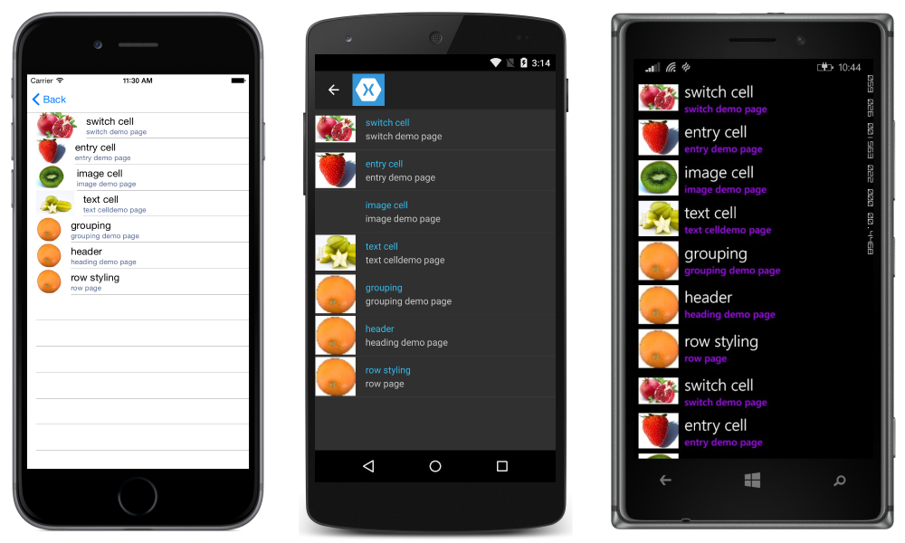

1. **Only Vertical Scrolling:** Android allows listviews to be scrollable only in verticle direction. No horizontal lists allowed. And also, If you want to use Grid as a ListView, you cannot! You need to use another widget, which is GridView. This is a putting off limitation of ListView.
2. **Lagged Scrolling:** Lists rendered using ListView widget have low performance. It provides us with a scrolling list that lags too much. This is because ListView has a habit of creating as many views (rows) as there are data items in the dataset. This creation of views and using findViewById() method is a costly affair. (Sorry for including a method in the high-level-view but I couldn’t resist) And the reason why this is lagged and how it was overcome, will be done in the remaining parts to come.
3. **Animations:** ListView had no in-built features for providing animations. It took days for animations to be incorporated into them.

## RecyclerView 运势而生

* 默认支持 Linear、Grid、Staggered Grid 三种布局
* 友好的 itemAnimator 动画Api
* 强制实现 ViewHolder
* 解耦的架构设计
* 相对 ListView 有更好的性能


# RecyclerView 的架构

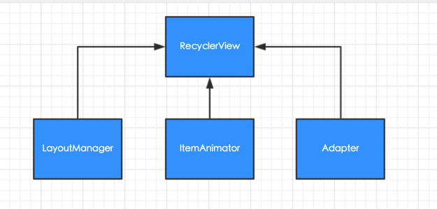

RecylerView 体系包含三大组件：

- Adapter : 提供 Views。

- LayoutManager :  定位 Views。
- Item Animator : 为 View 添加动画。

这三大组件各司其职，而 RecyclerView 负责管理，就组成了整个 RecyclerView 的架构。

## RecyclerView.Adapter

### 什么是 Adapter

Adatper 是一种设计模式：适配器模式（Adapter Pattern) ，但是适配器到底是什么呢？就是下图的东西（个人觉得如果翻译成转换器或许更为清晰）。

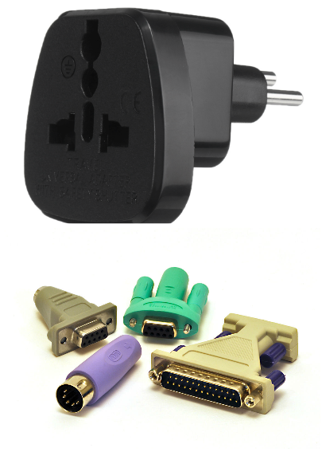

他的意图是为两个不兼容的接口之间的桥梁，将一个类的接口转换成客户希望的另外一个接口。适配器模式使得原本由于接口不兼容而不能一起工作的那些类可以一起工作。

简单的说 Adapter 的作用是将类型 A 转换为类型 B。

### RecyclerView.Adapter 的作用

对于 RecyclerView.Adapter [Google 给出了如下定义](https://developer.android.com/reference/android/support/v7/widget/RecyclerView.Adapter)：

> Adapters provide a binding from an app-specific data set to views that are displayed within a `RecyclerView`.
>
> RecyclerView.Adapter 提供了将特定数据集到 RecycleView 中显示 View 的绑定。


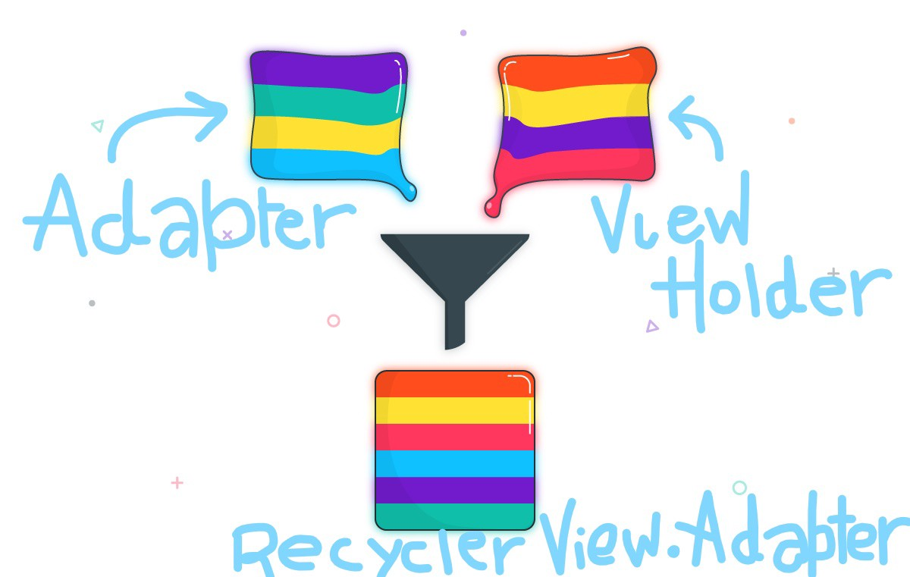

 

RecyclerView.Adapter 主要负责以下几部分的工作：

* 创建 View 和 ViewHodler，ViewHolder 才是真正的目标，它作为整个复用机制的跟踪单元。

* 把具体位置 Item 和 ViewHolder 的绑定，并存储相关信息。

* 通知 RecyclerView 数据的改变，支持局部的更新，在提高效率的同时也有效的支持了动画。

* Item 的交互(点击事件)处理。

* 多类型布局的支持

  RecyclerView.Adaper 可以任意指定一个整形数做为 ViewType，不用像 ListView 的 ViewType 必须连续，因为RecyclerView 并不关心这个 ViewType 到底是什么。在[RecyclerView ins and outs - Google I/O 2016视频里面](https://www.youtube.com/watch?v=LqBlYJTfLP4) 说的到：完全可以直接使用布局资源作为 ViewType，因为 AEPT 保证了 布局 ID 的唯一性（**现在有待确认还行不行**）

* 回收再利用(onFailedToRecyclerView)


## RecyclerView.LayoutManager

LayoutManger 主要负责一下几个部分工作

* **Position**

  LayoutManager 负责 View 的测量、绘制、摆放，LayoutManger 可以是线性、宫格、瀑布流或者自定义的任何类型，而 RecyclerView 也不关心这些。

* **Scroll**

  对于滚动事件的处理，RecyclerView 负责接收事件，但是最终还是由 LayoutManager 进行处理滚动后的逻辑，因为只有他知道 View 的具体位置。

* **Focus traversal**

  当焦点转移导致需要一个新的 item 的出现的在可视区域时， 也是由 LayoutManger 处理的。

  

## RecyclerView.ItemAnimator


# Recyclerview.ViewHolder

> A ViewHolder describes an item view and metadata about its place within the RecyclerView.


## ViewHolder 解决的是什么问题？

findeViewById 使用的算法的时间复杂度是 O(n)

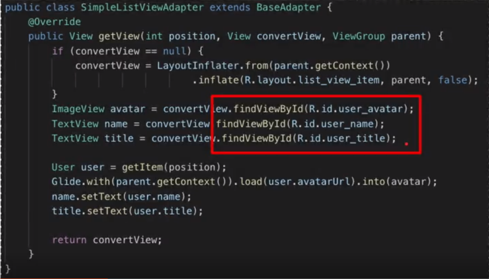

**ViewHolder 想要解决的问题是减少少 findViewById() 的过程，提高效率!**

> `View.setTag(Object)` 把任何 Object 存储到 View 中，需要使用的时候通过 `getTag` 获取出来。

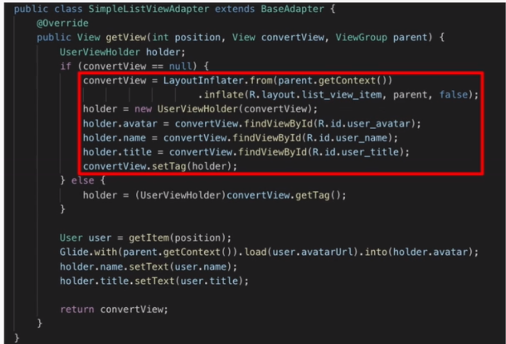

## ViewHolder 和 item view 是一对一？ 一对多？多对多？


## 不用 ViewHolder 还复用 item view 吗？

不用 ViewHolder 还是会复用 item view 的，ViewHolder 的本质就是为了较少 `findViewById()` 的过程。

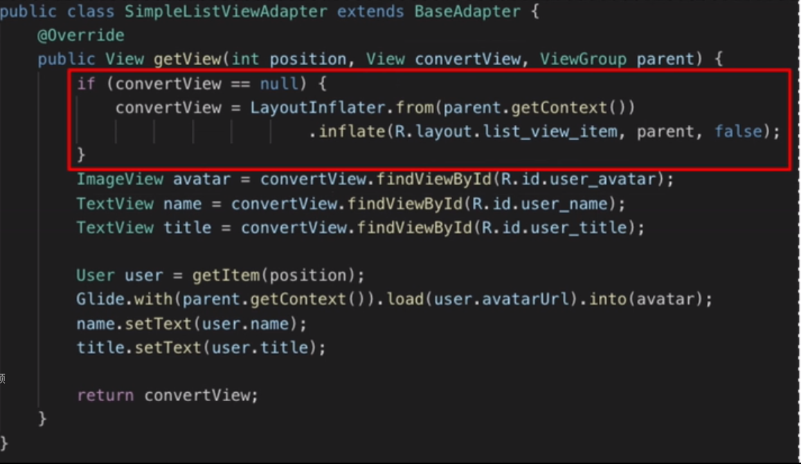


# RecyclerView 缓存机制

## ListView 缓存

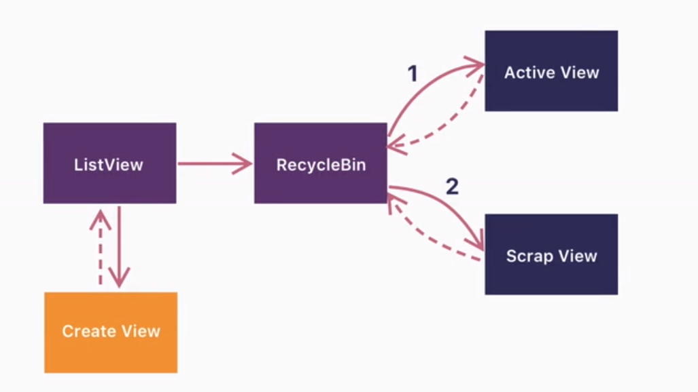

* RecycleBin:  专门用于管理 ListView的缓存的。

* 两层缓存（如下图）：

  1. Activity View ： 屏幕里面的 item view，
  2. Scrap View ： 已经被回收的 view，被放到了 RecycleBin 中


* 查找过程：

  先从 1 找，再从2 找，找了个之后直接绑定数据，如果都找不到则执行 Create View。

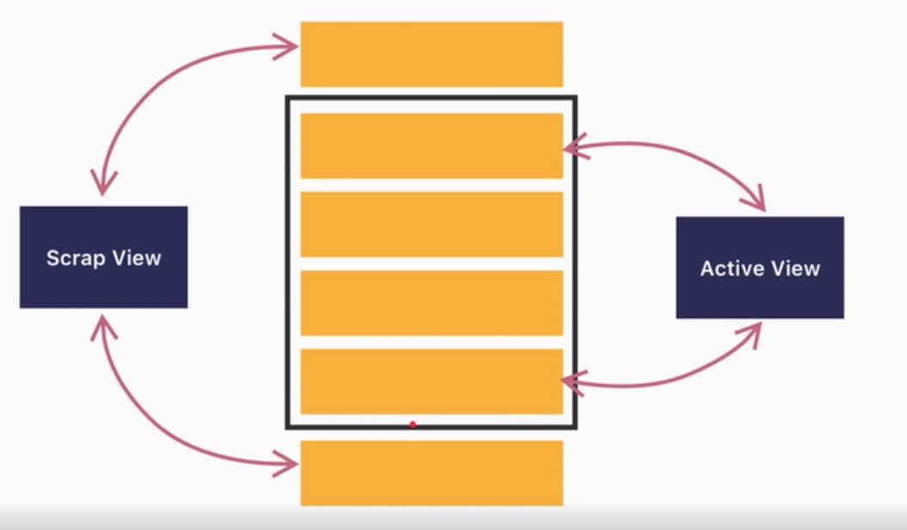

### item view 已经在屏幕中了怎么复用呢？

在每次渲染 `onDraw` 执行（16ms 执行一次）的时候，屏幕上的内容会全部清空，此时数据和View的状态都没有发生改变，可以直接复用。

## RecyclerView 的缓存概述

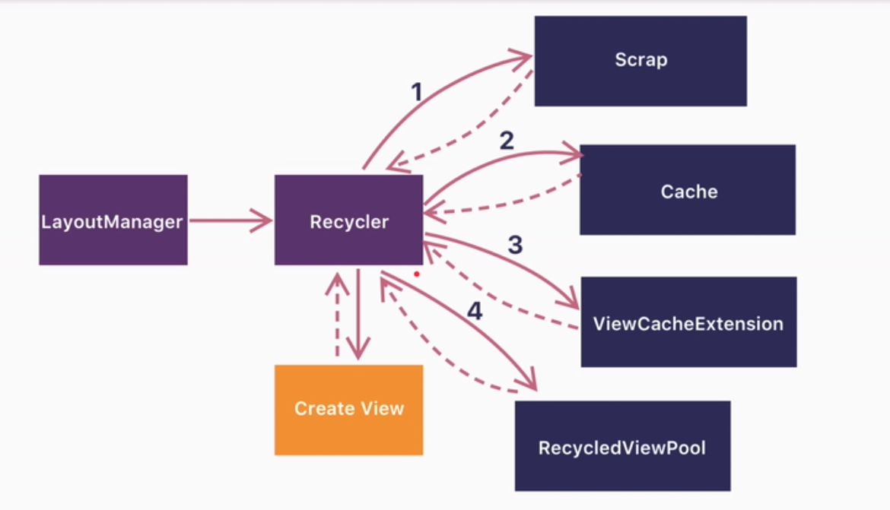


**注意** ：在 ListView 中缓存的是 item view，而 RecyclerView 缓存的是 ViewHolder 但是二者的区别并不大，因为 ViewHolder 和 item view 是一对一的关系。！


RecyclerView 有四级缓存：

1. Scrap：屏幕上活跃的 ViewHolder，在 View 16ms 渲染的时候复用。<font color = #c60c0e>**通过 position 寻找缓存 ViewHolder 是固定的直接拿来复用，不用重新绑定数据**</font>。

2. Cache：出了屏幕的 ViewHolder，<font color = #c60c0e>**同样是通过 postion 确定 ViewHolder 所以直接复用，不用重新绑定数据**</font>。 大小默认为 2，不会被清除数据，相当于一个高速缓存，在用户滑出屏幕后，再次滑动回来，此时 ViewHolder 数据是不用在次绑定的。Scrap、Cache 缓存都是直接复用。

3. ViewCacheExtension:  很特殊，返回的是 item view！很少被使用。需要用户手动实现的。不实现就相当于没有开启这个功能。这个场景网上找找看吧。

4. RecycledViewPool: <font color = #c60c0e>通过 view type 获取缓存</font>，所有里面的 ViewHolder 里面都是存有上次显示的数据的存（脏数据），<font color = #c60c0e>所有需要**重新绑定数据**执行 `onBindViewHolder` 方法</font>

   

如果没有找到缓存，Create ViewHolder


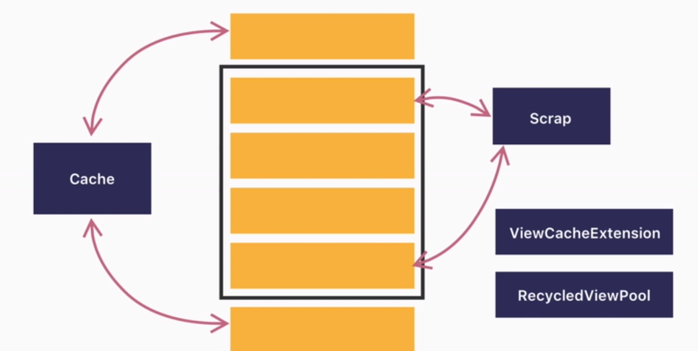


## RecyclerViewPool 机制

我们必须回答以下一下几个问题。

- 缓存背后的数据结构是什么
- ViewHolder 的缓存存储在什么地方并且从那里获取
- 缓存的目的是什么


# ViewHolder 的生命周期

***下面涉及到图一定要手绘一次，注意细节加深理解。***

## 1. 搜索

一起都是从 LayoutManager 请求 RecyclerView 提供指定 position 的 View 开始的。


### 1-1. Cache 中搜索

ViewHolder 和 View 是绑定的一一对应关系，ViewHolder 是 RecyclerView 缓存机制的主要跟踪单元，（**RecyclerView 到第几层缓存中文的都说是两层，上面的课程说是 4 层，需要确认一下**）当 LayoutManager 向 RecyclerView 请求位于有个位置的 View 的时候，RecyclerView 会先从 Cache 中根据 position 寻找（再次强调，这里是按照 position 寻找 View)。

如果在 Cache 中需要到了 View 直接返回使用，不会调用 Adapter 的`onCreateViewHolder`或者`onBindViewHolder`方法

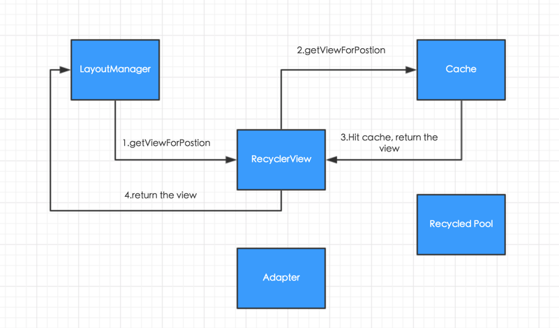

如果没有在 Cache 中找到，则需要在 ViewCacheExtension 中寻找，没有则开始在 RecycledPool 中寻找。       

### 1-2. 根据 ViewType 在 RecycledPool 中搜索

如果 RecycledPool 中存在此类型的 ViewHolder，会回调 Adapter 的`onBindViewHolder`方法，使用最近数据、position 更新`ViewHolder`内绑定的`itemView`状态。

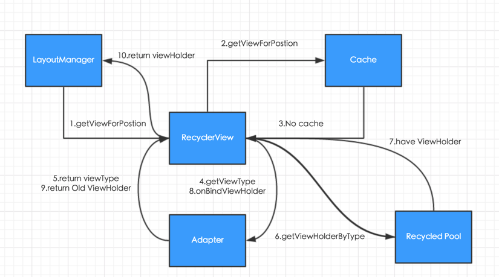


如果 RecycledPool 中不存在此类型的 ViewHolder，则进入下一阶段：创建。


## 2. 创建

如果经过了一次完整的搜索都没有找到 ViewHolder 的缓存，此时会回调用 Adapter 的 `onCreateViewHolder` 方法，创建一个对应此 ViewType 的 ViewHolder 从而完成 View 与 ViewHolder 的绑定工作，并在 `onBindViewHolder` 方法中将绑定具体数据。

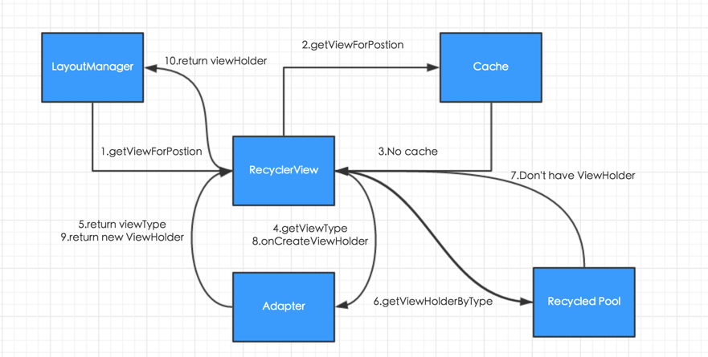

## 3. 添加

在 LayoutManager 获得到 View 之后，会通过 addView 的方法将 View 添加到 RecyclerView 中

RecyclerView 通过 `onViewattachToWindwo(ViewHolder)` 的方法通知 Adapter 这个 ViewHolder 所关联的 itemView 已经添加到布局当中了。

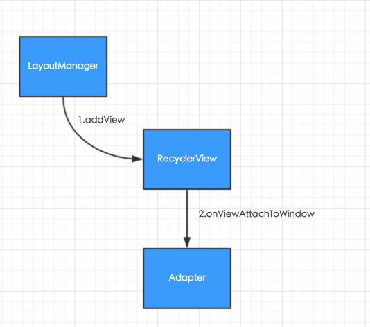

## 4. 移除

LayoutManager 请求 RecyclerView 移除某一个位置的 View 

### 普通情况

当 LayoutManager 发现不再需要一个 position 的 View 的时候(例如：彻底划出屏幕，删除)，他会通知 RecyclerView，RecyclerView 会通过 `onViewDatachFromWindow(ViewHolder)` 通知 Adapter 与 ItemView 绑定的 ViewHolder 被移除了。

此时 RecyclerView 会判断是否需要进行缓存，如果可以缓存则分为以下条件

1. 是划出屏幕的，并且没有超过 Cache 的 size 则进入 Cache，然后在 Cache 中判读是否需要转移到 RecycledPool 中。在放入缓存之后通过 `onViewRecycled` 通知 Adapter 此 ViewHolder 被回收了。
2. 如果删除，这直接判断否需要转移到 RecycledPool 中。

<font color = red>以上两个观点需要验证是否正确 19.9.16 - 23:11</font>

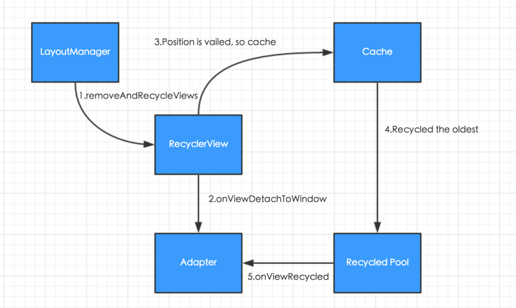

### 异常情况

在上面的普通的情况中，`onViewDetachFromWindow(VH viewHolder)`是立即被回调的。然而在实际当中，由于我们需要对`View`的添加、删除做一些过度动画，这时候，我们需要等待`ItemAnimator`进行完动画操作之后，才做`detach`和`recycle`的逻辑，这一过程对于`LayoutManager`是不可见的。

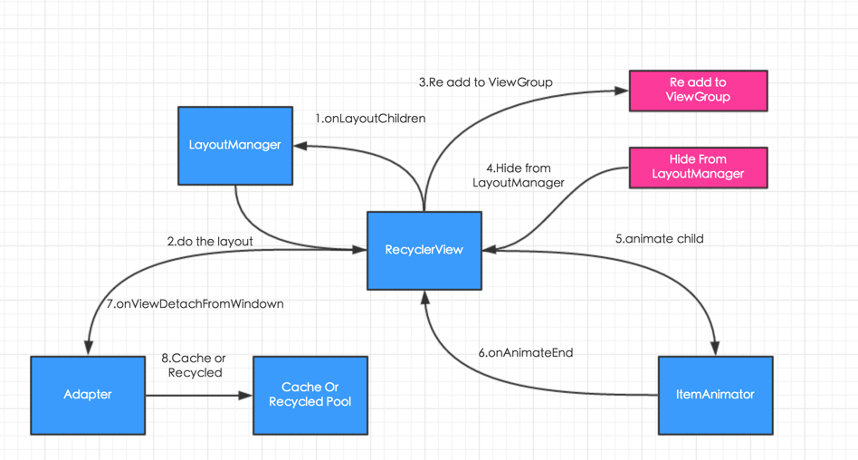

## 5. 销毁

### ViewHolder 所绑定的 itemView 当前状态异常

### RecycledPool中已经没有足够的空间


# 如何统计 item 的 impression 统计

* ListView 通过 getView() 统计
* RecyclerView 通过` onViewAttachedToWindow` 统计，不能通过` onBindViewHolder` 因为 scrap、cache、ViewCacheExtension 都不会执行` onBindViewHolder` 方法，统计会丢失很多的。

  

# RecyclerView的性能优化

## 不要在 `onBindViewHolder` 里面设置监听

会不停的产生 View.OnClickListenr 对象

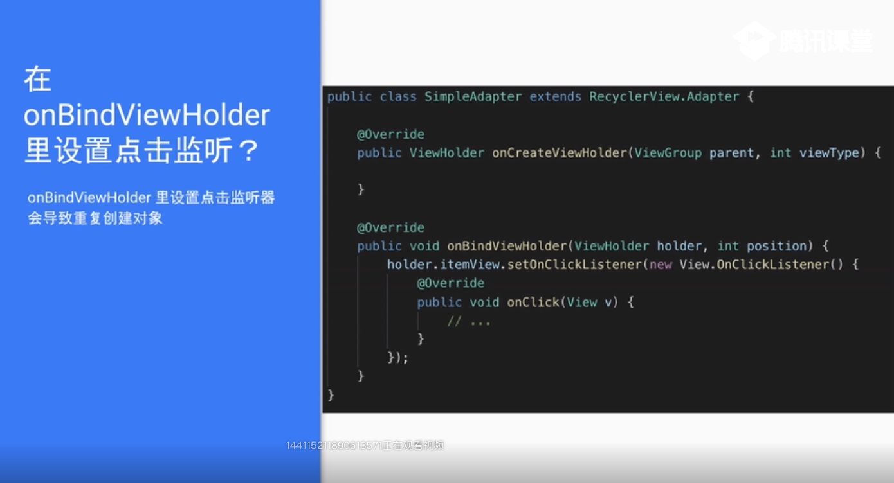

在 onCreateViewHolder 只会创建的时候创建一次

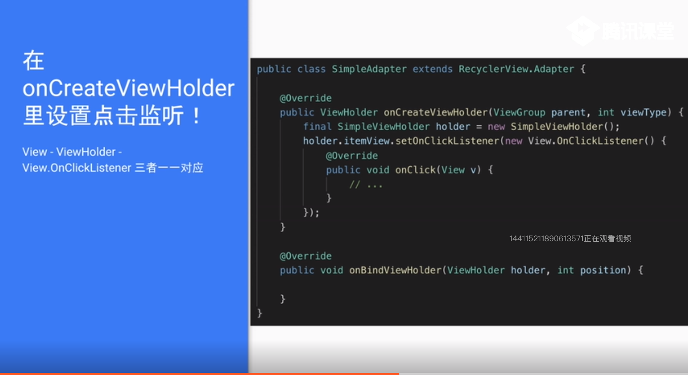

## LinearLayoutManger.setInitialPrefetchItemCount(int)

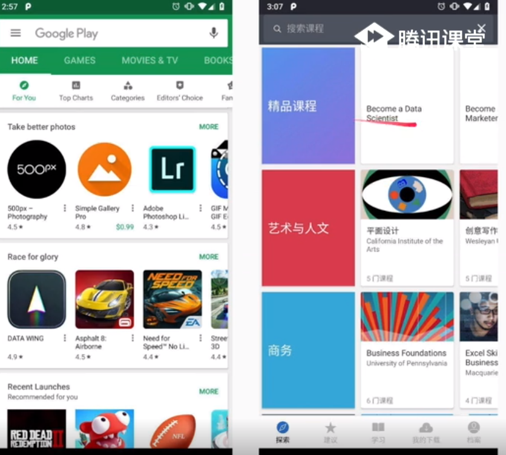

如图，纵向滑动的 RecyclerView 中的 ViewHolder 是一个横向滑动的 RecylerView

* 用户滑动到横向滑动的 item RecyclerView 的时候，由于需要创建更加复杂的 RecyclerView 以及多个子 View，可能导致页面卡顿
* 由于 RenderThread(专门用于渲染的线程，让 UI 线程轻松一些) 的存在，RecyclerView 会进行 prefetch
* LinearLayoutManger.setInitialPrefetchItemCount（横向列表初次显示时可见的 item 个数）
  * 只有 LinearLayoutManger 有这个Api
  * <font color = #c60c0e>只有嵌套在内部的 RecyclerView 才会生效</font>


## RecyclerView.setHasFiexedSize(Bollean)

RecyclerView 内容有变化的时候（插入、删除、内容变化）如果存在固定的大小则直接` layoutChildren`   否则就会执行`requestLayout `这意味着 `onMeasure` 、`onLayout` 、`onDraw` 这些绘制流程都会重新执行一遍，是很耗时的。

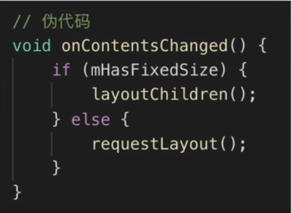

**如果 Adapter 的数据变化的时候不会导致 RecyclerView 大小的变化，这时候可以使用RecyclerView.setHasFiexedSize(true) 进行优化**，这个方法一般人不知道，但是很有用！


##多个 RecyclerView 公共 RecycledViewPool

view type 大量相同的时候，我们就可以同享缓存池，<font color = red>但是绑定之后，要注意解除绑</font>

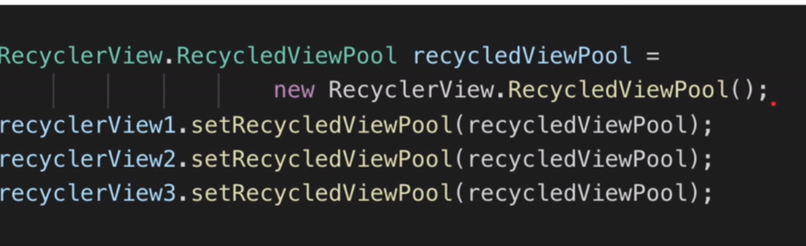	


# [DiffUtil](https://developer.android.com/reference/android/support/v7/util/DiffUtil)

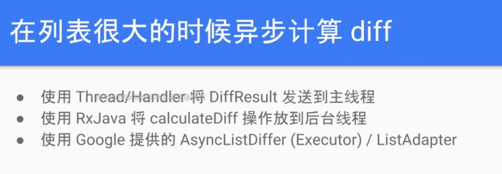

更多内容可以参考[【Android】RecyclerView的好伴侣：详解DiffUtil](https://blog.csdn.net/zxt0601/article/details/52562770)

# 为什么 ItemDecoration 可以绘制分割线


未完待续……


# 长按滑动交换数据位置

最近太忙了，先写下一个模版代码吧，以后在做说明 ---- 2019.8.18

```java
/**
 * 定义RecycleView的Adapter和SimpleItemTouchHelperCallback直接的交互接口方法
 * Created by mChenys on 2017/2/16.
 */
public interface ItemTouchHelperAdapter {
    /**
     * 数据交换
     */
    void onItemMove(RecyclerView.ViewHolder source, RecyclerView.ViewHolder target);

    /**
     * 数据删除
     */
    void onItemDismiss(RecyclerView.ViewHolder source);

    /**
     * drag或者swipe选中
     */
    void onItemSelect(RecyclerView.ViewHolder source);

    /**
     * 状态清除
     */
    void onItemClear(RecyclerView.ViewHolder source);
}
```


```java
public class SimpleItemTouchHelperCallback extends ItemTouchHelper.Callback {

    private ItemTouchHelperAdapter mAdapter;

    public SimpleItemTouchHelperCallback(ItemTouchHelperAdapter adapter) {
        mAdapter = adapter;
    }

    @Override
    public int getMovementFlags(RecyclerView recyclerView, RecyclerView.ViewHolder viewHolder) {
        //int dragFlags = ItemTouchHelper.UP | ItemTouchHelper.DOWN; //允许上下的拖动
        //int dragFlags =ItemTouchHelper.LEFT | ItemTouchHelper.RIGHT; //允许左右的拖动
        //int swipeFlags = ItemTouchHelper.LEFT; //只允许从右向左侧滑
        //int swipeFlags = ItemTouchHelper.DOWN; //只允许从上向下侧滑
        //一般使用makeMovementFlags(int,int)或makeFlag(int, int)来构造我们的返回值
        //makeMovementFlags(dragFlags, swipeFlags)

        //允许上下的拖动
        int dragFlags = ItemTouchHelper.UP | ItemTouchHelper.DOWN;
        return makeMovementFlags(dragFlags, 0);
    }

    @Override
    public boolean isLongPressDragEnabled() {
        //长按启用拖拽
        return true;
    }

    @Override
    public boolean isItemViewSwipeEnabled() {
        //不启用拖拽删除
        return false;
    }

    @Override
    public boolean onMove(RecyclerView recyclerView, RecyclerView.ViewHolder source, RecyclerView.ViewHolder target) {
        //通过接口传递拖拽交换数据的起始位置和目标位置的ViewHolder
        mAdapter.onItemMove(source, target);
        return true;
    }


    @Override
    public void onSwiped(RecyclerView.ViewHolder viewHolder, int direction) {
        //移动删除回调,如果不用可以不用理
       // mAdapter.onItemDismiss(viewHolder);
    }

    @Override
    public void onSelectedChanged(RecyclerView.ViewHolder viewHolder, int actionState) {
        super.onSelectedChanged(viewHolder, actionState);
        if (actionState != ItemTouchHelper.ACTION_STATE_IDLE) {
            //当滑动或者拖拽view的时候通过接口返回该ViewHolder
            mAdapter.onItemSelect(viewHolder);
        }
    }

    @Override
    public void clearView(RecyclerView recyclerView, RecyclerView.ViewHolder viewHolder) {
        super.clearView(recyclerView, viewHolder);
        if (!recyclerView.isComputingLayout()) {
            //当需要清除之前在onSelectedChanged或者onChildDraw,onChildDrawOver设置的状态或者动画时通过接口返回该ViewHolder
            mAdapter.onItemClear(viewHolder);
        }
    }
```

```java
public class DemoAdapter implements ItemTouchHelperAdapter {

    @Override
    public void onItemMove(RecyclerView.ViewHolder source, RecyclerView.ViewHolder target) {
        int fromPosition = source.getAdapterPosition();
        int toPosition = target.getAdapterPosition();
        if (fromPosition < getDataSet().size() && toPosition < getDataSet().size()) {
            //交换数据位置
            Collections.swap(getDataSet(), fromPosition, toPosition);
            //刷新位置交换
            notifyItemMoved(fromPosition, toPosition);
        }
        //移动过程中移除view的放大效果
        onItemClear(source);
    }

    @Override
    public void onItemDismiss(RecyclerView.ViewHolder source) {
        int position = source.getAdapterPosition();
        //移除数据
        getDataSet().remove(position);
        //刷新数据移除
        notifyItemRemoved(position);
    }

    @Override
    public void onItemSelect(RecyclerView.ViewHolder viewHolder) {
        //当拖拽选中时放大选中的view
        viewHolder.itemView.setScaleX(1.3f);
        viewHolder.itemView.setScaleY(1.3f);
    }

    @Override
    public void onItemClear(RecyclerView.ViewHolder viewHolder) {
        //拖拽结束后恢复view的状态
        viewHolder.itemView.setScaleX(1.0f);
        viewHolder.itemView.setScaleY(1.0f);
    }
}
```

使用时直接绑定到对应的 RecyclerView 上

```java
SimpleItemTouchHelperCallback callback = new SimpleItemTouchHelperCallback(Adaper);
ItemTouchHelper touchHelper = new ItemTouchHelper(callback);
touchHelper.attachToRecyclerView(RecyclerView);
```


# 参考

[Understanding RecyclerView. A high-level Insight](https://android.jlelse.eu/understanding-recyclerview-a-high-level-insight-part-1-dc3f81af5720#2057)

[Anatomy of RecyclerView: a Search for a ViewHolder](https://android.jlelse.eu/anatomy-of-recyclerview-part-1-a-search-for-a-viewholder-404ba3453714)

[图解 RecyclerView 的缓存机制](https://blog.csdn.net/weixin_43130724/article/details/90068112)

[深入浅出 RecyclerView](https://www.kymjs.com/code/2016/07/10/01/)

[RecyclerView ins and outs - Google I/O 2016](https://www.youtube.com/watch?v=LqBlYJTfLP4)

[RecyclerView 知识梳理(1) - 综述](https://www.jianshu.com/p/21a1384df9a1)