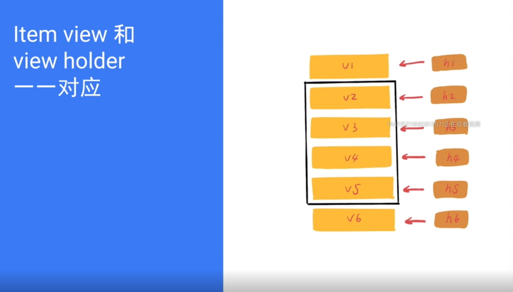

[TOC]


19年8月12日

# RecyclerView 是什么

> a **flexible** view for providing a **limited** window into a **large** data set

一个弹性的 View 在有限的 window 上展示无限的数据集

# RecyclerView 的优势

* 默认支持 Linear、Grid、Staggered Grid 三种布局
* 友好的 itemAnimator 动画Api
* 强制实现 ViewHolder
* 解耦的架构设计
* 相对 ListView 有更好的新能

# RecyclerView 的重要组件

* RecyclerView
* LayoutManager : I portion the viwes
* Item Animator : I animate the views
* Adapter : I provide the views


# View holder 究竟是什么

## View holder解决的是什么问题？

findeViewById 使用的算法的时间复杂度是 O(n)


<font color = # >**View holder 想要解决的问题是较少 findViewById() 的过程，提高效率!**

> `View.setTag(Object)` 把任何 Object 存储到 View 中，需要使用的时候通过 `getTag` 获取出来。


## View holder 和 item view 是一对一？ 一对多？多对多？



## 不用 View holder 还复用 item view 吗？

不用 View holder 还是会复用 item view 的，view holder 的本质就是为了较少 `findViewById()` 的过程。


# RecyclerView 缓存机制

## ListView 缓存


* RecycleBin:  专门用于管理 ListView的缓存的。

* 两层缓存（如下图）：

  1. Activity View ： 屏幕里面的 item view，
  2. Scrap View ： 已经被回收的 view，被放到了 RecycleBin 中


* 查找过程：

  先从 1 找，再从2 找，找了个之后直接绑定数据，如果都找不到则执行 Create View。


### item view 已经在屏幕中了怎么复用呢？

在每次渲染 `onDraw` 执行（16ms 执行一次）的时候，屏幕上的内容会全部清空，此时数据和View的状态都没有发生改变，可以直接复用。

## RecyclerView 的缓存


**注意** ：在 ListView 中缓存的是 item view，而 RecyclerView 缓存的是 View holder 但是二者的区别并不大，因为 View holder 和 item view 是一对一的关系。！


RecyclerView 有四级缓存，

1. Scrap：屏幕上活跃的 View holder，在 View 16ms 渲染的时候复用。<font color = #c60c0e>**通过 position 寻找缓存 View holder 是固定的直接拿来复用，不用重新绑定数据**</font>。

2. Cache：出了屏幕的 View holder，<font color = #c60c0e>**同样是通过 postion 确定 View holder 所以直接复用，不用重新绑定数据**</font>。 大小默认为 2，不会被清楚数据，相当于一个高速缓存，在用户滑出屏幕后，再次滑动回来，此时 View holder 数据是不用在次绑定的。Scrap、Cache 缓存都是直接复用。

3. ViewCacheExtension:  很特殊，返回的是 item view！很少被使用。需要用户手动实现的。这个场景网上找找看吧。

4. RecycledViewPool: <font color = #c60c0e>通过 view type 获取缓存</font>，所有里面的 View holder 里面都是存有上次显示的数据的存（脏数据），<font color = #c60c0e>所有需要**重新绑定数据**执行 `onBindViewHolder` 方法</font>

   

如果没有找到缓存，Create View holder


# 如何统计 item 的 impression 统计

* ListView 通过 getView() 统计
* RecyclerView 通过` onViewAttachedToWindow` 统计，不能通过` onBindViewHolder` 因为 scrap、cache、ViewCacheExtension 都不会执行` onBindViewHolder` 方法，统计会丢失很多的。
* 

https://blog.csdn.net/zxt0601/article/details/52562770)

# RecyclerView的性能优化

## 不要在 `onBindViewHolder` 里面设置监听

会不停的产生 View.OnClickListenr 对象


在 onCreateViewHolder 只会创建的时候创建一次


## LinearLayoutManger.setInitialPrefetchItemCount(int)


如图，纵向滑动的 RecyclerView 中的 View holder 是一个横向滑动的 RecylerView

* 用户滑动到横向滑动的 item RecyclerView 的时候，由于需要创建更加复杂的 RecyclerView 以及多个子 View，可能导致页面卡顿
* 由于 RenderThread(专门用于渲染的线程，让 UI 线程轻松一些) 的存在，RecyclerView 会进行 prefetch
* LinearLayoutManger.setInitialPrefetchItemCount（横向列表初次显示时可见的 item 个数）
  * 只有 LinearLayoutManger 有这个Api
  * <font color = #c60c0e>只有嵌套在内部的 RecyclerView 才会生效</font>


## RecyclerView.setHasFiexedSize(Bollean)

RecyclerView 内容有变化的时候（插入、删除、内容变化）如果存在固定的大小则直接` layoutChildren`   否则就会执行`requestLayout `这意味着 `onMeasure` 、`onLayout` 、`onDraw` 这些绘制流程都会重新执行一遍，是很耗时的。


**如果 Adapter 的数据变化的时候不会导致 RecyclerView 大小的变化，这时候可以使用RecyclerView.setHasFiexedSize(true) 进行优化**，这个方法一般人不知道，但是很有用！


##多个 RecyclerView 公共 RecycledViewPool

view type 大量相同的时候，我们就可以同享缓存池，<font color = red>但是绑定之后，要注意解除绑</font>

	


# DiffUtil


# 为什么 ItemDecoration 可以绘制分割线


未完待续……


# 长按滑动交换数据位置

最近太忙了，先写下一个模版代码吧，以后在做说明 ---- 2019.8.18

```java
/**
 * 定义RecycleView的Adapter和SimpleItemTouchHelperCallback直接的交互接口方法
 * Created by mChenys on 2017/2/16.
 */
public interface ItemTouchHelperAdapter {
    /**
     * 数据交换
     */
    void onItemMove(RecyclerView.ViewHolder source, RecyclerView.ViewHolder target);

    /**
     * 数据删除
     */
    void onItemDismiss(RecyclerView.ViewHolder source);

    /**
     * drag或者swipe选中
     */
    void onItemSelect(RecyclerView.ViewHolder source);

    /**
     * 状态清除
     */
    void onItemClear(RecyclerView.ViewHolder source);
}
```


```java
public class SimpleItemTouchHelperCallback extends ItemTouchHelper.Callback {

    private ItemTouchHelperAdapter mAdapter;

    public SimpleItemTouchHelperCallback(ItemTouchHelperAdapter adapter) {
        mAdapter = adapter;
    }

    @Override
    public int getMovementFlags(RecyclerView recyclerView, RecyclerView.ViewHolder viewHolder) {
        //int dragFlags = ItemTouchHelper.UP | ItemTouchHelper.DOWN; //允许上下的拖动
        //int dragFlags =ItemTouchHelper.LEFT | ItemTouchHelper.RIGHT; //允许左右的拖动
        //int swipeFlags = ItemTouchHelper.LEFT; //只允许从右向左侧滑
        //int swipeFlags = ItemTouchHelper.DOWN; //只允许从上向下侧滑
        //一般使用makeMovementFlags(int,int)或makeFlag(int, int)来构造我们的返回值
        //makeMovementFlags(dragFlags, swipeFlags)

        //允许上下的拖动
        int dragFlags = ItemTouchHelper.UP | ItemTouchHelper.DOWN;
        return makeMovementFlags(dragFlags, 0);
    }

    @Override
    public boolean isLongPressDragEnabled() {
        //长按启用拖拽
        return true;
    }

    @Override
    public boolean isItemViewSwipeEnabled() {
        //不启用拖拽删除
        return false;
    }

    @Override
    public boolean onMove(RecyclerView recyclerView, RecyclerView.ViewHolder source, RecyclerView.ViewHolder target) {
        //通过接口传递拖拽交换数据的起始位置和目标位置的ViewHolder
        mAdapter.onItemMove(source, target);
        return true;
    }


    @Override
    public void onSwiped(RecyclerView.ViewHolder viewHolder, int direction) {
        //移动删除回调,如果不用可以不用理
       // mAdapter.onItemDismiss(viewHolder);
    }

    @Override
    public void onSelectedChanged(RecyclerView.ViewHolder viewHolder, int actionState) {
        super.onSelectedChanged(viewHolder, actionState);
        if (actionState != ItemTouchHelper.ACTION_STATE_IDLE) {
            //当滑动或者拖拽view的时候通过接口返回该ViewHolder
            mAdapter.onItemSelect(viewHolder);
        }
    }

    @Override
    public void clearView(RecyclerView recyclerView, RecyclerView.ViewHolder viewHolder) {
        super.clearView(recyclerView, viewHolder);
        if (!recyclerView.isComputingLayout()) {
            //当需要清除之前在onSelectedChanged或者onChildDraw,onChildDrawOver设置的状态或者动画时通过接口返回该ViewHolder
            mAdapter.onItemClear(viewHolder);
        }
    }
```

```java
public class DemoAdapter implements ItemTouchHelperAdapter {

    @Override
    public void onItemMove(RecyclerView.ViewHolder source, RecyclerView.ViewHolder target) {
        int fromPosition = source.getAdapterPosition();
        int toPosition = target.getAdapterPosition();
        if (fromPosition < getDataSet().size() && toPosition < getDataSet().size()) {
            //交换数据位置
            Collections.swap(getDataSet(), fromPosition, toPosition);
            //刷新位置交换
            notifyItemMoved(fromPosition, toPosition);
        }
        //移动过程中移除view的放大效果
        onItemClear(source);
    }

    @Override
    public void onItemDismiss(RecyclerView.ViewHolder source) {
        int position = source.getAdapterPosition();
        //移除数据
        getDataSet().remove(position);
        //刷新数据移除
        notifyItemRemoved(position);
    }

    @Override
    public void onItemSelect(RecyclerView.ViewHolder viewHolder) {
        //当拖拽选中时放大选中的view
        viewHolder.itemView.setScaleX(1.3f);
        viewHolder.itemView.setScaleY(1.3f);
    }

    @Override
    public void onItemClear(RecyclerView.ViewHolder viewHolder) {
        //拖拽结束后恢复view的状态
        viewHolder.itemView.setScaleX(1.0f);
        viewHolder.itemView.setScaleY(1.0f);
    }
}
```

使用时直接绑定到对应的 RecyclerView 上

```java
SimpleItemTouchHelperCallback callback = new SimpleItemTouchHelperCallback(Adaper);
ItemTouchHelper touchHelper = new ItemTouchHelper(callback);
touchHelper.attachToRecyclerView(RecyclerView);
```

