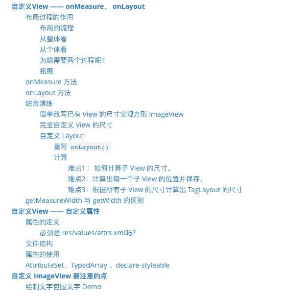

[TOC]

# [View 基础知识](./View 基础知识)

包括以下内容:

1. View 的基本概念
2. View 的坐标系
3. View 的参数位置
4. MotionEvent和TouchSlop
5. VelocityTracker、GestureDetecotr 和 Scroller

# View 的事件分发机制

点击事件的传递规则

滑动冲突解决方案

# View 的工作原理

包括以下内容:

* ViewRoot 和 DecorView

* MesaureSpec

* MeasureSpc 和 LayoutParams 的对应关系

# 自定义 View

# RemoteViews

# Android Drawable

# 动画