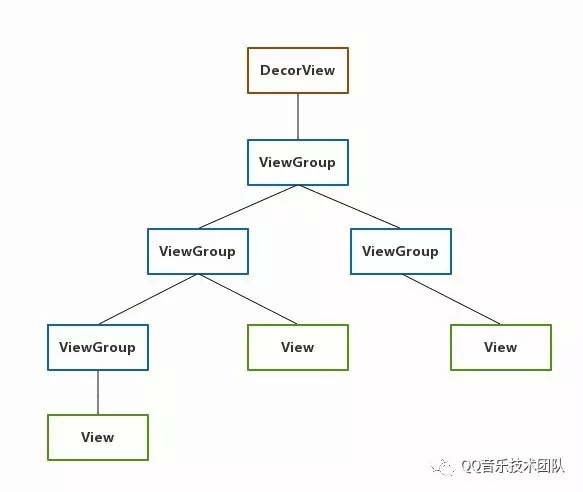
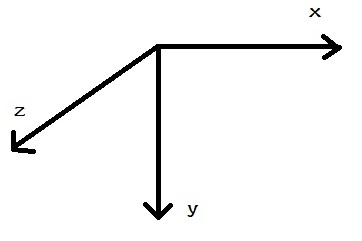
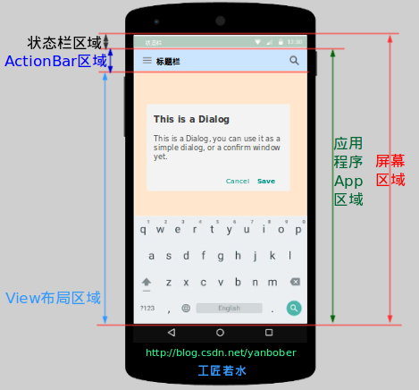
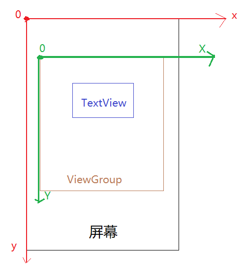
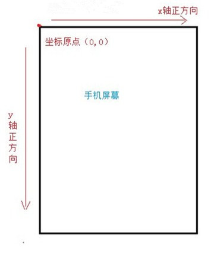
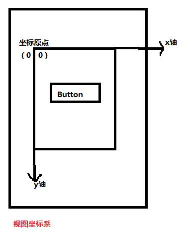
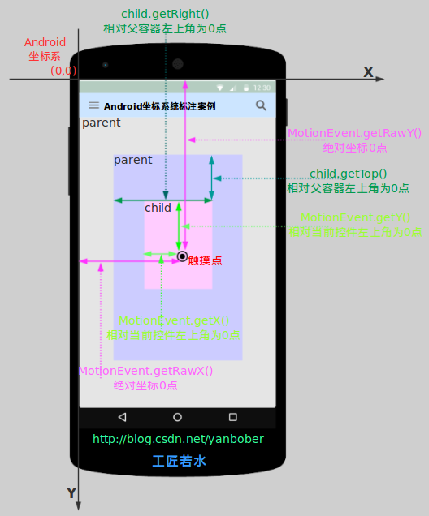

[TOC]


# 前言
View 在 Android 世界中扮演着重要的角色，正是这些控件组成了一个又一个精美的 App。View 体系是 Android 界面编程的核心，虽然它不属于四大组件但是它的重要性却毫不逊色。

# 什么是 View

在 Android 的世界中 View 是所有控件的基类，其中也包括 ViewGroup。View 是一个抽象的概念，特指某一个控件。而 ViewGroup 是代表着控件的集合，他的父类也是 View。 ViewGroup 中可以包含多个 View 并管理他们。通过 ViewGroup，整个界面的控件形成了一个树形结构，这也就是我们常说的控件树，上层的控件要负责测量与布局下层的控件、传递交互事件。我们在开发中常常使用到的 findViewById() 方法，就是在控件树中进行**深度遍历**(比较耗时)来查找对应元素的。在每棵控件树的顶部都存在着一个 ViewParent 对象，它是整棵控件树的核心，所有的交互都由它统一调度和分配，从而对整个视图进行控制。


## ViewParent 

ViewParent 定义了一些作为 View 父类应具有的功能，当一个 View 与其父 View 交互时，就可以用到这些 API.

例如上图绿色的 ViewGroup 节点都是下面子叶的 ViewParent。View 类中提供了`getParent()`方法用于获取当前 View 的直接父节点，可以通过 `view.getParent().getParent()` 遍历所有上层节点。

## view.getParent() VS. view.getRootView()

### 结论

1. 如果该 View 是 View 树的根节点，getParent() 返回 null,
2. 如果该 View 是 View 树的非根节点，getParent() 返回其父 View
3. getRootView 始终返回 View 树的根 View

### 示例1： Activity

**针对Activity**，无论使用什么布局，整体结构都可以使用如下图所示



- 非根节点也就是非DecorView,其getParent()一定是它的父View，DecorView是View树中根节点，其getParent()为null
- Activity的View树中任何节点调用getRootView都是DecorView

### 示例2：inflate 形成View树并且 rootView 传递以 null

```java
View view = LayoutInflater.from(this).inflate(R.layout.title_bar,null);
```

使用布局是title_bar.xml

```xml
<?xml version="1.0" encoding="utf-8"?>
<RelativeLayout xmlns:android="http://schemas.android.com/apk/res/android"
    android:id="@+id/rl_title_bar"
    android:layout_width="match_parent"
    android:layout_height="wrap_content"
    android:orientation="vertical">
    <TextView
        android:id="@+id/tv_text"
        android:layout_width="match_parent"
        android:layout_height="wrap_content"
        android:text="title" />
</RelativeLayout>
```

- 非根节点也就是 TextView，其 getParent() 是 RelativeLayout ,该 View 树中根节点为 ReletiveLayout，其getParent() 是 null
- 该 View 树的任何 View 调用 getRootView() 都返回 RelativeLayout


# Android的常用坐标系

Android 坐标系其实就是一个三维坐标系，Z 轴向前，X 轴向右，Y轴向下。



## Android 屏幕区域的划分



通过上图我们可以很直观的看到 Android 的屏幕区域是如何划分的。接下来我们就看看如何或者这些区域中的坐标和度量方法吧。

```java
// 获取屏幕区域的宽高等尺寸获取
DisplayMetrics metrics = new DisplayMetrics();
getWindowManager().getDefaultDisplay().getMetrics(metrics);
int widthPixels = metrics.widthPixels;
int heightPixels = metrics.heightPixels;
```

```java
// 应用程序App区域宽高等尺寸获取
Rect rect = new Rect();
getWindow().getDecorView().getWindowVisibleDisplayFrame(rect);
```

```java
// 获取状态栏高度
Rect rect= new Rect();
getWindow().getDecorView().getWindowVisibleDisplayFrame(rect);
int statusBarHeight = rect.top;
```

```java
// View 布局区域宽高等尺寸获取
Rect rect = new Rect();  
getWindow().findViewById(Window.ID_ANDROID_CONTENT).getDrawingRect(rect);  
```

**特别注意**：

这些方法最好都在Activity的 `onWindowFocusChanged()` 方法之后调用，因为在 Activity 生命周期中  onCreate、onStart、onResume 这些方法都不是界面 visible 的真正时刻，在`onWindowFocusChanged()`方法回调后才是真正 visible 时刻。


##Android View 坐标系



### 绝对坐标系(也称：Android 坐标系)

绝对坐标系以屏幕左上角为坐标原点，从这个原点水平向右为 X 轴正方向，原点垂直向下为Y轴正反向。即为上图红色部分。



### 相对坐标系(也称：视图坐标系)

所谓相对坐标系（视图坐标系）是以控件父视图的左上角为坐标原点的，从原出发水平向右为 X 轴正方向，垂直向下为 Y 轴正方向来表示控件的相对位置的。




# 获取 View 位置的常见方法：

1. View.getTop、View.getBotoom、View.getLeft、View.getRight
2. View.getX、 View.getY
3. View.getTranslationX、View.getTranslationY
4. View.getLocationInWindow、 View.getLocationOnScreen

## View.getXXX()

这些方法获取的都是**相对父容器的<font color=red>原始</font>位置**。当 View 发生移动的时候这些方法的值都是保持不变的。

View 的宽高和坐标系的关系：

```java
width = getRight() - getLeft()
height = getBottom() - getTop()

```

## translationX、translationY

translationX 表示的是当前 View 对于父 View 发生的偏移量，一开始的时候 translationX = 0，当 View 发生移动的时候 getTop、getRight 这些值是不会发生改变的，改变只有表示偏移量的 translationX 。

## View.getX、 View.getY

表示获取 View 在 Android 坐标系中的绝对位置，它与 getLeft、getTranslateX 存在如下关系

getX()  =  getTranslationX() + getLeft()
getY()  =  getTranslationY() + getTop()

## getLocatonInWindow()、getLocationOnScreen() 

`getLocationInWindow()` ：获取的是一个控件在其所在 window 的坐标位置
`getLocationOnScreent()`: 获取的是控件在屏幕上的坐标位置


`getLocationInWindow() `是以B为原点的C的坐标。
`getLocationOnScreen` 以A为原点，包括了状态栏的高度

一般情况下一个正常的 Activity 的 Window 是充满屏幕的，所以这两个方法将会返回同样的 x 和 y 坐标，仅仅在一些特殊的场景下，例如 dialog 他有属于自己的 window 这个 Acitivty 的 Window 和屏幕是存在偏移量的，这两个方法返回的结果将不同。

 **注意：**这两个方法在 Activity 的 onCreate 中获取的坐标永远是 0，要等 UI 控件都加载完成之后才能获取。在`onWindowFocusChanged()` 中获取最好。因为在生命周期：onCreate、onStart、onResume中真正的View都没有可见。

引自 `onWindowFocusChanged()` 官方文档：

> Called when the current `Window` of the activity gains or loses focus. This is the best indicator of whether this activity is visible to the user. The default implementation clears the key tracking state, so should always be called.

[参考 staticoverflow](https://stackoverflow.com/questions/17672891/getlocationonscreen-vs-getlocationinwindow/20154562#20154562)


## 总结

| 方法        | 解释                                                         |
| ----------- | ------------------------------------------------------------ |
| getTop()    | 获取 View 自身顶边到其父布局顶边的距离                       |
| getLeft()   | 获取 View 自身左边到其父布局左边的距离                       |
| getRight()  | 获取 View 自身右边到其父布局左边的距离                       |
| getBottom() | 获取 View 自身底边到其父布局顶边的距离                       |
| getX()      | 返回值为 getLeft()+getTranslationX()，当setTranslationX()时getLeft()不变，getX()变 |
| getY()      | 返回值为 getTop()+getTranslationY()，当setTranslationY()时getTop()不变，getY()变 |


|View宽高方法|	解释|
| ----------- | ------------------------------------------------------------ |
|getWidth()| layout 后有效，返回值是 mRight-mLeft，表示最终宽度 |
|getHeight()	|layout后有效，返回值是mBottom-mTop，表示最终高度|
|getMeasuredWidth()| 返回 measure 过程中得到的 mMeasuredWidth 值，表示中间值，供layout参考，或许没用。 |
|getMeasuredHeight()|返回 measure 过程中得到的 mMeasuredHeigh t值，表示中间值，供layout参考，或许没用。|

# MotionEvent、TouchSlop



## MotionEvent

MotionEvent 代表手指接触屏幕后所产生的一些列事件，典型的事件类型有如下几种：

* ACTION_DOWN: 手机刚接触屏幕；
* ACTION_MOVE: 手机在屏幕上移动；
* ACTION_UP: 手机从屏幕上松开的一瞬间；


如上图所示，当我们触摸屏幕的时候点击到的无论是 View 还是 ViewGroup，最终的点击事件都会由onTouchEvent(MotionEvent event) 方法来处理，MotionEvent 也提供了各种获取焦点坐标的方法：

| 方法      | 解释                                                     |
| --------- | -------------------------------------------------------- |
| getX()    | 获取点击事件距离**当前 View **左边框的距离，即视图坐标   |
| getY()    | 获取点击事件距离**当前 View **顶部边框的距离，即视图坐标 |
| getRawX() | 获取点击事件距离整个屏幕的左边距离，即绝对坐标           |
| getRawY() | 获取点击事件距离整个屏幕顶部的距离，即绝对坐标           |
**特别注意**：View中的`getX()`、`getY()`方法只是与MotionEvent中的`getX(`)、`getY()`方法只是重名而已，并不是一个。

## TouchSlop

TouchSlop 是系统所能识别出的、认为是滑动的最小距离。 它是一个常量，和设备有关，可以通过如下方法获得：

```JAVA
 ViewConfiguration.get(this).getScaledTouchSlop();
```

如果两次滑动事件的距离小于这个值，我们就可以认为他们并不是滑动，这样就可以给用户更好的体验。

# VelocityTracker、GestureDetecotr 和 Scroller

## VelocityTracker

用于追踪手指在滑动过程中的速度，包括水平和竖直方向的速度。使用方法如下：

```java
   @Override
    public boolean onTouchEvent(MotionEvent event) {
        VelocityTracker velocityTracker = VelocityTracker.obtain();
        // 将事件加入到追踪器
        velocityTracker.addMovement(event);
        // 调用计算代码，这个是必须的，指定计算时间间隔为 1s
        velocityTracker.computeCurrentVelocity(1000);
        // 获取 x、y 轴的速度，这个值可能为负数
        float xVelocity = velocityTracker.getXVelocity();
        float yVelocity = velocityTracker.getYVelocity();
        // 释放跟踪器
        velocityTracker.recycle();
        // 重置并回收内存
        velocityTracker.clear();
        return super.onTouchEvent(event);
    }
```

速度计算公式：速度 = （终点位置 - 起点位置）/ 时间段, 所以获得的速度可能为负值，即当从手指从右向左滑动的时候。

computeCurrentVelocity 方法的参数表示的是一个时间间隔，单位是毫秒。

## GestureDetector

使用的机会并不多，如果只是监听滑动的相关动作，建议自己在 onTouchEvent 中实现，如果要监听双击这种行为的话，再使用 GestureDetector

具体使用可以参考  [看完这篇还不会 GestureDetector 手势检测，我跪搓衣板！](https://www.cnblogs.com/yuanhao-1999/p/11081980.html)、 《Android 开发艺术探究》、Demo -> GestureDetectorDemo

## Scroller

具体可以参考之前的文章 [【Android View事件（三）】Scroll类源码分析与应用](https://blog.csdn.net/qq_23191031/article/details/78452364)

**这里只强调一点**：scrollTo 和 scrollBy 只能改变 View 中内容的位置，并不能改变 View 在布局中的位置。

#参考：

《Android群英传第三章》
[Android中的坐标系以及获取坐标的方法](http://www.linuxidc.com/Linux/2015-11/125391.htm)
[Android应用坐标系统全面详解](http://blog.csdn.net/yanbober/article/details/50419117/)