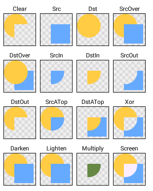
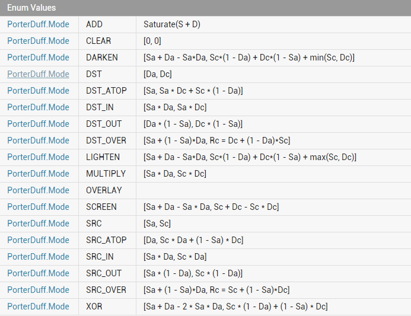
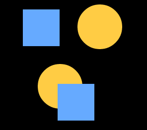
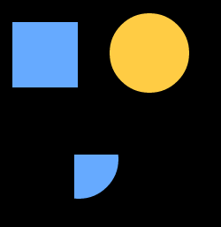
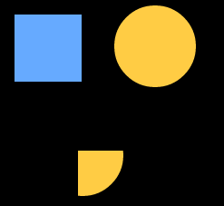

[toc]

# Xfermode



Xfermode 是 transfer mode 的组合，直接翻译过来是：过渡模式。这里的「过渡」指的是图像混合的一种。Xfermode 指的是一种图像混合模式。


今天主要学习的是 ProterDuffXfermode 类。该类同样有且只有一个含参的构造方法`PorterDuffXfermode(PorterDuff.Mode mode)`. 其概念最早来自于 SIGGRAPH 的 Tomas Proter 和 Tom Duff，他们提出了混合图形的概念极大地推动了图形图像学的发展，延伸到计算机图形图像学像 Adobe 和 AutoDesk 公司著名的多款设计软件都可以说一定程度上受到影响，而我们 PorterDuffXfermode 的名字也来源于这俩人的人名组合PorterDuff。




* Sa全称为 Source alpha 表示源图的 Alpha 通道；

* Sc 全称为 Source color 表示源图的颜色；

* Da 全称为 Destination alpha 表示目标图的Alpha通道；

* Dc 全称为 Destination color 表示目标图的颜色；

* [...,..] 前半部分计算的是结果图像的Alpha通道值，“,” 后半部分计算的是结果图像的颜色值。图像混排后是依靠这两个值来重新计算ARGB值的。

##  常用模式

等多内容参考[Android图像处理——Paint之Xfermode](https://blog.csdn.net/allen315410/article/details/45077165)后半部分。

 **PorterDuff.Mode.SRC_OVER**。中文描述：正常绘制显示，源图像居上显示。

```java
private static final PorterDuff.Mode MODE = PorterDuff.Mode.SRC_OVER;
```



**PorterDuff.Mode.SRC_IN**。中文描述： 取两层绘制交集中的源图像。

```java
private static final PorterDuff.Mode MODE = PorterDuff.Mode.SRC_IN;
```



**PorterDuff.Mode.DST_IN**。中文描述：取两层绘制交集中的目标图像。

```java
private static final PorterDuff.Mode MODE = PorterDuff.Mode.DST_IN;
```




# Demo

# 橡皮擦效果 

```java
 /**
     * 初始化实例
     */
    private void init() {
        mPath = new Path();
        // 开启抗锯齿、抗抖动
        mPaint = new Paint(Paint.ANTI_ALIAS_FLAG | Paint.DITHER_FLAG);
        mPaint.setColor(Color.TRANSPARENT);
        mPaint.setXfermode(new PorterDuffXfermode(PorterDuff.Mode.DST_IN));
        mPaint.setStyle(Paint.Style.STROKE);
        // 设置路径结合处样式
        mPaint.setStrokeJoin(Paint.Join.ROUND);
        // 设置笔触类型
        mPaint.setStrokeCap(Paint.Cap.ROUND);
        mPaint.setStrokeWidth(50);
        // 生成前景图, config 必须有 alpha 通道
        mFgBitmap = Bitmap.createBitmap(mWidth, mHeight, Bitmap.Config.ARGB_4444);
        mCanvas = new Canvas(mFgBitmap);
        // 绘制画布背景为中性灰
        mCanvas.drawColor(0xFF808080);
        mBgBitmap = BitmapFactory.decodeResource(getResources(), R.drawable.bg);
        mBgBitmap = Bitmap.createScaledBitmap(mBgBitmap, mWidth, mHeight, true);
    }

    @Override
    protected void onDraw(Canvas canvas) {
        super.onDraw(canvas);
        canvas.drawBitmap(mBgBitmap, 0, 0, null);
        canvas.drawBitmap(mFgBitmap, 0, 0, null);
        /*
         * 这里要注意canvas和mCanvas是两个不同的画布对象
         * 当我们在屏幕上移动手指绘制路径时会把路径通过mCanvas绘制到fgBitmap上
         * 每当我们手指移动一次均会将路径mPath作为目标图像绘制到mCanvas上，而在上面我们先在mCanvas上绘制了中性灰色
         * 两者会因为DST_IN模式的计算只显示中性灰，但是因为mPath的透明，计算生成的混合图像也会是透明的
         * 所以我们会得到“橡皮擦”的效果
         */
        mCanvas.drawPath(mPath, mPaint);
    }
```


##  IrregularDrawableView 例子

## 微信 Tab 切换


# Bitmap & Drawable 

## Bitmap 是什么

位图信息的存储，即一个图形每个像素颜色的存储。

```java
    /**
     * 加载 Bitmap
     *
     * @param drawableRes 资源id
     * @param reqWidth    结果的宽度
     * @param reqHeight   结果的高度
     * @return 经过计算采样率的bitmap
     */
    Bitmap getBitmap(@DrawableRes int drawableRes, int reqWidth, int reqHeight) {
        BitmapFactory.Options options = new BitmapFactory.Options();
        // 只加载进入内存
        options.inJustDecodeBounds = true;
        // 获取option
        BitmapFactory.decodeResource(getResources(), drawableRes, options);
        options.inSampleSize = calculateInSampleSize(options, reqWidth, reqHeight);
        options.inJustDecodeBounds = false;
        return BitmapFactory.decodeResource(getResources(), drawableRes, options);
    }

```


```java
    /**
     * 计算采样率
     *
     * @param options   BitmapFactory.Options
     * @param reqWidth  结果的宽度
     * @param reqHeight 结果的高度
     * @return inSampleSize
     */
    int calculateInSampleSize(BitmapFactory.Options options, int reqWidth, int reqHeight) {
        // Raw height and width of image
        final int height = options.outHeight;
        final int width = options.outWidth;
        int inSampleSize = 1;

        if (height > reqHeight || width > reqWidth) {

            final int halfHeight = height / 2;
            final int halfWidth = width / 2;

            // Calculate the largest inSampleSize value that is a power of 2 and keeps both
            // height and width larger than the requested height and width.
            while ((halfHeight / inSampleSize) >= reqHeight
                && (halfWidth / inSampleSize) >= reqWidth) {
                inSampleSize *= 2;
            }
        }

        return inSampleSize;
    }
```


## Drawable 是什么

Drawable 是一个可以调用 Canvas 来进行绘制的上层工具，调用 Drawable.draw(Canvas) 可以把 Drawable 设置的绘制内容绘制到 Canvas 上。

Drawable 内部存储的是绘制的规则，这个规则可以是一个具体的 Btimap，也可以是一个纯粹的颜色，甚至可以是一个抽象、灵活的描述。Drawable 可以不包含具体的像素信息，只要他含有的信息足以在 draw(Canvas) 方法被调用时进行绘制就足够了。

在绘制之前需要调用 Drawable.setBounds() 来为他设置绘制的边界。


## Bitmap 与 Drawable 的关系

事实上，由于 Bitmap 和 Drawable 是两个不同的概念，因此确切地说他们并不存在相互转换的关系，而是从其中一个获取另外一个对象:

* Bitmap -> Drawable : 创建一个 BitmapDrawable

```java
 public static Drawable bitmap2Drawable(Bitmap bitmap) {
        return new BitmapDrawable(Resources.getSystem(), bitmap);
    }
```


* Drawable -> Bitmap: 如果是 BitmapDrawable，可以使用 BtimapDrawable.getBitmap() 直接获取，如果不是创建一个 Btimap 和一个 Canvas，使用 Drawable 通过 Canvas 把内容绘制到 Bitmap 中。

```JAVA
    /**
     * drawable 转换为 bitmap
     */
    public static Bitmap drawable2Btimap(Drawable drawable) {
        if (drawable instanceof BitmapDrawable) {
            return ((BitmapDrawable) drawable).getBitmap();
        }
        int w = drawable.getIntrinsicWidth();
        int h = drawable.getIntrinsicHeight();
        if (w > 0 && h > 0) {
            Bitmap bitmap = Bitmap.createBitmap(w, h, Bitmap.Config.RGB_565);
            // 这一步很关键，设置 bounds 指定了绘制的区域，否者绘制有问题。
            drawable.setBounds(0, 0, w, h);
            Canvas canvas = new Canvas(bitmap);
            drawable.draw(canvas);
            return bitmap;
        }
      return null;
    }
```


| 像素类型  | 说明                                                         |
| --------- | ------------------------------------------------------------ |
| ARGB_8888 | 四个通道都是8位，每个像素占用4个字节，图片质量是最高的，但是占用的内存也是最大的 |
| ARGB_4444 | 四个通道都是4位，每个像素占用2个字节，图片的失真比较严重     |
| RGB_565   | 没有  alpha 通道，每个像素占用2个字节，图片失真小，但是没有透明度； |
| ALPHA_8   | 只有A通道，每个像素占用1个字节大大小，只有透明度，没有颜色值 |

使用场景总结：ARGB_4444 失真严重，基本不用；ALPHA_8 使用场景特殊，比如设置遮盖效果等；不需要设置透明度，RGB_565 是个不错的选择；既要设置透明度，对图片质量要求又高，就用 ARGB_8888。


## 自定义 Drawalbe

```java
/**
 * 自定义 Drawable
 * Created by im_dsd on 2019-08-01
 */
public class DrawableDemo extends Drawable {

    private Paint mPaint;

    {
        mPaint = new Paint(Paint.ANTI_ALIAS_FLAG);
    }

    @Override
    public void draw( @NonNull Canvas canvas) {
        // 自己想绘制的内容
    }

    // 注意： setAlpha 和 getAlpha 必须成对出现，不然白写，没有意义
    @Override public void setAlpha(int alpha) {
        mPaint.setAlpha(alpha);
    }

    // 注意：setAlpha 和 getAlpha 必须成对出现，不然白写，没有意义
    @Override public int getAlpha() {
        return mPaint.getAlpha();
    }

    // 设置颜色过滤器
    @Override public void setColorFilter( @Nullable ColorFilter colorFilter) {
        mPaint.setColorFilter(colorFilter);
    }

    // 设置不透明度，这个方法返回的并不是具体的值，还是三种状态：不透明，半透明，全透明
    @Override public int getOpacity() {
        if (mPaint.getAlpha() == 0Xff) {
            // 不透明
            return PixelFormat.OPAQUE;
        } else if (mPaint.getAlpha() == 0) {
            // 全透明
            return PixelFormat.TRANSPARENT;
        } else {
            // 半透明
            return PixelFormat.TRANSLUCENT;
        }
    }
}
```

### 有什么用

更加抽象专注、仅仅用于绘制自定义 View 的模块。

### 用来干什么

需要共享多个View之间的绘制代码，写在 Drawable 里，然后在定义 View 里面之后引用相同的 Drawable 就可以了，而且不用相互粘贴代码。例如金融软件的 K 线图，可以把共享的界面放进去。


# 参考

[Android中Xfermode简单用法](https://blog.csdn.net/logicsboy/article/details/44903371)

[详解Paint的setXfermode(Xfermode xfermode)](http://www.cnblogs.com/tianzhijiexian/p/4297172.html)

[Android图像处理——Paint之Xfermode](https://blog.csdn.net/allen315410/article/details/45077165)

[自定义控件其实很简单1/6](https://blog.csdn.net/aigestudio/article/details/41316141)