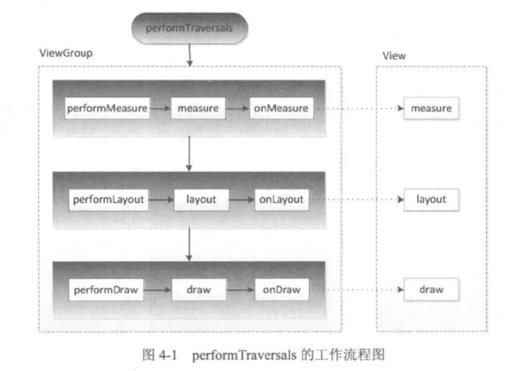
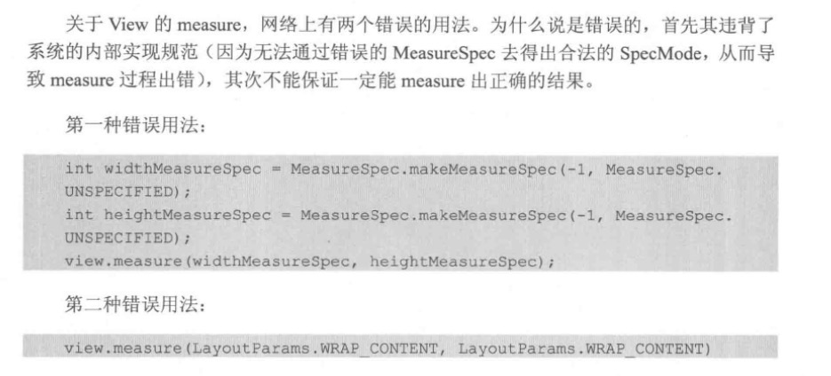

[toc]

# ViewRoot 和 DecorView

ViewRoot 对应于 ViewRoomImpl 类，他是链接 WindowManager 和 DecorViw 的纽带。View 的三大流程都是由 ViewRoot 来完成的。

在 ActivityThread 中， 当 Activity 对象被创造完毕后，会将 DecorView 添加到 Window 中，同时会常见 ViewRootImpl 对象，并将其与 DecorView 建立联系。


View 的绘制流程是从 ViewRoot 的 performTraversals 方法开始的，performTraversals 会依次调用 performMeasure，performLayout，performDraw 三个方法。具体流程如图：



# MesaureSpec

MesaureSpec 代表一个 32 位 int 值，高 2 位代表 SpecMode，低 20 位代表 SpecSize

SpecMode：

* UNSPECIFIED:

  父容器不对 View 做任何限制，要多大给多大的空间，此模式主要用于系统多次 Measure 的情形。具体的场景例如一个 ScrollView。

* EXACTLY:

  父容器已经检测出 View 所需的精确大小，这个时候 View 的最终大小就是 SpecSize 所制定的值，对应 LayoutParams 中的 match_parent 和具体的数值这两种模式。

* AT_MOST:

  父亲容器制指定了一个最大值，View 大小不能超过这个值，相当于 LayoutParams 中的 warp_content。

## MeasureSpc 和 LayoutParams 的对应关系

Android 的系统内部是通过 MeasureSpec 来进行 View 的测量的，**在 View 测量的时候系统会读取 View 的 LayoutParams ==并在父容器的约束下==转行成对应的 MeasureSpec** ，然后再根据这个 MeasureSpec 来确定 Views 测量后的宽/高

**注意：** 

* 决定 View 的 MeasureSpec 的因素： View.LayoutParams + 父容器的 MeasureSpec；

* DecorView 的 MeasureSpec 由 DecorView.LayoutParams + 窗口的 MeasureSpec 来决定。

 

# View 的工作流程

工作流程：measure、layout、draw

* measure（测量）：确定 View 的宽、高
* layout（布局）：确定 View 四个顶点的位置及==最终大小==
* draw（绘制）：将 View 绘制到屏幕上

## measure 过程

### View 的 measure 过程

具体细节参看《Android 开发艺术探索》

View 的 measure 方法是 final 的，子类不可以继承，最终的测量方法都是在 onMeasure 中回调完成的。==由此可见 measure 是调用者，而 onMeasure 是执行者==。

```java
    protected void onMeasure(int widthMeasureSpec, int heightMeasureSpec) {
        setMeasuredDimension(getDefaultSize(getSuggestedMinimumWidth(), widthMeasureSpec),
                getDefaultSize(getSuggestedMinimumHeight(), heightMeasureSpec));
    }
```

重点是 getDefaultSize 这个方法，在 AT_MOST, EXACTLY 模式下，就会返回 specSize，这个 size 就是上文提到的使用 LayoutParams + parent MeasureSpec 获得的，具体的解读看 《Android 开发艺术探索》4.3

```java
    public static int getDefaultSize(int size, int measureSpec) {
        int result = size;
        int specMode = MeasureSpec.getMode(measureSpec);
        int specSize = MeasureSpec.getSize(measureSpec);

        switch (specMode) {
        case MeasureSpec.UNSPECIFIED:
            result = size;
            break;
        case MeasureSpec.AT_MOST:
        case MeasureSpec.EXACTLY:
            result = specSize;
            break;
        }
        return result;
    }

```

UNSPECIFIED 模式的时候会先看有没有设置 Drawable 如果有没有使用 mMinWidth 这个大小可能为 0 ，如果有 使用 max(mMinWidth, mBackground.getMinimumWidth())。

### ViewGroup 的 measure 过程

ViewGroup 没有对于 onMeasure 方法有更多的实现，因为不同的子类都有着各自的测量方式不好统一，例如 LinearLayout、RelativeLayout

### Activity 刚启动如何获取 View 的宽高

这之后 View 的 measure 可能还没有完成，获取到的宽高都会是 0 。解决的方案有以下几种

1. Activity/View#onWindowFoucsChanged： 

   此方法的含义是，View 的初始化已经完毕，宽高已经准备好了，这个时候去获取宽、高是没问题的，但是此方法会被回调多次。当 Actiivty 焦点发生变化的时候都会回调一次。具体的说，当 Activity 继续执行和暂停的时候，都会回调。如果频繁的进行 onResume 和 onPause，那么 onWindowFocusChanged 也会频繁地调用。

   ```java
      @Override
       public void onWindowFocusChanged(boolean hasFocus) {
           super.onWindowFocusChanged(hasFocus);
           if (hasFocus) {
               int measuredHeight = mRecyclerView.getMeasuredHeight();
               int measuredWidth = mRecyclerView.getMeasuredWidth();
           }
       }
   ```

2. view.post(runnable)

3. ViewTreeObserver

4. view.measure()

   具体细节参看《Android 开发艺术探索》4.3.1后半部分

   此时所有 View 的大小都不知道，所以只能通过指定明确的大小，有两种可取的方法

   **制定具体的大小**

   ```java
   int widthMeasureSpec = MeasureSpec.makeMeasureSpec(100, MeasureSpec.EXACTLY);
   int heightMeasureSpec = MeasureSpec.makeMeasureSpec(100, MeasureSpec.EXACTLY);
   view.measure(widthMeasureSpec, heightMeasureSpec);
   ```

   **指定最大值**

   ```java
   int widthMeasureSpec = MeasureSpec.makeMeasureSpec((1 << 30) - 1, MeasureSpec.AT_MOST);
   int heightMeasureSpec = MeasureSpec.makeMeasureSpec((1 << 30) - 1,MeasureSpec.EXACTLY);
   view.measure(widthMeasureSpec, heightMeasureSpec);
   ```

   View 的尺寸使用30位二进制表示，也就是最大30个1 = 2^30 -1，也就是 (1 << 30) - 1。

   

### 总结 View 的measure 过程

## layout 过程

## draw 过程

