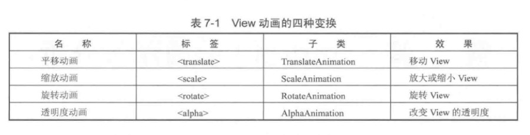
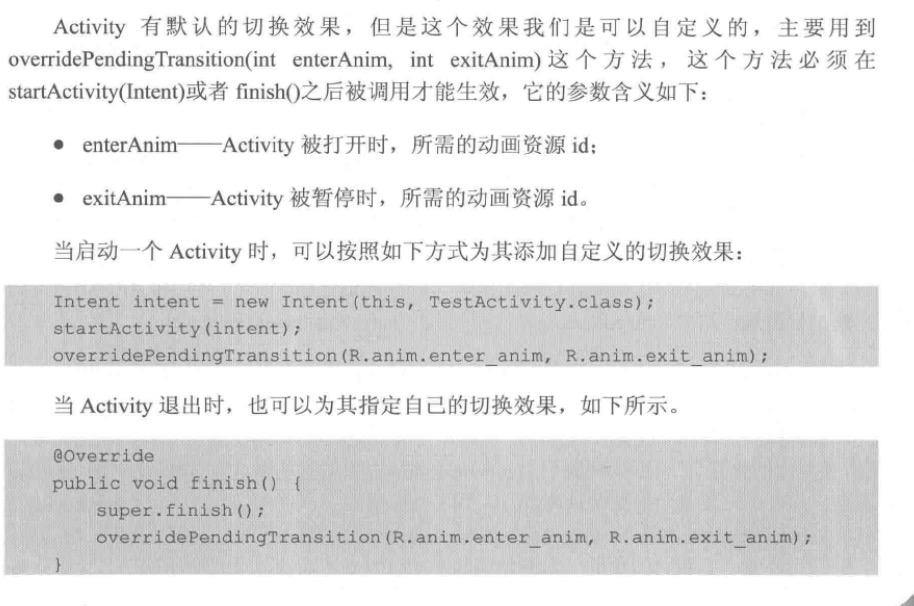
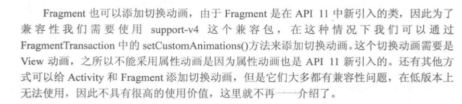

[TOC]

# View动画
View 动画作用的是 View，它支持 4 中效果：平移、缩放、旋转、透明



# 帧动画

帧动画也属于 View 动画，他是播放一系列图片的，所有图片不能太大否则有 OOM 的风险。

## Activiyt 的切换效果



**注意：**overridePendingTransion 这个方法必须位于 startActivity 或者 finish 的后面，否者动画效果将不起作用。

## Fragment 切换动画



# 属性动画

属性动画改变的事View的真实属性：例如：x、y坐标这些属性。


ViewPrepertyAnimate: view 自带的属性动画，但是限制性比较强，只支持View自带的属性，不能自定义属性。

实现原理，不停的调用 setXXXX 的相关方法，从而改变属性。	

```java
view.animate()
		.translationX(100)
		.translationY(100)
		.setStartDelay(100)
		.start
```


# 使用动画注意的事项

## OOM 问题

这个问题主要出现在帧动画中，当图片数量较多且图片较大的时候，所以在实际开发的时候避免使用帧动画

## 内存泄漏

在属性动画中有一类无限循环的动画，这类动画需要在 Activity 退出的时候停止，否者会导致 Activity 无法释放从而导致内存泄漏，

## View 动画的问题

View 动画是对 View 的影响做的动画，并没有真正的改变 View 的状态，因此有时候会出现动画完成后 View 无法隐藏的现象，也就是 setVisibility(GON) 失效了，这个时候只需要调用 View.clearAnimation() 清楚动画即可。


[Android 8 种动画你用过几个？](https://mp.weixin.qq.com/s/NejvLY1IQsG5_I7hN91tPA)

