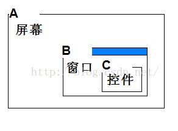

[TOC]


# 自定义View

## 自定义的布局过程

### 布局过程的作用

* 确定每个View的位置和尺寸
* 作用：为绘制和触摸范围做支持
  * 绘制：知道往哪里了画
  * 触摸返回：知道用户点的是哪里

### 布局的流程

* 测量流程：从根 View 递归调用每一级子 View 的 measure 方法，对它们进行测量。
* 布局流程：从根 View 递归调用每一级子 View 的 layout 方法，把测量过程得出的子 View 的位置和尺寸传给子 View，子 View 保存。

**为啥需要两个过程呢？**

* onMeasure 与 measure() 、onDraw 与 draw 的区别

  onXX 方法是调度过程的，而 measure、draw 才是真正做事情的

* 为什么不把对于尺寸的要求直接交个子 View 而是要交给父 View 呢？

  因为有些场景，子 View 的大小需要父 View 进行规划，例如 LinearLayout 的子 View 全部设置了 weight 

**注意：**

1. layout() 很少被使用到，因为他的改变没有通知的父 View 会导致布局重叠等问题

## 自定义属性


## getMeasureWidth 与 getWidth 的方法

getMeasureXX 代表的是 onMeasure 方法结束后（准确的说应该是测量结束后）**测量**的值，而 getXX 代表的是 layout 阶段 right - left、bottom - top 的**真实显示**值，所以第一个不同点就是**赋值的阶段不同**，可见 getXXX 在 layout（） 之前一直为 0， 而 getMeasureXX 可能不是最终值( onMeasure 可能会被调用多次），但是最终的时候二者的数值都会是相同的。使用那个还需要看具体的场景

总结: getMeasureXX 获取的是临时的值，而 getXX 获取的时候最终定稿的值，一般在绘制阶段、触摸反馈阶段使用 getXXX，在 onMeasure 阶段被迫使用 getMeasureXX 

## 自定义 ImageView 要注意的点
直接重写`onDraw()`方法就可以了，后去需要绘制的图片通过`getDrawable()`方法

## 绘制文字包围文字

```

```


## Cavans 几何变换
cavans.translate、cavans.rotate、cavans.scale 、cavans.sew 这些变化针对的都是 Cavans，并不是我们绘制的内容。 如果想要绘制的效果作用到内容上，我们有一个办法：**把效果倒着写！**

例如我们的需求是先将

```
cavas.traslate(100,100)
```


### cavarns.save()  与  cavans.restore()  方法的作用

[可以参考这篇文章](https://blog.csdn.net/u011043551/article/details/73692134)

1. save 方法相当于保存之前的所有操作，然后「复制」一个新的 cavans 进行绘制，不论做任何的几何变化都不会影响直接的结果，而 restore 的作用有点像是「merge」将结果进行融合。
2. save 方法在 clipXXX 方法的作用很明显，相当于标记了 clipXXX 方法的作用范围。否者 clipXXX 之后的代码都会受到 影响。


# View 的事件体系

## View 的位置与坐标系

获取位置相关内容(19.7.9 绘制引导遇到的问题)

### 获取View位置的常见方法：

1. View.getTop、View.getBotoom、View.getTop、View.getRight
2. View.getX、 View.getY
3. View.getTranslationX、View.getTranslationY
4. View.getLocationInWindow、 View.getLocationOnScreen

### View.getTop等

这些方法获取的都是**相对父容器的原始位置**，什么是原始位置呢？就是说当View发生移动的时候这些方法的值都是保持不变得。
可以通过这些方法获取View的宽度和高度

```java
width = getRight()- getLeft()
height = getBottom() -getTop()
```

### View.getX、 View.getY

getX = getTranslationX + getLeft
getY = getTranslationY + getTop
表示的相对于父容器的相对位置坐标。当View没有发生移动的时其实是和getLeft相同的

### translationX、translationY

translationX表示的是当前View对于父View发生的偏移量，一开始的时候translationX = 0，当View有移动的时候才会有变化，简单说：当View发生移动的时候getTop、getRight这写方法是不会发生改变的，改变的是表示偏移量的translationX

### getLocatonInWindow()、getLocationOnScreen() 

`getLocationInWindow()` ：获取的是一个控件在其所在 window 的坐标位置
`getLocationOnScreent()`: 获取的是控件在屏幕上的坐标位置



`getLocationInWindow() `是以B为原点的C的坐标。
`getLocationOnScreen` 以A为原点，包括了状态栏的高度

一般情况下一个正常的 Activity 的Window是充满屏幕的，所以这两个方法将会返回同样的 x 和 y 坐标，仅仅在一些特殊的场景下，例如 dialog 他有属于自己的 window 这个 window 和屏幕是存在偏移量的，这两个方法返回的结果将不同

 **注意：**这两个方法在Activity的onCreate中使用获取的坐标永远是0，要等UI控件都加载完成之后才能获取。在`onWindowFocusChanged()` 中获取最好。因为在生命周期：onCreate、onStart、onResume中真正的View都没有可见。

引自 `onWindowFocusChanged()` 官方文档：

> This is the best indicator of whether this activity is visible to the user. 


## 事件传递

常用的事件传递就三个方法

```java
dispathTouchEvent()
onInterceptTouchEvent()
onTouchEvent()
```


# Bitmap 与 Drawable

## Bitmap 是什么

Bitmap是位图信息的存储，即一个举行图像每个像素点的颜色信息的存储

## Drawable 是什么

Drawable 是一个可以调用 Cavans 来进行绘制的上层工具。调用 `Drawable.draw(Canvas)` 可以把 Drawable 这是的绘制内容绘制到 Canvas 中。

由于 Drawable 存储的只是绘制规则，因此在它的`draw（）`方法调用前，需要设置 `Drawable.setBound()`来设置绘制边界。

## 代码：Bitmap2Drawable

```java
 public static Drawable bitmap2Drawable(Bitmap bitmap) {
        return new BitmapDrawable(Resources.getSystem(), bitmap);
    }
```

## 代码：Drawable2Bitmap

```java
 public static Bitmap drawable2Btimap(Drawable drawable) {
        if (drawable instanceof BitmapDrawable) {
            return ((BitmapDrawable) drawable).getBitmap();
        }

        int w = drawable.getIntrinsicWidth();
        int h = drawable.getIntrinsicHeight();
        if (w > 0 && h > 0) {
            Bitmap bitmap = Bitmap.createBitmap(w, h, Bitmap.Config.RGB_565);
            // 这一步很关键，设置 bounds 指定了绘制的区域，否者绘制有问题。
            drawable.setBounds(0, 0, w, h);
            Canvas canvas = new Canvas(bitmap);
            drawable.draw(canvas);
            return bitmap;
        }
      return null;
    }
```

# 自定义 Drawable

```java
/**
 * 自定义 Drawable
 * Created by im_dsd on 2019-08-01
 */
public class DrawableDemo extends Drawable {

    private Paint mPaint;

    {
        mPaint = new Paint(Paint.ANTI_ALIAS_FLAG);
    }

    @Override
    public void draw( @NonNull Canvas canvas) {
        // 自己想绘制的内容
    }

    // 注意： setAlpha 和 getAlpha 必须成对出现，不然白写，没有意义
    @Override public void setAlpha(int alpha) {
        mPaint.setAlpha(alpha);
    }

    // 注意：setAlpha 和 getAlpha 必须成对出现，不然白写，没有意义
    @Override public int getAlpha() {
        return mPaint.getAlpha();
    }

    // 设置颜色过滤器
    @Override public void setColorFilter( @Nullable ColorFilter colorFilter) {
        mPaint.setColorFilter(colorFilter);
    }

    // 设置不透明度，这个方法返回的并不是具体的值，还是三种状态：不透明，半透明，全透明
    @Override public int getOpacity() {
        if (mPaint.getAlpha() == 0Xff) {
            // 不透明
            return PixelFormat.OPAQUE;
        } else if (mPaint.getAlpha() == 0) {
            // 全透明
            return PixelFormat.TRANSPARENT;
        } else {
            // 半透明
            return PixelFormat.TRANSLUCENT;
        }
    }
}
```


