[TOC]


# 自定义View —— onMeasure、 onLayout

## 布局过程的作用

* 确定每个View的尺寸和位置
* 作用：为绘制和触摸范围做支持
  * 绘制：知道往哪里了画
  * 触摸返回：知道用户点的是哪里

### 布局的流程

### 从整体看

* 测量流程：从根 View 递归调用每一级子 View 的 measure 方法，对它们进行测量。
* 布局流程：从根 View 递归调用每一级子 View 的 layout 方法，把测量过程得出的子 View 的位置和尺寸传给子 View，子 View 保存。

### 从个体看

对于每一个 View：

1. 运行前，开发者会根据自己的需求在 xml 文件中写下对于 View 大小的**期望值**

2. 在运行的时候，父 View 会在 `onMeaure()`中，根据开发者在 xml 中写的对子 View 的**要求**， 和自身的实际可用空间，得出对于子 View 的具体尺寸**要求**

3. 子 View 在自己的 `onMeasure`中，根据 xml 中指定的**期望值**和自身特点（指 View 的定义者在`onMeasrue`中的声明）算出自己的**期望**
   * 如果是 ViewGroup 还会在 `onMeasure` 中，调用每个子 View 的 measure () 进行测量.            

4. 父 View 在子 View 计算出**期望**尺寸后，得出⼦ View 的**实际**尺寸和位置

5. ⼦ View 在自己的 layout() ⽅法中将父 View 传进来的自己的实际尺寸和位置保存
   * 如果是 ViewGroup，还会在 onLayout() ⾥调用每个字 View 的 layout() 把它们的尺寸置传给它们

### 为啥需要两个过程呢？

* ##### **原因一**

measure 的测量过程可能不止一次，比如有三个子 View 在一个 ViewGroup 里面，ViewGroup 的宽度是 warp_content，A 的宽度是 match_parent, B 和 C 是 warp_content, 此时 ViewGroup 的宽度是不固定的，怎么确定 A 的 match_parent 到底有多大呢？此时是如何测量的呢？

以 LinearLayout 为例：第一次测量 LinearLayout 的大小也是没有确定的，所以无法确定 A 的 match_parent 到底有多大，这时候的 LinearLayout 会对 A 直接测量为 0 ，然后测量 B、C 的宽度，因为 B、C 的大小是包裹内容的，在测量后就可以确定 LinearLayout 的宽度了：即为最长的 B 的宽度。

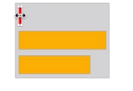

这时候再对 A 进行第二次测量，直接设置为与 LinearLayout 相同的宽度，至此达到了 match_parent 的效果。

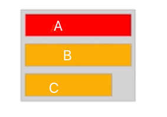

如果将 measure 和 layout 的过程糅合在一起，会导致两次测量的时候进行无用的 layout，消耗了更多的资源，所以为了性能，将其二者分开。


* ##### **原因二**

也是二者的职责相互独立，分为两个过程，可以使流程、代码更加清晰。


### 拓展

上面例子中的情况仅仅存在于 LinearLayout中，每种布局的测量机制是不同的。那么如果 A B C 三个 View 都是 match_parent LinearLayout 是如何做的呢？

* 第一轮测量：LinearLayout 无法确定自己的大小，所以遇到子 View match_parent 都会测量为 0

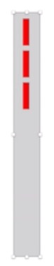

* 第二轮测量：都没有大小，LinearLayout 会让所有子 View 自由测量（父 View 不限制宽度）。每个测量之后都会变为和最宽的一样的宽度。

  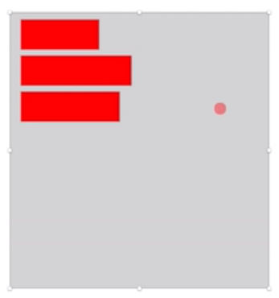

**注意：**

- onMeasure 与 measure() 、onDraw 与 draw 的区别

  onXX 方法是调度过程，而 measure、draw 才是真正做事情的。可以从源码中看到 measure 中调用了 onMeasure 方法。

  ```java
  public final void measure(int widthMeasureSpec, int heightMeasureSpec) {
         // ……………
              if (cacheIndex < 0 || sIgnoreMeasureCache) {
                  // measure ourselves, this should set the measured dimension flag back
                  onMeasure(widthMeasureSpec, heightMeasureSpec);
               // ………………
              }
  }
      
  ```

  

- 为什么不把对于尺寸的要求直接交个子 View 而是要交给父 View 呢？

  因为有些场景子 View 的大小需要父 View 进行规划，例如上面的例子中 LinearLayout 的子 View 设置了 weight。

* layout() 很少被使用到，因为他的改变没有通知父 View，这可能会导致布局重叠等问题 。在下面的「综合演练 —— 简单改写已有 View 的尺寸」中会有一个证明。


##onMeasure 方法

要明确的一个问题是： 什么时候需要我们自己实现 onMeasure 方法呢？

答：具体开发的时候有以下三种场景：

* 当我们继承一个已有 View 的时候，简单改写他们的尺寸，比如自定义一个正方形的 ImageView，取宽高中较大的值为边长。
* 完全进行自定义尺寸的计算。比如实现一个绘制圆形的 View 我们需要在尺寸为 warp_content 时指定一个大小例如下文中的「综合演练 —— 完全自定义 View 的尺寸」。
* 自定义 Layout，这时候内部所有的子 View 的尺寸和位置都需要我们自己控制，需要重写 `onMeasure()` 和 `onLayout()`方法。例如下文中的「综合演练 —— 自定义 Layout」

## onLayout 方法

onLayout 方法是 ViewGroup 中用于控制子 View 位置的方法。放置子 View 位置的过程很简单，只需重写  onLayout 方法，然后获取子 View 的实例，调用子 View 的 layout 方法实现布局。在实际开发中，一般要配合 onMeasure 测量方法一起使用。在下文「综合演练 —— 自定义 Layout」中会详细演示。

## 综合演练 

### 简单改写已有 View 的尺寸实现方形 ImageView

* 首先来证明一下改写 layout 方法会存在的问题

```java
/**
 * 自定义正方形 ImageView
 *
 * Created by im_dsd on 2019-08-24
 */
public class SquareImageView extends android.support.v7.widget.AppCompatImageView {

    public SquareImageView(Context context) {
        super(context);
    }

    public SquareImageView(Context context, AttributeSet attrs) {
        super(context, attrs);
    }

    public SquareImageView(Context context, AttributeSet attrs, int defStyleAttr) {
        super(context, attrs, defStyleAttr);
    }

   @Override
    public void layout(int l, int t, int r, int b) {
        // 使用宽高的最大值设置边长
        int width = r - l;
        int height = b - t;
        int size = Math.max(width, height);
        super.layout(l, t, l + size, t + size);
    }
}
```

代码很简单，获取宽与高的最大值用于设置正方形 View 的边长。再看一下布局文件的设置

```xml
<?xml version="1.0" encoding="utf-8"?>
<LinearLayout
    xmlns:android="http://schemas.android.com/apk/res/android"
    xmlns:app="http://schemas.android.com/apk/res-auto"
    xmlns:tools="http://schemas.android.com/tools"
    android:layout_width="match_parent"
    android:layout_height="match_parent"
    android:orientation="horizontal"
    tools:context=".MainActivity">


    <com.example.dsd.demo.ui.custom.measure.SquareImageView
        android:background="@color/colorAccent"
        android:layout_width="200dp"
        android:layout_height="300dp"/>

    <View
        android:background="@android:color/holo_blue_bright"
        android:layout_width="200dp"
        android:layout_height="200dp"/>
</LinearLayout>
```

通过布局文件的描述如果是普通的 View 显示的状态应该是这样的

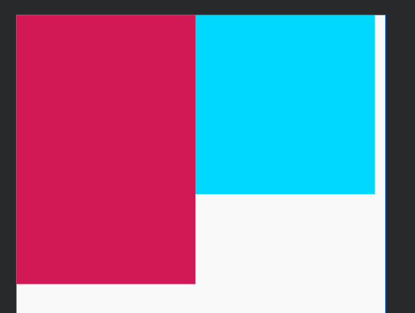


而我们期待的状态应该是这样的：SquareImageView 的宽高均为 300dp。

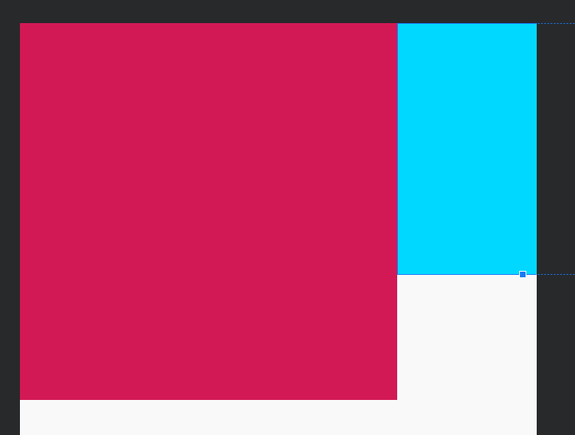

但是最终的结果却是下图，虽然我们使用了 LinearLayout 但是我们通过` layout()` 方法改变了 SquareImageView 的大小，对于这个变化LinearLayout 并不知道，所以会发生布局重叠的问题。**可见一般情况下不要使用 `layout()`方法**。

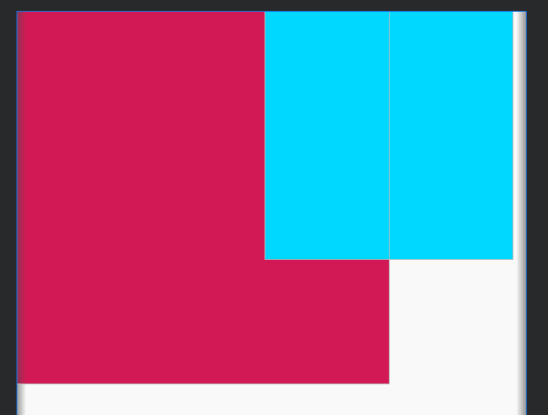

* 通过 `onMeasure` 方法更改尺寸。

```java
    @Override
    protected void onMeasure(int widthMeasureSpec, int heightMeasureSpec) {
        // super.onMeasure 中已经完成了 View 的测量
        super.onMeasure(widthMeasureSpec, heightMeasureSpec);
        // 获取测量的结果比较后得出最大值
        int height = getMeasuredHeight();
        int width = getMeasuredWidth();
        int size = Math.max(width, height);
        // 将结果设置回去
        setMeasuredDimension(size, size);
    }

```

**总结**

简单来说，更改已有 View 的尺寸主要分为以下步骤

1. 重写 `onMeasure（）`
2. 用`getMeasureWidth` 和 `getMeasureHeight()`获取测量尺寸
3. 计算最终要的尺寸
4. 用 `setMeasuredDimension(width, height) `把结果保存

### 完全自定义 View 的尺寸

此处用绘制圆形的 CircleView 做一个例子。对于这个 View 的期望是：View 的大小有内部的圆决定。

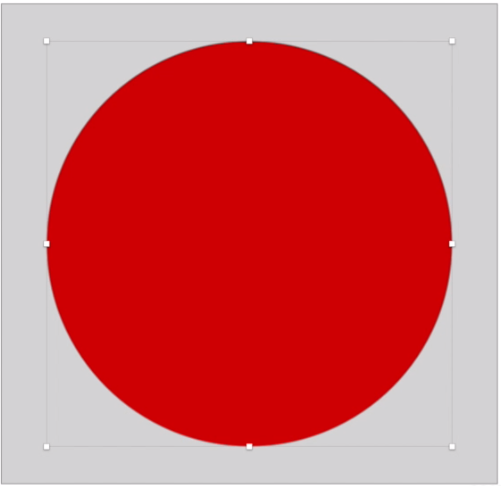

首先画一个圆形看看

```java
/**
 * 自定义 View 简单测量
 * Created by im_dsd on 2019-08-15
 */
public class CircleView extends View {
    private Paint mPaint = new Paint(Paint.ANTI_ALIAS_FLAG);
    /**
     * 为了方便简单，固定尺寸
     */
    private static final float PADDING = DisplayUtils.dp2px(20);
    private static final float RADIUS = DisplayUtils.dp2px(80);

    public CircleView(Context context) {
        super(context);
    }

    public CircleView(Context context, @Nullable AttributeSet attrs) {
        super(context, attrs);
    }

    public CircleView(Context context, @Nullable AttributeSet attrs, int defStyleAttr) {
        super(context, attrs, defStyleAttr);
    }

    @Override
    protected void onDraw(Canvas canvas) {
        super.onDraw(canvas);
        mPaint.setColor(Color.RED);
        canvas.drawCircle(PADDING + RADIUS, PADDING + RADIUS, RADIUS, mPaint);
    }
}
```

```java
    <com.example.dsd.demo.ui.custom.layout.CircleView
        android:background="@android:color/background_dark"
        android:layout_width="wrap_content"
        android:layout_height="wrap_content"/>
```

此时将大小设置为 wrap_content 包裹布局，结果会是怎么样的呢？


竟然填充了屏幕！根本就没有包裹内容，此时就需要我们大展身手了

```java
  @Override
    protected void onMeasure(int widthMeasureSpec, int heightMeasureSpec) {
        // 没有必要再让 view 自己测量一遍了，浪费资源
        // super.onMeasure(widthMeasureSpec, heightMeasureSpec);
        
        // 计算期望的 size
        int size = (int) ((PADDING + RADIUS) * 2);
        // 获取父 View 传递来的可用大小
        int widthSize = MeasureSpec.getSize(widthMeasureSpec);
        int widthMode = MeasureSpec.getMode(widthMeasureSpec);

        // 开始计算
        int result = 0;
        switch (widthMode) {
            // 不超过
            case MeasureSpec.AT_MOST:
                // 在 AT_MOST 模式下，取二者的最小值
                if (widthSize < size) {
                    result = widthSize;
                } else {
                    result = size;
                }
                break;
            // 精准的
            case MeasureSpec.EXACTLY:
                // 父 View 给多少用多少
                result = widthSize;
                break;
            // 无限大，没有指定大小
            case MeasureSpec.UNSPECIFIED:
                // 使用计算出的大小
                result = size;
                break;
            default:
                result = 0;
                break;
        }
        // 设置大小
        setMeasuredDimension(result, result);
    }
```

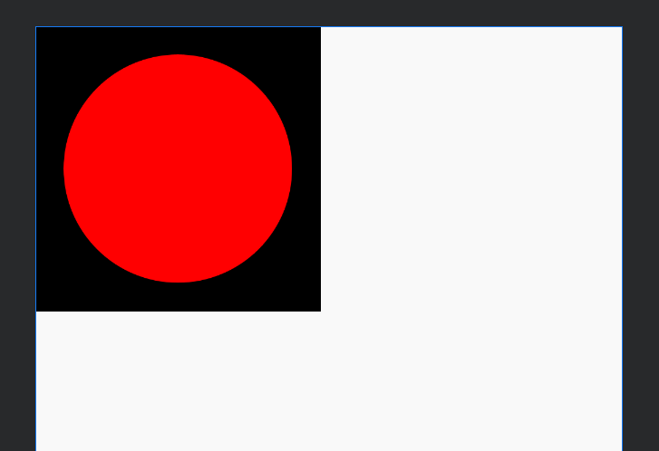

上面的代码就是 `onMeasure(int,int)` 的模板代码了，要注意一点的是需要注释 `super.onMeasure` 方法，此处面试的时候普遍会问。

```java
 // 没有必要再让 view 自己测量一遍了，浪费资源
 // super.onMeasure(widthMeasureSpec, heightMeasureSpec);
```

这段模版代码其实 Android SDK 里面早就有了很好的封装 ： `resolveSize(int size, int measureSpec)` 和 `resolveSizeAndState(int size, int measureSpec, int childMeasuredState)` ，两行代码直接搞定。

```java
    @Override
    protected void onMeasure(int widthMeasureSpec, int heightMeasureSpec) {
        // 没有必要再让 view 自己测量一遍了，浪费资源
        // super.onMeasure(widthMeasureSpec, heightMeasureSpec);
        
        // 计算期望的 size
        int size = (int) ((PADDING + RADIUS) * 2);
        // 指定期望的 size
        int width = resolveSize(size, widthMeasureSpec);
        int height = resolveSize(size, heightMeasureSpec);
        // 设置大小
        setMeasuredDimension(width, height);
    }

```

使用的时候完全可以这样做，但是非常建议大家都自己手写几遍理解其中的含义，因为面试会问到其中的细节。

还有一点很遗憾，就是 `resolveSizeAndState(int, int, int)` 不好用。不好用的原因不是方法有问题，而是很多自定义 View 包括原生的 View 都没有使用 `resolveSizeAndState(int, int, int)` 方法，或者没用指定 sate （state 传递父 View 对于子 View 的期望，相比`resolveSize(int, in）` 方法对于子 View 的控制更好）所以就算设置了，也不会起作用。


**总结**

完全自定义 View 的尺寸主要分为以下步骤：

1. 重写 `onMeasure（）`
2. 计算自己期望的尺寸
3. 用 `resolveSize()` 或者 `resolveSizeAndState（）`修正结果
4. 用 `setMeasuredDimension(width, height) `保存结果

### 自定义 Layout

[源码地址](https://github.com/daishengda2018/AndroidKnowledgeSystem/blob/master/Demo/app/src/main/java/com/example/dsd/demo/ui/custom/TabLayout.java)

以 TagLayout 为例一步一步实现一个自定义 Layout。具体期望的效果如下图：

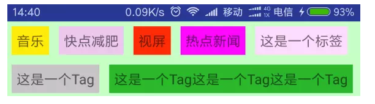

#### 重写 `onLayout()`

在继承 ViewGroup 的时候 `onLayout()` 是必须要实现的，这意味着子 View 的位置摆放的规则，全部交由开发者定义。

```java
/**
 * 自定义 Layout Demo
 *
 * Created by im_dsd on 2019-08-11
 */
public class TagLayout extends ViewGroup {

    public TagLayout(Context context) {
        super(context);
    }

    public TagLayout(Context context, AttributeSet attrs) {
        super(context, attrs);
    }

    public TagLayout(Context context, AttributeSet attrs, int defStyleAttr) {
        super(context, attrs, defStyleAttr);
    }

    @Override
    protected void onLayout(boolean changed, int l, int t, int r, int b) {
        for (int i = 0; i < getChildCount(); i++) {
            View child = getChildAt(i);
            // 此时所有的子 View 都和 TagLayout 一样大
            child.layout(l, t, r, b);
        }
    }
}

```

实验一下是否和期望的效果一样呢 

```xml
<?xml version="1.0" encoding="utf-8"?>
<com.example.dsd.demo.ui.custom.layout.TagLayout
    xmlns:android="http://schemas.android.com/apk/res/android"
    xmlns:tools="http://schemas.android.com/tools"
    android:layout_width="match_parent"
    android:layout_height="match_parent"
    tools:context=".MainActivity">

    <TextView
        android:layout_width="wrap_content"
        android:layout_height="wrap_content"
        android:layout_margin="5dp"
        android:padding="5dp"
        android:background="#ffee00"
        android:textSize="16sp"
        android:textStyle="bold"
        android:text="音乐" />

</com.example.dsd.demo.ui.custom.layout.TagLayout>
```

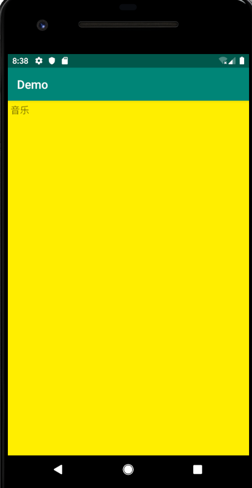

的确和期望一致。如果想要 TextView 显示为 TagLayout 的四分之一呢？

```xml
    @Override
    protected void onLayout(boolean changed, int l, int t, int r, int b) {
        for (int i = 0; i < getChildCount(); i++) {
            View child = getChildAt(i);
            // 子 View 显示为 TagLayout 的 1/4
            child.layout(l, t, r / 4, b / 4);
        }
    }
```

效果达成！！！很明显`onLayout`可以非常灵活的控制 View 的位置

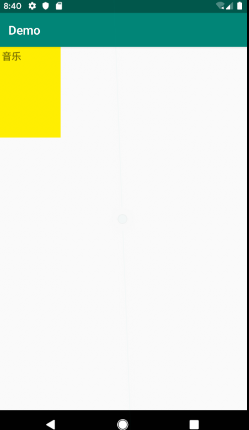

再尝试让两个 View 呈对角线布局呢？

```xml
    @Override
    protected void onLayout(boolean changed, int l, int t, int r, int b) {
        for (int i = 0; i < getChildCount(); i++) {
            View child = getChildAt(i);
            if (i == 0 ){
                child.layout(0, 0, (r - l) / 2, (b - t)  / 2);
            } else {
                child.layout((r - l) / 2, (b - t)  / 2, (r - l), (b - t));
            }
        }
    }
```

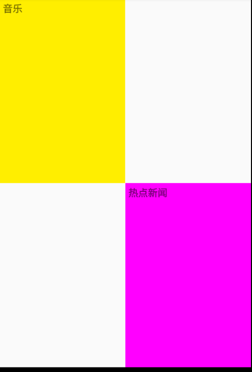

`onLayout`的方法还是很简单的，但是在真正布局中怎么获取 View 的位置才是难点！如何获取呢，这时候就需要 `onMeasure` 的帮助了！

#### 计算

在写具体的代码之前，先来搭建大体的框架。主要的思路就是在 `onMeasure()`方法中计算好子 View 的尺寸和位置信息包括 TagLayout 的具体尺寸，然后在`onLayout()`方法中摆放子 View。

在计算过程中涉及到三个难点，具体请看注释

```java
private List<Rect> mChildRectList = new ArrayList<>();

    @Override
    protected void onMeasure(int widthMeasureSpec, int heightMeasureSpec) {
        // 没有必要让 View 自己算了，浪费资源。 
        // super.onMeasure(widthMeasureSpec, heightMeasureSpec);
        for (int i = 0; i < getChildCount(); i++) {
            View child = getChildAt(i);
            // 难点1: 计算出对于每个子 View 的尺寸
            child.measure(childWidthMeasureSpec, childHeightMeasureSpec);
            // 难点2：计算出每一个子 View 的位置并保存。
            Rect rect = new Rect(?, ?, ?, ?);
            mChildRectList.add(rect);
        }
        // 难点3：根据所有子 View 的尺寸计算出 TagLayout 的尺寸
        int measureWidth = ?;
        int measureHeight = ?;
        setMeasuredDimension(measureWidth, measureHeight);
    }

    @Override
    protected void onLayout(boolean changed, int l, int t, int r, int b) {
        if (mChildRectList.size() == 0) {
            return;
        }
        for (int i = 0; i < getChildCount(); i++) {
            if (mChildRectList.size() <= i) {
                return;
            }
            View child = getChildAt(i);
            // 通过保存好的位置，设置子 View
            Rect rect = mChildRectList.get(i);
            child.layout(rect.left, rect.top, rect.right, rect.bottom);
        }
    }
```

##### 难点1 ：如何计算子 View 的尺寸。

主要涉及两点：开发者对于子 View 的尺寸设置和父 View 的具体可用空间。获取开发者对于子 View 尺寸的设置就比较简单了：

```java
// 获取开发者对于子 View 尺寸的设置
LayoutParams layoutParams = child.getLayoutParams();
int width = layoutParams.width;
int height = layoutParams.height;
```

获取父 View (TagLayout) 的可用空间要结合两点：

1. TagLayout 的父 View 对于他的尺寸限制
2. TagLayout 的剩余空间。我们用 width 为例用伪代码简单分析一下如何计算子 View 的尺寸

```java
int widthMode = MeasureSpec.getMode(widthMeasureSpec);
int widthSize = MeasureSpec.getSize(widthMeasureSpec);
// TagLayout 已经使用过的空间，此处的计算是个难点，此处不是本例子重点，一会儿讨论
int widthUseSize = 0;
for (int i = 0; i < getChildCount(); i++) {
	View child = getChildAt(i);
  // 获取开发者对于子 View 尺寸的设置
  LayoutParams layoutParams = child.getLayoutParams();
  int childWidthMode;
  int childWidthSize;
  // 获取父 View 具体的可用空间
  switch (layoutParams.width) {
  // 如果说子 View 被开发者设置为 match_parent
  	case LayoutParams.MATCH_PARENT:
    	switch (widthMode) {
      	case MeasureSpec.EXACTLY:
        // TagLayout 为 EXACTLY 模式下，子 View 可以填充的部位就是 TagLayout 的可用空间
        case MeasureSpec.AT_MOST:
        // TagLayout 为 AT_MOST 模式下有一个最大可用空间，子 View 要是想 match_parent 其实是和 
        // EXACTLY 模式一样的
        childWidthMode = MeasureSpec.EXACTLY;
        childWidthSize = widthSize - widthUseSize;
        break;
        case MeasureSpec.UNSPECIFIED:
        // 当 TagLayout 为 UNSPECIFIED 不限制尺寸的时候，意味着可用空间无限大！空间无限大还想
        // match_parent 二者完全是悖论，所以我们也要将子 View 的 mode 指定为 UNSPECIFIED
        childWidthMode = MeasureSpec.UNSPECIFIED;
        // 此时 size 已经没有作用了，写 0 就可以了
        childWidthSize = 0;
        break;
        }
      case LayoutParams.WRAP_CONTENT:
       break;
      default:
      // 具体设置的尺寸
      break;
}
// 获取 measureSpec
int childWidthMeasureSpec = MeasureSpec.makeMeasureSpec(childWidthSize, childWidthMode);
```

**补充一下什么时候会是 UNSPECIFIED 模式呢？比如说横向或纵向滑动的 ScrollView，他的宽度或者高度的模式就是 UNSPECIFIED**

伪代码仅仅模拟了开发者将子 View 的 size 设置为 match_parent 的情况，其他的情况读者要是感兴趣可以自己分析一下。笔者就不做过多的分析了！因为 Android SDK 早就为我们提供好了可用的 API： `measureChildWithMargins(int, int, int, int)`一句话就完成了对于子 View 的测量。

##### 难点2：计算出每一个子 View 的位置并保存。

##### 难点3：根据所有子 View 的尺寸计算出 TagLayout 的尺寸

有了 `measureChildWithMargins` 方法，对于子 View 的测量就很简单啦。 一口气解决难点 2 3。

```java
  @Override
    protected void onMeasure(int widthMeasureSpec, int heightMeasureSpec) {
        int lineHeightUsed = 0;
        int lineWidthUsed = 0;
        int widthUsed = 0;
        int heightUsed = 0;
        int widthSize = MeasureSpec.getSize(widthMeasureSpec);
        int widthMode = MeasureSpec.getMode(widthMeasureSpec);
        for (int i = 0; i < getChildCount(); i++) {
            View child = getChildAt(i);
            // 测量子 View 尺寸。TagLayout 的子 view 是可以换行的，所以设置 widthUsed 参数为 0
            // 让子 View 的尺寸不会受到挤压。
            measureChildWithMargins(child, widthMeasureSpec, 0, heightMeasureSpec, heightUsed);
            if (widthMode != MeasureSpec.UNSPECIFIED && lineWidthUsed + child.getMeasuredWidth() > widthSize) {
                // 需要换行了
                lineWidthUsed = 0;
                heightUsed += lineHeightUsed;
                measureChildWithMargins(child, widthMeasureSpec, 0, heightMeasureSpec, heightUsed);
            }
            Rect childBound;
            if (mChildRectList.size() >= i) {
                // 不存在则创建
                childBound = new Rect();
                mChildRectList.add(childBound);
            } else {
                childBound = mChildRectList.get(i);
            }
            // 存储 child 位置信息
            childBound.set(lineWidthUsed, heightUsed, lineWidthUsed + child.getMeasuredWidth(),
                            heightUsed + child.getMeasuredHeight());
            // 更新位置信息
            lineWidthUsed += child.getMeasuredWidth();
            // 获取一行中最大的尺寸
            lineHeightUsed = Math.max(lineHeightUsed, child.getMeasuredHeight());
            widthUsed = Math.max(lineWidthUsed, widthUsed);
        }

        // 使用的宽度和高度就是 TagLayout 的宽高啦
        heightUsed += lineHeightUsed;
        setMeasuredDimension(widthUsed, heightUsed);
    }
```

终于写完代码啦，运行起来瞧瞧看。

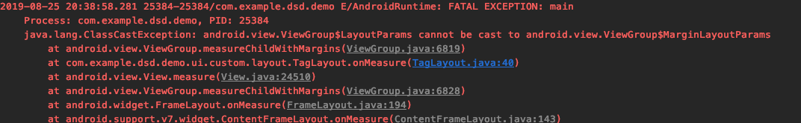

竟然奔溃了！通过日志可以定位到是

```java
  // 对于子 View 的测量
  measureChildWithMargins(child, widthMeasureSpec, widthUsed, 
                                                          heightMeasureSpec, heightUsed);
```

这一句出了问题，通过源码得知`measureChildWithMargins`方法会有一个类型转换导致了崩溃

```java
protected void measureChildWithMargins(int, int ,int, int) {
	final MarginLayoutParams lp = (MarginLayoutParams) child.getLayoutParams();
	………………
}
```

解决办法就是在 TagLayout 中重写方法 `generateLayoutParams(AttributeSet)` 返回 MarginLayoutParams 就可以解决问题了。

```java
    @Override
    public LayoutParams generateLayoutParams(AttributeSet attrs) {
        return new MarginLayoutParams(getContext(), attrs);
    }
```

再次运行达到最终目标！

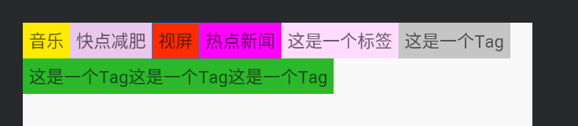


**总结**

自定义 Layout 的主要步骤分为以下几点：

1. 重写 `onMeasure()`
   * 遍历每一个子 View，用 `measureChildWidthMargins()` 测量 View
     * MarginLayoutParams 和 generateLayoutParams()
     * 有些子 View 可能需要多次测量
     * 测量完成后，得出子 View 的实际尺寸和位置，并暂时保存
   * 测量出所有子 View 的位置和尺寸后，计算出自己的尺寸，并用` setMeasuredDimension(width, height)`保存
2. 重写 `onLayout()`
   * 遍历每个子 View，调用它们的 layout() 方法来将位置和尺寸传递给它们。


## getMeasureWidth 与 getWidth 的区别

getMeasureXX 代表的是 onMeasure 方法结束后（准确的说应该是测量结束后）**测量**的值，而 getXX 代表的是 layout 阶段 right - left、bottom - top 的**真实显示**值，所以第一个不同点就是**赋值的阶段不同**，可见 getXXX 在 layout（） 之前一直为 0， 而 getMeasureXX 可能不是最终值( onMeasure 可能会被调用多次），但是最终的时候二者的数值都会是相同的。使用那个还需要看具体的场景。

总结: getMeasureXX 获取的是临时的值，而 getXX 获取的时候最终定稿的值，一般在绘制阶段、触摸反馈阶段使用 getXXX，在 onMeasure 阶段被迫使用 getMeasureXX 。


# 自定义View —— 自定义属性

**[此文已于19年8月12日发表到博客上 ——「[Android 自定义 View] 自定义属性你真的理解吗？」在博客上的阅读效果更好推荐到博客查看](https://blog.csdn.net/qq_23191031/article/details/99201766)**

自定义属性其实就是一些 xml 标签，他们通过 xml 文件的形式，可以配置某些 View 的信息，让自定义 View 使用起来更加灵活。

## 属性的定义

### 必须是 res/values/attrs.xml吗？

很多文章都说：需要在 res/values 目录下创建 attrs.xml 文件然后在里面写我们需要的属性，其实这是不太准确的，通过实验证明，文件的名字可以随意指定，不一定必须是 attrs.xml ！


例如笔者自定义了一个 custom.xml 文件里面的内容符合自定义属性的规范，在 View 中也是可以正常访问到的。（具体原因尚不清楚，可能是 Android Stuido 的功能）

## 文件结构


1. name space : 命名空间，**名字可以随便起，但是最好和自定义 View 的名字相同，因为 Android Stuido 可以帮我们做一些事情，比如说 command + 手表左键，可以直接跳转**。

2. attr name ：这就是我们自定义属性的名字，具体的格式还是模仿 android 内部的方式，驼峰式命名或者是 名称_名称

3. format ： 属性的具体类型，此处讲解一些特殊的类型，此处不是重点，网上文章很多。

   a .**reference**: 资源id

   ```java
   <ImageView android:background = "@drawable/图片ID"/>
   ```

   b.  **fraction** : 百分数

   * 属性定义

   ```xml
   <attr name="pivotX" format="fraction"/>
   ```

   * 使用

   ```java
   <android:pivotX = "200%"/>
   ```

   c. **flag** : 位运算，可以在使用过程中指定多个值

   * 定义

   ```xml
   <attr name="gravity" format="flags">
   	<flag name="top" value="0x30"/>
   	<flag name="bottom" value="0x50" />
   	<flag name="left" value="0x03" />
   	<flag name="right" value="0x05" />
   	<flag name="center_vertical" value="0x10" />
   </attr>
   ```

   * 使用

   ```xml
   <TextView android:gravity="bottom|left"/>
   ```

   d. **enum** : 枚举

   * 属性定义

   ```xml
   <attr name="orientation" format="enum">
   	<enum name="horizontal" value="0"/>
   	<enum name="vertical" value="1"/>
   </attr>
   ```

   e. **混合模式** ：指定属性的时候可以指定多种类型值

   ```xml
    <attr name="background" format="reference|color"/>
   ```


## 属性的使用

1. 定义属性

```xml
<?xml version="1.0" encoding="utf-8"?>
<resources>
    <declare-styleable name="CustomAttrsDemo">
        <attr name="text_color" format="color" />
        <attr name="text" format="dimension" />
    </declare-styleable>

</resources>
```

2. 在 xml 文件中使用

   在布局文件中使用，首先需要引入命名空间，这样才能找到我们包中的 attrs，这里我们引入了命名空间 app，res-auto 表示自动查找
   
```java
xmlns:app="http://schemas.android.com/apk/res-auto"
```

```java
<?xml version="1.0" encoding="utf-8"?>
<FrameLayout
    xmlns:android="http://schemas.android.com/apk/res/android"
    xmlns:app="http://schemas.android.com/apk/res-auto"
    xmlns:tools="http://schemas.android.com/tools"
    android:layout_width="match_parent"
    android:layout_height="match_parent"
    tools:context=".MainActivity">

    <com.example.dsd.demo.ui.draw.attrs.CustomAttrsDemo
        android:id="@+id/custom_attrs_demo"
        android:layout_width="wrap_content"
        android:layout_height="wrap_content"
        android:text="@string/app_name"
        app:text_color="#333333"
        app:text_size="10sp"/>

</FrameLayout>
```


2. 在自定义 View 中使用

```java

  /**
   * 自定义属性 Demo
      *
   * Created by im_dsd on 2019-08-11
      */

    public class CustomAttrsDemo extends android.support.v7.widget.AppCompatTextView {
      
      private final int mTextColor;
      private final int mTextSize;
      
      public CustomAttrsDemo(Context context, AttributeSet attrs) {
          super(context, attrs);
          TypedArray array = context.obtainStyledAttributes(attrs, R.styleable.CustomAttrsDemo);
          mTextColor = array.getColor(R.styleable.CustomAttrsDemo_textColor, Color.BLACK);
          mTextSize = array.getDimensionPixelSize(R.styleable.CustomAttrsDemo_textSize, 18);
          // 注意使用完成之后一定要回收
          array.recycle();
      }
    }
```


## AttributeSet、TypedArray 、declare-styleable

**AttributeSet** ：

>  A collection of attributes, as found associated with a tag in an XML document. Often you will not want to use this interface directly, instead passing it to {@link android.content.res.Resources.Theme#obtainStyledAttributes(AttributeSet, int[], int, int) Resources.Theme.obtainStyledAttributes()}


可以看到 AtttirbuteSet 是一个大的属性集合，装载了此 View 所有的属性，用户可以通过方法：

```java
 Context.obtainStyledAttributes(AttributeSet, R.styleable.XXXX);
```
获取指定的属性集合（一个明确的小集合 TypedArray) 


**TypedArray**

```java
TypedArray array = Context.obtainStyledAttributes(AttributeSet, R.styleable.XXXX);
```

TypedArray里面装的就是具体的属性了，我们可以通过 :`array.getXXXX` 的方法获取具体的属性值

**注意**： 在使用后一定要调用`array.recycle` 用于释放内存空间，不然此内存空间就被浪费了


**declare-styleable**

此标签的作用就是将属性分组，在 `Context.obtainStyledAttributes` 方法中指定需要加载的属性组


# 自定义 ImageView 要注意的点
直接重写`onDraw()`方法就可以了，可以通过`getDrawable()`方法获取到前景图。在自定义 ImageView 的时候一般都会和 Bitmap Drawable 打交道，关于二者的细节见下文「Bitmap 与 Drawable」

## 绘制文字包围文字 Demo

```
待续……
```


# Cavans 几何变换
cavans.translate、cavans.rotate、cavans.scale 、cavans.sew 这些变化针对的都是 Cavans，并不是我们绘制的内容。 如果想要绘制的效果作用到内容上，我们有一个办法：**把效果倒着写！**

例如我们的需求是先将

```
cavas.traslate(100,100)
```


### cavarns.save()  与  cavans.restore()  方法的作用

[可以参考这篇文章](https://blog.csdn.net/u011043551/article/details/73692134)

1. save 方法相当于保存之前的所有操作，然后「复制」一个新的 cavans 进行绘制，不论做任何的几何变化都不会影响直接的结果，而 restore 的作用有点像是「merge」将结果进行融合。
2. save 方法在 clipXXX 方法的作用很明显，相当于标记了 clipXXX 方法的作用范围。否者 clipXXX 之后的代码都会受到 影响。


# View 的事件体系

## View 的位置与坐标系

获取位置相关内容(19.7.9 绘制引导遇到的问题)

### 获取View位置的常见方法：

1. View.getTop、View.getBotoom、View.getTop、View.getRight
2. View.getX、 View.getY
3. View.getTranslationX、View.getTranslationY
4. View.getLocationInWindow、 View.getLocationOnScreen

### View.getTop等

这些方法获取的都是**相对父容器的原始位置**，什么是原始位置呢？就是说当View发生移动的时候这些方法的值都是保持不变得。
可以通过这些方法获取View的宽度和高度

```java
width = getRight()- getLeft()
height = getBottom() -getTop()
```

### View.getX、 View.getY

getX = getTranslationX + getLeft
getY = getTranslationY + getTop
表示的相对于父容器的相对位置坐标。当View没有发生移动的时其实是和getLeft相同的

### translationX、translationY

translationX表示的是当前View对于父View发生的偏移量，一开始的时候translationX = 0，当View有移动的时候才会有变化，简单说：当View发生移动的时候getTop、getRight这写方法是不会发生改变的，改变的是表示偏移量的translationX

### getLocatonInWindow()、getLocationOnScreen() 

`getLocationInWindow()` ：获取的是一个控件在其所在 window 的坐标位置
`getLocationOnScreent()`: 获取的是控件在屏幕上的坐标位置


`getLocationInWindow() `是以B为原点的C的坐标。
`getLocationOnScreen` 以A为原点，包括了状态栏的高度

一般情况下一个正常的 Activity 的Window是充满屏幕的，所以这两个方法将会返回同样的 x 和 y 坐标，仅仅在一些特殊的场景下，例如 dialog 他有属于自己的 window 这个 window 和屏幕是存在偏移量的，这两个方法返回的结果将不同

 **注意：**这两个方法在Activity的onCreate中使用获取的坐标永远是0，要等UI控件都加载完成之后才能获取。在`onWindowFocusChanged()` 中获取最好。因为在生命周期：onCreate、onStart、onResume中真正的View都没有可见。

引自 `onWindowFocusChanged()` 官方文档：

> Called when the current `Window` of the activity gains or loses focus. This is the best indicator of whether this activity is visible to the user. The default implementation clears the key tracking state, so should always be called.

[参考 staticoverflow](https://stackoverflow.com/questions/17672891/getlocationonscreen-vs-getlocationinwindow/20154562#20154562)


## 事件传递

常用的事件传递就三个方法

```java
dispathTouchEvent()
onInterceptTouchEvent()
onTouchEvent()
```


# Bitmap 与 Drawable

## Bitmap 是什么

Bitmap是位图信息的存储，即一个举行图像每个像素点的颜色信息的存储

## Drawable 是什么

Drawable 是一个可以调用 Cavans 来进行绘制的上层工具。调用 `Drawable.draw(Canvas)` 可以把 Drawable 这是的绘制内容绘制到 Canvas 中。

由于 Drawable 存储的只是绘制规则，因此在它的`draw（）`方法调用前，需要设置 `Drawable.setBound()`来设置绘制边界。

## 代码：Bitmap2Drawable

```java
 public static Drawable bitmap2Drawable(Bitmap bitmap) {
        return new BitmapDrawable(Resources.getSystem(), bitmap);
    }
```

## 代码：Drawable2Bitmap

```java
 public static Bitmap drawable2Btimap(Drawable drawable) {
        if (drawable instanceof BitmapDrawable) {
            return ((BitmapDrawable) drawable).getBitmap();
        }

        int w = drawable.getIntrinsicWidth();
        int h = drawable.getIntrinsicHeight();
        if (w > 0 && h > 0) {
            Bitmap bitmap = Bitmap.createBitmap(w, h, Bitmap.Config.RGB_565);
            // 这一步很关键，设置 bounds 指定了绘制的区域，否者绘制有问题。
            drawable.setBounds(0, 0, w, h);
            Canvas canvas = new Canvas(bitmap);
            drawable.draw(canvas);
            return bitmap;
        }
      return null;
    }
```

# 自定义 Drawable

## 怎么做

* 重写几个抽象的方法
* 重写 setAlpha() 的时候要记得重写 getAlpha()
* 重写 draw(Canvas）方法，用户绘制具体内容

```java
/**
 * 自定义 Drawable
 * Created by im_dsd on 2019-08-01
 */
public class DrawableDemo extends Drawable {

    private Paint mPaint;

    {
        mPaint = new Paint(Paint.ANTI_ALIAS_FLAG);
    }

    @Override
    public void draw( @NonNull Canvas canvas) {
        // 自己想绘制的内容
    }

    // 注意： setAlpha 和 getAlpha 必须成对出现，不然白写，没有意义
    @Override public void setAlpha(int alpha) {
        mPaint.setAlpha(alpha);
    }

    // 注意：setAlpha 和 getAlpha 必须成对出现，不然白写，没有意义
    @Override public int getAlpha() {
        return mPaint.getAlpha();
    }

    // 设置颜色过滤器
    @Override public void setColorFilter( @Nullable ColorFilter colorFilter) {
        mPaint.setColorFilter(colorFilter);
    }

    // 设置不透明度，这个方法返回的并不是具体的值，还是三种状态：不透明，半透明，全透明
    @Override public int getOpacity() {
        if (mPaint.getAlpha() == 0Xff) {
            // 不透明
            return PixelFormat.OPAQUE;
        } else if (mPaint.getAlpha() == 0) {
            // 全透明
            return PixelFormat.TRANSPARENT;
        } else {
            // 半透明
            return PixelFormat.TRANSLUCENT;
        }
    }
}

```


# 手势监听


todo

1. ViewDragHelper

```java
ViewCompat.postInvalidateOnAnimation(View)
```

