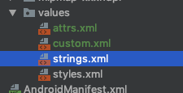
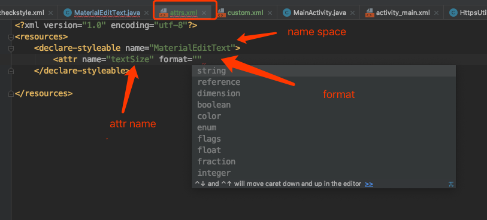

[TOC]


# 自定义View

## 自定义的布局过程

### 布局过程的作用

* 确定每个View的位置和尺寸
* 作用：为绘制和触摸范围做支持
  * 绘制：知道往哪里了画
  * 触摸返回：知道用户点的是哪里

### 布局的流程

* 测量流程：从根 View 递归调用每一级子 View 的 measure 方法，对它们进行测量。
* 布局流程：从根 View 递归调用每一级子 View 的 layout 方法，把测量过程得出的子 View 的位置和尺寸传给子 View，子 View 保存。

**为啥需要两个过程呢？**

* onMeasure 与 measure() 、onDraw 与 draw 的区别

  onXX 方法是调度过程的，而 measure、draw 才是真正做事情的

* 为什么不把对于尺寸的要求直接交个子 View 而是要交给父 View 呢？

  因为有些场景，子 View 的大小需要父 View 进行规划，例如 LinearLayout 的子 View 全部设置了 weight 

**注意：**

1. layout() 很少被使用到，因为他的改变没有通知的父 View 会导致布局重叠等问题


### 自定义 TabLayout


## 自定义属性

自定义属性其实就是一些 xml 标签，他们通过 xml 文件的形式，可以配置某些 View 的信息，让自定义 View 使用起来更加灵活。

### 属性的定义

#### 必须是 res/values/attrs.xml吗？

很多文章都说：需要在 res/values 目录下创建 attrs.xml 文件然后在里面写我们需要的属性，其实这是不太准确的，通过实验证明，文件的名字可以随意指定，不一定必须是 attrs.xml ！



例如笔者自定义了一个 custom.xml 文件里面的内容符合自定义属性的规范，在 View 中也是可以正常访问到的。（具体原因尚不清楚，可能是 Android Stuido 的功能）

#### 文件结构



1. name space : 命名空间，**名字可以随便起，但是最好和自定义 View 的名字相同，因为 Android Stuido 可以帮我们做一些事情，比如说 command + 手表左键，可以直接跳转**。

2. attr name ：这就是我们自定义属性的名字，具体的格式还是模仿 android 内部的方式，驼峰式命名或者是 名称_名称

3. format ： 属性的具体类型，此处讲解一些特殊的类型，此处不是重点，网上文章很多。

   a .**reference**: 资源id

   ```java
   <ImageView android:background = "@drawable/图片ID"/>
   ```

   b.  **fraction** : 百分数

   * 属性定义

   ```xml
   <attr name="pivotX" format="fraction"/>
   ```

   * 使用

   ```java
   <android:pivotX = "200%"/>
   ```

   c. **flag** : 位运算，可以在使用过程中指定多个值

   * 定义

   ```xml
   <attr name="gravity" format="flags">
   	<flag name="top" value="0x30"/>
   	<flag name="bottom" value="0x50" />
   	<flag name="left" value="0x03" />
   	<flag name="right" value="0x05" />
   	<flag name="center_vertical" value="0x10" />
   </attr>
   ```

   * 使用

   ```xml
   <TextView android:gravity="bottom|left"/>
   ```

   d. **enum** : 枚举

   * 属性定义

   ```xml
   <attr name="orientation" format="enum">
   	<enum name="horizontal" value="0"/>
   	<enum name="vertical" value="1"/>
   </attr>
   ```

   e. **混合模式** ：指定属性的时候可以指定多种类型值

   ```xml
    <attr name="background" format="reference|color"/>
   ```


### 属性的使用

1. 定义属性

```xml
<?xml version="1.0" encoding="utf-8"?>
<resources>
    <declare-styleable name="CustomAttrsDemo">
        <attr name="text_color" format="color" />
        <attr name="text" format="dimension" />
    </declare-styleable>

</resources>
```

2. 在 xml 文件中使用

   在布局文件中使用，首先需要引入命名空间，这样才能找到我们包中的 attrs，这里我们引入了命名空间 app，res-auto 表示自动查找
   
   ```java
    xmlns:app="http://schemas.android.com/apk/res-auto"
   ```

```java
<?xml version="1.0" encoding="utf-8"?>
<FrameLayout
    xmlns:android="http://schemas.android.com/apk/res/android"
    xmlns:app="http://schemas.android.com/apk/res-auto"
    xmlns:tools="http://schemas.android.com/tools"
    android:layout_width="match_parent"
    android:layout_height="match_parent"
    tools:context=".MainActivity">

    <com.example.dsd.demo.ui.draw.attrs.CustomAttrsDemo
        android:id="@+id/custom_attrs_demo"
        android:layout_width="wrap_content"
        android:layout_height="wrap_content"
        android:text="@string/app_name"
        app:text_color="#333333"
        app:text_size="10sp"/>

</FrameLayout>
```


2. 在自定义 View 中使用

   ```java
   
   ```

  /**
   * 自定义属性 Demo
      *
   * Created by im_dsd on 2019-08-11
      */
    public class CustomAttrsDemo extends android.support.v7.widget.AppCompatTextView {
  
      private final int mTextColor;
      private final int mTextSize;
  
      public CustomAttrsDemo(Context context, AttributeSet attrs) {
          super(context, attrs);
          TypedArray array = context.obtainStyledAttributes(attrs, R.styleable.CustomAttrsDemo);
          mTextColor = array.getColor(R.styleable.CustomAttrsDemo_textColor, Color.BLACK);
          mTextSize = array.getDimensionPixelSize(R.styleable.CustomAttrsDemo_textSize, 18);
          // 注意使用完成之后一定要回收
          array.recycle();
      }
    }
   ```


### AttributeSet、TypedArray 、declare-styleable

**AttributeSet** ：

​```java
A collection of attributes, as found associated with a tag in an XML document. Often you will not want to use this interface directly, instead passing it to {@link android.content.res.Resources.Theme#obtainStyledAttributes(AttributeSet, int[], int, int) Resources.Theme.obtainStyledAttributes()}
   ```

可以看到 AtttirbuteSet 是一个大的属性集合，装载了此 View 所有的属性，用户可以通过方法：

```java
 Context.obtainStyledAttributes(AttributeSet, R.styleable.XXXX);
```

获取指定的属性集合（一个明确的小集合 TypedArray) 


**TypedArray**

```java
TypedArray array = Context.obtainStyledAttributes(AttributeSet, R.styleable.XXXX);
```

TypedArray里面装的就是具体的属性了，我们可以通过 :`array.getXXXX` 的方法获取具体的属性值

**注意**： 在使用后一定要调用`array.recycle` 用于释放内存空间，不然此内存空间就被浪费了


**declare-styleable**

此标签的作用就是将属性分组，在 `Context.obtainStyledAttributes` 方法中指定需要加载的属性组


## getMeasureWidth 与 getWidth 的方法

getMeasureXX 代表的是 onMeasure 方法结束后（准确的说应该是测量结束后）**测量**的值，而 getXX 代表的是 layout 阶段 right - left、bottom - top 的**真实显示**值，所以第一个不同点就是**赋值的阶段不同**，可见 getXXX 在 layout（） 之前一直为 0， 而 getMeasureXX 可能不是最终值( onMeasure 可能会被调用多次），但是最终的时候二者的数值都会是相同的。使用那个还需要看具体的场景

总结: getMeasureXX 获取的是临时的值，而 getXX 获取的时候最终定稿的值，一般在绘制阶段、触摸反馈阶段使用 getXXX，在 onMeasure 阶段被迫使用 getMeasureXX 

## 自定义 ImageView 要注意的点
直接重写`onDraw()`方法就可以了，后去需要绘制的图片通过`getDrawable()`方法

## 绘制文字包围文字

```

```


## Cavans 几何变换
cavans.translate、cavans.rotate、cavans.scale 、cavans.sew 这些变化针对的都是 Cavans，并不是我们绘制的内容。 如果想要绘制的效果作用到内容上，我们有一个办法：**把效果倒着写！**

例如我们的需求是先将

```
cavas.traslate(100,100)
```


### cavarns.save()  与  cavans.restore()  方法的作用

[可以参考这篇文章](https://blog.csdn.net/u011043551/article/details/73692134)

1. save 方法相当于保存之前的所有操作，然后「复制」一个新的 cavans 进行绘制，不论做任何的几何变化都不会影响直接的结果，而 restore 的作用有点像是「merge」将结果进行融合。
2. save 方法在 clipXXX 方法的作用很明显，相当于标记了 clipXXX 方法的作用范围。否者 clipXXX 之后的代码都会受到 影响。


# View 的事件体系

## View 的位置与坐标系

获取位置相关内容(19.7.9 绘制引导遇到的问题)

### 获取View位置的常见方法：

1. View.getTop、View.getBotoom、View.getTop、View.getRight
2. View.getX、 View.getY
3. View.getTranslationX、View.getTranslationY
4. View.getLocationInWindow、 View.getLocationOnScreen

### View.getTop等

这些方法获取的都是**相对父容器的原始位置**，什么是原始位置呢？就是说当View发生移动的时候这些方法的值都是保持不变得。
可以通过这些方法获取View的宽度和高度

```java
width = getRight()- getLeft()
height = getBottom() -getTop()
```

### View.getX、 View.getY

getX = getTranslationX + getLeft
getY = getTranslationY + getTop
表示的相对于父容器的相对位置坐标。当View没有发生移动的时其实是和getLeft相同的

### translationX、translationY

translationX表示的是当前View对于父View发生的偏移量，一开始的时候translationX = 0，当View有移动的时候才会有变化，简单说：当View发生移动的时候getTop、getRight这写方法是不会发生改变的，改变的是表示偏移量的translationX

### getLocatonInWindow()、getLocationOnScreen() 

`getLocationInWindow()` ：获取的是一个控件在其所在 window 的坐标位置
`getLocationOnScreent()`: 获取的是控件在屏幕上的坐标位置


`getLocationInWindow() `是以B为原点的C的坐标。
`getLocationOnScreen` 以A为原点，包括了状态栏的高度

一般情况下一个正常的 Activity 的Window是充满屏幕的，所以这两个方法将会返回同样的 x 和 y 坐标，仅仅在一些特殊的场景下，例如 dialog 他有属于自己的 window 这个 window 和屏幕是存在偏移量的，这两个方法返回的结果将不同

 **注意：**这两个方法在Activity的onCreate中使用获取的坐标永远是0，要等UI控件都加载完成之后才能获取。在`onWindowFocusChanged()` 中获取最好。因为在生命周期：onCreate、onStart、onResume中真正的View都没有可见。

引自 `onWindowFocusChanged()` 官方文档：

> Called when the current `Window` of the activity gains or loses focus. This is the best indicator of whether this activity is visible to the user. The default implementation clears the key tracking state, so should always be called.

[参考 staticoverflow](https://stackoverflow.com/questions/17672891/getlocationonscreen-vs-getlocationinwindow/20154562#20154562)


## 事件传递

常用的事件传递就三个方法

```java
dispathTouchEvent()
onInterceptTouchEvent()
onTouchEvent()
```


# Bitmap 与 Drawable

## Bitmap 是什么

Bitmap是位图信息的存储，即一个举行图像每个像素点的颜色信息的存储

## Drawable 是什么

Drawable 是一个可以调用 Cavans 来进行绘制的上层工具。调用 `Drawable.draw(Canvas)` 可以把 Drawable 这是的绘制内容绘制到 Canvas 中。

由于 Drawable 存储的只是绘制规则，因此在它的`draw（）`方法调用前，需要设置 `Drawable.setBound()`来设置绘制边界。

## 代码：Bitmap2Drawable

```java
 public static Drawable bitmap2Drawable(Bitmap bitmap) {
        return new BitmapDrawable(Resources.getSystem(), bitmap);
    }
```

## 代码：Drawable2Bitmap

```java
 public static Bitmap drawable2Btimap(Drawable drawable) {
        if (drawable instanceof BitmapDrawable) {
            return ((BitmapDrawable) drawable).getBitmap();
        }

        int w = drawable.getIntrinsicWidth();
        int h = drawable.getIntrinsicHeight();
        if (w > 0 && h > 0) {
            Bitmap bitmap = Bitmap.createBitmap(w, h, Bitmap.Config.RGB_565);
            // 这一步很关键，设置 bounds 指定了绘制的区域，否者绘制有问题。
            drawable.setBounds(0, 0, w, h);
            Canvas canvas = new Canvas(bitmap);
            drawable.draw(canvas);
            return bitmap;
        }
      return null;
    }
```

# 自定义 Drawable

## 怎么做

* 重写几个抽象的方法
* 重写 setAlpha() 的时候要记得重写 getAlpha()
* 重写 draw(Canvas）方法，用户绘制具体内容

```java
/**
 * 自定义 Drawable
 * Created by im_dsd on 2019-08-01
 */
public class DrawableDemo extends Drawable {

    private Paint mPaint;

    {
        mPaint = new Paint(Paint.ANTI_ALIAS_FLAG);
    }

    @Override
    public void draw( @NonNull Canvas canvas) {
        // 自己想绘制的内容
    }

    // 注意： setAlpha 和 getAlpha 必须成对出现，不然白写，没有意义
    @Override public void setAlpha(int alpha) {
        mPaint.setAlpha(alpha);
    }

    // 注意：setAlpha 和 getAlpha 必须成对出现，不然白写，没有意义
    @Override public int getAlpha() {
        return mPaint.getAlpha();
    }

    // 设置颜色过滤器
    @Override public void setColorFilter( @Nullable ColorFilter colorFilter) {
        mPaint.setColorFilter(colorFilter);
    }

    // 设置不透明度，这个方法返回的并不是具体的值，还是三种状态：不透明，半透明，全透明
    @Override public int getOpacity() {
        if (mPaint.getAlpha() == 0Xff) {
            // 不透明
            return PixelFormat.OPAQUE;
        } else if (mPaint.getAlpha() == 0) {
            // 全透明
            return PixelFormat.TRANSPARENT;
        } else {
            // 半透明
            return PixelFormat.TRANSLUCENT;
        }
    }
}
```


# 手势监听


todo

1. ViewDragHelper

```java
ViewCompat.postInvalidateOnAnimation(View)
```