[toc]


# Window 和 WindowManger

## 如何添加一个 Window

添加一个 Window 的方法很简单，只要通过 WindowManger#addView 方法，添加一个 View 就可以了。

```java
   /**
     * 获取悬浮框的LayoutPar
     *
     * @return
     */
    private WindowManager.LayoutParams getLayoutParams() {
        WindowManager.LayoutParams layoutParams = new WindowManager.LayoutParams();
        layoutParams.format = PixelFormat.RGBA_8888;
        layoutParams.flags = WindowManager.LayoutParams.FLAG_NOT_TOUCH_MODAL
            | WindowManager.LayoutParams.FLAG_NOT_FOCUSABLE
            | WindowManager.LayoutParams.FLAG_LAYOUT_NO_LIMITS;
        layoutParams.windowAnimations = 0;
        layoutParams.width = ViewGroup.LayoutParams.MATCH_PARENT;
        layoutParams.height = ViewGroup.LayoutParams.MATCH_PARENT;
        if (Build.VERSION.SDK_INT >= Build.VERSION_CODES.O) {
            layoutParams.type = WindowManager.LayoutParams.TYPE_APPLICATION_OVERLAY;
        } else {
            layoutParams.type = WindowManager.LayoutParams.TYPE_PHONE;
        }
        return layoutParams;
    }

// 添加 View 到 WindowManger 中
mWindowManger.addView(view, getLayoutParams());
```


WindowManager.LayoutParams 中的 falgs 和 type 这两个参数比较重要：

Flags 参数表示 Window 属性，他有很多的选项，通过这些选项可以控制 Window 的显示特征

具体的可以参见《Anroid 开发艺术探索》8 章第一节。

### Flags：

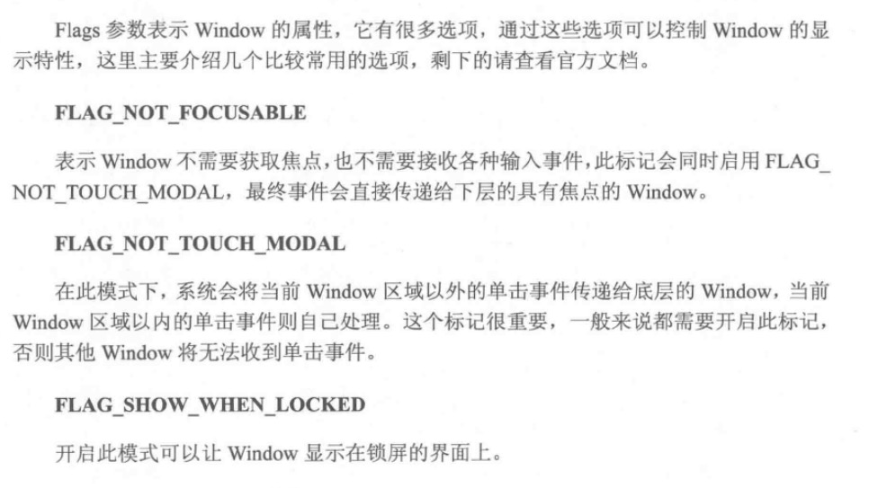

### Types：

Type 参数表示 Window 的类型，Window 有三种类型:

* 应用 Window，层级范围 1 ~ 99.

* 子 Window，层级范围 1000 ~ 1999

* 系统 Window ，层级范围 2000 ~2999

  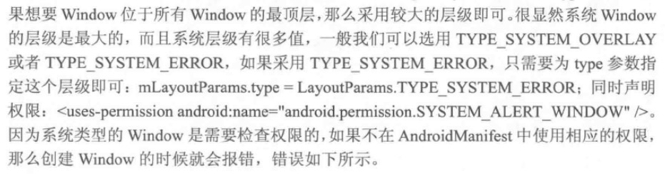


## WindowManger 的常用功能

对于开发者常用的三个方法就三个：

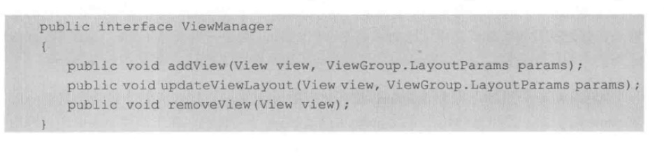

其实所有对于 Window 的操作，都是对于 View 的。

如果想实现可以跟随手指滑动的 Window，很简单只要在 View#onTouchListener 中根据手指改变 LayoutParams 中的 x y 参数，然后通过 WindowManger#updateViewLayout 达到更新 Window 位置的目的。

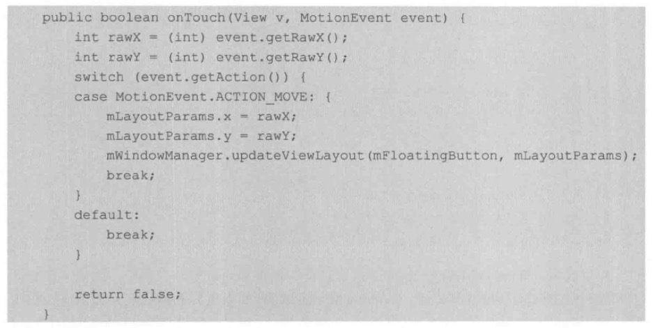


# Window 的内部机制

**参见 《Android 开发艺术探索》8.2.1**

Window 是一个抽象的概念，具体的实现是 WindowMangerImpl，而 add、update、remove 都是通过 WindowMangerGlobal 实现的。

**其实 Window 根本不存，我们操作的都是View。**在每一个 Window 对应一个 View 和 ViewRootImpl， Window 和 View 通过 ViewRootImpl 建立联系。


# Window 的创建过程

View 是 Android 中视图呈现的方式，但是 View 不能单独存在，他必须依附于 Window 这个抽线概念。所以：**有 View 的地方就必存在 Window**。


## Activity 的 Window 创建过程

参见 《Android 开发艺术探索》8.3.1

### Window 的创建

Activity 的启动是由 ActivityTread#performLaunchActivity 完成的，这个方法内部通过类加载创建 Activity 的实例，并调用 Activity#attach 为 Activity 关联运行过程中所依赖的一系列上下文环境。

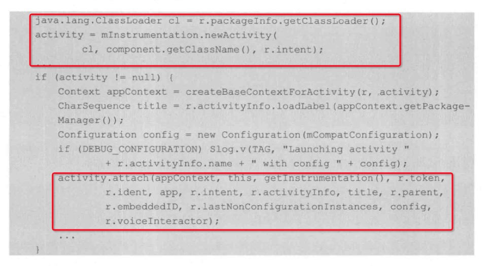

在 attach 方法中系统会为 Activity 创建所属的 Window 并为 Window 设置回调接口。回调接口很多，但是有几个却是我们熟悉的：onAttachedToWindow, onDetachedFromWindow、dispatchTouchEvent 等等

Window 的创建使用过 PolicyManger#makeNewWindow 完成的，但 PolicyManger 只是一个策略模式类，真正的调用是通过 Policy#makeNewWindow 实现的，在源码中的 PolicyManger 与 Policy 的调用关系无法看到，猜测是在编译环节动态控制的。

从  Plicy#makeNewWindow 的源码可以明确看到 Activity  Window 的具体实现是 PhoneWindow


### View 如何 attach 到 Window 上的

答案是通过 setContentView 方法。

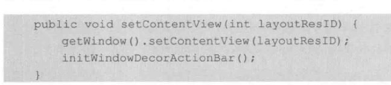

Activity Window 的具体实现是 PhoneWindow，所以我们去看 PhonWindow#setContentView 的源码，大致遵循以下几个步骤

#### 1. 如果没有 DecorView，那么创建它

DecoreView 就是一个 FrameLayout，**他是 Activity 的顶级 View**，一般来说它包含内部标题栏和内部，但是真个需要根据主题确定。至少内容区域是肯定有的。真个内容区域有固定的 id -> android.R.id.content。这也就是 setContentView 方法名字的由来。

DecorView 的创建过程由 installDecor 方法来完成，在方法内部会通过 generateDecor 方法直接来常见 DecorView，这时候的 DecorView 还是一个空白的 FrameLayout。

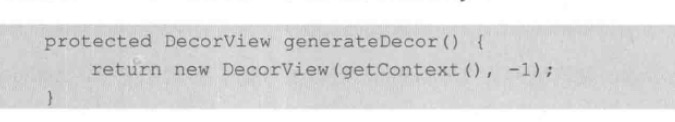

然后 PhonWindow 会根据不同的主题，通过 generateLayout 将具体布局加载到 DecorView 中。不同的布局和系统版本、主题有关。

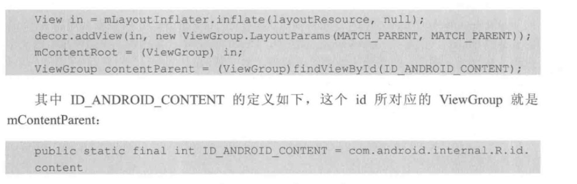

可以看到 mContentParent 就是我们指定视图的容器了。

#### 2. 将 View 添加到 DecorView 的 mContentParent 中

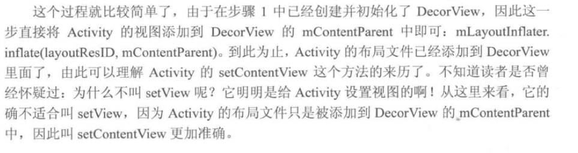

#### 3. 回到 Activity#onContentChanged 通知 Activity 视图发生改变

#### 4 将 DecorView 添加到 WindowManger 中

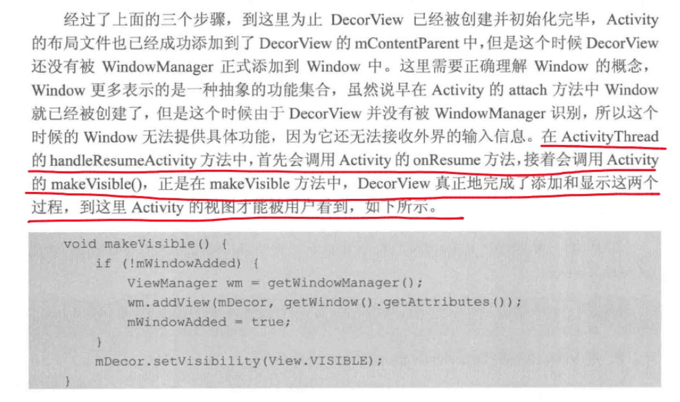

**所以说 onResume 方法并不是视图真正看见的时机，在 onResume 之后才会将 DecorView 添加到 Window Manger 并可见。这也是网上很多文章说有些判断需要放在 Activity#onWindowFouceChanged 方法中。**


## Dialog 的 Window 的创建过程

过程和 Activity 创建 Window 的方式基本一致，具体参见 《Android 开发艺术探索》8.3.2.


要注意的是 Dialog 的创建的时候必须传递 Activity 的 Context，否者会报错

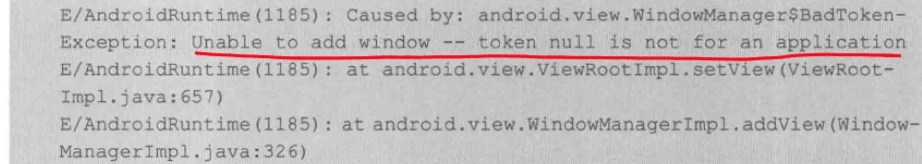

原因是没有 token，而应用 token 一般只有 Activity 才有

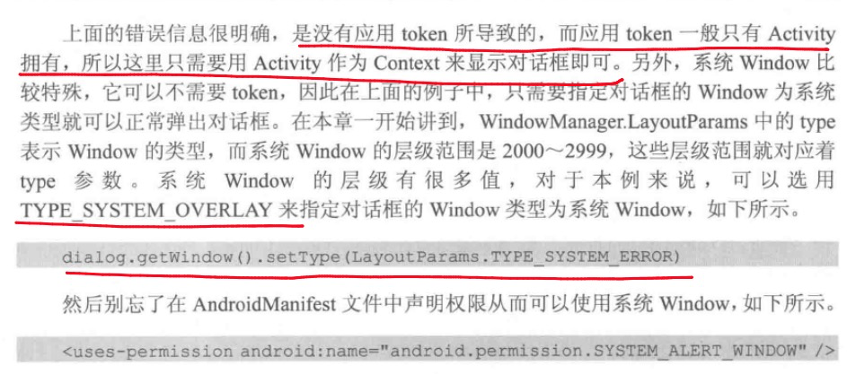

## Toast Window 创建过程

关键点：使用 Handler Looper 完成定时隐藏。内部使用 IPC 机制达到显示小时的目的。