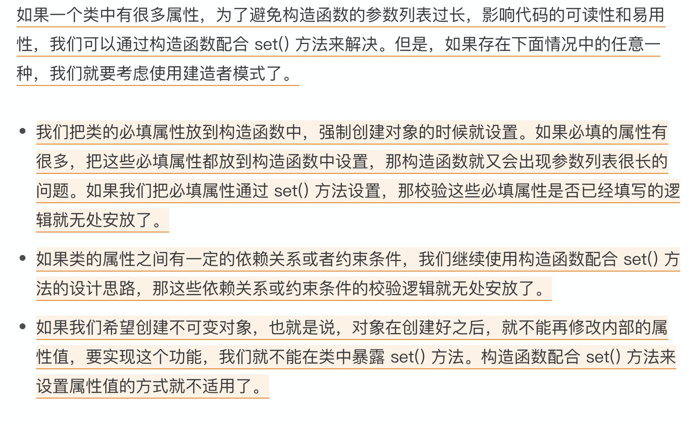
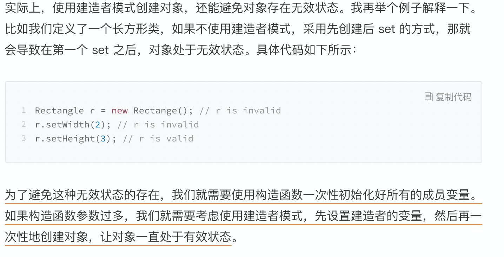

[toc]

# 工厂方法

参考

> [我为什么说没事不要随便用工厂模式创建对象](https://time.geekbang.org/column/article/197254)

## 定义

* 工厂方法

  > 定义了一个创建对象的接口，但由子类决定要实例化的类是哪一个。工厂方法把类的实例化推迟到子类。

* 抽象工厂

  > 提供一个接口，用于创建相关和依赖对象的家族，而不需要明确指定具体类。


==工厂方法值得类就是一个用来创建工厂来创建对象的类==

==工厂模式是用来创建不同但是相关类型的对象（继承同一父类或者接口的一组子类），由给定的参数来决定创建哪种类型的对象==


## 简单工厂

代码模板：

```java

public class RuleConfigParserFactory {
  // 使用一个静态的 Map 承载对象
  private static final Map<String, RuleConfigParser> cachedParsers = new HashMap<>();

  static {
    // 在初始化的时候就已经将对象缓存在 Map 中了
    cachedParsers.put("json", new JsonRuleConfigParser());
    cachedParsers.put("xml", new XmlRuleConfigParser());
    cachedParsers.put("yaml", new YamlRuleConfigParser());
    cachedParsers.put("properties", new PropertiesRuleConfigParser());
  }

  public static IRuleConfigParser createParser(String configFormat) {
    if (configFormat == null || configFormat.isEmpty()) {
      return null;//返回null还是IllegalArgumentException全凭你自己说了算
    }
    IRuleConfigParser parser = cachedParsers.get(configFormat.toLowerCase());
    return parser;
  }
}
```

**其他的代码模板到[我为什么说没事不要随便用工厂模式创建对象](https://time.geekbang.org/column/article/197254)里面看**

## 使用场景

使用时机、使用前提：

==当创建逻辑比较复杂，是一个“大工程”的时候，我们就考虑使用工厂模式，封装对象的创建过程，将对象的创建和使用相分离。==

第一种情况：类似规则配置解析的例子，代码中存在 if-else 分支判断，动态地根据不同的类型创建不同的对象。针对这种情况，我们就考虑使用工厂模式，将这一大坨 if-else 创建对象的代码抽离出来，放到工厂类中。

还有一种情况，尽管我们不需要根据不同的类型创建不同的对象，但是，单个对象本身的创建过程比较复杂，比如前面提到的要组合其他类对象，做各种初始化操作。在这种情况下，我们也可以考虑使用工厂模式，将对象的创建过程封装到工厂类中。

==如果创建对象的逻辑并不复杂，那我们就直接通过 new 来创建对象就可以了，不需要使用工厂模式。==

## 那什么时候该用工厂方法模式，而非简单工厂模式呢？

当对象的创建逻辑比较复杂，不只是简单的 new 一下就可以，而是要组合其他类对象，做各种初始化操作的时候，我们推荐使用工厂方法模式，将复杂的创建逻辑拆分到多个工厂类中，让每个工厂类都不至于过于复杂。

而使用简单工厂模式，将所有的**创建逻辑**都放到一个工厂类中，会导致这个工厂类变得很复杂。

> 由此可见，工厂方法和简单工厂方法的差异在于将创建的过程放在什么地方，简单工厂把创建过程使用都放在了一个类中，而工厂方法是将他们分散在了各个接口的实现类中。


==工厂方法是为了创建对象而生的==他无法消除创建对象的复杂度，只能将其转移:

* 不是工厂方法，if-else 逻辑、创建逻辑和业务耦合在一起
* 简单方法是将不同的创建逻辑放在一个工厂类中， if-else 逻辑在这个工厂类中
* 工厂方法是根据定义的接口将不同创建逻辑放到不同工厂类中，先用一个工厂类得到创建某个对象的工厂类从而创建对象，if-else 逻辑在工厂类的工厂中。
* 抽象工厂就是同时负责多种不同类型对象的创建。


==工厂类中创建对象的方法一般都是 create 开头==


# 建造者模式

参考

> [详解构造函数、set方法、建造者模式三种对象创建方式](https://time.geekbang.org/column/article/199674)

## 使用场景

1. 构造函数需要的必要参数很多
2. 一些属性的设置存在关联关系，使用 set 方法可能会遗漏
3. 创建之后对象不该再改变。

## VS 工厂模式

工厂模式是用来创建不同但是相关类型的对象（继承同一父类或者接口的一组子类），由给定的参数来决定创建哪种类型的对象。建造者模式是用来创建一种类型的复杂对象，通过设置不同的可选参数，“定制化”地创建不同的对象。

==当配置项是必填的，需要把它放到构造函数中设置，强制创建类对象的时候就要填写==




