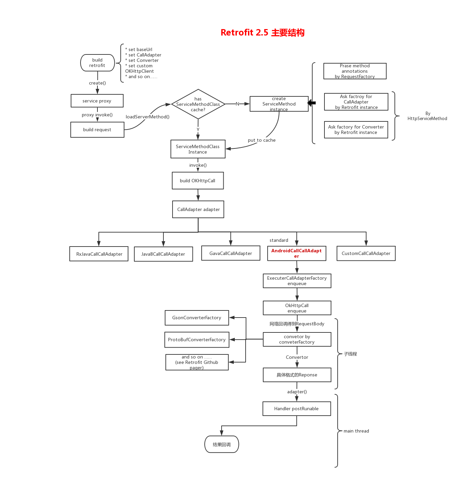

Retrofit 是对于 OkHttp 的封装，通过注解的形式将请求过程声明在接口中，然后通过通过动态代理将各种声明统一封装成网络请求，通过 OkHttp 发送到网络。

# 学习资源

[*从架构角度看Retrofit的作用、原理和启示](https://www.jianshu.com/p/f57b7cdb1c99)

[Retrofit分析-漂亮的解耦套路](https://www.jianshu.com/p/45cb536be2f4)

[Retrofit分析-经典设计模式案例](https://www.jianshu.com/p/fb8d21978e38)

[Retrofit 实现文字(参数)和多张图片一起上传](https://www.jianshu.com/p/3b8b2a0c0f30)

