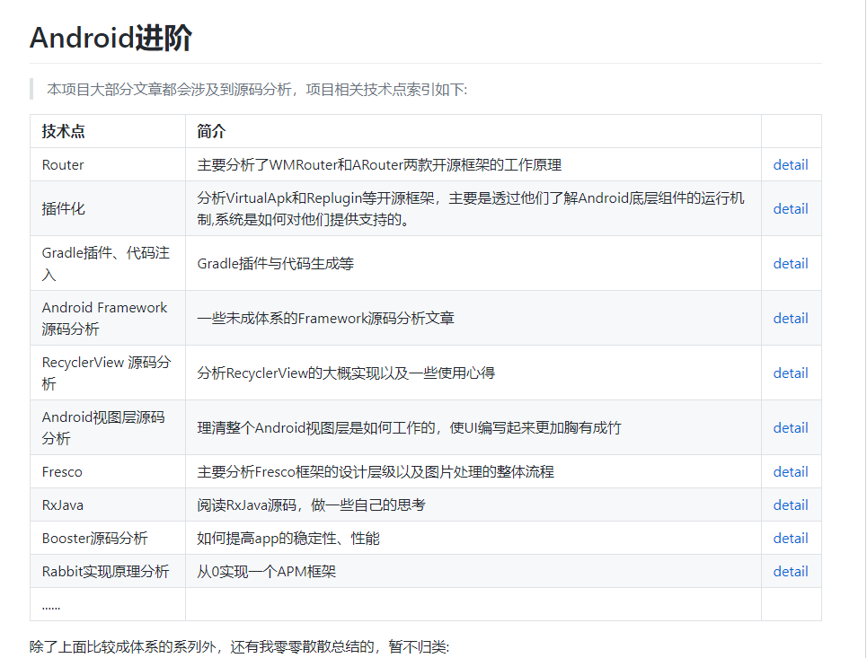

[Android知识体系总结(全方面覆盖Android知识结构，面试&进阶)](https://blog.csdn.net/ClAndEllen/article/details/79257663)

[Gityuan的博客](http://gityuan.com/archive/)

[算法面试通关40讲](https://time.geekbang.org/course/intro/130)

[Flutter核心技术与实战](https://time.geekbang.org/column/intro/200)

[一篇文章带你领略Android混淆的魅力](https://juejin.im/post/5d1717996fb9a07eeb13bc95)

[定位国家全套解决方案](<https://inneka.com/programming/android/how-can-i-get-my-android-device-country-code-without-using-gps/>)

[一些精彩的源码分析](https://github.com/SusionSuc/AdvancedAndroid)

