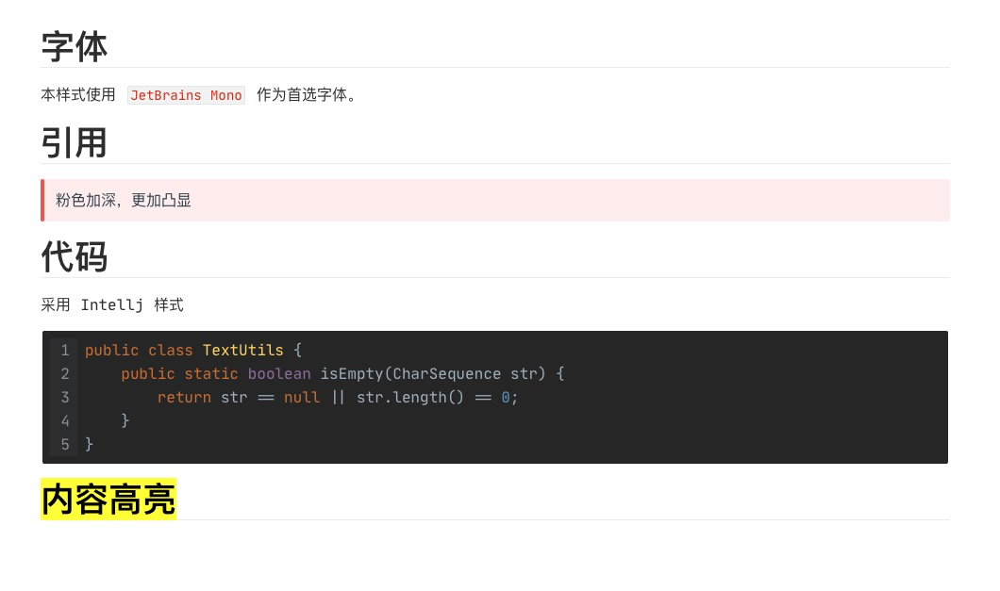

本项目致力于梳理 Android 学习路径，打造解决问题的方法论。[基础知识部分主要内容如下](目录.xmind)（会慢慢添加整理更多）

> 我叫大圣代，一名4年经验的 Android 工程师，目前致力于出海音频项目的研发和优化工作。有什么问题欢迎与我沟通探讨 ：im_dsd@126.com。我的博客：https://blog.csdn.net/qq_23191031

# 序

我一直有个毛病就是“学究式”的学习，感觉学啥都要研究好久好久下苦功死记硬背。多年下来林林总总也学了一大堆，但回头一看还是”啥也不会“，没产出多少值得炫耀的成绩。问题出在什么地方了呢？这个问题我从高中就开始思考。不怕大家笑话高中的时候我是出了名的拼命三郎：我曾持续一段时间在寝室熄灯后到女厕所挑灯夜战看书做题！！就是这样的拼还是没有换来特出众的成绩。一转眼已经毕业快4年了（17年毕业）虽然这种拼命的尽头一直延续到了现在，但是依旧很多的基础知识不会，没有做出让人眼前一亮的成绩。

2020 年可谓是自我救赎的一年.在我的领导[何红辉 Mr.Simple](https://blog.csdn.net/bboyfeiyu)([Android 源码设计模式解析与实战作者](https://github.com/hehonghui/)),辉哥的鞭策下我改变了很多，也很高兴得到了他的认可，最主要的收货莫过于：==学会了抓住重点和动手实践==

## 抓住重点

信息爆炸的时代，海量的知识充斥在我们身边，如果啥都想学脑袋挤爆了你也学不完。所以要学会抓重点：这包括知识范围的重点和内容的重点。比如并发编程这方面内容，对于 Android 开发者来说日常应用的并不多，如果没有一定的功底，上来就啃《Java并发编程实战》这本晃晃著作，肯定会一头雾水被里面的各种理论分散了注意力。这些理论很重要但在日常开发中很少有用武之地，我们不再是学生了，哪有时间精力去研究和日常脱轨、水平超纲的知识呢（不好意思，以前我真就这样）所以要识别知识的作用域==去学习工作中有用到、或感兴趣、或面试会考的内容==，在什么水平就去研究什么水平的内容一味的深入没有实践那就是纸上谈兵，而且能力不够也识别不了知识的重点很容易高射炮打蚊子。力气用了很多但是成长却很慢。

接下来就是要抓住知识的重点了。==大佬都是记特征的和哪里有坑的，具体细节网上查查就可以啦==，我觉得有个简单粗暴的办法挺好的：就是去找面试题，看看在面试的时候会问什么。这些问题一般都是对应知识的重点，当然要多找一点，然后提炼重点形成思维导图。当工作一段时间有一定的经验积累自然能够主动识别重点了。但要注重找面试题看是为了日常积累，而不是临时抱佛脚。

## 动手实践

学知识的目的是为了运用，是为了解决现实中的问题地。一味地为了面试而突击永远成不了高手。高端的面试官都会看重==面试者在过往的经历中用技术解决了什么问题==。也就是说==一个人的价值体现在他能做成什么事、解决什么难度的问题上面==。所以日常要用平常心去积累，做好准备去迎接工作中的挑战地，形成快速学习、能将知识落地到实际工作、解决他人难以应付地问题的能力。只有这样才能充分地向外界展示你的水平及成长。试想一下如此循序渐进岂不是每年都能超出领导对你的预期，升职加薪指日可待呢。

​										          21年1月19 01:31 于北京牡丹园

# 关于软件

* MarkDown 文档是使用 Typora 编辑的，推荐使用[我的自定义样式](CODE/Typora 自定义样式) ，你就可以获得与我相同的体验啦！

  

* 思维导图是 XMind 2020 一开始使用了 MindNote 但是功能没有 XMind 强大，而且是 MacOS 独占，对读者不太友好，后面会慢慢迁移思维导图到 XMind 格式的。

* 流程图是使用 drawio 绘制的，软件可以在 [GitHub中仓库获取](https://github.com/jgraph/drawio-desktop/releases/tag/v14.1.8) 

> 本项目采用[知识共享 署名-非商业性使用-禁止演绎 4.0 国际 许可协议](https://creativecommons.org/licenses/by-nc-nd/4.0/deed.zh)

