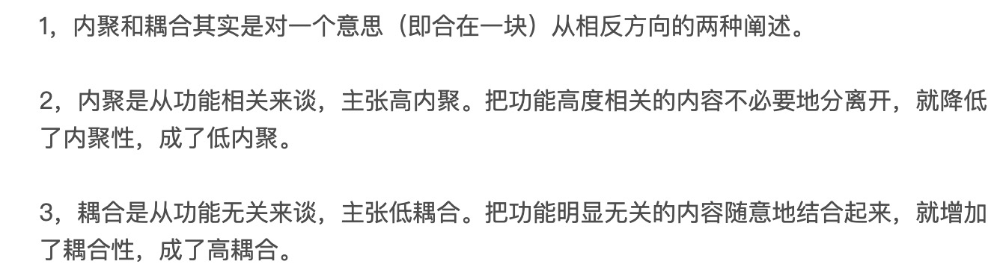
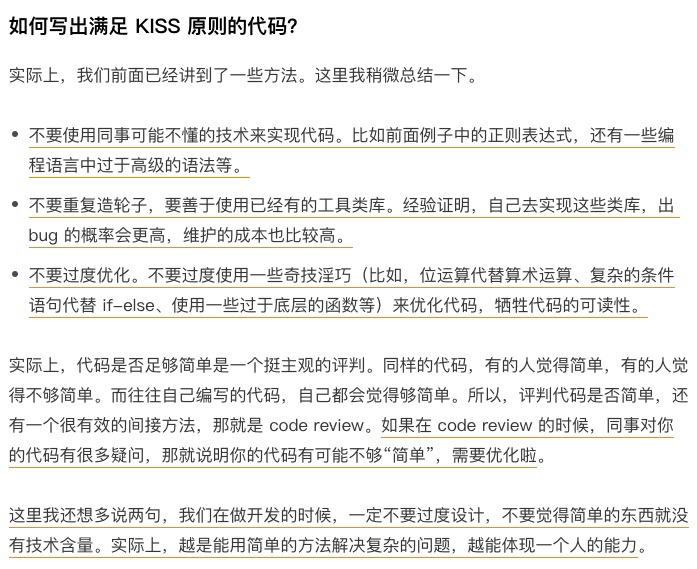
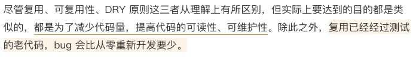
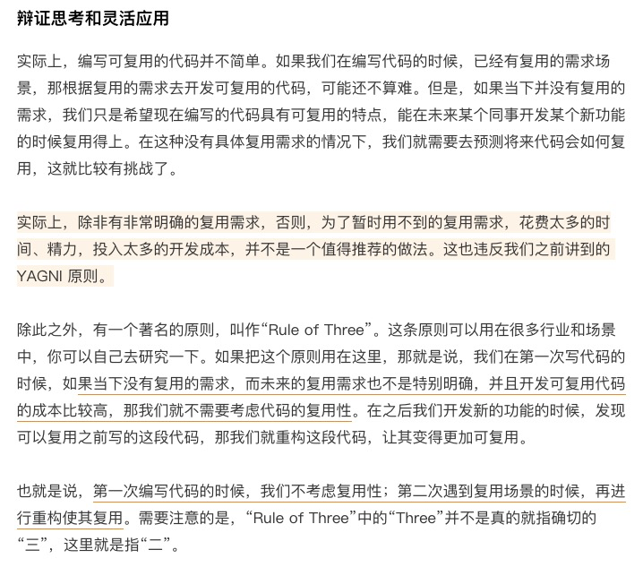
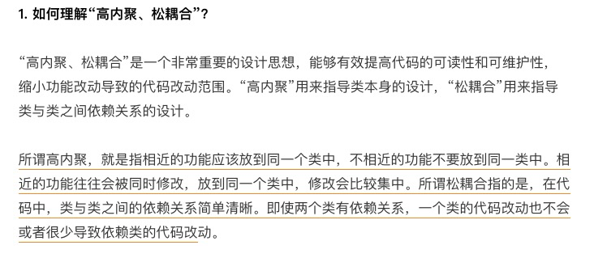
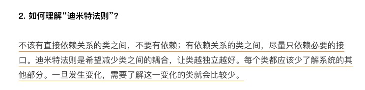

[toc]


# 设计原则

SOLID


## 单一原则：如何判定某个类的职责是否够"单一"

### 如何理解单一原则模式（SRP）

单一原则描述的方法非常简单：一个类只负责完成一个职责或者功能。不要设计大而全的类，要设计颗粒度小、功能单一的类。如果一个类完成了包含两个或者两个以上业务不相干的功能，我们就说他职责不够单一，应该将他拆分成多个功能更加单一，粒度更新的类。单一职责原则是为了实现代码高内聚、低耦合提高代码的复用性、可读性、可维护性。

### 如何判断类的职责是否足够单一

不同阶段的需求背景下，同一个类的职责是否单一的判断，可能都不是一样的，在某些场景、需求背景下，一个类的设计可能已经满足了单一原则，但是如果换一个应用场景就不一定满足了，这个就需要人为主观的判断而不是需要继续拆分成粒度更细的类。


### 类的职责是否设计的越单一越好

单一原则的目可以说是避免不相关的功能耦合在一起，来提高类的内聚性。不要过度设计，如果粒度分的太细反而适得其反，降低内聚性，也会影响代码的可维护性。



在日常开发中，我们要根据具体的业务常见，先写一个粗粒度的类，来满足需求。随着业务的发展，如果粗粒度的类越来越大，代码越来越多，这个时候就可以将代码拆分成粒度更细的类。

## 对扩展开放、修改关闭

**定义**：软件实体（模块、类、方法等）应该对拓展开放、对修改关闭。

在 23 种经典设计模式中，大部分设计模式都是为了解决代码扩展性问题而存在的，主要遵循的设计原则就是开闭原则。

在为代码添加一个功能的时候应该是在已有代码基础上拓展代码（新增模块、类、方法等），而非修改已有代码（修改模块、类、方法登）

==同样的一个代码改动，在粗粒度下可以被认为是”修改“、在细粒度下又可以被认为是”拓展“==。实际上，我们没有必要纠结某个代码是”修改“还是”拓展“，更没有必要太纠结它是否违反”开闭原则“。我们回到这条原则的设计初衷：只要它没有破坏原来代码的正常运行，没有破坏原有的单元测试，我们就可以说是一个合格的代码改动。

添加一个功能，不可能任何模块、类、方法的代码都不”修改“，这个是做不到的。类需要创建、组装、并且做一些初始化操作，才能构建成可运行的程序，这部分代码的修改是在所难免的。我们要做的尽量让修改操作更集中、更少、更上层、尽量让最核心、最复杂的那部分逻辑代码满足开闭原则。


实际上，开闭原则讲的就是代码的拓展性问题，是判断一段代码是否易拓展的”金标准“。如果某段代码在应对未来需求变化的时候，能够做到”对拓展开放、对修改关闭“，那就说名这段代码的拓展性较好。所以，问如何做到对拓展开放、对修改关闭，其实就是在问如何写出拓展性好的代码。

在讲具体的方法论之前，我们先来看一些更加偏向顶层的指导思想。为了尽量写出扩展性好的代码，我们要==时刻具备扩展意识、抽象意识、封装意识==。这些“潜意识”可能比任何开发技巧都重要。


拓展的方法是要靠长期经验积累的，我们要时刻能具备抽象意识、拓展意识、封装意识。设计那些短期内会拓展、有比较简单的点，而那些不一定会拓展，而且实现起来很麻烦减弱了代码的可读性就要先停下来，不要过度设计。


<font color = red>我的理解</font>

<font color = red>对拓展开放的目的是为了应对变化，对修改关闭的目的是为了保护老代码的稳定性，最终的目的是提高系统弹性。不要对未来过度担忧杞人忧天，要结合实际情况：根据未来发生变化的可能性、发生的时间远近、时间成本等因素，将代码分类为未来可变部分和稳定部分，然后使用抽象手段将可变部转变为更加稳定的接口或者抽象类，以供上层逻辑使用(依赖注入的方式、基于接口编程)。这样一来就实现了拓展开放、对修改关闭</font>


## 里式替换（LSP）跟多态有何区别？哪些代码违背了LSP？


## 控制反转、依赖反转、依赖注入，这三者有何区别和联系？

### 依赖反转原则

高层模块不要依赖底层模块的具体实现，而是要通过抽象来相互依赖。除此之外，抽象不要依赖具体实现细节，而是具体细节依赖抽象。

### 控制反转

这里的“控制”指的是对程序执行流程的控制，而“反转”指的是在没有使用框架之前，程序员自己控制整个程序的执行。在使用框架之后，整个程序的执行流程可以通过框架来控制。流程的控制权从程序员“反转”到了框架。

### 依赖注入 ID

依赖注入的意识是说，不通过 new() 等方式在类的内部创建依赖类的对象，而是将依赖类的对象在外部创建好之后通过构造函数、函数参数等方式传递(注入)进来。

依赖注入的实现方式通常是接口

```java
public interface MessageSender {
  void send();
}

public class Notification {
  private MessageSender mMsgSender;
  
  //此处体现的就是依赖注入，将具体的依赖对象传递进来，因为依赖的是借口，
  //所以外部有很大的拓展空间。
  void Notification(MessageSender msgSender) {
    	mMsgSender = msgSender;
  }
}
```

### 基于接口而非实现编程 跟 依赖注入 区别于联系

联系是二者都是从外部传入依赖对象而不是在内部去new一个出来。
区别是“基于接口而非实现编程”强调的是“接口”，强调依赖的对象是接口，而不是具体的实现类；

而“依赖注入”不强调这个，类或接口都可以，只要是从外部传入不是在内部new出来都可以称为依赖注入。


## 我为何说KISS、YAGNI原则看似简单，却经常被用错？

### KISS：

> Keep It Simple and Stupid.
>
> Keep It Short and Simple.
>
> Keep It Simple and Straightforward.

翻译成中文就是：尽量保持简单。用简单的方式处理复制的问题才能体现出一个人的能力。

只有代码足够简单才能更好的让人读懂、才能更好的定位 bug。

例如：不要写正则表达式这种一般人看不懂的代码，而且很容易出错。



KISS 原则是保持代码可读和可维护的重要手段。KISS 原则中的“简单”并不是以代码行数来考量的。代码行数越少并不代表代码越简单，我们还要考虑逻辑复杂度、实现难度、代码的可读性等。而且，本身就复杂的问题，用复杂的方法解决，并不违背 KISS 原则。除此之外，同样的代码，在某个业务场景下满足 KISS 原则，换一个应用场景可能就不满足了。

### YAGNI

YAGNI：You Ain’t Gonna Need It。直译就是：你不会需要它。它的意思是：不要去设计当前用不到的功能；不要去编写当前用不到的代码。实际上，这条原则的核心思想就是：==不要做过度设计==。


**KISS 原则讲的是“如何做”的问题（==尽量保持简单==），而 YAGNI 原则说的是“要不要做”的问题（==当前不需要的就不要做==）。**

对于如何写出满足 KISS 原则的代码，我还总结了下面几条指导原则：

==不要使用同事可能不懂的技术来实现代码；==

==不要重复造轮子，要善于使用已经有的工具类库；==

==不要过度优化。==


## 重复的代码就一定违背DRY吗？如何提高代码的复用性？







DRY 原则。它的英文描述为：Don’t Repeat Yourself。中文直译为：不要重复自己。将它应用在编程中，可以理解为：不要写重复的代码。


## 如何用迪米特法则（LOD）实现“高内聚、松耦合”？

迪米特法则也叫做最小知识法则：每个模块应该只了解和他关系密切的模块的有限知识。或者说：每个模块只和自己的朋友说最少的话，坚决不和陌生人说话。





*在今天的讲解中，我们提到了“高内聚、松耦合”“单一职责原则”“接口隔离原则”“基于接口而非实现编程”“迪米特法则”，你能总结一下它们之间的区别和联系吗？*

> 目的都是实现高内聚低耦合，但是出发的角度不一样，==单一职责是从自身提供的功能出发，迪米特法则是从关系出发，针对接口而非实现编程是使用者的角度==，殊途同归。


# 参考

[设计模式之美](https://time.geekbang.org/column/article/161114)

