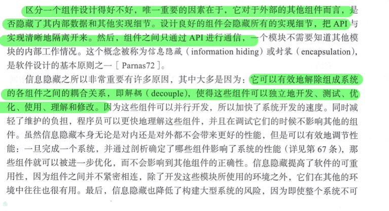
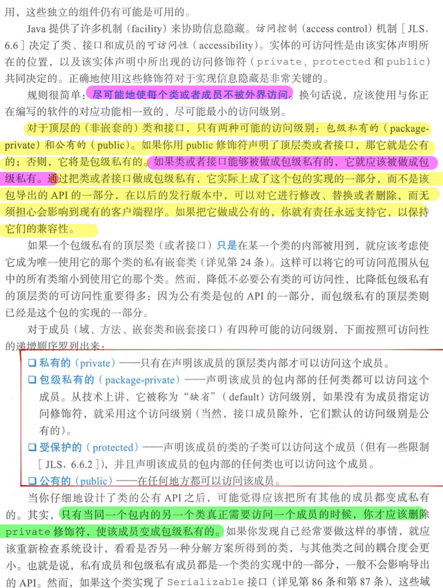
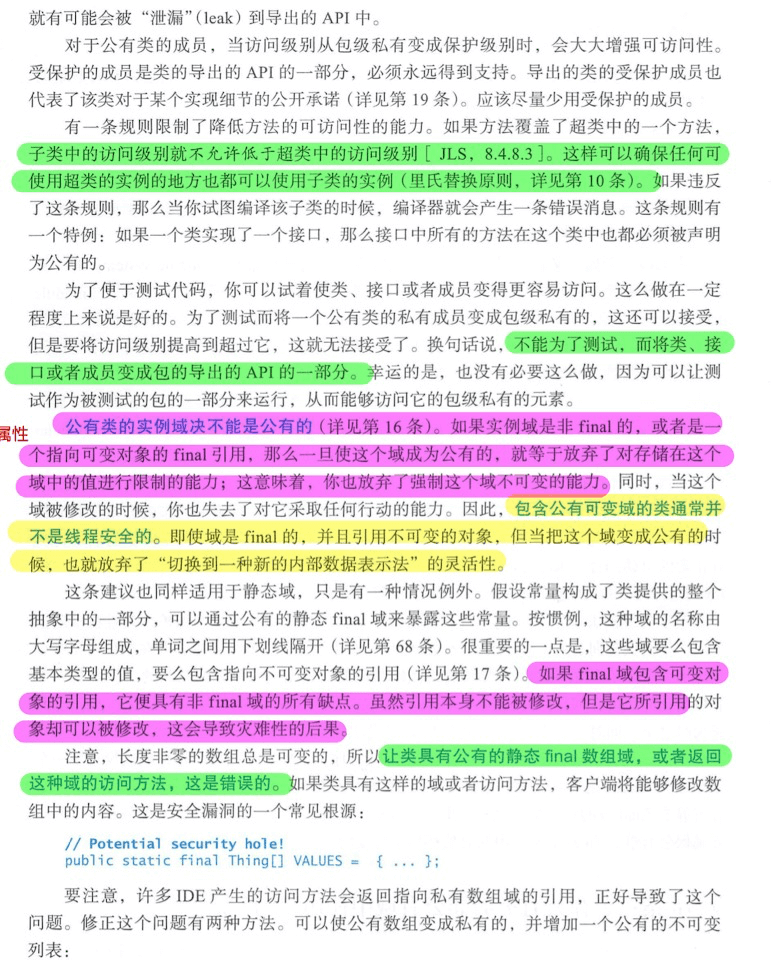
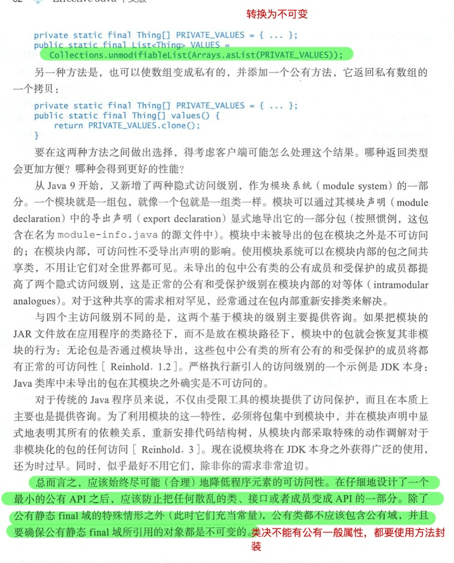
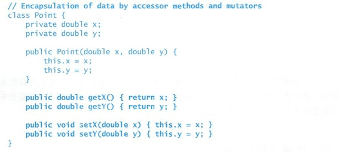

[参考](https://www.jianshu.com/p/6030be68b245)

[toc]


## Chapter 01 :引言

这本书的目的是帮助编写清晰正确，可用的，健壮性灵活性高和可维护的代码，而非针对高性能。主要从对象，类，接口，泛型，枚举，流，并发和序列化等方面介绍。

## Chapter 02 :对象的创建和销毁

### 考虑使用静态工厂方法而不是构造方法创建对象

**静态工厂方法的好处有：**

1. 静态工厂方法有方法名，可避免构造方法的重载并且易读。
2. 静态工厂方法不要求每次调用都创建一个新的对象，如对于单例以及不可变对象的复用。
3. 静态工厂方法可以返回类型可以是子类对象
4. 静态工厂方法的接收参数不同，可以返回不同的对象。
5. 静态工厂方法可以只定义抽象方法或接口，由具体的实现类实现。如SPI技术。
6. 

**静态工厂方法的缺点主要有：**

   1. 如果返回对象的类只有package-protected或private的构造方法，则工厂方法不能创建子类对象

   2. 静态工厂方法的API难找到,可使用`from,of,valueOf,instance,getIntance,create,newInstance`等方法名来命名。

      > * from - 类型转换方法，接受单个参数并返回此类型的相应实例：Date d = Data.from(intance)
      >
      > * of - 聚合方法，接受多个参数并返回该类型的实例，并把他们合并在一起：Set<Rank> card = EnumSet.of(JACK, QUEEN, KING);
      >
      > * valueOf - 比 from 和 of 更加繁琐的一种替代方法，例如
      >
      >   ```BigInteger prime = BigIntegr.valueOf(Integer.MAX_VALUE);```
      >
      > * instance 或者 getInstace - 返回的实例是通过方法的（如有）参数来描述的，但是不能说与参数具有相同的值，例如：
      >
      >   ```StackWalker luke = StackWalker.getInstance(options);```
      >
      > * creaet 或者 newInstance - 像 instance 或者 getInstance 一样，但是 create 或者 newInstance 能够保证每次都返回一个新的实例，例如。
      >
      > * get*Type* - 像 getInstance 一样，但是在工厂方法处于不同的类中的时候使用， *Type*表示工厂方法所返回的类型。
      >
      >   ```FileStore fs = Files.getFileStore(path)```
      >
      > * new*Type* - 像 newInstance 一样，但是在工厂方法处于不同的类中的时候使用， *Type*表示工厂方法所返回的类型。
      >
      >   ```BufferedReader br = Files.newBufferedReader(path);```
      >
      > * *type* - getType 和 newType 的简化版：
      >
      >   `List<Complaint> litany = Collections.list(legacyLitany);`

      <font color = red>在我的项目里面我会使用</font>

      > <font color = red>creaetFrom ：单参数创建</font>
      >
      > <font color = red>createOf 多参数聚合参数创建</font>
      >
      > <font color = red>getInstance 表示获取单例</font>
      >
      > <font color = red>get*Type* 表示从工厂方法获取缓存实例</font>
      >
      > <font color = red>create*Type* 从工厂方法创建实例</font>

### 当有很多构造参数时，使用Builder模式

当有很多构造参数并且是可选参数的时候，使用Builder模式更加易读，而且保护了对象的不可变性。JavaBean.set 也好用，但是他会带来实例对象不一致的问题 -> 对象在创建后被随意使用 set 方法修改了内容。而 Buidler 模式只有在创建实例之初才进行修改，保护了对象的不可变性。

### 单例对象必须私有化构造方法，或者使用枚举类型

单例必须保证只有一个对象实例，枚举会更加安全（不可序列化），如果单例的类必须继承抽象类的时候，只能使用前者，因为枚举类都会继承Enum类。

### 不可实例化的类必须私有化构造方法

只有这样才不允许外界创建对象或者实现子类。

### 优先使用依赖注入而不是绑定固定资源

如果一个类可能依赖多个资源，不要在实现上写死某个资源，可以使用构造方法传参，工厂类创建对象或者DI框架（Spring）等实现。

### 避免创建不必要的对象

如对String对象的包装`new String("bikini")`(应该直接使用`"bikini"`)，计算时包装类型和基本类型的来回转换，大对象的重复创建等都是资源的浪费。应尽量使用基本类型的对象参与运算，复用不可变（或在使用时不会改变的）大对象，常用对象使用池化技术等技巧来避免对象的创建。

### 消除无用的对象引用

如下面的代码在`pop`时应释放弹出的数组元素的引用,否则会导致内存泄漏。


```java
public class Stack  {
    private Object[] elements;
    
    private static final int DEFAULT_INITIAL_CAPACITY = 16;
    
    private int size;

    public Stack{
        elements = new Object[DEFAULT_INITIAL_CAPACITY];
    }
    public Object pop(){
        if(size == 0){
            throw new EmptyStackException();
        }
        Object result = elements[--size];
        //释放引用
        elements[size] = null;
        return result;
    }
.......

}
```

因为Java是有垃圾回收机制的，通常不需要手动将对象置为null。但是如果对象内部管理自己的内存分配，则需要手动释放元素的引用，（如上面的例子，只有数组将元素置空了，元素对应的对象才能被回收）否则会导致内存泄漏。此外，缓存，监听器和其他回调函数也可能导致内存泄漏，可借助性能分析工具来分析这类问题。

- **避免使用finalizer和cleaner**
   不要使用finalizer和cleaner来做对象的清理工作，因为他们的回收时间无法控制（回收对象是放在队列中，同时于具体的引用类型相关）。没有实现`AutoClosable`接口的对象回收速度快。Finalizer存在finalizer攻击，可通过增加一个空实现的finalize方法解决。在Java中，可使用cleaner来实现native方法分配的堆外内存的回收（DirectByteBuffer）。总的来说，还是要慎用。关于Java的引用，可参考：
   [Java Reference详解](https://links.jianshu.com/go?to=https%3A%2F%2Fmy.oschina.net%2Frobinyao%2Fblog%2F829983)
- **优先使用try-with-resources而不是try-finally**
   `try-with-resources`的书写更加简洁优雅，同时可解决`try-finally`资源关闭失败的情况。使用`try-with-resources`的资源必须实现`AutoClosable`接口。

## Chapter03:Object类的方法

`Object` 类是所有类的父类，它定义了一些非 `final` 的方法，如 `equals`, `hashCode`, `toString` 等,这些方法有它们自己的规定。此外，`Comparable.compareTo` 方法虽然不是Object的方法，但是它也经常出现在任何同类对象中用来比较两个对象，以下也会讨论。

### 重写equals方法时的规定

1.每一个类实例对象都是唯一的。
2.如果对象没有比较是否相等的必要，就不用重写equals方法，如`java.util.regex.Pattern`就没必要。
3.父类重写的equals方法已经合适使用了，就不需要子类再重写。如`AbstractMap`。
4.如果类是private或者package-private的访问权限，则没有必要暴露equals方法，也就不用重写。
所以value classes（也就是需要比较类对象内容的类）适合重写equals方法，重写equals方法应该满足以下特性：
<font color = red>1.自反性，即`x.equals(x)==true`。</font>
<font color = red>2.对称性，即如果`x.equals(y)==y.equals(x)`。</font>
<font color = red>3.传递性，即如果`x.equals(y)==y.equals(z)==true`,则`x.equals(z)==true`。</font>
<font color = red>4.一致性，即如果`x.equals(y)==true`,x,y值不改变的话，`x.equals(y)==true`一直成立。</font>
<font color = red>5.如果x是不为null的引用对象，则`x.equals(null)==false`。</font>
一般重写equals方法时需要先对比引用，再对比类型，然后挨个对比成员变量的值是否相等。如`AbstractList.equals`：


```kotlin
//AbstractList.equals
public boolean equals(Object o) {
        if (o == this)
            return true;
        if (!(o instanceof List))
            return false;

        ListIterator<E> e1 = listIterator();
        ListIterator<?> e2 = ((List<?>) o).listIterator();
        while (e1.hasNext() && e2.hasNext()) {
            E o1 = e1.next();
            Object o2 = e2.next();
            if (!(o1==null ? o2==null : o1.equals(o2)))
                return false;
        }
        return !(e1.hasNext() || e2.hasNext());
    }
```

### 重写equals方式时必须重写hashCode方法

因为相同的对象必须拥有相同的hashCode。比如HashSet和HashMap的实现，会根据key的hash值分配所在entry的位置，如果两个key对象equals对比为true，而hashCode值不相同，那么会存在put进去但无法get出来的情况，这是不符合逻辑的。所以重写equals方式时必须重写hashCode方法。
一般重写hashCode方法时hash算法要尽量保证不同元素的hash值唯一，如`AbstractList.hashCode`:


```csharp
public int hashCode() {
        int hashCode = 1;
        for (E e : this)
//使用31这个质数尽可能保证了运算值的唯一性
            hashCode = 31*hashCode + (e==null ? 0 : e.hashCode());
        return hashCode;
    }
```

### 总是重写toString方法

`println,printf,log输出`以及debug的时候都会默认调用对象的toString方法，所以重写toString可使代码更易懂，同时toString方法返回信息应该包含对象中所有有意义的信息，并且尽量格式化，方便阅读。

### 慎重重写clone方法

类必须实现`Cloneable`接口才能重写clone方法，clone方法的规定需要保证以下成立：


```php
x.clone() != x;
x.clone().getClass() == x.getClass();
//非必须
x.clone().equals(x);
```

使用clone方法需要注意：
<font color = red> 1.不可变的类不应该提供clone方法。</font>
<font color = red> 2.clone方法的功能就像是构造方法，应该确保不会对原来的对象造成影响。</font>
<font color = red> 3.对于final成员变量，将其作为可变对象进行clone是不太合适的，可能需要去掉final修饰。</font>
<font color = red> 4.对于复杂对象的clone，应该先调用super.clone，然后在组装变量之间的关联关系，如HashTable中的Entry链表引用.</font>
<font color = red> 5.对象克隆的更好方法其实是提供copy 构造方法或者 copy工厂方法，</font>如:


```cpp
//copy constructor
    public static Yum(Yum yum){
        .....
    }
//copy factory
    public static Yum newInstance(Yum yum){
        .....
    }
```

因为他们不依赖危险的克隆机制，也没有文档克隆要求，和final fields的使用不冲突，同时不需要抛出检查异常和强转。
 对于数组，是适合使用clone的，因为它的运行时类型为Object[],不需要进行强转。如`ArrayList.copy`


```php
public Object clone() {
        try {
            ArrayList<?> v = (ArrayList<?>) super.clone();
            v.elementData = Arrays.copyOf(elementData, size);
            v.modCount = 0;
            return v;
        } catch (CloneNotSupportedException e) {
            // this shouldn't happen, since we are Cloneable
            throw new InternalError(e);
        }
    }
```

## 考虑实现Comparable接口

Comparable用来给对象排序使用，实现该接口意味着类实例对象拥有一个天然的排序方式。当对象拥有排序的意义时，就可以考虑实现Comparable接口。这样对象可用在基于排序的集合中，如`TreeSet,TreeMap`。此外，在`compareTo`实现中，不要使用`<,>`来做比较，而应该继续调用比较对象（基础对象就用包装类的compare方法）的compare或compareTo方法。

## Chapter04:类和接口

### 使类和成员的可访问性最小化

对于变量，方法，类和接口，对外界的访问级别有`private`,`package-private`,`protected`,`public`四种。使用原则是尽量减少成员的访问权限。如public类的实例变量基本不能为public的，也不应该定义public static final修饰的数组和集合变量，或对外返回这样的变量，都是线程不安全的。









### 属性访问性最小化:公有类中不能暴露公有变量

因为暴露方法比暴露变量更具有实现的灵活性，同时前者客户端的破坏性相对较小。

不能再公有类中定义 public 属性，应该使用方法封装一层

```java
public class Point {
  public double x;
  public double y;
}
```

getter 方法用户获取值，对于可变参数的类来说，应该用公有设值方法 setter 类来代替：



<font color = green>如果类可以在它所在的包之外进行访问，就提供访问方法</font>

<font color = red>如果类是包私有的，或者是私有嵌套类，直接暴露他的数据域并没有本质的错误</font>

简而言之，公有类永远不应该暴露可变的域。

### 使可变性最小化

不可变类指的是实例不能被修改的类 -》 每个实例中包含的所有信息都应该在创建实例的死后就提供，并在对象的整个生命周期内固定不变。

不可变类拥有线程安全，简洁和不易出错等优点，不可变类需要遵循：

1. 不提供外界方法修改对象的状态 -> 不提供设值方法
2. 确保类不可以被继承，用final修饰。
3. 所有的变量用final修饰。
4. 所有的变量用private修饰。
5. 确保不提供可变对象的访问方式。

不可变对象的唯一缺点是每次都是重新一个新的对象，对于创建巨型对象时，资源消耗大。
如果一个类不能设计为不可变的，应该尽量缩小它的可变性。如变量私有化，构造方法

### 优先使用组合而不是继承

继承会破坏封装性。而持有对象的实例或接口实例（组合模式/装饰者模式）比继承更加健壮，功能强大。如果子类和父类有共性，还是用继承。

对于那些明知道不需要被使用继承的类，在设计的时候直接定义为 final class

### 继承的设计和文档说明

1.如果子类重写父类方法，应写明方法签名的相关信息和调用者信息等。
2.慎重的在protected的方法中留有hook，可能子类并不能处理好。
3.构造方法不应该调用重写方法。
4.clone和readObject方法不能调用重写方法，因为这些方法就像是构造方法一样。

### 优先使用接口而不是抽象类

接口表示拥有某种特性，一个类可实现多个接口，但是只能继承一个类。接口可使用包装类获得安全性功能性更强的类。

### 慎重设计接口

接口可提供 default 方法给它的实现类，但是可能只有在运行期才能发现这些default方法的异常。

建议尽量避免利用省却方法在现有接口上添加新的方法，除非有特殊的需要，但就算是那样的情况下也应该谨慎考虑：缺省方法的实现是否破坏了先有接口的实现。

缺省方法不支持从接口中删除方法、修改函数的签名。

### 只有当定义类型时，才使用接口

接口是用来表示某种类型：是可以被其他类调用方法的。不要使用接口作为常量的实现，应该使用常量类或工具类来实现常量等功能。

### 优先使用继承类而不是标记类

标记类是指用标记属性来区分标记对象，如用长宽高属性来区分长方形和圆。而应该分别设计长方形类和圆类（分别继承一个表示形状的类）来区分长方形和圆。

### 内部类的使用

内部类包括`静态内部类`，`成员内部类`，`匿名内部类`和`局部内部类`。
1.静态内部类相当于外部类的一个静态成员，它的创建不依赖于外部类，可访问外部类的所有静态成员。可作为一个`公有的帮助类`，如外部类的枚举类(Calculator.Operation.PLUS)。私有静态内部类可表示外部类的组成。如HashMap中的`Node`类，因为它并不持有外部类的引用，所以用静态实现更节省内存空间。
2.成员内部类依赖于外部类的创建，可以调用外部类的任何成员。通常作为外部类的一个扩展类使用，如集合类中的`Iterator`实现类。
3.匿名内部类没有名字，是一个类的引用。之前匿名内部类可用来作为接口或抽象类的实现传入方法，但自从Java8引入Lambda表达式，Lambda表达式更适合这种场景。此外，匿名内部类可作为静态工厂方法的实例返回。
4.局部内部类使用频率最低，可定义在方法和代码块中。可参考：
[详解内部类](https://www.cnblogs.com/chenssy/p/3388487.html)

### 公有类应该单独设计在一个路径下

这样可保证编译器读取的公有类文件是互不影响的。

## Chapter05:泛型

Java5之后，泛型成为Java语言的一部分。没有泛型前，操作集合中的元素必须进行强转，而类型转换异常只能在运行期才能发现。泛型可以告诉编译器集合中每个元素是什么类型的，从而可以在编译期就发现了类型转换的错误。泛型使得程序更加安全，简洁明了。

## 不要使用没有泛型的集合

也就是不要使用`Set`定义集合，这又回到了没有泛型的时代了。而应该使用`Set`,`Set`,`Set`等来定义集合。关于泛型类型的获取，可参考：
[java Type 详解](https://www.jianshu.com/p/cae76008b36b)
[Java泛型的学习和使用](https://www.jianshu.com/p/e4e4401c3d46)

## 消除每一个未检查的警告

每一个未检查的waring都是一个潜在的运行时类型转换异常，尽量保证代码不提示这种异常。或者使用`@SuppressWarnings`注解抑制警告，同时说明原因，并尽量缩小该注解的作用范围。

## 优先使用集合而不是数组

因为数组不支持创建泛型数组(如new List<E>[],new E[])，它只能保证运行时的类型安全而不是编译时的类型安全。

## 优先使用泛型参数（如E）定义泛型

解决基于数组实现的泛型类有两种方式：
1.使用Object[]来做成员变量,每次获取元素都进行强转，如Java的`Stack`类。
2.使用E[]来做成员变量,只有创建泛型数组的时候强转为E[]，其他添加和获取操作不用进行强转。即


```dart
        E[] elements = (E[])new Object[16];
```

推荐使用第二种方式，因为它更加易读，简洁，只在创建数组时进行了一次强转。
 此外，可以使用<E extends T>可使泛型元素获得原来T的功能。
 总之，使用泛型类型的参数可尽量避免运行时的类型强转。

## 优先使用泛型修饰的方法

是指用泛型类型修饰方法的形式参数和返回值，同样可以避免方法中的类型强转。

## 使用WildcardType 通配符类型增加灵活性

通配符类型主要包含三种：
1.无限定通配符，形式：<?>，表示任意类型，List<?>会比List<String>具有更大的灵活性。
2.上边界通配符，形式：<? extends E>，表示是E或者E的子类型。
3.下边界通配符，形式：<? super E>，表示是E或者E的父类型。
当方法中的形式参数使用通配符泛型类型时，遵循`PECS原则`可获得最大的灵活性。PECS是指当参数是作为生产者时，使用``,当参数作为消费者时，使用``。如向Stack中添加元素`push`（向stack中生产元素）,使用<? extends E>；从Stack中获取元素`pop`（从stack中消费元素）,使用<? super E>。即生产上边界类型消费下边界类型的原则。


```csharp
//保证放进去的元素都有E的特性
    public void pushAll(Iterable<? extends E> src){
        for (E e : src) {
            push(e);
            
        }
    }
//保证取出来的元素至多有E的特性
    public void popAll(Iterable<? super E> dst){
        while (! isEmpty()){
            dst.add(pop());
        }
    }
```

## 慎重可变参数的泛型类型参数

因为可变参数是由数组实现的，当数组和泛型共同使用时，可能导致类型转换的失败。避免异常需要保证：
1.不要向可变参数的数组中添加元素。
2.不要使数组暴露给客户端代码,也不要使用clone。
可参考JDK中`Arrays.asList(T... a)`,`EnumSet.of(E first, E... rest)`中的实现。如果类型安全，使用`@SafeVarags`注解这类方法。

## 考虑使用类型安全的异构容器

通常我们是在集合容器中使用泛型，如List<String>，但是这类容器只能接收一种类型（String）的参数。我们可以使用`Class object`作为key，来存储更多参数类型的容器。如`Map,Object> map`。

## Chapter06:枚举和注解

## 使用枚举代替数字常量

枚举类是继承Enum类实现的，枚举对象是`public static final`定义的（枚举对象可以是枚举类的子类实现）。同时枚举类构造方法是私有的，外界没有办法创建枚举实例，Enum类序列化相关方法会抛出异常，也就无法通过序列化创建出新的枚举对象。所以枚举对象是天然的不可变单例对象。
枚举类的好处是易读，安全和可提供更多的功能。如何使用枚举类：
1.枚举类应该是`public`的类，如果它和使用者紧密相关，那么应该是使用者的成员类。
2.如果每个枚举对象都有各自特有的行为，最好是定义一个抽象方法，让枚举对象各自实现这个抽象方法。如：


```java
public enum Operation {
    PLUS{
        @Override
        public double apply(double x, double y) {
            return x + y;
        }
    },
    MINUS{
        @Override
        public double apply(double x, double y) {
            return x-y;
        }
    };
//由子类实现
   public abstract double apply(double x,double y);
}
```

3.当由某个特征获取枚举对象时，可返回Optional<T>对象，由客户端判断是否能获取到枚举对象。
 4.当编译期可确定常量的集合内容时，都可以使用枚举类来实现。

## 使用枚举对象的字段属性定义枚举对象，而不是枚举类中的ordinal字段

如以下定义：


```cpp
public enum Ensemble {
    SOLO(1),
    DUET(2);
    
    private int numberOfMusicians;

    Ensemble(int size){
        this.numberOfMusicians = size;
    }
    //正确使用
    public int numberOfMusicians1(){
        return numberOfMusicians;
    }
    //错误使用
    public int numberOfMusicians(){
        return ordinal() + 1;
    }
    
}
```

Enum类中`ordinal`的设计是用来比较枚举对象的大小和EnumSet,EnumMap中使用的。

## 使用EnumSet代替bit字段的定义

EnumSet是对枚举类对象的数组集合包装，提供了一系列处理枚举类数组集合的方法。使用位向量数组实现，性能和bit处理相当，同时又拥有枚举类的优点。

## 使用EnumMap代替使用ordinal索引

EnumMap是对枚举类对象的Map数组集合包装,key为对应的枚举类对象。底层实现也是使用ordinal作为数组下标。但是相比直接使用ordinal作为数组下标的数组，EnumMap更加直观方便，同时可表示多个维度，如`EnumMap<...,EnumMap<...>>`。

## 使用实现接口来扩展枚举类

因为枚举类默认继承Enum类，可实现多个接口来扩展枚举对象的方法。
可参考：
[剖析EnumSet](https://links.jianshu.com/go?to=https%3A%2F%2Fwww.cnblogs.com%2Fswiftma%2Fp%2F6044718.html)
[剖析EnumMap](https://links.jianshu.com/go?to=https%3A%2F%2Fwww.cnblogs.com%2Fswiftma%2Fp%2F6044672.html)

## 优先使用注解而不是固定命名模式

注解更加灵活，方便统一处理。如Lombok,Junit中的使用。

## 对于重写方法，使用Override注解标明

否则重写了方法而不自知，可能导致错误发生。

## 使用接口声明某种通用特性

相比使用注解声明某种`通用特性`，使用接口声明会更加明确，统一。如`Serializable`接口统一表示Java的原生序列化标志。

## Chapter07:Lambda表达式和流处理

- ## **优先使用lambdas而不是匿名类**
  
   lambda可以使代码看起来更加简洁，书写方便。对于函数接口（只有一个abstract方法的接口），不要使用匿名类创建实例，也不要序列化lambdas或者匿名类。lambdas最好是不超过几行，容易理解的代码。
- ## **优先使用方法引用而不是lambdas**
  
   Lambda 表达式常用语法是 `(argument) -> (body)`，而方法引用指的是`目标引用::方法`的形式。如下：


```rust
//Lambda 表达式形式
Comparator c = (p1, p2) -> p1.getAge().compareTo(p2.getAge());
//方法引用
Comparator c = Comparator.comparing(Person::getAge);
```

使用方法引用大多时候会显得更加简洁易懂。但是当Lambda 表达式形式比方法引用更简洁的时候，使用前者。

- ## **优先使用标准的函数接口**
  
   `java.util.function`包中提供了表示生产者（Supplier<T>）,消费者（Consumer<T>）,预测（Predicate<T>)等众多函数接口，优先使用这些函数接口。另外，含有基本类型参数的函数接口不要传入包装类型参数。自定义的函数接口使用`@FunctionalInterface`注解。
- ## **慎重使用streams**
  
   过度使用streams(流处理)会导致程序难读难维护。streams用函数对象来处理流数据（想象水流流过管道），循环代码块(循环遍历代码，如for循环，while循环)用代码块不断的重复操作。他们的操作对比：

1.代码块可读写作用域内访问的任何局部变量。Lambda只能读用`final修饰`或者`effectively final`(A variable or parameter whose value is never changed after it is initialized is effectively final.)的变量，并且不能修改任何局部变量。
 2.代码块可使用`return`，`break`，`continue`或者`抛异常`；Lambda不能做这些事情。
 如果需要上述这些代码块操作的，则不适合使用streams。streams适合做的事情为：
 1.统一的流中元素转换
 2.按照条件过滤一些元素
 3.用简单的操作（如求最小值）处理元素
 4.把元素放入集合容器中，如分组
 5.查询满足某些条件的元素集合
 其实也就是`map-reduce`操作适合流式处理。

- ## **在streams管道中优先使用无副作用的函数**
  
   无副作用的函数参数是指不依赖可变状态参数，同时也不会修改任何状态的函数。这样在流处理的过程中，每阶段的处理结果只依赖于它的前一阶段的输入结果。同时不要使用`forEach`做流展示的运算。在做流的`collect`操作时，可通过`Collectors`实现一系列的集合操作，如`toList`,`toMap`,`groupingBy`等。
- ## **优先使用集合而不是Stream作为返回结果**
  
   集合既可以做集合中元素序列的流处理，也可以迭代使用。但是Stream没有实现Iterable接口，无法做迭代操作。
- ## **小心使用streams 并行计算**
  
   可调用`parallel`方法实现并行计算，但是对于`limit`,`collect`方法并不适合使用并行计算，因为这些操作可能导致错误的结果或灾难。而对于`reduce`或者有预操作的方法，比如`min`,`max`,`count`,`anyMatch`这些是适合使用并行计算的。同时集合类`ArrayList`,`HashMap`,`ConcurrentHashMap`,`arrays`是适合做并行计算，因为他们的数据结构主要由数组构成，可简单切分成小块数据并行运算，同时局部的数组数据引用通常在内存中是连续的。此外，只有当数据量很大时，使用cpu核数相同的线程才可能达到接近线性的速度，如机器学习和大数据处理适合使用流的并行计算。
   可参考：
   [什么是函数式编程思维？](https://links.jianshu.com/go?to=https%3A%2F%2Fwww.zhihu.com%2Fquestion%2F28292740%2Fanswer%2F40336090)
   [JavaLambdaInternals](https://links.jianshu.com/go?to=https%3A%2F%2Fgithub.com%2FCarpenterLee%2FJavaLambdaInternals)
   [lambda表达式原理篇(译)](https://links.jianshu.com/go?to=https%3A%2F%2Fboykablog.readthedocs.io%2Fen%2Fmaster%2Fit%2Fjava%2Fjava8%2Flambda%2Flambda%E5%8E%9F%E7%90%86%E7%AF%87(%E8%AF%91).html)
   [浅析 Java Stream 实现原理](https://links.jianshu.com/go?to=http%3A%2F%2Fhack.xingren.com%2Findex.php%2F2018%2F10%2F17%2Fjava-stream%2F)
   [java8 函数式编程Stream 概念深入理解 Stream 运行原理 Stream设计思路](https://links.jianshu.com/go?to=https%3A%2F%2Fcloud.tencent.com%2Fdeveloper%2Farticle%2F1333533)

## Chapter08:方法

### 校验方法参数的有效性

### 考虑是否需要深copy对象

如方法返回对象是可变对象的话，就有可能被调用方篡改，导致数据有误。最好是使用copy对象进行参数校验，而不是原来的对象。尽量手动copy，而不是使用`clone方法`，后者可能会导致安全问题。

### 认真设计方法签名

1.选取合适的方法名，易懂且具有包，类的共识一致性。
2.尽量使方法具有灵活通用性。
3.避免数量过多的方法参数，尽量不超过4个。可考虑拆成多个方法，创建帮助类，使用Builder模式等解决。
4.方法参数最好采用接口类型，而不是具体实现类类型。
5.使用两个元素的枚举类型作为对象，而不是boolean参数。前者方便扩展。

### 慎重使用重载

重载方法的确定是在编译期，重写方法的确定是在运行期，所以会选择子类的重写方法。重载容易导致编译错误，且不易读。应该尽量给方法起不同名字，避免重载。如writeBoolean(boolean),writeInt(int),writeLong(long)。

- **慎重使用可变数量方法参数**
   1.不要使用可变参数做参数个数校验，这样只会在运行时报错，且不优雅。
   2.可变参数是用来为`printf`设计的，对打印和反射都很有帮助。
   3.每次调用可变参数都会造成数组的分配和初始化。如果是为了性能考虑，可重载多参数方法，直到超过3个参数再使用可变参数，`EnumSet`的静态创建方法就是使用这种策略。


```csharp
  public static <E extends Enum<E>> EnumSet<E> of(E e) {
      ....
    }
 public static <E extends Enum<E>> EnumSet<E> of(E e1, E e2) {
 ....
    }
 public static <E extends Enum<E>> EnumSet<E> of(E e1, E e2, E e3) {
    ....
    }
 public static <E extends Enum<E>> EnumSet<E> of(E e1, E e2, E e3, E e4) {
        ....
    }
public static <E extends Enum<E>> EnumSet<E> of(E e1, E e2, E e3, E e4,E e5)
    {
 ....
    }
 public static <E extends Enum<E>> EnumSet<E> of(E first, E... rest) {
       ....
    }
```

### <font color = red>返回空集合或数组，而不是null</font>

返回null容易造成空指针异常，返回的空数组或空集合可优化为：


```tsx
  private static final Object[] EMPTY_OBJECT_ARRAY = new Object[0]; 
//返回空数组
  public Object[] getObject(){
        ...
        return Collections.emptyList();
    }
//返回空集合
    public List<Object> getObject(){
       ...
        return list.toArray(EMPTY_OBJECT_ARRAY);
    }
```

## 慎重返回optionals

Optional<T>是一个不可变容器，可以持有个非null T对象引用或者没有。相比不确定返回对象是什么的时候，返回null 或者 抛出异常，返回Optional<T>是更好的方式。它有很多方法供我们在不同条件下选择不同的值进行返回,如`empty`,`get`,`orElse`,`orElseThrow`等。但是：
1.不要再返回Optional的方法中返回null。
2.Optional<T>中T 不应该为容器类型：比如collections，maps，streams，arrays和optionals，不应该在包着一层Optional。
3.Optional<T>中T 不应该为包装类型，如Long等。
4.几乎也不把Optional<T> 用在集合和数组的key，value或者element上。
5.Optional<T>也不适合当成员变量。
6.严格考虑性能的方法，还是返回null或者抛异常吧。

- **所有暴露的API都应该文档说明**
   参考JDK的文档说明。

## Chapter09:通用编程

### 最小化局部变量的作用范围

1.第一次使用前定义。
2.优先使用增强for循环，而不是while或者Iterator.可减少犯错。
3.方法内容指责单一，短小。

### 优先使用增强for循环而不是普通for循环

增强for循环易读并且不易出错。但是有时不得不用普通for循环：
1.集合遍历时的删除操作。
2.需要用到元素下表的操作，如元素的替换。
如果是分组遍历做一些事情，可考虑自己实现Iterator迭代器。

### 使用标准库

JDK源码，Guava必备，不多说了。

### 对于精确计算，避免使用float和double

如对于金额计算，使用BigDecimal进行小数运算，int/long可根据金额大小选择，使用分做单位进行四舍五入运算。关于浮点数的原理可参考：
[程序员必知之浮点数运算原理详解](https://links.jianshu.com/go?to=https%3A%2F%2Fblog.csdn.net%2Ftercel_zhang%2Farticle%2Fdetails%2F52537726)

### 优先使用基本类型而不是包装类型

1.包装类型除了拥有值，还有引用。原始类型更加简单性能高。如下面的代码由于不停的拆箱封箱可导致性能问题：


```csharp
 public static void main(String[] args) {
        Long sum = 0L;
        for (long i = 0;i<Integer.MAX_VALUE;i++){
//不停的拆箱封箱
            sum += i;
        }
        System.out.println(sum);
    }
```

2.原始类型有默认值，而包装类型初始值为null，进行运算时可能会报NullPointerException。
 3.原始类型可使用==比较，包装类型的==总是false。

### 当有更和事的对象类型时，避免使用String

1.枚举对象时最好用enum。
2.聚合对象用聚合的方式展示，如用私有静态类表示元素。而非字符串连接。
3.基本类型如int，不要用String表示。

### 慎重使用“+”连接字符串

"+"连接字符串复杂度是n^2,因为字符串是不可变的，每次都需要copy。使用`StringBuilder`代替，它的复杂度为线性的。或者使用字符数组，或者只调用一次连接字符串。

### *对象使用接口类引用，而不是实现类引用

对象使用接口类引用会更加灵活。如果找不到合适的接口类引用，尽量选择可提供功能的父类实现。

### 对于反射对象，优先使用接口或父类引用，而不是反射类的引用

### 慎重使用native方法

native方法相比Java普通方法是不安全的，也更加依赖于平台，不容易使用，bug可能导致整个应用失败。

### 慎重优化代码

提到设计的时候考虑好架构性能，不要图快。配合性能检测工具，优化算法等。

### 命名规范，见名知意

Package/module:全小写（com.junit.jupiter）
Class/Interface:驼峰命名（Stream,HashMap）
Method/Filed:首字母小写，驼峰命名（remove.getCrc）
Constant Filed:全大写，单词用下划线隔开（MIN_VALUE）
Local Variable:首字母小写，驼峰命名（i,houseName）
Type Parameter:大写单字母（T,E）

## Chapter10:异常

- **只在异常发生时使用异常**
   异常会阻止JVM的一些优化，影响性能。异常就是用来处理异常的。
- **可恢复条件下发生异常，使用检查异常，程序错误使用运行时异常**
   不要使用errors，errors是JVM表明资源缺乏等导致无法运行用的。定义所有未检查的异常应该继承RuntimeException。
- **避免不必要的检查异常**
   有些异常需要抛给调用者解决。
- **优先使用Java定义的异常**
   大家都懂的异常，简单明了。如NullPointerException。
- **合理抛出调用方法的异常**


```cpp
            try {
                ... //调用其他低级方法
                
            }catch (LowerLevelException e){
                throw new HigherLevelException(...);
            }
```

- **文档说明方法抛出异常的详细信息**
   如异常产生的条件。
- **异常包含详细信息**
   如所有导致这个异常的参数，但也不能包含敏感信息，如密码等。
- **保证失败操作的原子性**
   类似回滚机制，当异常发生时，应该保证对象被调用前的状态，或者文档详细说明。
- **不要忽略异常**
   catch完啥也不干是不允许的，否则就要说明为啥要这么干。

## Chapter11:并发

- **共享可变数据的同步访问**
   Java内存模型（JMM）通过happens-before原则，synchronized等关键字定义了Java线程之间的可见性，原子性，顺序性等问题。同步访问的保证有以下方式：
   1.synchronized使用时，保证进入同步的条件也是同步的，也就是说与同步有关的读写操作都是同步的。
   2.第1点可以优化为进入同步的条件必须保证可见性，如双重检查实现单例懒加载方式时，静态单例对象用volatile修饰。
   3.类似j.u.c包中的同步实现，使用volatile+cas(乐观锁原理-版本控制)操作可实现lock-free且线程安全的同步。
- **避免过度同步**
   1.同步方法中不要调用外来方法，如可重写的方法，观察者方法，因为这些方法可能产生异常，死锁等问题导致同步失败。
   2.如果无法实现高性能的并发同步，将同步交给客户端去做，并写好文档说明。对于静态变量，必须自己实现同步。自实现同步时可考虑`lock splitting,lock stripping,nonblocking（无锁）技术`（我的理解lock splitting/lock stripping,就是类似ConcurrentHashMap1.7中的分段锁，ConcurrentHashMap1.8中的多线程预分配帮助扩容以及disruptor中的队列预分配一样的技术，《Java Concurrency in Practice 》好像有讨论，欢迎小伙伴指出我这里是不是有问题。。）
- **优先使用线程池(ThreadPoolExecutor/ForkJoinPool)，任务（Runnable/Callable,ForkJoinTask)而不是多个单线程**
   池化技术加任务队列能够提高效率，节省资源，更好的抽象等。可参考：
   [聊聊并发（八）——Fork/Join 框架介绍](https://links.jianshu.com/go?to=https%3A%2F%2Fwww.infoq.cn%2Farticle%2Ffork-join-introduction)
   [线程池与ForkJoin比较](https://links.jianshu.com/go?to=https%3A%2F%2Fwww.jdon.com%2Fperformance%2Fthreadpool-forkjoin.html)
   [Java8的CompletableFuture](https://links.jianshu.com/go?to=https%3A%2F%2Fwww.jdon.com%2Fidea%2Fjava%2Fcompletablefuture.html)
- **优先使用并发工具类（java.util.concurrent包中的类）而不是wait/notify**
   因为Doug Lea大神比我们写的好。。如果一定要使用wait/notify：调用notifyAll而不是notify。保证在条件循环中调用wait,


```java
            synchronized (obj){
                while (<condition does not hold>){
                    obj.wait();//不满足条件时释放锁，唤醒时重新再获得锁
                }
                    ... //满足条件时的操作
                
            }
```

这样子保证了只有条件满足时，才能执行操作。否则可能由于notifyAll/notify唤醒了不该唤醒的线程等导致条件不满足就被唤醒了，而执行错误操作。

- **文档写明线程是否安全**
   文档要说明方法的线程安全级别，如`不可变`（String/Long/BigInteger）,`无条件线程安全`(AtomicLong/ConcurrentHashMap),`有条件线程安全`（Collections.synchronized包装类需要额外保证自身迭代器的同步，否则可能fail-fast）,`线程不安全`（ArrayList/HashMap),`违反线程安全的`（修改静态变量时没有同步）。
   有条件线程安全需要写明什么时候需要额外同步，且应该获取什么锁进行同步。
   无条件线程安全的类可以在同步方法上使用不可变私有对象锁代替类锁，可保护子类或客户端的同步方法。同时增加自身后续实现的灵活性。
- **慎重使用懒加载**
   懒加载适用于初始化对象开销大，且不一定会初始化该对象的场景。否则使用正常初始化更好。对于静态变量，可使用静态私有holder类来加载。对于成员变量，可使用双重检查+volatile实现。
- **不要依赖线程调度保证程序的正确性**
   不要使用Thread.yield和线程优先级别，线程不应该运行无用的任务。

## Chapter12:序列化

首先介绍下Java原生序列化的原理：

Java原生序列化使用`ObjectInputStream.readObject`和`ObjectOutputStream.writeObject`来序列化和反序列化对象。对象必须实现`Serializable`接口，同时对象也可以自实现序列化方法`readObject`和反序列化方法`writeObject`定义对象成员变量的序列化和反序列化方式。此外对象还可实现`writeReplace`,`readResolve`,`serialVersionUID`。
 `writeReplace`主要用来定义对象具体序列化的内容，可对原来按照`readObject`方法序列化的内容进行修改替换。
 `readResolve`主要用来定义对象反序列化时的内容，可对原来按照`writeObject`方法反序列化的内容进行修改替换。
 `serialVersionUID`是类的序列化版本号，保证能将二进制流反序列化为内存中存在的类的对象。如果不主动生成的话，在序列化反序列化过程中根据类信息动态生成，耗时且类结构不灵活。

- **优先使用其他序列化方式代替Java自身序列化**
- **谨慎使用`Serializable`接口**
   why:
   1.因为一旦使用了，以后就不好去掉了。本来就不建议使用原生序列化方式。
   2.增加产生bug和安全漏洞的风险。
   3.增加新版本发布的测试负担。
- **考虑使用自定义序列化的格式**
   如果使用了原生序列化方式，就考虑自实现序列化对象的`readObject`和`writeObject`方法，因为Java实现的太笨重了，序列化所有东西，并且耗时不可控，可能导致安全和异常等问题。自己实现相对会减少这些风险。
- **保守的实现`readObject`方法**
   其实还是降低安全风险等问题，如变量的完整校验，不要将序列化方法重写，交给子类不可控等问题。
- **对于单例对象，优先使用`枚举`而不是`readResolve`方法**
   why:
   枚举类对象的序列化和反序列化方式是Java语言规范的，不是由用户实现的。枚举类对象是天生的单例对象。
   自实现`readResolve`方法实现单例的话，需要做很多额外工作，如将所有成员变量用`transient`修饰等，此外仍然会拥有Java序列化的缺点。
- **考虑序列化代理类对象而不是真正的序列化对象**
   也就是自实现`writeReplace`方法，好处是安全。

**关于原生序列化的优化，其实都不用看。。。**

因为生产上一般是不会使用原生序列化的，性能差又不安全又不易读....有关序列化的知识和框架选择，可参考：
 [序列化和反序列化](https://links.jianshu.com/go?to=https%3A%2F%2Ftech.meituan.com%2F2015%2F02%2F26%2Fserialization-vs-deserialization.html)
 [分布式服务序列化框架的使用与选型](https://links.jianshu.com/go?to=http%3A%2F%2Fbenjaminwhx.com%2F2018%2F06%2F12%2F%E5%88%86%E5%B8%83%E5%BC%8F%E6%9C%8D%E5%8A%A1%E5%BA%8F%E5%88%97%E5%8C%96%E6%A1%86%E6%9E%B6%E7%9A%84%E4%BD%BF%E7%94%A8%E4%B8%8E%E9%80%89%E5%9E%8B%2F)