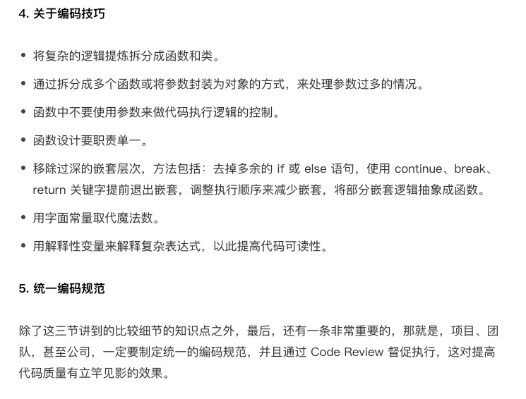

[toc]

# 第一部分 - 提升代码可读性

# 1. 命名

好的名字可以很直观的表达代码的用意，名字要描述：做什么，而不是怎么做。所以在写代码的时候要揣摩，反复斟酌，如果想不到好名字去 GitHub 上看看。

命名的关键是精准达意。

## 多长的名字合适

名字的长度不是第一位的，能够清楚的表达代码的语意才是最重要的。但是也不要写过于长的名字，否则在调用时很容易出现换行的问题。那么多长的名字合适呢？要看作用域。

如果作用域仅限于一个方法内，那么尽可能的短。如果作用域是跨类的，那么就要清晰一些。==命名中也可以使用一些耳熟能详的缩写==

## 利用上下文简化名字

```java
public class User {
  private String userName;
  private String userPassword;
  private String userAvatarUrl;
  //...
}
```

在这样一个 User 类上下文中，就没有必要再添加 user 前缀了。在使用他们的时候也能借助对象的上下文表达清楚。

```java
User user = new User();
user.getName(); // 借助user对象这个上下文
```

**函数的参数也是用这个规律。**

```java
public void uploadUserAvatarImageToAliyun(String userAvatarImageUri);
//利用上下文简化为：
public void uploadUserAvatarImageToAliyun(String imageUri);
```

## 名字要可读、可搜索

我们在命名的时候，最好能符合整个项目的命名习惯。大家都用“selectXXX”表示查询，你就不要用“queryXXX”；大家都用“insertXXX”表示插入一条数据，你就要不用“addXXX”，统一规约是很重要的，能减少很多不必要的麻烦。

## 如何命名接口和抽象类

对于接口的命名，一般有两种比较常见的方式。一种是加前缀==“I”==，表示一个 Interface。比如 IUserService，对应的实现类命名为 UserService。另一种是不加前缀，比如 UserService，对应的实现类加后缀“Impl”，比如 UserServiceImpl。对于抽象类的命名，也有两种方式，一种是带上前缀 ==“Abstract”==，比如 AbstractConfiguration；另一种是不带前缀“Abstract”。实际上，对于接口和抽象类，选择哪种命名方式都是可以的，只要项目里能够统一就行。


# 2.注释

## 注释到底应该写什么

注释的内容主要包含这样三个方面：做什么、为什么、怎么做。对于一些复杂的类和接口，我们可能还需要写明“如何用”。

### 注释比代码承载的信息更多

命名的主要目的是解释“做什么”。

比如，void increaseWalletAvailableBalance(BigDecimal amount) 表明这个函数用来增加钱包的可用余额，boolean isValidatedPassword 表明这个变量用来标识是否是合法密码。函数和变量如果命名得好，确实可以不用再在注释中解释它是做什么的。但是，==对于类来说，包含的信息比较多，一个简单的命名就不够全面详尽了。这个时候，在注释中写明“做什么”就合情合理了==。

### 注释起到总结性作用、文档的作用

代码之下无秘密。阅读代码可以明确地知道代码是==“怎么做”==的，也就是知道代码是如何实现的，那注释中是不是就不用写“怎么做”了？实际上也**可以**写。在注释中，关于具体的代码实现思路，我们可以写一些总结性的说明、特殊情况的说明。这样能够让阅读代码的人通过注释就能大概了解代码的实现思路，阅读起来就会更加容易。

实际上，==对于有些比较复杂的类或者接口，我们可能还需要在注释中写清楚“如何用”==，举一些简单的 quick start 的例子，让使用者在不阅读代码的情况下，快速地知道该如何使用。

### 一些总结性注释能让代码结构更清晰

对于逻辑比较复杂的代码或者比较长的函数，如果不好提炼、不好拆分成小的函数调用，那我们可以借助总结性的注释来让代码结构更清晰、更有条理。


```java
public boolean isValidPasword(String password) {
  // check if password is null or empty
  if (StringUtils.isBlank(password)) {
    return false;
  }

  // check if the length of password is between 4 and 64
  int length = password.length();
  if (length < 4 || length > 64) {
    return false;
  }
    
  // check if password contains only a~z,0~9,dot
  for (int i = 0; i < length; ++i) {
    char c = password.charAt(i);
    if (!((c >= 'a' && c <= 'z') || (c >= '0' && c <= '9') || c == '.')) {
      return false;
    }
  }
  return true;
}
```

  

## 注释是不是越多越好

注释本身有一定的维护成本，所以并非越多越好。==类和函数一定要写注释，而且要写得尽可能全面、详细，而函数内部的注释要相对少一些，一般都是靠好的命名、提炼函数、解释性变量、总结性注释来提高代码可读性。==

# 第二部分 - 代码风格

## 1. 函数、类多大才合适？

函数的代码行数不要超过一屏幕的大小，比如 50 行。类的大小限制比较难确定。

## 2. 一行代码多长最合适？

最好不要超过 IDE 显示的宽度。当然，限制也不能太小，太小会导致很多稍微长点的语句被折成两行，也会影响到代码的整洁，不利于阅读。

## 3. 善用空行分割单元块

对于比较长的函数，为了让逻辑更加清晰，可以使用空行来分割各个代码块。在类内部，成员变量与函数之间、静态成员变量与普通成员变量之间、函数之间，甚至成员变量之间，都可以通过添加空行的方式，让不同模块的代码之间的界限更加明确。

## 4. 四格缩进还是两格缩进？

我个人比较推荐使用两格缩进，这样可以节省空间，特别是在代码嵌套层次比较深的情况下。除此之外，值得强调的是，不管是用两格缩进还是四格缩进，一定不要用 tab 键缩进。

## 5.大括号是否要另起一行？

我个人还是比较推荐将大括号放到跟上一条语句同一行的风格，这样可以节省代码行数。但是，将大括号另起一行，也有它的优势，那就是，左右括号可以垂直对齐，哪些代码属于哪一个代码块，更加一目了然。

## 6.类中成员的排列顺序

在 Google Java 编程规范中，依赖类按照字母序从小到大排列。类中先写成员变量后写函数。成员变量之间或函数之间，先写静态成员变量或函数，后写普通变量或函数，并且按照作用域大小依次排列。今天讲到所有的代码风格都没有对错和优劣之分，只要能在团队、项目中统一即可，不过，最好能跟业内推荐的风格、开源项目的代码风格相一致。


# 第三部分 - 实用的编程技巧

## 1. 把代码分割成更小的单元块

这个说的是提炼代码，将大块复杂的逻辑提炼成类或者函数。只有代码逻辑比较复杂的时候才提炼类或者函数。毕竟如果提炼出的函数只包含两三行代码，在阅读代码的时候，还得跳过去看一下，这样反倒增加了阅读成本。

[这部分比较简单具体参见「设计模式之美」](https://time.geekbang.org/column/article/188882)

# 总结


