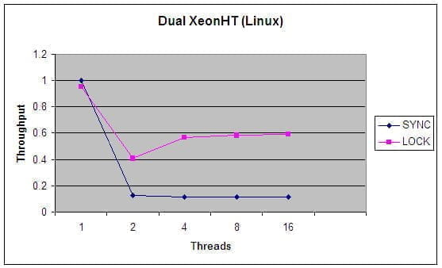
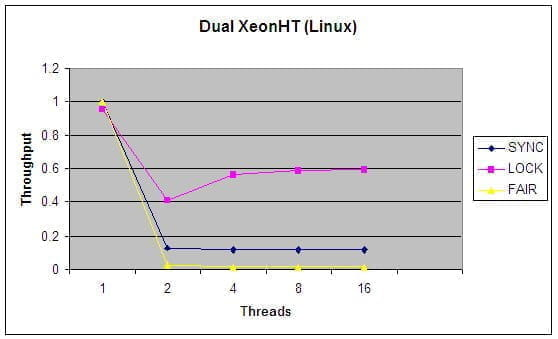
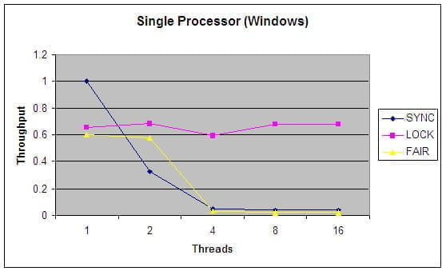

> 本文由 [简悦 SimpRead](http://ksria.com/simpread/) 转码， 原文地址 [www.ibm.com](https://www.ibm.com/developerworks/cn/java/j-jtp10264/index.html)

Java 理论与实践

新的锁定类提高了同步性 —— 但还不能现在就抛弃 synchronized

多线程和并发性并不是什么新内容，但是 Java 语言设计中的创新之一就是，它是第一个直接把跨平台线程模型和正规的内存模型集成到语言中的主流语言。核心类库包含一个 `Thread` 类，可以用它来构建、启动和操纵线程，Java 语言包括了跨线程传达并发性约束的构造 —— `synchronized` 和 `volatile` 。在简化与平台无关的并发类的开发的同时，它决没有使并发类的编写工作变得更繁琐，只是使它变得更容易了。

synchronized 快速回顾
-----------------

把代码块声明为 synchronized，有两个重要后果，通常是指该代码具有 _原子性（atomicity）_和 _可见性（visibility）_。原子性意味着一个线程一次只能执行由一个指定监控对象（lock）保护的代码，从而防止多个线程在更新共享状态时相互冲突。可见性则更为微妙；它要对付内存缓存和编译器优化的各种反常行为。一般来说，线程以某种不必让其他线程立即可以看到的方式（不管这些线程在寄存器中、在处理器特定的缓存中，还是通过指令重排或者其他编译器优化），不受缓存变量值的约束，但是如果开发人员使用了同步，如下面的代码所示，那么运行库将确保某一线程对变量所做的更新先于对现有 `synchronized` 块所进行的更新，当进入由同一监控器（lock）保护的另一个 `synchronized` 块时，将立刻可以看到这些对变量所做的更新。类似的规则也存在于 `volatile` 变量上。（有关同步和 Java 内存模型的内容，请参阅 [参考资料](#artrelatedtopics)。）

```
synchronized (lockObject) { 
  // update object state
}
```

所以，实现同步操作需要考虑安全更新多个共享变量所需的一切，不能有争用条件，不能破坏数据（假设同步的边界位置正确），而且要保证正确同步的其他线程可以看到这些变量的最新值。通过定义一个清晰的、跨平台的内存模型（该模型在 JDK 5.0 中做了修改，改正了原来定义中的某些错误），通过遵守下面这个简单规则，构建 “一次编写，随处运行” 的并发类是有可能的：

> 不论什么时候，只要您将编写的变量接下来可能被另一个线程读取，或者您将读取的变量最后是被另一个线程写入的，那么您必须进行同步。

不过现在好了一点，在最近的 JVM 中，没有争用的同步（一个线程拥有锁的时候，没有其他线程企图获得锁）的性能成本还是很低的。（也不总是这样；早期 JVM 中的同步还没有优化，所以让很多人都这样认为，但是现在这变成了一种误解，人们认为不管是不是争用，同步都有很高的性能成本。）

对 synchronized 的改进
------------------

如此看来同步相当好了，是么？那么为什么 JSR 166 小组花了这么多时间来开发 `java.util.concurrent.lock` 框架呢？答案很简单－同步是不错，但它并不完美。它有一些功能性的限制 —— 它无法中断一个正在等候获得锁的线程，也无法通过轮询得到锁，如果不想等下去，也就没法得到锁。同步还要求锁的释放只能在与获得锁所在的堆栈帧相同的堆栈帧中进行，多数情况下，这没问题（而且与异常处理交互得很好），但是，确实存在一些非块结构的锁定更合适的情况。

### ReentrantLock 类

`java.util.concurrent.lock` 中的 `Lock` 框架是锁定的一个抽象，它允许把锁定的实现作为 Java 类，而不是作为语言的特性来实现。这就为 `Lock` 的多种实现留下了空间，各种实现可能有不同的调度算法、性能特性或者锁定语义。 `ReentrantLock` 类实现了 `Lock` ，它拥有与 `synchronized` 相同的并发性和内存语义，但是添加了类似轮询锁、定时锁等候和可中断锁等候的一些特性。此外，它还提供了在激烈争用情况下更佳的性能。（换句话说，当许多线程都想访问共享资源时，JVM 可以花更少的时候来调度线程，把更多时间用在执行线程上。）

_reentrant_ 锁意味着什么呢？简单来说，它有一个与锁相关的获取计数器，如果拥有锁的某个线程再次得到锁，那么获取计数器就加 1，然后锁需要被释放两次才能获得真正释放。这模仿了 `synchronized` 的语义；如果线程进入由线程已经拥有的监控器保护的 synchronized 块，就允许线程继续进行，当线程退出第二个（或者后续） `synchronized` 块的时候，不释放锁，只有线程退出它进入的监控器保护的第一个 `synchronized` 块时，才释放锁。

在查看清单 1 中的代码示例时，可以看到 `Lock` 和 synchronized 有一点明显的区别 —— lock 必须在 finally 块中释放。否则，如果受保护的代码将抛出异常，锁就有可能永远得不到释放！这一点区别看起来可能没什么，但是实际上，它极为重要。忘记在 finally 块中释放锁，可能会在程序中留下一个定时炸弹，当有一天炸弹爆炸时，您要花费很大力气才有找到源头在哪。而使用同步，JVM 将确保锁会获得自动释放。

##### 清单 1. 用 ReentrantLock 保护代码块。

```
Lock lock = new ReentrantLock();
lock.lock();
try { 
  // update object state
}
finally {
  lock.unlock(); 
}
```

除此之外，与目前的 synchronized 实现相比，争用下的 `ReentrantLock` 实现更具可伸缩性。（在未来的 JVM 版本中，synchronized 的争用性能很有可能会获得提高。）这意味着当许多线程都在争用同一个锁时，使用 `ReentrantLock` 的总体开支通常要比 `synchronized` 少得多。

比较 ReentrantLock 和 synchronized 的可伸缩性
-------------------------------------

Tim Peierls 用一个简单的线性全等伪随机数生成器（PRNG）构建了一个简单的评测，用它来测量 `synchronized` 和 `Lock` 之间相对的可伸缩性。这个示例很好，因为每次调用 `nextRandom()` 时，PRNG 都确实在做一些工作，所以这个基准程序实际上是在测量一个合理的、真实的 `synchronized` 和 `Lock` 应用程序，而不是测试纯粹纸上谈兵或者什么也不做的代码（就像许多所谓的基准程序一样。）

在这个基准程序中，有一个 `PseudoRandom` 的接口，它只有一个方法 `nextRandom(int bound)` 。该接口与 `java.util.Random` 类的功能非常类似。因为在生成下一个随机数时，PRNG 用最新生成的数字作为输入，而且把最后生成的数字作为一个实例变量来维护，其重点在于让更新这个状态的代码段不被其他线程抢占，所以我要用某种形式的锁定来确保这一点。（ `java.util.Random` 类也可以做到这点。）我们为 `PseudoRandom` 构建了两个实现；一个使用 syncronized，另一个使用 `java.util.concurrent.ReentrantLock` 。驱动程序生成了大量线程，每个线程都疯狂地争夺时间片，然后计算不同版本每秒能执行多少轮。图 1 和 图 2 总结了不同线程数量的结果。这个评测并不完美，而且只在两个系统上运行了（一个是双 Xeon 运行超线程 Linux，另一个是单处理器 Windows 系统），但是，应当足以表现 `synchronized` 与 `ReentrantLock` 相比所具有的伸缩性优势了。

##### 图 1. synchronized 和 Lock 的吞吐率，单 CPU



##### 图 2. synchronized 和 Lock 的吞吐率（标准化之后），4 个 CPU


图 1 和图 2 中的图表以每秒调用数为单位显示了吞吐率，把不同的实现调整到 1 线程 `synchronized` 的情况。每个实现都相对迅速地集中在某个稳定状态的吞吐率上，该状态通常要求处理器得到充分利用，把大多数的处理器时间都花在处理实际工作（计算机随机数）上，只有小部分时间花在了线程调度开支上。您会注意到，synchronized 版本在处理任何类型的争用时，表现都相当差，而 `Lock` 版本在调度的开支上花的时间相当少，从而为更高的吞吐率留下空间，实现了更有效的 CPU 利用。

条件变量
----

根类 `Object` 包含某些特殊的方法，用来在线程的 `wait()` 、 `notify()` 和 `notifyAll()` 之间进行通信。这些是高级的并发性特性，许多开发人员从来没有用过它们 —— 这可能是件好事，因为它们相当微妙，很容易使用不当。幸运的是，随着 JDK 5.0 中引入 `java.util.concurrent` ，开发人员几乎更加没有什么地方需要使用这些方法了。

通知与锁定之间有一个交互 —— 为了在对象上 `wait` 或 `notify` ，您必须持有该对象的锁。就像 `Lock` 是同步的概括一样， `Lock` 框架包含了对 `wait` 和 `notify` 的概括，这个概括叫作 `条件（Condition）` 。 `Lock` 对象则充当绑定到这个锁的条件变量的工厂对象，与标准的 `wait` 和 `notify` 方法不同，对于指定的 `Lock` ，可以有不止一个条件变量与它关联。这样就简化了许多并发算法的开发。例如， `条件（Condition）` 的 Javadoc 显示了一个有界缓冲区实现的示例，该示例使用了两个条件变量，“not full” 和 “not empty”，它比每个 lock 只用一个 wait 设置的实现方式可读性要好一些（而且更有效）。 `Condition` 的方法与 `wait` 、 `notify` 和 `notifyAll` 方法类似，分别命名为 `await` 、 `signal` 和 `signalAll` ，因为它们不能覆盖 `Object` 上的对应方法。

这不公平
----

如果查看 Javadoc，您会看到， `ReentrantLock` 构造器的一个参数是 boolean 值，它允许您选择想要一个 _公平（fair）_锁，还是一个 _不公平（unfair）_锁。公平锁使线程按照请求锁的顺序依次获得锁；而不公平锁则允许直接获取锁，在这种情况下，线程有时可以比先请求锁的其他线程先得到锁。

为什么我们不让所有的锁都公平呢？毕竟，公平是好事，不公平是不好的，不是吗？（当孩子们想要一个决定时，总会叫嚷 “这不公平”。我们认为公平非常重要，孩子们也知道。）在现实中，公平保证了锁是非常健壮的锁，有很大的性能成本。要确保公平所需要的记帐（bookkeeping）和同步，就意味着被争夺的公平锁要比不公平锁的吞吐率更低。作为默认设置，应当把公平设置为 `false` ，除非公平对您的算法至关重要，需要严格按照线程排队的顺序对其进行服务。

那么同步又如何呢？内置的监控器锁是公平的吗？答案令许多人感到大吃一惊，它们是不公平的，而且永远都是不公平的。但是没有人抱怨过线程饥渴，因为 JVM 保证了所有线程最终都会得到它们所等候的锁。确保统计上的公平性，对多数情况来说，这就已经足够了，而这花费的成本则要比绝对的公平保证的低得多。所以，默认情况下 `ReentrantLock` 是 “不公平” 的，这一事实只是把同步中一直是事件的东西表面化而已。如果您在同步的时候并不介意这一点，那么在 `ReentrantLock` 时也不必为它担心。

图 3 和图 4 包含与 [图 1](#fig1) 和 [图 2](#fig1) 相同的数据，只是添加了一个数据集，用来进行随机数基准检测，这次检测使用了公平锁，而不是默认的协商锁。正如您能看到的，公平是有代价的。如果您需要公平，就必须付出代价，但是请不要把它作为您的默认选择。

##### 图 3. 使用 4 个 CPU 时的同步、协商锁和公平锁的相对吞吐率



##### 图 4. 使用 1 个 CPU 时的同步、协商和公平锁的相对吞吐率



处处都好？
-----

看起来 `ReentrantLock` 无论在哪方面都比 `synchronized` 好 —— 所有 `synchronized` 能做的，它都能做，它拥有与 `synchronized` 相同的内存和并发性语义，还拥有 `synchronized` 所没有的特性，在负荷下还拥有更好的性能。那么，我们是不是应当忘记 `synchronized` ，不再把它当作已经已经得到优化的好主意呢？或者甚至用 `ReentrantLock` 重写我们现有的 `synchronized` 代码？实际上，几本 Java 编程方面介绍性的书籍在它们多线程的章节中就采用了这种方法，完全用 `Lock` 来做示例，只把 synchronized 当作历史。但我觉得这是把好事做得太过了。

### 还不要抛弃 synchronized

虽然 `ReentrantLock` 是个非常动人的实现，相对 synchronized 来说，它有一些重要的优势，但是我认为急于把 synchronized 视若敝屣，绝对是个严重的错误。 _`java.util.concurrent.lock` 中的锁定类是用于高级用户和高级情况的工具_ 。一般来说，除非您对 `Lock` 的某个高级特性有明确的需要，或者有明确的证据（而不是仅仅是怀疑）表明在特定情况下，同步已经成为可伸缩性的瓶颈，否则还是应当继续使用 synchronized。

为什么我在一个显然 “更好的” 实现的使用上主张保守呢？因为对于 `java.util.concurrent.lock` 中的锁定类来说，synchronized 仍然有一些优势。比如，在使用 synchronized 的时候，不可能忘记释放锁；在退出 `synchronized` 块时，JVM 会为您做这件事。您很容易忘记用 `finally` 块释放锁，这对程序非常有害。您的程序能够通过测试，但会在实际工作中出现死锁，那时会很难指出原因（这也是为什么根本不让初级开发人员使用 `Lock` 的一个好理由。）

另一个原因是因为，当 JVM 用 synchronized 管理锁定请求和释放时，JVM 在生成线程转储时能够包括锁定信息。这些对调试非常有价值，因为它们能标识死锁或者其他异常行为的来源。 `Lock` 类只是普通的类，JVM 不知道具体哪个线程拥有 `Lock` 对象。而且，几乎每个开发人员都熟悉 synchronized，它可以在 JVM 的所有版本中工作。在 JDK 5.0 成为标准（从现在开始可能需要两年）之前，使用 `Lock` 类将意味着要利用的特性不是每个 JVM 都有的，而且不是每个开发人员都熟悉的。

### 什么时候选择用 ReentrantLock 代替 synchronized

既然如此，我们什么时候才应该使用 `ReentrantLock` 呢？答案非常简单 —— 在确实需要一些 synchronized 所没有的特性的时候，比如时间锁等候、可中断锁等候、无块结构锁、多个条件变量或者轮询锁。 `ReentrantLock` 还具有可伸缩性的好处，应当在高度争用的情况下使用它，但是请记住，大多数 synchronized 块几乎从来没有出现过争用，所以可以把高度争用放在一边。我建议用 synchronized 开发，直到确实证明 synchronized 不合适，而不要仅仅是假设如果使用 `ReentrantLock` “性能会更好”。请记住，这些是供高级用户使用的高级工具。（而且，真正的高级用户喜欢选择能够找到的最简单工具，直到他们认为简单的工具不适用为止。）。一如既往，首先要把事情做好，然后再考虑是不是有必要做得更快。

结束语
---

`Lock` 框架是同步的兼容替代品，它提供了 `synchronized` 没有提供的许多特性，它的实现在争用下提供了更好的性能。但是，这些明显存在的好处，还不足以成为用 `ReentrantLock` 代替 `synchronized` 的理由。相反，应当根据您是否 _需要_ `ReentrantLock` 的能力来作出选择。大多数情况下，您不应当选择它 —— synchronized 工作得很好，可以在所有 JVM 上工作，更多的开发人员了解它，而且不太容易出错。只有在真正需要 `Lock` 的时候才用它。在这些情况下，您会很高兴拥有这款工具。

*   您可以参阅本文在 developerWorks 全球站点上的 [英文原文](http://www.ibm.com/developerworks/java/library/j-jtp10264/?S_TACT=105AGX52&S_CMP=cn-a-j)。
*   请阅读 Brian Goetz 撰写的完整的 [_Java 理论与实践_](/developerworks/cn/java/j-jtp/index.html)系列。
*   开发人员经常混淆非争用同步成本与争用同步成本。“ [Synchronization is not the enemy](http://www.ibm.com/developerworks/java/library/j-threads1.html?S_TACT=105AGX52&S_CMP=cn-a-j)”（ _developerWorks_，2001 年 7 月）提供了一些粗略的基准检测，用以估计非争用同步的成本，“ [Reducing contention](http://www.ibm.com/developerworks/java/library/j-threads2.html?S_TACT=105AGX52&S_CMP=cn-a-j)"（ _developerWorks_，2001 年 9 月）提供了降低应用程序中锁争用影响的一些教程。
*   [Lock](http://java.sun.com/j2se/1.5.0/docs/api/java/util/concurrent/locks/Lock.html) 的 Javadoc、 [ReentrantLock](http://java.sun.com/j2se/1.5.0/docs/api/java/util/concurrent/locks/ReentrantLock.html) 以及 [Condition](http://java.sun.com/j2se/1.5.0/docs/api/java/util/concurrent/locks/Condition.html) 提供了有关新锁定类的应用程序和行为的更多信息。
*   Doug Lea 撰写的 [_Concurrent Programming in Java, Second Edition_](http://devworks.krcinfo.com/WebForms/ProductDetails.aspx?ProductID=0201310090) 是一本关于在 Java 编程中进行多线程编程的一些微妙问题的权威书籍。
*   JavaOne 2004 年的 [演示文档](http://javaoneonline.mentorware.net/servlet/mware.servlets.StudentServlet?mwaction=showDescr&class_id=28052&fromtopic=By Topic&subsysid=2000&topic=technical&avail_frames=true)中概括了 JDK 5.0 中的一些并发性方面的改进。
*   在 [_developerWorks_Java 技术专区](/developerworks/cn/java/) 中，可以找到 Java 各个方面的文章。
*   请参阅 [Developer Bookstore](http://devworks.krcinfo.com/)，获得技术书籍的完整列表，其中包括数百本 [Java 相关主题](http://devworks.krcinfo.com/WebForms/ProductList.aspx?Search=Category&id=1200&p=Java)的书籍。
