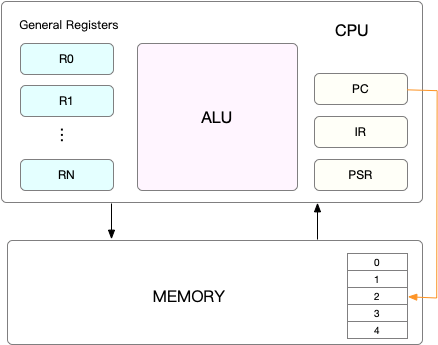
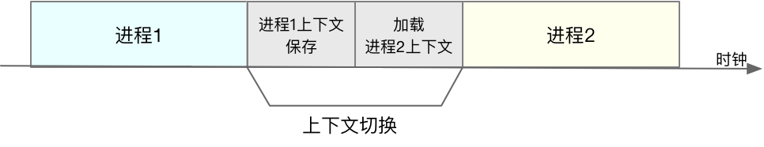

# CPU 上下文

我们知道，Linux 是一个多任务操作系统，它支持远大于 CPU 数量的任务同时执行，这个同时执行的原理就是时间分片。

而每个任务在运行前，CPU 都需要知道从哪里加载数据、从哪里开始运行代码，也就是需要系统帮它先设置好 CPU 寄存器和程序计数器，这二者是 CPU 执行任务必须的依赖环境，因此也被叫做 CPU 上下文。

> CPU 寄存器：
>
> ​	CPU 内部容量小，但是速度极快的内存单元
>
> 程序计数器：
>
> ​	存储正在执行，或者即将执行的指令的内存地址

# CPU 上下文切换

将之前任务的上下文（也就是 CPU 寄存器和程序计数器）存储起来，然后加载新任务的上下文数据到 CPU 寄存器和程序计数器，最后在跳转到程序计数器指向的指令地址，执行新任务。

而这些保存下来的任务上下文存储在操作系统的内核中，并在任务再次执行的时候重新加载，这样就能保证任务原来的状态不受影响，让任务看起来还是连续运行。

# CPU 上下文切换场景

## 1、进程上下文切换

### 特权模式切换

进程从用户态切换到内核态的时候会发生 CPU 上下文切换：

> CPU 寄存器里原来用户态的指令位置，需要先保存起来。接着，为了执行内核态代码，
>
> CPU 寄存器需要更新为内核态指令的新位置。最后才是跳转到内核态运行内核任务。

## 2、线程上下文切换

**线程是调度的基本单位，而进程则是资源拥有的基本单位**，说白了，所谓内核中的任务调度，实际上调度对象是线程；而进程只是给线程提供了虚拟内存、全局变量等资源。对于线程和进程，我们可以这样理解：

* 当进程只有一个小线程时，可以认为进程就等于线程。
* 当进程拥有多个线程时，这些线程会共享相同的虚拟内存和全局变量等资源。这些资源在上下文切换的时候是不需要修改的。
* 线程是有自己的私有数据的，例如栈和寄存器，这在些上下文切换的时候也需要保持。

线程切换有两种情况：

* 同一个进程的线程切换，因为虚拟机是共享的，所以在切换的时候，虚拟内存这些资源就保持波动，只需要切换线程的私有数据、寄存器等不共享的数据。
* 不同进程的线程切换，就和切换进程一样了，因为他们不共享资源，所以切换过程就跟进程上下文切换是一样的。

## 3、中断上下文切换

**为了快速响应硬件的事件，中断出来会打断进程的正常调度和执行**，转而调度中断处理程序，响应设备事件。而在打断其他进程时，就需要将进程当前的状态保存下来，这样在中断结束后，进程仍然可以从原来的状态恢复运行。

跟进程上下文不同，==中断上下文切换并不涉及到进程的用户态==。所以，即便中断过程打断了一个正处在用户态的进程，也不需要保存和恢复这个进程的虚拟内存、全局变量等用户态资源。中断上下文，其实只包括内核态中断服务程序执行所必需的状态，包括 CPU 寄存器、内核堆栈、硬件中断参数等。

对同一个 CPU 来说，中断处理比进程拥有更高的优先级，所以中断上下文切换并不会与进程上下文切换同时发生。

另外，跟进程上下文切换一样，中断上下文切换也需要消耗 CPU，切换次数过多也会耗费大量的 CPU，甚至严重降低系统的整体性能。

## 小结

* CPU 上下文切换，是保证 Linux 系统正常工作的核心功能之一，一般情况下不需要我们特别关注。
* 但过多的上下文切换，会把 CPU 时间消耗在寄存器、内核栈以及虚拟内存等数据的保存和恢复上，从而缩短进程真正运行的时间，导致系统的整体性能大幅下降。

