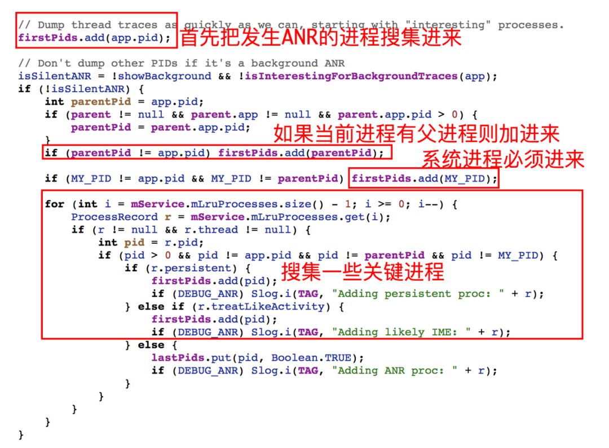

# 原文地址：

[今日头条 ANR 优化实践系列 - 设计原理及影响因素](https://blog.csdn.net/ByteDanceTech/article/details/114909721)

[今日头条 ANR 优化实践系列 - 监控工具与分析思路](https://blog.csdn.net/ByteDanceTech/article/details/115153783)

# ANR 设计原理

ANR： Application No Response，指系统通过与之交互的组件以及用户交互进行超时监控。

## 组件超时分类

## Broadcast 超时原理举例

**广播分为有序广播和无序广播，同时又有前台广播和后台广播之分；只针对有序广播设置超时监控机制，并根据前台广播和后台广播的广播类型决定了超时时长；例如后台广播超时时长 60S，前台广播超时时长只有 10S；**

### 无序广播：

**对于无序广播，系统在搜集所有接收者之后一次性全部发送完毕。无序广播是没有设置超时监听机制的**

### 有序广播：

有序广播会有超时监听机制，在 ASM 服务中所有有序广播都会被注册一个超时时间并顺序发送。

在客户端进程中，Binder 线程接收到 AMS 服务发送过来的广播消息之后，会将此消息进行封装成一个 Message，然后将 Message 发送到主线程消息队列，如果在超时时间内广播消息没有被及时消费，则会触发服务端的超时机制。流程如下图

## ANR Trace Dump 流程

### ANR 信息获取：

系统判定响应超时后会调用系统服务 AMS 接口，搜集本次 ANR 相关信息并存档。储存在：data/anr/trace、data/system/dropbox

在 Dump 信息之前系统会做一些场景判断，过滤如下场景：

> 已经在 Dump 的、发生了 Crash、已经被系统 Kill、是否正在关系等特殊情况

接下来系统再判断当前 ANR 进程对用户是否可感知，如后台低优先级进程(没有重要服务或者 Activity 界面)。接下来就开始获取信息了。

首先统计与当前进程相关的进程，或者系统核心服务的进程信息：

接下里就是统计各进程的更多信息，如虚拟机相关信息、Java 线程状态、堆栈。以便于知道此刻这些进程乃至系统都发生了什么情况

系统收集其他进程信息的目的是为了统计高 CPU 或高 IO 的情况，因为这些情况都会造成性能问题影响其他进程的调度。

### Dump Trace 流程

进程之间实现互隔离的，就算系统进程也无法获取其他进程的信息，要想通信就得 IPC，发送指令到目标进程，目标进程在接受到指令之后 Dump 自身信息，协助完成 Trace 流程。

==注意这个 SINGQUIT 信号，他会触发 ANR Dump Trace==

Framework 层有个 SignalCatcher 线程会专门接受此信号，在接受到信号后首先 Dump 当先虚拟机有关的信息：内存状态、对象、加载 Class、GC 等等。==接下来就是遍历虚拟机内的所有线程，通过设置线程的标记为（check_point）请求线程挂起（suspend）==当线程发现标记后会自动把自己挂起。==等到所有线程挂起后，SignalCatcher 线程开始遍历 Dump 各个线程的堆栈和线程数据，遍历结束之后再唤醒线程。期间如果某些线程一直无法挂起直到超时，那么本次 Dump 流程则失败，并主动抛出超时异常。==

SignalCatcher 获取各线程信息的工作过程如下图：

>整体来看链路比较长，而且涉及到与很多进程交互，同时为了进一步降低对应用乃至系统的影响，系统在很多环节都设置大量超时检测。而且从上面流程可以看到发生 ANR 时，系统进程除了发送信号给其它进程之外，自身也 Dump Trace，并获取系统整体及各进程 CPU 使用情况，且将其它进程 Dump 发送的数据写到文件中。因此这些开销将会导致系统进程在 ANR 过程承担很大的负载，==这是为什么我们经常在 ANR Trace 中看到 SystemServer 进程 CPU 占比普遍较高的主要原因。==

## 应用层如何判定 ANR

Android 6.0 (M) 以后的版本，在应用程序层再也无法通过直接监听 data/anr/trace 文件来判断是否发生了 ANR。站在应用侧角度来说，系统没有提供友好的机制监控 ANR，而且很多信息都对应用屏蔽了访问权限。目前解决方案有两个：

1. **主线程 watchdog 机制**

核心思想是在应用层定期向主线程设置探测消息，并在异步设置超时检测。如果在规定时间内没有收到发送的探测信息，就判定可能发生了 ANR。

> 为什么是可能发生 ANR？因为还需要进一步从系统服务获取相关数据(下面会讲到如何获取)，进一步判定是否真的发生 ANR。

1. **监听 SIGNALQUIT 信号**

> 该方案在很多公司有应用，网上也有相关介绍，这里主要介绍一下思路。我们在上面提到了==虚拟机是通过注册和监听 SIGNALQUIT 信号的方式执行请求的==，而对于信号机制有了解的同学马上就可以猜到，我们也可以在应用层参考此方式注册相同信号去监听。不过要注意的是注册之后虚拟机之前注册的就会被覆盖，需要在适当的时候进行恢复，否则小心系统(厂商)找上门。
>
> 当接收到该信号时，过滤场景，确定是发生用户可感知的 ANR 之后，从 Java 层获取各线程堆栈，或通过反射方式获取到虚拟机内部 Dump 线程堆栈的接口，在内存映射的函数地址，强制调用该接口，并将数据重定向输出到本地。

**该方案从思路上来说优于第一种方案，并且遵循系统信息获取方式，获取的线程信息及虚拟机信息更加全面，但缺点是对性能影响比较大，对于复杂的 App 来说，统计其耗时，部分场景一次 Dump 耗时可能要超过 10S。**

## 应用层如何获取 ANR Info

上面提供的两种判断方法都需要进一步过滤结果进行确认，以确保是不是真的发生了 ANR，因此我们需要通过系统提供的接口进一步判定当前应用是否发生了 ANR 问题。除了获取各进程中线程状态之外，我们也需要知道系统乃至其他进程的一些状态，例如系统 CPU、Mem、IO 负载、关键进程的 CPU 使用率等等，便于推测发生问题的系统环境是否正常。

获取信息相关接口类如下：

获取结果如下：

## 影响因素

AMS 对于 ANR 的检查完全是黑盒的：系统服务(AMS，InputService) 将具有超时属性的消息（如创建 Service，Receiver，Input 事件等）通过 Binder 或者其他 IPC的方式发送给目标进程之后，便会启动超市监控，但是如果消息全部堆积在 Looper 检查的消息根本还没来得及调度执行，也会导致超时机制的触发开始 Dump，此时主线程 Dump 的是当前某个消息执行过程的业务堆栈。

==所以总结来说，发生 ANR 问题是， Trace 堆栈快很多情况下都不是 RootCase。而系统 ANR Info 中提示某个 Service 或者 Receiver 导致 ANR 很大程度上，并不是这些组件的问题==

### 影响因素分类

> 影响环境分为**应用内部环境和系统环境**；即 **系统负载正常，但是应用内部主线程消息过多或耗时严重**；另外一类则是**系统或应用内部其它线程或资源负载过高，主线程调度被严重抢占**

总体来说包括以下几种：

> 当前 Trace 堆栈所在业务耗时严重；
>
> 当前 Trace 堆栈所在业务耗时并不严重，但是历史调度有一个严重耗时；
>
> 当前 Trace 堆栈所在业务耗时并不严重，但是历史调度有多个消息耗时；
>
> 当前 Trace 堆栈所在业务耗时并不严重，但是历史调度存在巨量重复消息(业务频繁发送消息)；
>
> 当前 Trace 堆栈业务逻辑并不耗时，但是其他线程存在严重资源抢占，如 IO，Mem，CPU；
>
> 当前 Trace 堆栈业务逻辑并不耗时，但是其他进程存在严重资源抢占，如 IO，Mem，CPU；

