> 本文由 [简悦 SimpRead](http://ksria.com/simpread/) 转码， 原文地址 [developer.aliyun.com](https://developer.aliyun.com/article/225751)

## 简介     

内存问题一直是大型 App 的开发人员比较头痛的问题，特别是像手淘这种超级的 App，App 中到处都是带有图片和视频的界面，而且这些功能都是由不同的团队甚至不同的事业部开发的，要整体上去管控和排查内存的问题变得相当的复杂。

内存问题一直是大型 App 的开发人员比较头痛的问题，特别是像手淘这种超级的 App，App 中到处都是带有图片和视频的界面，而且这些功能都是由不同的团队甚至不同的事业部开发的，要整体上去管控和排查内存的问题变得相当的复杂。之前，我们多个线上版本都存在着严重的 Activity 等内存泄漏和不合理内存使用。这不是偶然，一个很重要的原因就是我们很多的开发测试人员侧重业务开发，忽略内存和性能，而且没有站在全局性的角度去考虑资源的使用。认为我自己的模块多缓存一些就会加快速度，以空间换时间看似正确，但是在手淘这样的超级 App 中是不可取的，需要严格限制，否则不要说里面几百个模块，有几十个模块这样来做，其结果都会是灾难性的，不但没有加快速度，反而会拖慢速度以及带来很多稳定性问题。

经过一年多的更新，现在的 Android Studio 所带的工具已经相当的成熟。以前我们还停留在使用 MAT 来分析内存，但是现在 Android Studio 的内存分析工具已经相当的强大，已经完全可以抛开 MAT 来实现更为直观的内存检测。我想，作为一个大型 App 的开发人员和测试人员，掌握这些技能都是必不可少的，也是提高整个 App 质量的关键所在。  
在使用工具分析内存之前，我们需要了解一下内存回收上的一些策略，否则很多时候排查到的可能都不是真正的问题。

1、没有强引用不代表这块内存就会马上回收
----------------------------------------------------------------

我们知道，Java 的内存回收如果有强引用存在，那么这个对象的内存不会回收。那么这个对象的引用如果不存在，是不是这块内存就会回收呢？答案是否定的，VM 有自己的回收策略，不会因为一个对象的引用为空了就立马对它进行回收。也就是说，回收策略需要达到一定的触发阈值。我们可以看一个 Demo，写如下的分配对象的方法：

```java
void onButtonClick(){
        for (int i = 0; i < 1000; i++) {
            View view = new ImageView(this);
        }
    }
```

在内存充足的情况下，我们点击按钮 4 次，执行了 4 遍该函数，这个时候可以看到堆内存呈现了 4 次增长。如下图所示：

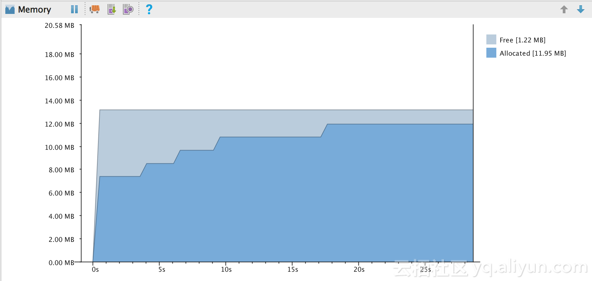  静置在那半个小时，内存仍然会维持现状，VM 并不会来执行实际的 GC。我们可以 Dump 内存看看内存中的对象：  
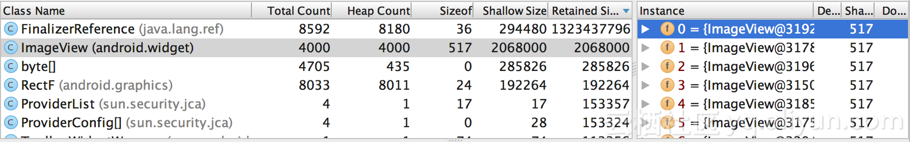

我们可以看到，4000 个 ImageView 对象仍然毫发无损的在内存中残留，系统没有回收其内存。不管是 Dalvik 还是 ART 环境，包括最新的 Android N，都可能出现这样的情况，<font color = green>具体是否每次都保持（等量）增长等还要看手机内存剩余情况和手机的 GC 策略</font>。<font color = red>所以，我们在检测内存占用或者内存泄漏之前，一定要执行工具自带的 GC 触发功能，否则结果会不准确。明明没有泄漏或者没有占用，而 Dump 出来的堆中提示占用很大或者泄漏。</font>
通过 Memory Monitor 工具，我们可以看到其引用的情况。点击其中一个 ImageView，我们看下它的引用情况：  

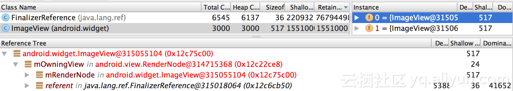

可以看到，其引用路径是被一个 FinalizerReference 所持有。该对象已经标记为红色，表明我们自己的代码中已经没有其他引用持有该对象，状态是等待被回收。

通过手动触发 GC，我们可以来主动回收这块内存，点击如下图所示的按钮，触发 GC。


当然，这里还有一个问题存在，因为刚才创建的属于 Finalizer 对象，该对象前面的文章已经分析过，需要至少两次 GC 才能真正回收其内存。所以，第一次触发 GC 的时候，我们可以看一下内存的变化。

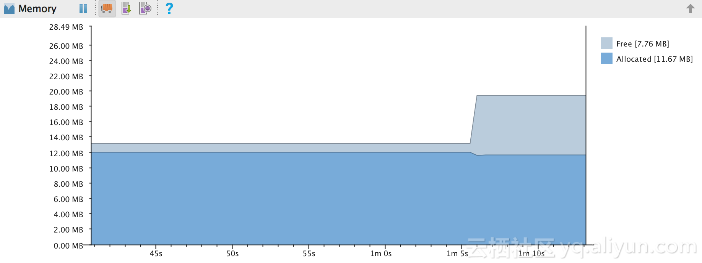  

第一次触发 GC 后，内存只是部分的下降，这个时候 Finalize 链表中的对象被回收，但是 ImageView 还没有回收 (在不同 Rom 和 Android 版本下可能会存在少许差异，在 Dalvik 下的差异会更大一些)。我们可以看一下堆内存：

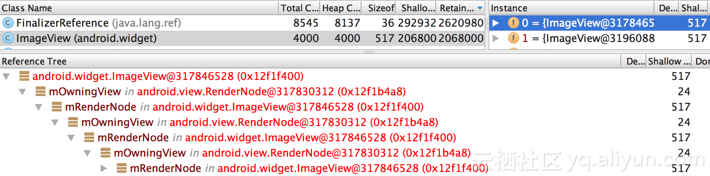

该对象的引用链路全部标记为红色，已经没有强引用指向该对象，刚才的 FinalizerReference 已经执行了清理。但是第一次 GC 只是执行了 Finalizer 清理，而没有真正的回收这部分对象。所以还需要再一次的触发 GC，再次执行 GC 后，我们可以看到堆内存下降，这些对象被回收了。  

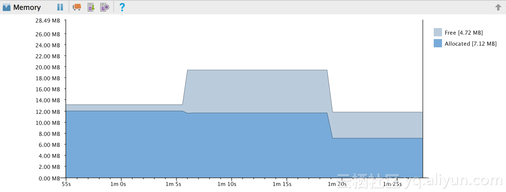

我们可以通过 Dump 堆内存来验证是否已经回收，如下图所示，对内存中已经没有了刚才的 ImageView 对象，确实已经被回收了。

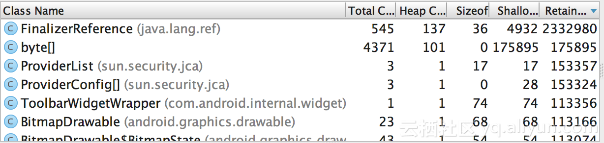

通过前面的分析我们可以知道，并不是引用释放了，内存就会回收。在实际使用手机淘宝的过程中，我们也可以观察堆内存的变化，在退出一个界面的时候很可能是不会有 GC 的，堆内存不会变化。如果这个时候用 MAT 工具去 Dump 内存，那结果很多是不够正确的。而如果后续再做其他操作，引发 GC 后，才会使得结果更加准确，当然我们可以手动的去触发 GC。

## 2、调用 GC 时的策略变化

在前面的文章中已经提到过，代码调用 GC，只是告诉 VM 需要 GC，但是是否真正的去执行 GC 还是要看 VM 的配置和是否达到阈值。前面也提到，在执行手动 GC 的时候，Dalvik 和 ART 下会有比较明显的差异。Android 5.0 开始增加了更多的 GC 方式，到了 6.0，7.0 在 GC 方面有了更多的优化。特别是在执行 Finalizer 对象方面，Android 5.0 开始回收就没有那么快，单次执行 GC，并不会导致失去引用的 Finalizer 对象进行完全回收，如果要更好的回收 Finalizer 对象，需要执行 System.runFinalization() 方法来强制回收 Finalizer 对象。

我们将测试代码后面加上主动调用 GC 的代码，如下：

```java
void onButtonClick(){
        for (int i = 0; i < 1000; i++) {
            View view = new ImageView(this);
        }
        System.gc();
    }
```

在不同的 Android 版本上看下执行效果，点击按钮执行多次。在 Android 4.4.4 版本的设备上，内存基本已经回收，如果将 1000 次修改为 10 次，偶尔可以看到有 ImageView 已经没有引用存在，但是仍然没有回收。如下图所示：

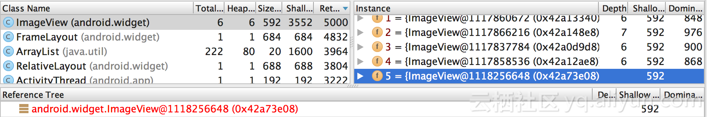

从这里可以看出来，在该版本下，大部分的对象在没有强引用后，调用 System.gc() 就会被回收。我们再看下 ART 上的情况，在 ART 下，却发生了不一致的表现。在调用后没有进行 GC。查看堆内存，我们也可以看到，4000 个 ImageView 仍然存在，并未执行 GC。

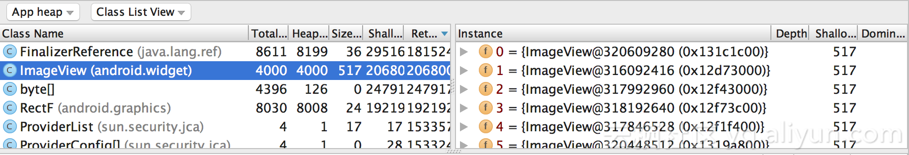

看来在 ART 后，这部分的 GC 策略做了调整，System.gc() 没有内存回收。我们可以看下源码，在 Android 4.4.4 下的源码：

```java
/**
     * Indicates to the VM that it would be a good time to run the
     * garbage collector. Note that this is a hint only. There is no guarantee
     * that the garbage collector will actually be run.
     */
    public static void gc() {
        Runtime.getRuntime().gc();
    }
```

我们可以看到，在调用 gc 函数后，直接调用了运行时的 gc。再来看下 5.0 上的代码：

```java
/**
     * Indicates to the VM that it would be a good time to run the
     * garbage collector. Note that this is a hint only. There is no guarantee
     * that the garbage collector will actually be run.
     */
    public static void gc() {
        boolean shouldRunGC;
        synchronized(lock) {
            shouldRunGC = justRanFinalization;
            if (shouldRunGC) {
                justRanFinalization = false;
            } else {
                runGC = true;
            }
        }
        if (shouldRunGC) {
            Runtime.getRuntime().gc();
        }
    }

   /**
     * Whether or not we need to do a GC before running the finalizers.
     */
    private static boolean runGC;
   /**
     * If we just ran finalization, we might want to do a GC to free the finalized objects.
     * This lets us do gc/runFinlization/gc sequences but prevents back to back System.gc().
     */
   private static boolean justRanFinalization;

    /**
     * Provides a hint to the VM that it would be useful to attempt
     * to perform any outstanding object finalization.
     */
    public static void runFinalization() {
        boolean shouldRunGC;
        synchronized(lock) {
            shouldRunGC = runGC;
            runGC = false;
        }
        if (shouldRunGC) {
            Runtime.getRuntime().gc();
        }
        Runtime.getRuntime().runFinalization();
        synchronized(lock) {
            justRanFinalization = true;
        }
    }
```

从源码我们可以发现，System.gc() 函数，已经有了变化，从 5.0 开始，多了一些判断条件。是否执行 gc，是依赖于 `justRanFinalization` 变量，而变量 `justRanFinalization` 在 `runFinalization` 后才会变为 true。也就是说，<font color = red>**直接调用 System.gc() 方法并没有调用 Runtime.getRuntime().gc()**</font> ，只是做了一个标记将 runGC 变量设置为 true 的动作。

等到系统执行 `runFinalization` 函数时，如果标记了 runGC 这会先执行一次 gc，然后标记 Finalizer 对象，并标记为依据清理过了 Finalizer 对象。这说明只有 `runFinalization` 执行后，再调用 `System.gc` 的时候，才会真正执行 gc，已回收 Finalizer 对象。 

在 Android ART 的设备上，我们将调用 gc 的方式做下变更：

```java
void onButtonClick(){
        for (int i = 0; i < 2000; i++) {
            View view = new ImageView(this);
        }

       Runtime.getRuntime().gc();
    }
```

这里直接调用了 Runtime.getRuntime().gc()。这个时候内存回收确实会有变化。但是 Finalizer 对象仍然可能存在，在 Android 5.0 的时候会回收一部分，但是**从 6.0 开始，单次调用 gc，Finalizer 对象却不一定回收**。如下图所示，虽然所有引用链路已经不复存在，但是内存仍然没有回收：

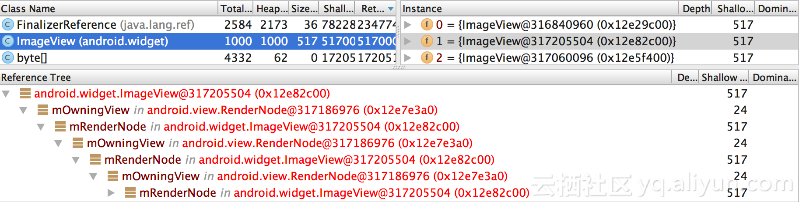

那么执行 2 次 gc 是否就都能把内存回收了呢？我们修改下代码：

```java
void onButtonClick(){
        for (int i = 0; i < 2000; i++) {
            View view = new ImageView(this);
        }

       Runtime.getRuntime().gc();
       Runtime.getRuntime().gc();
    }
```

这里连续 2 次调用了 gc，按理是可以回收 Finalizer 对象的，但是由于两次调用 gc 的间隔太短，而 Finalizer 对象是由专门的线程执行回收的，所以也不一定能完全回收。这个和线程的调度情况有关系。例如执行上面代码可能出现的结果是部分回收：


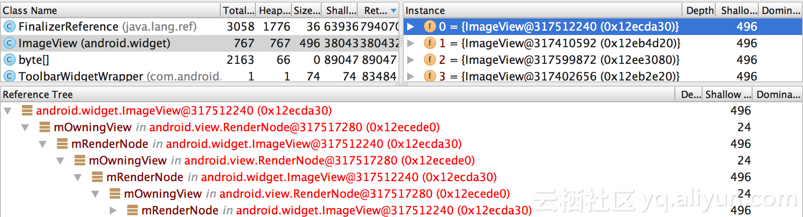  

如果想要全部回收，可以在中间停顿一些间隔，或者增加 System.runFinalization() 方法的调用。这样就能将当前可以回收的内存基本都回收了。<font color = red>我们在 Android Studio 的触发 GC 的按钮，也是通过 BinderInternal$GcWatcher 等代码来执行内存回收的。当然，在实际的业务代码中，不要主动调用 gc，这样可能会导致额外的内存回收开销，在检测代码中，如果需要检测内存，最好按照 gc，runFinalization，gc 的顺序去回收内存后，再做内存的 Dump 分析。</font>

> 这解释了为啥 LeakCanary 需要封装一个 `GcTrigger#DEFAULT` ,实现了触发 GC 的方法
>
> ```java
> interface GcTrigger {
> 
>   GcTrigger DEFAULT = new GcTrigger() {
>     @Override
>     public void runGc() {
>       // System.gc() does not garbage collect every time. Runtime.gc() is
>       // more likely to perfom a gc.
>       Runtime.getRuntime().gc();
>       enqueueReferences();
>       System.runFinalization();
>     }
> 
>     private void enqueueReferences() {
>       // Hack. We don't have a programmatic way to wait for the reference queue daemon to move
>       // references to the appropriate queues.
>       try {
>         Thread.sleep(100);
>       } catch (InterruptedException e) {
>         throw new AssertionError();
>       }
>     }
>   };
> 
>   void runGc();
> }
> ```

3、使用 Android Studio 的 Memory 分析内存占用
-------------------------------------------------------------------------------

Memory Monitor 工具比起 MAT 一个很大的优势就是可以非常简单的查看内存占用，而且可以迅速找到自己的模块所占用的堆内存，所以希望开发和测试人员都能够迁移到 Android Studio 所带的工具上来。如何查看内存占用？真的是非常的简单，而且可以找到很细小的内存占用情况。 
例如，这里自定义一个类，然后创建该类，代码如下：

```java
public  class MyThread extends Thread{

        @Override
        public void run() {
            View view = new View(MainActivity.this);
            view = null;
        }
    }

    void onButtonClick(){
        new MyThread().start();
    }
```

这里只是创建了一个该对象，但是也很容易可以跟踪到该对象的内存情况。通过 Memory Monitor 的【Dump Java Heap】按钮可以把当前堆内存显示出来，如下图所示：  
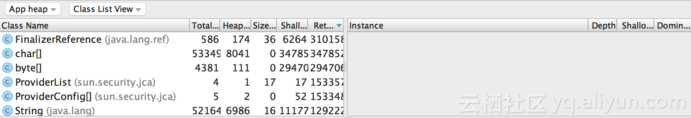  

这里是默认查看方式，我们可以切换到以包名的形式查看。这样就可以很容易的找到我们自己的代码了。如下所示：

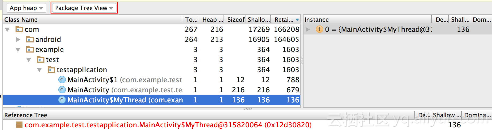

切换查看方式后，我们可以很容易的就找到自己所写的代码内存占用情况。这里可以看到实例的个数，占用内存的大小等情况。  
例如在打开手机淘宝，简单操作一会后再来观察内存占用情况。按照包名查看后，我们很容易就可以看到整个堆内存的占用情况，如下图所示：

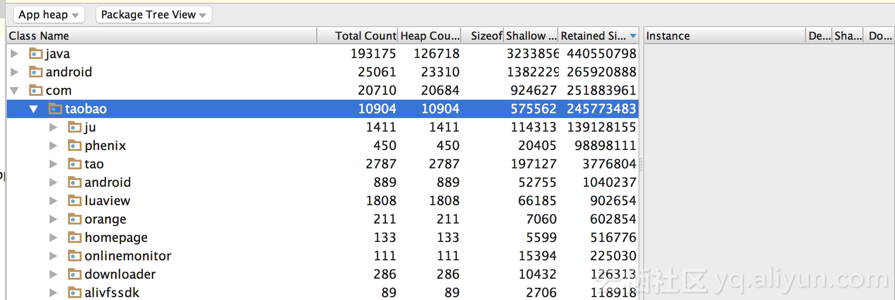  
      
通过上图我们很容易看到，在 com.taobao 包名下占用了近 240 多 M 的内存。继续往下看，聚划算模块，图片库模块占了大头。点击 ju 模块，展开后，又可以看到该包名下的内存占用：

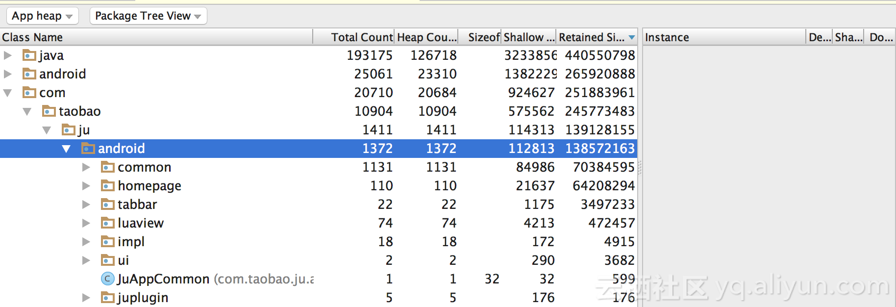 

通过上图我们可以清晰的看到，在 ju 包名下的内存分布情况。

所以，在内存占用的检查上，Android Studio 已经给我们提供了强大的工具，各个开发和测试人员已经可以很简单的查看到自己开发的模块占据的内存大小，然后对内存的使用做一些改进等措施。这里也可以通过右侧的 Instance 窗口检查各个实例的引用以及排查不合理的内存强制占用。

[](https://www.atatech.org/articles/69454#3)4、排查内存泄漏
----------------------------------------------------

Memory Dump 下来后，我们可以检查 Java 堆的 Activity 内存泄漏和重复的 String。很多人还习惯于 MAT 分析工具，其实 Memory Monitor 已经包含了这个功能，而且使用非常简单。  
首先 dump 内存，如前面分析的那样，在右侧可以看到【Analyzer Tasks】按钮。

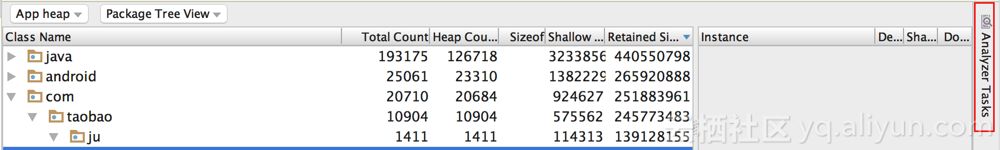  
     
然后，我们点击该按钮，就可以看到分析泄漏的工具。

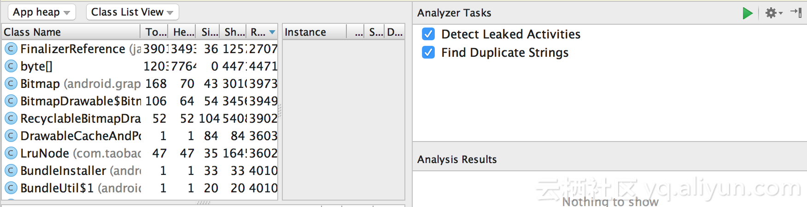

这里可以只勾选 检测泄漏 Activity 选项，然后选择执行。这样就可以看到泄漏的 Activity 了。

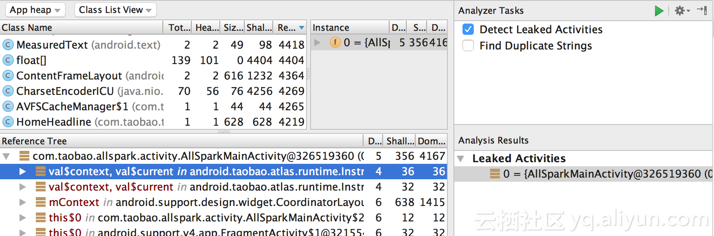

通过引用指向，我们可以比较容易的判断出不该持有的强引用关系，而且该工具从上到下的排序，已经做了初步的判断。

当然在检测泄漏和占用之前，需要点击 2 次 GC 的按钮，这样结果才会相对准确。
    
对于 Android Studio 提供的内存分析工具，使用起来非常简单，会比 Mat 工具要快捷，排查问题也更加容易。所以 Android 的开发和测试人员，应该尽可能的都迁移到该工具上来，并能够熟练的掌握内存分析工具，这样才能让自己开发的模块质量更加的优秀。
    
以上主要是针对 Android Studio 2 中的使用方式，在今年的 Android Studio 3 Preview 版本中，内存这块的分析工具更加强大，可以在面板上直接看到更细粒度的内存占用，不仅仅是 Java 的对内存了。

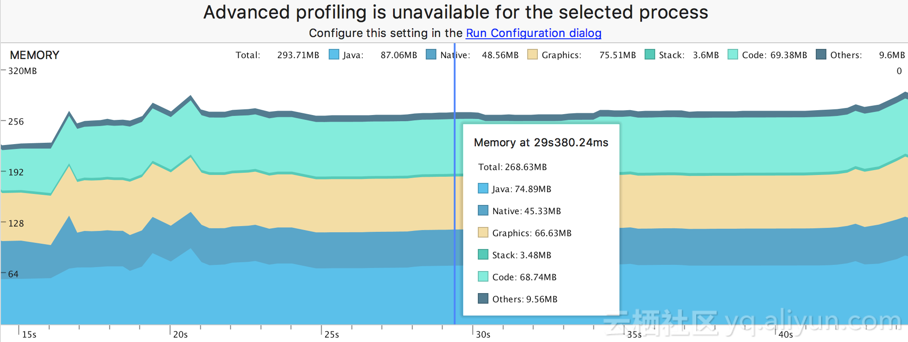

对于需要更细粒度和更全面的分析一些内存的细节，本文所涉及的内存知识还是不够的，还需要了解 Linux 下的内存机制以及 Android 下的一些内存机制，例如按页分配，共享内存，GPU 内存等等。
